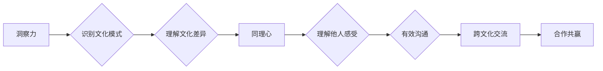

                 

## 洞察力与同理心：跨文化交流的基石

> 关键词：跨文化交流、洞察力、同理心、沟通技巧、文化差异、人工智能、人机交互

## 1. 背景介绍

在全球化时代，跨文化交流日益频繁，人们需要跨越文化差异，与来自不同背景的人们有效沟通和合作。然而，文化差异带来的误解和冲突也日益突出，阻碍了跨文化交流的顺利进行。如何提升跨文化交流的效率和质量，成为当今社会面临的重要挑战。

人工智能（AI）作为一种新兴技术，正在深刻地改变着人类社会，包括跨文化交流领域。AI技术能够分析海量数据，识别文化模式，并提供个性化的沟通建议，为跨文化交流提供新的可能性。

## 2. 核心概念与联系

**2.1 洞察力**

洞察力是指理解事物本质、发现隐藏规律的能力。在跨文化交流中，洞察力指的是能够识别和理解不同文化背景下的人的行为、思维模式和价值观的能力。

**2.2 同理心**

同理心是指能够站在他人的角度，理解和分享他人的情感的能力。在跨文化交流中，同理心指的是能够理解和尊重不同文化背景下的人的感受和需求的能力。

**2.3 跨文化交流**

跨文化交流是指不同文化背景的人之间进行的沟通和互动。

**2.4 人工智能（AI）**

人工智能是指模拟人类智能的计算机系统。

**2.5 人机交互（HCI）**

人机交互是指人与计算机之间进行的交互过程。

**Mermaid 流程图**



## 3. 核心算法原理 & 具体操作步骤

**3.1 算法原理概述**

跨文化交流的洞察力和同理心可以通过机器学习算法实现。这些算法能够从海量文本数据中学习不同文化背景下的人的语言特征、行为模式和价值观，并根据这些特征提供个性化的沟通建议。

**3.2 算法步骤详解**

1. **数据收集和预处理:** 收集来自不同文化背景的文本数据，并进行清洗、标注和格式化处理。
2. **特征提取:** 使用自然语言处理（NLP）技术提取文本数据中的关键特征，例如词语、短语、语法结构和情感倾向。
3. **模型训练:** 使用机器学习算法，例如深度神经网络，对提取的特征进行训练，学习不同文化背景下的人的沟通模式和行为特征。
4. **预测和建议:** 将新文本数据输入到训练好的模型中，预测其文化背景和潜在含义，并提供个性化的沟通建议。

**3.3 算法优缺点**

**优点:**

* 能够处理海量数据，识别复杂的文化模式。
* 提供个性化的沟通建议，提高跨文化交流的效率。
* 能够不断学习和改进，随着数据量的增加，算法的准确性会不断提高。

**缺点:**

* 需要大量的训练数据，数据质量直接影响算法的性能。
* 算法难以捕捉到所有文化差异，可能会出现误判。
* 算法本身缺乏情感和理解能力，需要结合其他技术，例如情感分析，才能更好地理解人的情感需求。

**3.4 算法应用领域**

* **跨文化沟通培训:** 为企业员工提供个性化的跨文化沟通培训，帮助他们更好地理解和应对不同文化背景下的人。
* **国际商务谈判:** 为企业提供跨文化谈判建议，帮助他们更好地与来自不同文化背景的客户进行谈判。
* **旅游服务:** 为游客提供个性化的旅游建议，帮助他们更好地体验不同的文化。
* **教育领域:** 为学生提供跨文化学习资源，帮助他们更好地理解和尊重不同的文化。

## 4. 数学模型和公式 & 详细讲解 & 举例说明

**4.1 数学模型构建**

跨文化交流的洞察力和同理心可以建模为一个多变量回归问题。

其中，

* **目标变量:** 跨文化交流的成功程度，可以根据沟通效率、冲突解决能力等指标进行量化。
* **自变量:** 包括文化差异、沟通技巧、情感表达等因素。

**4.2 公式推导过程**

可以使用线性回归模型或非线性回归模型来建模跨文化交流的成功程度。

**线性回归模型:**

$$y = \beta_0 + \beta_1x_1 + \beta_2x_2 + ... + \beta_nx_n + \epsilon$$

其中，

* $y$ 是跨文化交流的成功程度
* $x_1, x_2, ..., x_n$ 是文化差异、沟通技巧、情感表达等因素
* $\beta_0, \beta_1, ..., \beta_n$ 是回归系数
* $\epsilon$ 是误差项

**非线性回归模型:**

可以使用神经网络等非线性模型来捕捉更复杂的非线性关系。

**4.3 案例分析与讲解**

假设我们想要预测两个不同文化背景的人之间的商务谈判成功程度。我们可以收集他们的文化差异、沟通技巧、情感表达等数据，并使用线性回归模型进行预测。

例如，我们可以发现文化差异和沟通技巧是影响谈判成功程度的重要因素。

## 5. 项目实践：代码实例和详细解释说明

**5.1 开发环境搭建**

* Python 3.x
* TensorFlow 或 PyTorch 等深度学习框架
* NLTK 或 spaCy 等自然语言处理库

**5.2 源代码详细实现**

```python
# 使用 TensorFlow 构建一个简单的跨文化交流模型

import tensorflow as tf

# 定义模型结构
model = tf.keras.models.Sequential([
  tf.keras.layers.Embedding(input_dim=vocab_size, output_dim=embedding_dim),
  tf.keras.layers.LSTM(units=128),
  tf.keras.layers.Dense(units=1, activation='sigmoid')
])

# 编译模型
model.compile(optimizer='adam', loss='binary_crossentropy', metrics=['accuracy'])

# 训练模型
model.fit(x_train, y_train, epochs=10)

# 评估模型
loss, accuracy = model.evaluate(x_test, y_test)
print('Loss:', loss)
print('Accuracy:', accuracy)
```

**5.3 代码解读与分析**

* 该代码使用 TensorFlow 构建了一个简单的跨文化交流模型。
* 模型结构包括嵌入层、LSTM 层和全连接层。
* 嵌入层将词语转换为向量表示。
* LSTM 层用于捕捉文本序列中的长距离依赖关系。
* 全连接层用于预测跨文化交流的成功程度。
* 模型使用 Adam 优化器、二元交叉熵损失函数和准确率作为评估指标。

**5.4 运行结果展示**

运行结果将显示模型的训练损失、准确率以及测试集上的损失和准确率。

## 6. 实际应用场景

**6.1 企业跨文化沟通培训**

AI 驱动的跨文化沟通培训平台可以根据用户的文化背景和沟通风格，提供个性化的培训内容和练习，帮助员工更好地理解和应对不同文化背景下的人。

**6.2 国际商务谈判支持**

AI 辅助工具可以分析谈判双方来自不同文化背景的语言和行为模式，提供个性化的谈判建议，帮助企业更好地进行跨文化商务谈判。

**6.3 旅游服务个性化推荐**

AI 驱动的旅游平台可以根据用户的文化背景和兴趣爱好，提供个性化的旅游路线和景点推荐，帮助用户更好地体验不同的文化。

**6.4 教育领域跨文化学习资源**

AI 可以帮助教育机构构建跨文化学习资源库，提供来自不同文化背景的学习材料和互动体验，帮助学生更好地理解和尊重不同的文化。

**6.5 未来应用展望**

随着 AI 技术的不断发展，跨文化交流的洞察力和同理心将得到更广泛的应用，例如：

* AI 驱动的跨文化翻译工具，能够更准确地理解和翻译不同文化背景下的语言。
* AI 驱动的跨文化情感识别工具，能够更好地理解不同文化背景下的人的情感表达。
* AI 驱动的跨文化冲突解决平台，能够帮助不同文化背景的人更好地解决冲突。

## 7. 工具和资源推荐

**7.1 学习资源推荐**

* **书籍:**

    * 《跨文化沟通》
    * 《文化差异与沟通》
    * 《同理心：理解他人的内心世界》

* **在线课程:**

    * Coursera 上的跨文化沟通课程
    * edX 上的跨文化管理课程

**7.2 开发工具推荐**

* **Python:** 

    * TensorFlow
    * PyTorch
    * NLTK
    * spaCy

* **其他工具:**

    * Google Cloud AI Platform
    * Amazon SageMaker

**7.3 相关论文推荐**

* **跨文化沟通与 AI:**

    * "Using Artificial Intelligence to Improve Cross-Cultural Communication"
    * "A Survey of AI-Based Cross-Cultural Communication Systems"

* **同理心与 AI:**

    * "Towards AI-Powered Empathy: A Review of Recent Advances"
    * "Can Machines Be Empathetic? A Computational Perspective"

## 8. 总结：未来发展趋势与挑战

**8.1 研究成果总结**

AI 技术为跨文化交流的洞察力和同理心提供了新的可能性，能够帮助人们更好地理解和应对不同文化背景下的人。

**8.2 未来发展趋势**

* **更精准的文化识别:** AI 模型将能够更精准地识别不同文化背景下的语言、行为和价值观。
* **更个性化的沟通建议:** AI 将能够根据用户的文化背景和沟通风格，提供更个性化的沟通建议。
* **更深入的同理心理解:** AI 将能够更好地理解和模拟人的情感，从而提供更深入的同理心支持。

**8.3 面临的挑战**

* **数据偏见:** AI 模型的训练数据可能存在文化偏见，导致模型的预测结果不准确。
* **文化复杂性:** 文化是一个复杂多变的系统，难以用数学模型完全描述。
* **伦理问题:** AI 技术的应用可能引发伦理问题，例如数据隐私和算法透明度。

**8.4 研究展望**

未来研究将重点关注以下几个方面:

* **解决数据偏见问题:** 开发新的数据收集和预处理方法，减少数据偏见的影响。
* **构建更复杂的文化模型:** 探索新的数学模型和算法，更好地捕捉文化复杂性。
* **探讨 AI 技术的伦理问题:** 制定相应的伦理规范和法律法规，确保 AI 技术的健康发展。

## 9. 附录：常见问题与解答

**9.1 如何提高 AI 模型的准确性?**

* 使用更大量的训练数据
* 提高数据质量，减少数据噪声和偏见
* 尝试不同的模型结构和算法
* 使用数据增强技术，增加训练数据的多样性

**9.2 AI 技术是否能够完全替代人类在跨文化交流中的作用?**

AI 技术可以辅助人类进行跨文化交流，但无法完全替代人类。人类的情感、理解力和创造力是 AI 无法替代的。

**9.3 AI 技术在跨文化交流中的应用会带来哪些伦理问题?**

AI 技术的应用可能引发数据隐私、算法透明度、文化歧视等伦理问题。需要制定相应的伦理规范和法律法规，确保 AI 技术的健康发展。


作者：禅与计算机程序设计艺术 / Zen and the Art of Computer Programming 
<end_of_turn>

