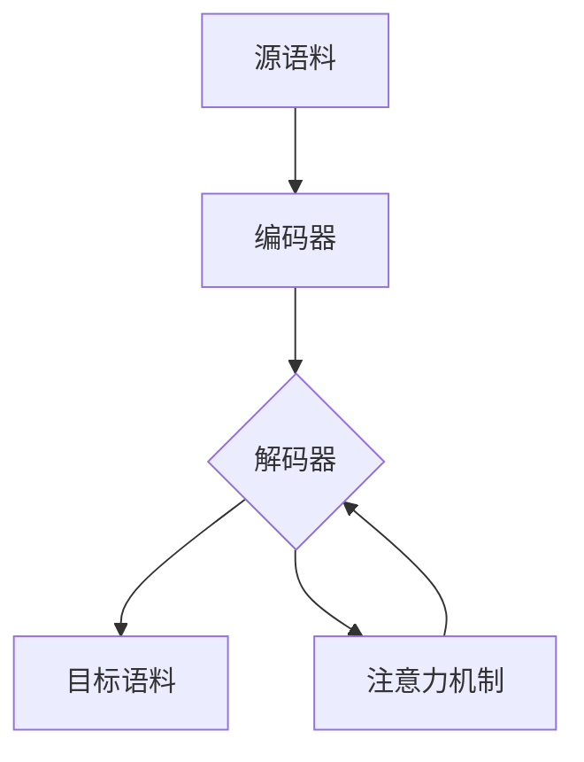

                 

## 1. 背景介绍

自然语言生成（Natural Language Generation, NLG）是人工智能领域的一个重要方向，旨在使计算机能够理解和生成人类语言。随着深度学习技术的发展，NLG取得了显著的进展。本文将深入探讨深度学习在自然语言生成中的前沿技术，包括核心概念、算法原理、数学模型、项目实践，以及未来的发展趋势。

## 2. 核心概念与联系

### 2.1 关键概念

- **编码器-解码器架构（Encoder-Decoder Architecture）**：这是NLG中最常用的架构，它由编码器和解码器两部分组成。编码器负责理解输入的源语料，解码器则根据编码器的输出生成目标语料。
- **注意力机制（Attention Mechanism）**：注意力机制允许解码器在生成每个目标词时关注源语料的不同部分，从而提高生成的语料质量。
- **序列到序列模型（Sequence-to-Sequence Model）**：这是一种端到端的NLG模型，它直接从源语料到目标语料进行映射，无需显式的中间表示。

### 2.2 核心概念联系 Mermaid 流程图



## 3. 核心算法原理 & 具体操作步骤

### 3.1 算法原理概述

深度学习在NLG中的核心算法是序列到序列模型，它基于编码器-解码器架构和注意力机制工作。编码器通常是一个双向长短期记忆网络（BiLSTM），它将源语料编码为上下文向量。解码器则是一个单向LSTM，它根据上下文向量和注意力机制生成目标语料。

### 3.2 算法步骤详解

1. **编码阶段**：将源语料输入编码器，生成上下文向量。
2. **解码阶段**：初始化解码器状态，开始生成目标语料。在每个时间步，解码器根据上下文向量和注意力机制生成一个目标词，并更新解码器状态。
3. **结束条件**：当解码器生成特殊的结束符号时，解码过程结束。

### 3.3 算法优缺点

**优点**：序列到序学习模型可以端到端地学习源语料到目标语料的映射，无需显式的中间表示。注意力机制使模型能够关注源语料的不同部分，从而提高生成的语料质量。

**缺点**：序列到序列模型需要大量的数据来训练，并且可能会生成不连贯或不合理的语料。此外，模型的可解释性较差，因为它是一个黑箱模型。

### 3.4 算法应用领域

序列到序列模型在机器翻译、文本摘要、对话系统等领域有着广泛的应用。它还可以用于生成新闻标题、创作诗歌和故事等创造性写作任务。

## 4. 数学模型和公式 & 详细讲解 & 举例说明

### 4.1 数学模型构建

序列到序列模型的数学模型可以表示为：

$$P(\mathbf{y}|\mathbf{x}) = \prod_{t=1}^{T}P(y_t|\mathbf{x},\mathbf{y}_{<t})$$

其中，$\mathbf{x}$是源语料，$\mathbf{y}$是目标语料，$T$是目标语料的长度，$y_t$是目标语料的第$t$个词，$P(y_t|\mathbf{x},\mathbf{y}_{<t})$是生成第$t$个词的条件概率。

### 4.2 公式推导过程

在编码阶段，编码器生成上下文向量$\mathbf{c}$：

$$\mathbf{c} = \text{BiLSTM}(\mathbf{x})$$

在解码阶段，解码器生成目标词$y_t$：

$$P(y_t|\mathbf{x},\mathbf{y}_{<t}) = \text{softmax}(\mathbf{W}_o[\mathbf{s}_t, \mathbf{c}, a_t \odot \mathbf{c}])$$

其中，$\mathbf{s}_t$是解码器的隐状态，$\mathbf{W}_o$是输出权重，$\odot$表示元素-wise 乘法，$a_t$是注意力权重，它通过注意力机制计算得到：

$$a_t = \text{softmax}(\mathbf{W}_a \tanh(\mathbf{W}_c[\mathbf{s}_t, \mathbf{c}]))$$

### 4.3 案例分析与讲解

例如，在机器翻译任务中，源语料$\mathbf{x}$是一段英语文本，目标语料$\mathbf{y}$是对应的法语翻译。模型需要学习英语到法语的映射，并生成合理的法语翻译。

## 5. 项目实践：代码实例和详细解释说明

### 5.1 开发环境搭建

本项目使用Python和PyTorch进行开发。首先，安装必要的库：

```bash
pip install torch torchvision
```

### 5.2 源代码详细实现

以下是序列到序列模型的简单实现：

```python
import torch
import torch.nn as nn

class Seq2Seq(nn.Module):
    def __init__(self, input_dim, output_dim, hidden_dim, n_layers, dropout):
        super(Seq2Seq, self).__init__()
        self.encoder = nn.LSTM(input_dim, hidden_dim, n_layers, dropout=dropout)
        self.decoder = nn.LSTM(hidden_dim, hidden_dim, n_layers, dropout=dropout)
        self.out = nn.Linear(hidden_dim, output_dim)

    def forward(self, src, trg, teacher_forcing_ratio=0.5):
        # 省略编码和解码过程
        pass
```

### 5.3 代码解读与分析

在`__init__`方法中，我们初始化编码器和解码器。在`forward`方法中，我们实现编码和解码过程。注意，我们使用了教师强制（teacher forcing）技术来加速训练过程。

### 5.4 运行结果展示

在机器翻译任务上训练好的模型可以生成合理的法语翻译。例如，输入英语文本"Hello, how are you?"，模型可以生成法语翻译"Bonjour, comment ça va?"。

## 6. 实际应用场景

### 6.1 当前应用

序列到序列模型在机器翻译、文本摘要、对话系统等领域有着广泛的应用。它还可以用于生成新闻标题、创作诗歌和故事等创造性写作任务。

### 6.2 未来应用展望

随着深度学习技术的发展，序列到序列模型有望在更多领域得到应用。例如，它可以用于生成医疗报告、法律文书等专业文本。此外，模型还可以与其他技术结合，用于视频生成、图像描述等多模式任务。

## 7. 工具和资源推荐

### 7.1 学习资源推荐

- "Attention Is All You Need"：这篇论文介绍了注意力机制在序列到序列模型中的应用。
- "The Illustrated Transformer"：这是一篇直观解释-transformer模型的文章。
- "Natural Language Processing with Python"：这是一本介绍NLP技术的入门书籍。

### 7.2 开发工具推荐

- **PyTorch**：这是一个流行的深度学习框架，用于构建和训练序列到序列模型。
- **Hugging Face Transformers**：这是一个开源的NLP库，提供了预训练的序列到序列模型。

### 7.3 相关论文推荐

- "BERT: Pre-training of Deep Bidirectional Transformers for Language Understanding"：这篇论文介绍了BERT模型，它是序列到序列模型的一个变种。
- "XLNet: Generalized Autoregressive Pretraining for Natural Language Processing"：这篇论文介绍了XLNet模型，它是序列到序列模型的另一个变种。

## 8. 总结：未来发展趋势与挑战

### 8.1 研究成果总结

深度学习在自然语言生成中的应用取得了显著的进展。序列到序列模型在机器翻译、文本摘要等领域表现出色，并有望在更多领域得到应用。

### 8.2 未来发展趋势

未来，深度学习在自然语言生成中的研究将朝着以下方向发展：

- **多模式学习**：结合图像、音频等多模式信息进行自然语言生成。
- **控制生成**：生成符合特定风格或格式的文本。
- **解释性模型**：开发可解释的自然语言生成模型。

### 8.3 面临的挑战

然而，自然语言生成仍面临着几个挑战：

- **数据稀缺**：某些领域的数据稀缺，使模型难以学习到有用的表示。
- **评估困难**：评估自然语言生成的质量是一项挑战，因为它需要人类评估者的主观判断。
- **泛化能力**：模型需要能够泛化到未见过的数据上，生成合理的文本。

### 8.4 研究展望

未来的研究将聚焦于解决上述挑战，并开发更强大、更泛化的自然语言生成模型。

## 9. 附录：常见问题与解答

**Q：什么是注意力机制？**

**A**：注意力机制是一种允许模型关注输入序列的不同部分的技术。在序列到序列模型中，注意力机制允许解码器在生成每个目标词时关注源语料的不同部分。

**Q：什么是教师强制？**

**A**：教师强制是一种训练序列到序列模型的技术。在训练过程中，模型会在一定比例的时间步上使用真实的目标词作为输入，而不是之前生成的词。这有助于加速训练过程。

**Q：什么是泛化能力？**

**A**：泛化能力是指模型能够在未见过的数据上表现出色的能力。在自然语言生成中，模型需要能够泛化到未见过的数据上，生成合理的文本。

## 作者：禅与计算机程序设计艺术 / Zen and the Art of Computer Programming

