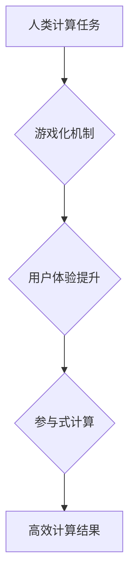

                 

# 游戏化体验：让参与人类计算充满乐趣

> 关键词：人类计算、游戏化、参与式计算、激励机制、用户体验

## 1. 背景介绍

人类计算，顾名思义，是指利用人类的智慧和认知能力来解决复杂问题，并将其与计算机技术相结合。近年来，随着人工智能和大数据技术的快速发展，人类计算逐渐成为一个重要的研究领域。

传统的计算模式主要依赖于计算机的计算能力，但对于一些需要人类主观判断、创意和经验的复杂问题，计算机往往难以给出最佳解决方案。而人类计算则可以弥补这一不足，通过将任务分解成更小的单元，并由人类参与者进行处理，从而提高计算效率和准确性。

然而，参与人类计算的体验往往枯燥乏味，缺乏趣味性和激励性，这导致参与者流失率高，难以形成规模化效应。因此，如何提升人类计算的参与度和用户体验，使其更加有趣和吸引人，成为了一个亟待解决的问题。

## 2. 核心概念与联系

游戏化体验是指借鉴游戏的设计理念和机制，将非游戏场景或任务转化为具有游戏化特性的体验。在人类计算领域，游戏化体验可以有效地提升参与者的积极性和参与度，使其更加愿意投入时间和精力参与计算任务。

**核心概念：**

* **游戏化机制:**  包括积分、排行榜、奖励、成就、任务目标等，这些机制可以激发参与者的竞争意识和成就感，使其更加投入。
* **用户体验:**  指参与者在参与人类计算过程中所感受到的整体感受，包括趣味性、便捷性、成就感等。
* **参与式计算:**  是指将计算任务分解成更小的单元，并由多个参与者共同完成，从而提高计算效率和准确性。

**架构流程图:**



## 3. 核心算法原理 & 具体操作步骤

### 3.1  算法原理概述

游戏化算法的核心在于如何将人类计算任务与游戏机制相结合，使其更加有趣和有吸引力。常见的算法包括：

* **积分奖励算法:**  根据参与者的贡献度，给予相应的积分奖励，积分可以兑换虚拟物品或现实奖励。
* **排行榜算法:**  根据参与者的积分排名，展示排行榜，激发参与者的竞争意识和成就感。
* **成就系统算法:**  设置不同的成就目标，参与者完成目标后获得成就奖励，增强参与者的成就感和归属感。
* **任务目标算法:**  将人类计算任务分解成多个小任务，设置任务目标和奖励，引导参与者逐步完成任务。

### 3.2  算法步骤详解

以积分奖励算法为例，其具体操作步骤如下：

1. **任务定义:**  明确人类计算任务的具体内容和目标。
2. **积分分配:**  根据任务难度和参与者贡献度，制定积分分配规则。
3. **积分记录:**  记录参与者的积分变化，并及时更新排行榜。
4. **奖励兑换:**  设置积分兑换规则，参与者可以将积分兑换为虚拟物品或现实奖励。

### 3.3  算法优缺点

**优点:**

* 能够有效提升参与者的积极性和参与度。
* 能够激发参与者的竞争意识和成就感。
* 能够增强参与者的归属感和粘性。

**缺点:**

* 可能会导致过度竞争和恶意行为。
* 需要精心设计积分分配规则，避免不公平现象。
* 需要持续更新奖励机制，保持参与者的新鲜感。

### 3.4  算法应用领域

游戏化算法广泛应用于人类计算领域，例如：

* **图像识别:**  利用游戏化机制，鼓励用户标注图像，提高图像识别模型的准确性。
* **自然语言处理:**  通过游戏化任务，引导用户参与文本标注和语义理解，提升自然语言处理模型的性能。
* **科学研究:**  利用游戏化平台，收集用户参与的科学数据，加速科学研究进程。

## 4. 数学模型和公式 & 详细讲解 & 举例说明

### 4.1  数学模型构建

在游戏化人类计算中，我们可以构建一个简单的数学模型来描述参与者的激励机制：

$$
Motivation = f(Reward, Ranking, Achievement)
$$

其中：

* **Motivation:**  参与者的动机和积极性。
* **Reward:**  参与者获得的奖励，例如积分、虚拟物品、现实奖励等。
* **Ranking:**  参与者在排行榜中的排名。
* **Achievement:**  参与者完成的成就目标数量。

### 4.2  公式推导过程

我们可以假设以下关系：

* **Reward:**  奖励对动机的贡献度较高，可以用一个线性函数表示：

$$
Reward \cdot k_1
$$

其中 $k_1$ 是奖励的权重系数。

* **Ranking:**  排名对动机的贡献度中等，可以用一个指数函数表示：

$$
Ranking^{-k_2}
$$

其中 $k_2$ 是排名的权重系数。

* **Achievement:**  成就对动机的贡献度较低，可以用一个常数项表示：

$$
Achievement \cdot k_3
$$

其中 $k_3$ 是成就的权重系数。

将以上关系代入公式，得到最终的动机模型：

$$
Motivation = Reward \cdot k_1 + Ranking^{-k_2} + Achievement \cdot k_3
$$

### 4.3  案例分析与讲解

假设一个图像识别任务，参与者需要标注图像中的物体。

* **Reward:**  每标注一个正确的物体，给予10积分奖励。
* **Ranking:**  排行榜前10名可以获得额外的虚拟物品奖励。
* **Achievement:**  完成特定数量的标注任务，获得成就奖励。

根据上述设置，我们可以调整 $k_1$, $k_2$, $k_3$ 的值，来平衡奖励、排名和成就对参与者的激励作用。例如，如果希望鼓励用户积极标注，可以将 $k_1$ 设置为一个较大的值，同时将 $k_2$ 和 $k_3$ 设置为较小的值。

## 5. 项目实践：代码实例和详细解释说明

### 5.1  开发环境搭建

本项目使用 Python 语言开发，所需环境如下：

* Python 3.x
* Flask 框架
* Redis 数据库

### 5.2  源代码详细实现

```python
from flask import Flask, render_template, request
from redis import Redis

app = Flask(__name__)
redis_client = Redis(host='localhost', port=6379)

@app.route('/')
def index():
    return render_template('index.html')

@app.route('/submit', methods=['POST'])
def submit():
    data = request.form.get('data')
    # ... 处理数据并存储到 Redis 数据库 ...
    return 'success'

if __name__ == '__main__':
    app.run(debug=True)
```

**代码解读与分析:**

*  `index.html` 页面负责展示游戏化界面，例如任务列表、排行榜、积分记录等。
*  `submit` 函数处理用户提交的数据，并将其存储到 Redis 数据库中。
*  Redis 数据库用于存储用户积分、排名和任务进度等数据。

### 5.3  代码解读与分析

```python
# ... 
# 存储用户积分
redis_client.hincrby('user:123', 'score', 10)
# ... 
```

**代码解读与分析:**

*  `redis_client.hincrby()` 函数用于将用户积分增加10分。
*  `user:123` 是用户的 Redis 键，`score` 是积分的字段名。

### 5.4  运行结果展示

运行上述代码后，用户可以访问 `http://127.0.0.1:5000/` 页面，参与游戏化的人类计算任务。

## 6. 实际应用场景

### 6.1  科学研究

* **蛋白质折叠预测:**  利用游戏化机制，鼓励用户参与蛋白质结构预测任务，加速蛋白质折叠问题的研究。
* **药物研发:**  通过游戏化平台，收集用户对药物分子结构的评价，辅助药物研发过程。

### 6.2  社会公益

* **环境监测:**  利用游戏化任务，引导用户参与环境数据采集和分析，提高环境监测的效率和准确性。
* **灾害救援:**  在灾害发生后，利用游戏化平台，收集用户对灾情信息的反馈，辅助灾害救援工作。

### 6.3  教育培训

* **语言学习:**  通过游戏化任务，引导用户学习新的语言，提高语言学习的趣味性和效率。
* **科学知识普及:**  利用游戏化平台，将科学知识转化为有趣的游戏，提高公众对科学的理解和兴趣。

### 6.4  未来应用展望

随着人工智能和游戏技术的不断发展，游戏化人类计算将有更广泛的应用场景，例如：

* **个性化教育:**  根据用户的学习进度和兴趣，定制个性化的游戏化学习任务。
* **虚拟现实体验:**  将人类计算任务融入虚拟现实环境，提供更加沉浸式的体验。
* **跨文化交流:**  利用游戏化平台，促进不同文化背景的人员之间的交流和合作。

## 7. 工具和资源推荐

### 7.1  学习资源推荐

* **书籍:**

    * 《游戏设计基础》
    * 《用户体验设计》
    * 《人工智能：一种现代方法》

* **在线课程:**

    * Coursera: 人工智能课程
    * edX: 游戏设计课程
    * Udemy: 用户体验设计课程

### 7.2  开发工具推荐

* **Python:**  用于开发游戏化人类计算平台。
* **Flask:**  轻量级 Web 框架，用于构建游戏化平台的 Web 接口。
* **Redis:**  内存数据库，用于存储用户数据和游戏状态。
* **Unity:**  游戏引擎，用于开发虚拟现实体验。

### 7.3  相关论文推荐

* **Human Computation: A Survey**
* **Game-Based Human Computation: A Survey**
* **The Future of Human Computation**

## 8. 总结：未来发展趋势与挑战

### 8.1  研究成果总结

游戏化人类计算是一个新兴的领域，近年来取得了显著的进展。通过借鉴游戏设计理念和机制，能够有效提升参与者的积极性和参与度，并将其应用于科学研究、社会公益、教育培训等多个领域。

### 8.2  未来发展趋势

未来，游戏化人类计算将朝着以下几个方向发展：

* **更智能化的游戏化机制:**  利用人工智能技术，根据用户的行为和喜好，定制更智能化的游戏化机制，提高参与者的体验和效率。
* **更沉浸式的体验:**  将游戏化人类计算融入虚拟现实和增强现实环境，提供更加沉浸式的体验。
* **更广泛的应用场景:**  将游戏化人类计算应用于更多领域，例如医疗保健、金融服务、城市管理等。

### 8.3  面临的挑战

游戏化人类计算也面临一些挑战：

* **如何设计更有效的激励机制:**  需要不断探索新的激励机制，避免过度竞争和恶意行为。
* **如何保证数据安全和隐私:**  需要采取有效的措施，保护用户数据安全和隐私。
* **如何提高参与者的长期粘性:**  需要持续更新游戏内容和玩法，保持参与者的新鲜感和兴趣。

### 8.4  研究展望

未来，我们将继续深入研究游戏化人类计算，探索更智能、更沉浸、更广泛的应用场景，并致力于解决面临的挑战，推动游戏化人类计算的发展。

## 9. 附录：常见问题与解答

**Q1: 游戏化人类计算与传统人类计算有什么区别？**

**A1:**  传统人类计算主要依赖于人工的判断和决策，而游戏化人类计算则通过游戏化机制，激发参与者的积极性和参与度，提高计算效率和准确性。

**Q2: 如何设计有效的游戏化机制？**

**A2:**  需要根据具体的任务和目标，设计合理的积分分配规则、排行榜机制、成就系统等，并不断进行调整和优化。

**Q3: 游戏化人类计算有哪些应用场景？**

**A3:**  游戏化人类计算可以应用于科学研究、社会公益、教育培训等多个领域，例如蛋白质折叠预测、药物研发、语言学习等。

**Q4: 游戏化人类计算面临哪些挑战？**

**A4:**  游戏化人类计算面临的挑战包括设计有效的激励机制、保证数据安全和隐私、提高参与者的长期粘性等。

**Q5: 未来游戏化人类计算的发展趋势是什么？**

**A5:**  未来游戏化人类计算将朝着更智能化、更沉浸式、更广泛的应用场景发展。


作者：禅与计算机程序设计艺术 / Zen and the Art of Computer Programming 
<end_of_turn>

