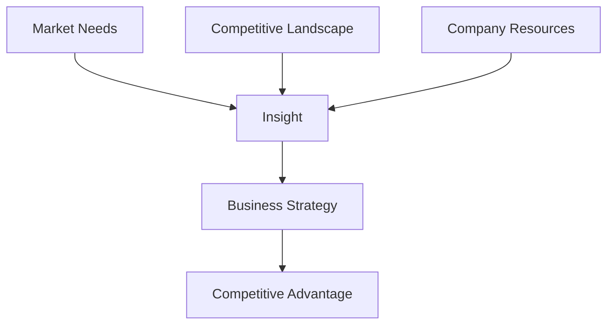

                 

**理解洞察力的应用：在商业策略中的力量**

## 1. 背景介绍

在当今快速变化的商业环境中，企业需要具备敏锐的洞察力来应对不断变化的市场需求和竞争格局。洞察力，即对事物本质的深入理解，是企业制定有效商业策略的关键。本文将深入探讨洞察力在商业策略中的应用，并提供实践指南和工具推荐。

## 2. 核心概念与联系

### 2.1 洞察力的定义

洞察力（Insight）是指对事物本质的深入理解，它超越了表面现象，揭示了事物的内在联系和规律。洞察力是一种创造性的思维，它将信息转化为有价值的见解，从而指导决策和行动。

### 2.2 商业策略的定义

商业策略（Business Strategy）是企业为实现其目标而采取的行动计划。它是企业对市场环境、竞争对手和自身资源的反应，旨在创造和维持竞争优势。

### 2.3 洞察力与商业策略的联系

洞察力是商业策略的基础。它帮助企业理解市场需求、竞争格局和自身优势，从而制定有效的商业策略。洞察力可以帮助企业预测市场趋势，识别新的商机，提高决策质量，并增强竞争力。



## 3. 核心算法原理 & 具体操作步骤

### 3.1 算法原理概述

洞察力的产生并非随机，而是遵循一定的逻辑过程。本节将介绍一种洞察力算法，它基于信息收集、信息整理、信息分析和信息应用四个步骤。

### 3.2 算法步骤详解

1. **信息收集（Information Gathering）**：收集与目标相关的信息，包括市场数据、竞争对手信息、客户反馈等。
2. **信息整理（Information Organization）**：整理收集到的信息，将其分类、汇总，并去除无关信息。
3. **信息分析（Information Analysis）**：分析整理好的信息，寻找其中的模式、趋势和规律。这通常需要运用统计学、数据挖掘等工具。
4. **信息应用（Information Application）**：将分析结果转化为有价值的见解，并应用于商业策略的制定。

### 3.3 算法优缺点

**优点**：该算法有助于企业系统地收集、分析和应用信息，从而产生洞察力。它帮助企业超越直觉和经验，基于数据和分析做出决策。

**缺点**：该算法需要大量的时间和资源来收集和分析信息。此外，它可能会导致企业过度依赖数据，忽略其他重要因素，如文化和政治因素。

### 3.4 算法应用领域

该算法适用于各种商业领域，包括市场营销、产品开发、竞争分析和战略规划。它可以帮助企业理解市场需求、识别新的商机，并制定有效的商业策略。

## 4. 数学模型和公式 & 详细讲解 & 举例说明

### 4.1 数学模型构建

洞察力的产生可以视为一个信息处理过程。我们可以使用信息熵（Entropy）模型来量化这个过程。信息熵是信息论中的一个基本概念，它衡量信息的不确定性或随机性。

### 4.2 公式推导过程

信息熵的公式为：

$$H(X) = -\sum P(x_i) \log P(x_i)$$

其中，$X$是一个随机变量，$P(x_i)$是随机变量$X$取值$x_i$的概率。信息熵越高，表示信息的不确定性或随机性越大。

在洞察力的产生过程中，信息熵会随着信息的收集、整理、分析和应用而减小。这是因为这些步骤都会减小信息的不确定性或随机性。

### 4.3 案例分析与讲解

例如，一家企业想要理解其客户的需求。它首先收集客户的反馈信息（信息收集），然后整理这些信息（信息整理），并使用统计学工具分析这些信息（信息分析）。通过这些步骤，企业对客户需求的理解变得更清晰，信息熵减小，从而产生了洞察力。

## 5. 项目实践：代码实例和详细解释说明

### 5.1 开发环境搭建

本节将使用Python语言来实现洞察力算法。我们需要安装以下库：pandas（数据处理）、numpy（数值计算）、matplotlib（数据可视化）和 scipy（信息熵计算）。

### 5.2 源代码详细实现

```python
import pandas as pd
import numpy as np
import matplotlib.pyplot as plt
from scipy.stats import entropy

# 信息收集：假设我们已经收集了客户反馈数据
data = pd.read_csv('customer_feedback.csv')

# 信息整理：假设我们已经整理了数据，并将其转化为一个数据框
#...

# 信息分析：计算信息熵
entropy_before = entropy(data['customer_needs'].value_counts(normalize=True), base=2)

# 信息应用：假设我们已经分析了数据，并得到了客户需求的洞察力
#...

# 计算信息熵
entropy_after = entropy(data['customer_needs'].value_counts(normalize=True), base=2)

# 打印信息熵的变化
print('信息熵变化：', entropy_before - entropy_after)
```

### 5.3 代码解读与分析

这段代码实现了洞察力算法的信息收集、信息整理、信息分析和信息应用四个步骤。它使用信息熵模型来量化信息的不确定性或随机性，并计算信息熵的变化来衡量洞察力的产生。

### 5.4 运行结果展示

运行这段代码后，您会看到信息熵的变化。信息熵的减小表示信息的不确定性或随机性减小，从而产生了洞察力。

## 6. 实际应用场景

### 6.1 当前应用

洞察力在商业策略中的应用已经非常广泛。例如，市场调查公司使用洞察力帮助企业理解市场需求，竞争对手分析公司使用洞察力帮助企业分析竞争格局，战略咨询公司使用洞察力帮助企业制定战略规划。

### 6.2 未来应用展望

随着大数据和人工智能技术的发展，洞察力的产生将变得更加自动化和智能化。企业可以使用机器学习算法自动分析大数据，从而产生洞察力。此外，洞察力的产生也将更加实时，企业可以即时地响应市场变化。

## 7. 工具和资源推荐

### 7.1 学习资源推荐

- 书籍：《洞察力：理解商业的新科学》（Insight: The New Science of Understanding）作者：Tina Seelig
- 课程：Coursera上的“数据驱动型思维”课程

### 7.2 开发工具推荐

- Python：一个强大的数据分析和可视化工具
- Tableau：一个 powerful data visualization tool
- IBM Watson Analytics：一个基于人工智能的商业分析平台

### 7.3 相关论文推荐

- “Insight: A New Approach to Understanding the World”作者：Gary Klein
- “The Science of Insight”作者：David E. Meyer

## 8. 总结：未来发展趋势与挑战

### 8.1 研究成果总结

本文介绍了洞察力在商业策略中的应用，并提供了实践指南和工具推荐。我们还提出了信息熵模型来量化洞察力的产生过程。

### 8.2 未来发展趋势

未来，洞察力的产生将变得更加自动化和智能化。企业可以使用机器学习算法自动分析大数据，从而产生洞察力。此外，洞察力的产生也将更加实时，企业可以即时地响应市场变化。

### 8.3 面临的挑战

然而，洞察力的产生也面临着挑战。企业需要平衡数据驱动和人为判断，避免过度依赖数据。此外，企业还需要面对大数据的海量和复杂性，以及数据安全和隐私问题。

### 8.4 研究展望

未来的研究可以探讨洞察力与人工智能的结合，研究如何使用机器学习算法自动产生洞察力。此外，研究还可以探讨洞察力与企业文化和组织结构的关系，研究如何在企业内部推广洞察力文化。

## 9. 附录：常见问题与解答

**Q1：洞察力与直觉有什么区别？**

**A1：洞察力是基于数据和分析的深入理解，而直觉则是基于经验和本能的判断。洞察力是一种创造性的思维，它将信息转化为有价值的见解，而直觉则更多地基于过去的经验。**

**Q2：洞察力的产生需要什么条件？**

**A2：洞察力的产生需要信息收集、信息整理、信息分析和信息应用四个步骤。此外，它还需要创造性的思维和开放的心态。**

**Q3：洞察力在商业策略中的作用是什么？**

**A3：洞察力在商业策略中的作用是帮助企业理解市场需求、竞争格局和自身优势，从而制定有效的商业策略。它可以帮助企业预测市场趋势，识别新的商机，提高决策质量，并增强竞争力。**

**作者：禅与计算机程序设计艺术 / Zen and the Art of Computer Programming**

