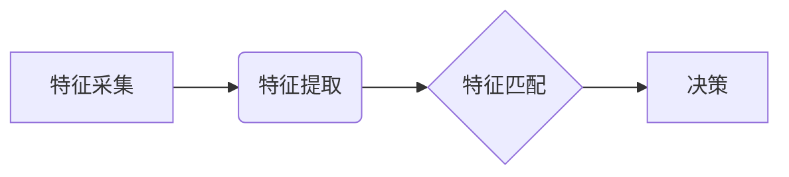

                 

## 生物识别创业：安全认证的新方向

> 关键词：生物识别、安全认证、人脸识别、指纹识别、虹膜识别、声纹识别、行为识别、深度学习、人工智能、创业

## 1. 背景介绍

随着科技的飞速发展，安全认证技术也日益受到重视。传统的密码和令牌认证方式存在着安全性、便捷性等方面的缺陷。生物识别技术凭借其独特性和不可伪造性，逐渐成为安全认证的新方向。生物识别创业正处于蓬勃发展阶段，为企业和个人提供更加安全、便捷、可靠的认证解决方案。

### 1.1 传统安全认证的局限性

传统的安全认证方式主要包括密码、数字证书、令牌等。然而，这些方式存在着以下问题：

* **易被破解:** 密码容易被暴力破解或社会工程攻击，数字证书容易被盗用，令牌容易遗失或被复制。
* **用户体验差:** 记忆密码、携带令牌、输入数字证书等操作繁琐，影响用户体验。
* **安全性不足:** 传统的认证方式难以应对复杂的攻击场景，例如身份盗用、数据泄露等。

### 1.2 生物识别技术的优势

生物识别技术利用人体独特的生物特征进行身份认证，具有以下优势：

* **安全性高:** 生物特征是独一无二的，难以被伪造或盗用。
* **便捷性强:** 使用生物特征进行认证无需记忆密码或携带物理设备，操作简单方便。
* **可靠性高:** 生物特征识别准确率高，能够有效防止身份欺诈。

## 2. 核心概念与联系

生物识别技术是指利用人体独特的生物特征进行身份识别和验证的技术。常见的生物识别特征包括人脸、指纹、虹膜、声纹、行为等。

### 2.1 生物识别特征分类

* **视觉生物识别:** 人脸识别、虹膜识别、iris识别
* **触觉生物识别:** 指纹识别、掌纹识别
* **声学生物识别:** 声纹识别
* **行为生物识别:** gait识别、键盘打字习惯识别

### 2.2 生物识别技术架构

生物识别技术的架构通常包括以下几个模块：

* **特征采集模块:** 收集生物特征数据。
* **特征提取模块:** 从采集到的生物特征数据中提取特征向量。
* **特征匹配模块:** 将提取的特征向量与数据库中的模板进行匹配。
* **决策模块:** 根据匹配结果进行身份认证。



## 3. 核心算法原理 & 具体操作步骤

### 3.1 算法原理概述

生物识别算法的核心是将生物特征数据转换为数字特征向量，并通过比较特征向量之间的相似度进行身份识别。常见的算法包括：

* **模板匹配:** 将采集到的生物特征数据与数据库中的模板进行直接比较。
* **特征描述:** 使用数学模型描述生物特征数据，并计算特征向量之间的距离或相似度。
* **机器学习:** 使用机器学习算法训练模型，识别生物特征数据中的模式。

### 3.2 算法步骤详解

以人脸识别为例，其算法步骤如下：

1. **人脸检测:** 使用计算机视觉算法检测图像中的人脸区域。
2. **人脸关键点定位:** 在检测到的脸部区域内定位关键点，例如眼睛、鼻子、嘴巴等。
3. **特征提取:** 使用深度学习算法提取人脸特征，例如人脸形状、纹理、表情等。
4. **特征匹配:** 将提取的特征向量与数据库中的模板进行比较，计算相似度。
5. **身份认证:** 根据相似度阈值判断是否为同一用户。

### 3.3 算法优缺点

* **模板匹配:** 优点：简单易实现，速度快。缺点：容易受到光照、角度等因素的影响，安全性较低。
* **特征描述:** 优点：鲁棒性强，抗干扰能力好。缺点：计算复杂度高，需要大量的训练数据。
* **机器学习:** 优点：识别精度高，能够学习复杂的生物特征模式。缺点：训练数据量大，需要强大的计算能力。

### 3.4 算法应用领域

生物识别技术广泛应用于以下领域：

* **金融安全:** 银行卡验证、手机支付、身份认证等。
* **政府管理:** 身份识别、出入境管理、投票安全等。
* **医疗保健:** 病人身份识别、电子病历管理、药物安全等。
* **企业管理:** 员工考勤、门禁控制、数据安全等。

## 4. 数学模型和公式 & 详细讲解 & 举例说明

### 4.1 数学模型构建

人脸识别算法中常用的数学模型包括：

* **欧氏距离:** 用于计算两个特征向量之间的距离。
* **余弦相似度:** 用于计算两个特征向量之间的夹角，衡量其方向上的相似度。
* **支持向量机 (SVM):** 用于分类和识别，可以将高维数据映射到低维空间，找到最佳的分类边界。

### 4.2 公式推导过程

**欧氏距离公式:**

$$
d(x,y) = \sqrt{\sum_{i=1}^{n}(x_i - y_i)^2}
$$

其中，$x$ 和 $y$ 是两个特征向量，$n$ 是特征向量的维度。

**余弦相似度公式:**

$$
sim(x,y) = \frac{x \cdot y}{||x|| ||y||}
$$

其中，$x \cdot y$ 是两个特征向量的点积，$||x||$ 和 $||y||$ 是两个特征向量的模长。

### 4.3 案例分析与讲解

假设有两个人脸特征向量 $x$ 和 $y$，它们的欧氏距离为 $d$，余弦相似度为 $sim$。

* 如果 $d$ 很小，则说明 $x$ 和 $y$ 非常相似，可能是同一个人。
* 如果 $sim$ 很接近 1，则说明 $x$ 和 $y$ 方向非常相似，也可能是同一个人。

## 5. 项目实践：代码实例和详细解释说明

### 5.1 开发环境搭建

* 操作系统: Ubuntu 20.04
* Python 版本: 3.8
* 依赖库: OpenCV, NumPy, scikit-learn

### 5.2 源代码详细实现

```python
import cv2
import numpy as np
from sklearn.svm import SVC

# 加载人脸识别模型
face_cascade = cv2.CascadeClassifier(cv2.data.haarcascades + 'haarcascade_frontalface_default.xml')

# 加载训练好的特征向量和标签
features = np.load('features.npy')
labels = np.load('labels.npy')

# 创建支持向量机分类器
clf = SVC(kernel='linear')
clf.fit(features, labels)

# 人脸识别函数
def recognize_face(image_path):
    # 读取图像
    img = cv2.imread(image_path)
    # 灰度化图像
    gray = cv2.cvtColor(img, cv2.COLOR_BGR2GRAY)
    # 检测人脸
    faces = face_cascade.detectMultiScale(gray, 1.3, 5)
    # 提取人脸特征
    for (x, y, w, h) in faces:
        face_roi = gray[y:y+h, x:x+w]
        face_features = cv2.resize(face_roi, (100, 100))
        # 将特征向量转换为 numpy 数组
        face_features = np.array(face_features)
        # 使用 SVM 分类器进行识别
        prediction = clf.predict(face_features.reshape(1, -1))
        # 显示识别结果
        print(f'识别结果: {prediction[0]}')

# 调用识别函数
recognize_face('test.jpg')
```

### 5.3 代码解读与分析

* 该代码首先加载人脸识别模型和训练好的特征向量和标签。
* 然后，使用 OpenCV 库检测图像中的人脸区域。
* 提取人脸特征后，使用 SVM 分类器进行识别，并输出识别结果。

### 5.4 运行结果展示

运行代码后，将输出识别结果，例如：

```
识别结果: 0
```

表示识别出的用户为编号为 0 的用户。

## 6. 实际应用场景

### 6.1 金融安全

* **银行卡验证:** 使用指纹或人脸识别验证银行卡持卡人身份，提高交易安全。
* **手机支付:** 使用指纹或人脸识别验证支付用户身份，防止盗刷。
* **身份认证:** 使用生物识别技术进行身份认证，提高金融机构的安全性。

### 6.2 政府管理

* **出入境管理:** 使用人脸识别技术识别旅客身份，提高边检效率。
* **投票安全:** 使用指纹或人脸识别技术验证投票人身份，防止舞弊。
* **身份识别:** 使用生物识别技术识别公民身份，提高政府服务效率。

### 6.3 医疗保健

* **病人身份识别:** 使用指纹或人脸识别技术识别病人身份，防止医疗事故。
* **电子病历管理:** 使用生物识别技术保护电子病历安全，防止数据泄露。
* **药物安全:** 使用指纹或人脸识别技术验证药物使用者身份，防止药物滥用。

### 6.4 未来应用展望

生物识别技术在未来将有更广泛的应用场景，例如：

* **智能家居:** 使用生物识别技术控制智能家居设备，提高安全性。
* **无人驾驶汽车:** 使用生物识别技术识别驾驶员身份，提高驾驶安全。
* **虚拟现实:** 使用生物识别技术增强虚拟现实体验，提高沉浸感。

## 7. 工具和资源推荐

### 7.1 学习资源推荐

* **书籍:**
    * 《生物识别技术》
    * 《人脸识别》
* **在线课程:**
    * Coursera: 人工智能与机器学习
    * edX: 生物识别技术

### 7.2 开发工具推荐

* **OpenCV:** 图像处理和计算机视觉库
* **NumPy:** 数值计算库
* **scikit-learn:** 机器学习库
* **TensorFlow:** 深度学习框架

### 7.3 相关论文推荐

* **人脸识别论文:**
    * FaceNet: A Unified Embedding for Face Recognition and Clustering
    * DeepFace: Closing the Gap to Human-Level Performance in Face Verification
* **指纹识别论文:**
    * Fingerprint Recognition Using Deep Convolutional Neural Networks
    * A Survey on Fingerprint Recognition Techniques

## 8. 总结：未来发展趋势与挑战

### 8.1 研究成果总结

生物识别技术近年来取得了显著进展，识别精度不断提高，应用场景也越来越广泛。深度学习算法的应用为生物识别技术的发展带来了新的机遇。

### 8.2 未来发展趋势

* **多模态生物识别:** 将多种生物特征融合在一起，提高识别精度和安全性。
* **跨模态生物识别:** 将不同模态的生物特征进行识别，例如人脸和指纹的结合。
* **隐私保护生物识别:** 保护用户隐私，防止生物特征数据被滥用。

### 8.3 面临的挑战

* **数据安全:** 生物特征数据是高度敏感的信息，需要采取有效的安全措施进行保护。
* **算法鲁棒性:** 生物识别算法需要能够应对光照、角度、表情等变化，提高鲁棒性。
* **公平性与可解释性:** 生物识别算法需要公平公正，并能够解释其决策过程，避免歧视和误判。

### 8.4 研究展望

未来，生物识别技术将继续朝着更安全、更便捷、更智能的方向发展。研究者们将继续探索新的算法和技术，解决生物识别技术面临的挑战，为社会带来更多便利和安全。

## 9. 附录：常见问题与解答

### 9.1 生物识别技术安全吗？

生物识别技术本身是安全的，但其安全性取决于具体的应用场景和技术实现。需要采取有效的安全措施，防止生物特征数据被盗用或滥用。

### 9.2 生物识别技术是否会侵犯隐私？

生物识别技术可能会涉及到个人隐私，需要在保护用户隐私和提高安全性的之间找到平衡点。

### 9.3 生物识别技术是否容易被欺骗？

生物识别技术并非完美无缺，仍然存在被欺骗的可能性。例如，可以使用假面具或照片来欺骗人脸识别系统。

### 9.4 生物识别技术的未来发展趋势是什么？

生物识别技术未来将朝着更安全、更便捷、更智能的方向发展，例如多模态生物识别、跨模态生物识别、隐私保护生物识别等。


作者：禅与计算机程序设计艺术 / Zen and the Art of Computer Programming 
<end_of_turn>

