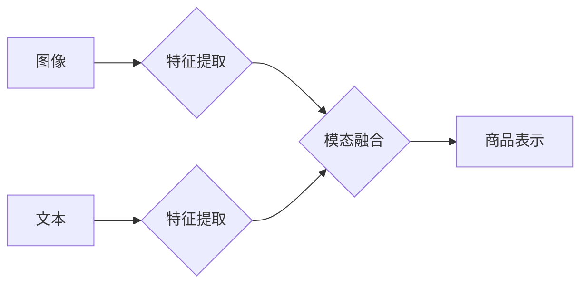

                 

## 电商平台中的多模态商品表示学习

> 关键词：多模态学习、商品表示、电商平台、图像、文本、深度学习、推荐系统

## 1. 背景介绍

在当今数据爆炸的时代，电商平台面临着海量商品信息和用户行为数据的挑战。如何有效地理解和表示商品，是提升用户体验、精准推荐和提高转化率的关键。传统的商品表示方法主要依赖文本描述，但文本信息往往缺乏丰富性和语义深度。

多模态学习 (Multi-modal Learning) 作为一种新兴的机器学习范式，旨在从多种数据模态（如图像、文本、音频、视频等）中学习商品的综合表示，从而获得更全面、更准确的商品理解。

电商平台的多模态商品表示学习具有重要的理论意义和实际价值：

* **提升商品理解深度:** 多模态信息融合可以弥补单一模态信息不足，构建更丰富的商品语义表示。
* **精准推荐商品:** 基于多模态商品表示，推荐系统可以更精准地匹配用户需求，提高推荐效果。
* **个性化用户体验:** 多模态信息可以帮助电商平台个性化商品展示和推荐，提升用户体验。
* **促进新业务发展:** 多模态商品表示为电商平台发展新业务，如虚拟试衣、商品3D建模等，提供了技术基础。

## 2. 核心概念与联系

多模态商品表示学习的核心概念包括：

* **模态:** 指商品信息的不同表现形式，例如图像、文本、视频等。
* **特征提取:** 从每个模态中提取相应的特征表示，例如图像的视觉特征、文本的语义特征等。
* **模态融合:** 将不同模态的特征进行融合，构建商品的综合表示。
* **商品表示:** 多模态信息融合后的商品特征向量，用于后续的商品检索、推荐等任务。

**Mermaid 流程图:**



## 3. 核心算法原理 & 具体操作步骤

### 3.1  算法原理概述

多模态商品表示学习算法主要分为以下几种类型：

* **早期融合:** 将不同模态的特征直接拼接或连接，然后输入到分类器或回归模型中。
* **晚期融合:** 先分别对每个模态进行特征提取和分类，然后将分类结果进行融合。
* **深度融合:** 使用深度学习模型，例如多层感知机 (MLP)、卷积神经网络 (CNN) 和循环神经网络 (RNN) 等，对多模态特征进行端到端的学习。

### 3.2  算法步骤详解

以深度融合为例，详细介绍其算法步骤：

1. **数据预处理:** 对图像和文本数据进行预处理，例如图像裁剪、尺寸调整、文本分词、词向量化等。
2. **特征提取:** 使用预训练的 CNN 模型提取图像特征，使用预训练的 RNN 模型提取文本特征。
3. **特征融合:** 将图像特征和文本特征进行融合，可以使用多种方法，例如拼接、注意力机制、多层感知机等。
4. **商品表示学习:** 使用深度学习模型，例如多层感知机 (MLP) 或 Transformer 等，对融合后的特征进行训练，学习商品的综合表示。
5. **模型评估:** 使用测试数据评估模型性能，例如准确率、召回率、F1-score 等。

### 3.3  算法优缺点

**优点:**

* 能够学习到更丰富的商品表示，提升商品理解深度。
* 能够更好地融合不同模态信息，提高推荐效果。
* 能够适应复杂的数据分布，具有较强的泛化能力。

**缺点:**

* 需要大量的训练数据，训练成本较高。
* 模型复杂度较高，训练和推理时间较长。
* 需要对不同模态数据进行专门的预处理，增加了开发难度。

### 3.4  算法应用领域

多模态商品表示学习算法广泛应用于电商平台的多个领域，例如：

* **商品搜索:** 基于多模态商品表示，可以实现更精准的商品搜索，例如根据用户上传的图片搜索相似商品。
* **商品推荐:** 基于多模态商品表示，可以更精准地推荐用户感兴趣的商品，例如根据用户的浏览历史和购买记录推荐个性化商品。
* **商品分类:** 基于多模态商品表示，可以更准确地对商品进行分类，例如根据商品的图像和文本描述进行分类。
* **商品问答:** 基于多模态商品表示，可以实现更智能的商品问答系统，例如根据用户的问题，自动检索相关商品信息。

## 4. 数学模型和公式 & 详细讲解 & 举例说明

### 4.1  数学模型构建

多模态商品表示学习的数学模型通常基于深度学习框架，例如 TensorFlow 或 PyTorch。模型结构通常包括以下几个部分：

* **模态编码器:** 用于提取每个模态的特征表示。
* **模态融合模块:** 用于将不同模态的特征进行融合。
* **商品表示层:** 用于学习商品的综合表示。

### 4.2  公式推导过程

以注意力机制为例，公式推导过程如下：

1. **计算模态特征之间的相似度:** 使用点积或余弦相似度计算不同模态特征之间的相似度。

$$
\text{Similarity}(x_i, y_j) = \frac{x_i \cdot y_j}{||x_i|| ||y_j||}
$$

2. **计算注意力权重:** 使用 softmax 函数将相似度转换为注意力权重。

$$
\alpha_{ij} = \frac{\exp(\text{Similarity}(x_i, y_j))}{\sum_{k=1}^{N} \exp(\text{Similarity}(x_i, y_k))}
$$

3. **融合模态特征:** 使用注意力权重对不同模态特征进行加权求和。

$$
z_i = \sum_{j=1}^{M} \alpha_{ij} y_j
$$

### 4.3  案例分析与讲解

假设我们有一个电商平台，需要对商品进行多模态表示学习。

* **图像模态:** 商品的图片信息。
* **文本模态:** 商品的标题、描述、属性等文本信息。

我们可以使用 CNN 模型提取图像特征，使用 RNN 模型提取文本特征，然后使用注意力机制将图像特征和文本特征进行融合，最终学习到商品的综合表示。

## 5. 项目实践：代码实例和详细解释说明

### 5.1  开发环境搭建

* Python 3.6+
* TensorFlow 2.0+
* PyTorch 1.0+
* CUDA 10.0+

### 5.2  源代码详细实现

```python
import tensorflow as tf

# 定义图像编码器
def image_encoder(image):
    # 使用预训练的 CNN 模型提取图像特征
    # ...

# 定义文本编码器
def text_encoder(text):
    # 使用预训练的 RNN 模型提取文本特征
    # ...

# 定义注意力机制
def attention_mechanism(image_features, text_features):
    # 计算图像特征和文本特征之间的相似度
    # ...
    # 计算注意力权重
    # ...
    # 融合图像特征和文本特征
    # ...

# 定义商品表示层
def product_representation_layer(fused_features):
    # 使用多层感知机学习商品的综合表示
    # ...

# 定义训练模型
def train_model(image_data, text_data, labels):
    # ...

# 训练模型
train_model(image_data, text_data, labels)
```

### 5.3  代码解读与分析

* 代码首先定义了图像编码器和文本编码器，分别使用预训练的 CNN 和 RNN 模型提取图像和文本特征。
* 然后定义了注意力机制，将图像特征和文本特征进行融合。
* 最后定义了商品表示层，使用多层感知机学习商品的综合表示。

### 5.4  运行结果展示

训练完成后，可以将模型应用于实际场景，例如商品搜索、推荐等。

## 6. 实际应用场景

### 6.1  商品搜索

多模态商品表示学习可以提升商品搜索的精准度。例如，用户可以上传商品图片进行搜索，系统可以根据图像特征和文本描述，找到与用户需求最匹配的商品。

### 6.2  商品推荐

多模态商品表示学习可以帮助电商平台更精准地推荐商品。例如，系统可以根据用户的浏览历史、购买记录、兴趣偏好等信息，学习用户的商品偏好，并推荐符合用户需求的商品。

### 6.3  商品分类

多模态商品表示学习可以帮助电商平台更准确地对商品进行分类。例如，系统可以根据商品的图像和文本描述，自动识别商品类别，并进行分类。

### 6.4  未来应用展望

未来，多模态商品表示学习将在电商平台的更多领域得到应用，例如：

* **虚拟试衣:** 基于多模态商品表示，用户可以虚拟试穿衣服，体验不同风格的搭配。
* **商品3D建模:** 基于多模态商品表示，可以自动生成商品的3D模型，为用户提供更直观的商品展示。
* **个性化商品设计:** 基于多模态商品表示，用户可以参与到商品设计过程中，定制个性化的商品。

## 7. 工具和资源推荐

### 7.1  学习资源推荐

* **书籍:**
    * Deep Learning by Ian Goodfellow, Yoshua Bengio, and Aaron Courville
    * Multimodal Learning by  A. Krizhevsky
* **课程:**
    * Stanford CS231n: Convolutional Neural Networks for Visual Recognition
    * Deep Learning Specialization by Andrew Ng

### 7.2  开发工具推荐

* **TensorFlow:** https://www.tensorflow.org/
* **PyTorch:** https://pytorch.org/
* **Keras:** https://keras.io/

### 7.3  相关论文推荐

* **Show, Attend and Tell: Neural Image Captioning with Visual Attention** by Xu et al. (2015)
* **Multimodal Deep Learning: A Survey** by  A. Krizhevsky (2018)
* **Learning Visual Representations with Deep Multimodal Networks** by  Hinton et al. (2011)

## 8. 总结：未来发展趋势与挑战

### 8.1  研究成果总结

多模态商品表示学习取得了显著的成果，在电商平台的商品搜索、推荐、分类等领域取得了广泛应用。

### 8.2  未来发展趋势

未来，多模态商品表示学习的研究将朝着以下几个方向发展：

* **更强大的模型架构:** 开发更强大的深度学习模型，例如 Transformer、Graph Neural Networks 等，提升商品表示的学习能力。
* **更丰富的模态融合:** 融合更多模态信息，例如音频、视频等，构建更全面的商品表示。
* **更个性化的商品体验:** 基于用户行为和偏好，个性化商品表示和推荐。
* **跨平台商品表示:** 建立跨平台的商品表示体系，实现商品信息在不同平台的共享和互通。

### 8.3  面临的挑战

多模态商品表示学习也面临着一些挑战：

* **数据获取和标注:** 多模态数据获取和标注成本较高，需要开发更有效的标注方法。
* **模态对齐:** 不同模态数据的时间和空间对齐问题需要解决。
* **模型解释性:** 深度学习模型的解释性较差，需要开发更可解释的模型。
* **隐私保护:** 多模态数据包含用户隐私信息，需要开发更有效的隐私保护机制。

### 8.4  研究展望

未来，多模态商品表示学习将继续是一个重要的研究方向，其发展将推动电商平台的智能化转型，为用户提供更便捷、更个性化的购物体验。

## 9. 附录：常见问题与解答

* **Q1: 多模态商品表示学习与传统商品表示方法相比有什么优势？**

* **A1:** 多模态商品表示学习能够融合多种数据模态信息，构建更丰富的商品语义表示，提升商品理解深度和推荐精准度。

* **Q2: 多模态商品表示学习有哪些应用场景？**

* **A2:** 多模态商品表示学习应用场景广泛，例如商品搜索、推荐、分类、虚拟试衣、商品3D建模等。

* **Q3: 如何选择合适的多模态商品表示学习算法？**

* **A3:** 选择合适的算法需要根据具体应用场景和数据特点进行选择。例如，对于图像和文本数据，可以使用 CNN 和 RNN 模型进行融合。

* **Q4: 多模态商品表示学习有哪些挑战？**

* **A4:** 多模态商品表示学习面临着数据获取和标注成本高、模态对齐问题、模型解释性差、隐私保护等挑战。


作者：禅与计算机程序设计艺术 / Zen and the Art of Computer Programming 
<end_of_turn>

