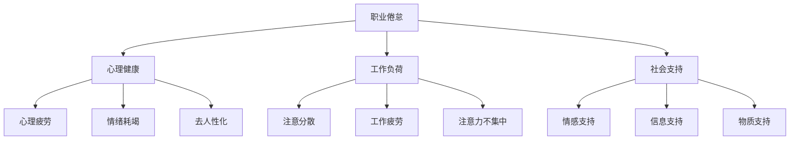

                 

## 1. 背景介绍

在数字化转型浪潮的推动下，元宇宙这一新型虚拟工作环境迅速崛起，成为未来企业的新基建之一。随着技术的进步，企业不再局限于物理办公空间，而是通过虚拟平台实现跨时空的协同工作。然而，这一变革也给员工带来了新的挑战，特别是在心理健康方面。

### 1.1 元宇宙工作环境的概念与兴起
元宇宙（Metaverse）是一个以虚拟现实技术为支撑的虚拟空间，其中融合了多维感官信息，具有沉浸性、交互性和自治性等特征。在这一环境中，员工可以通过虚拟分身进行工作，实现了物理距离的消融和协作效率的提升。

元宇宙之所以能快速兴起，主要得益于云计算、大数据、AI等技术的融合应用。企业利用虚拟平台，整合内部协作、客户服务、供应链管理等多个业务环节，形成了全新的虚拟生态系统。例如，谷歌的三维办公平台“Jamboard”、Meta公司的虚拟会议室“Horizon Workrooms”等，都已成为职场的新常态。

### 1.2 元宇宙工作环境的优势
元宇宙办公环境具有以下几大优势：

- **打破地理限制**：员工不再受限于物理办公地点，可以随时随地进行工作。
- **提高协作效率**：通过虚拟平台，员工之间的互动更加便捷，团队协作更加高效。
- **降低成本**：企业可以节省实体办公空间、设备购置和维护等费用。
- **增强体验感**：虚拟环境能够模拟现实场景，提升员工的沉浸感和工作体验。

### 1.3 元宇宙工作环境的挑战
然而，元宇宙的兴起也带来了新的挑战，尤其是对员工心理健康的影响：

- **隔离感与孤独感**：长时间处于虚拟环境中，员工容易感到与现实世界的隔离，产生孤独感。
- **注意分散与疲劳**：虚拟环境中的多感官刺激，容易导致员工的注意力分散，增加工作疲劳。
- **隐私与安全风险**：虚拟环境中的隐私保护和数据安全问题，也给员工的心理健康带来了新挑战。

## 2. 核心概念与联系

### 2.1 核心概念概述

在研究元宇宙工作环境中的职业倦怠问题时，需要了解以下核心概念：

- **职业倦怠（Job Burnout）**：指长时间处于高压工作状态下，员工出现情绪耗竭、去人性化、个人成就感下降等心理症状，严重时可能导致职业枯竭。
- **心理健康（Mental Health）**：指个体在心理活动和心理特征上的良好状态，包括心理的适应性、反应性及抗性等方面。
- **虚拟环境（Virtual Environment）**：指利用VR/AR等技术构建的虚拟空间，用于模拟现实环境，实现沉浸式交互。
- **工作负荷（Workload）**：指员工在工作中承担的任务量和复杂度，直接影响其心理健康。
- **社会支持（Social Support）**：指员工在职场中获得的各种支持，如情感支持、信息支持、物质支持等。

这些概念之间的联系可以表示为：



以上流程图展示，工作负荷和心理健康之间存在双向关联，心理健康问题可能会导致工作负荷的增加，而工作负荷也可能对心理健康造成负面影响。同时，社会支持是缓解职业倦怠的重要手段，能够提供必要的情感、信息和物质支持，帮助员工应对工作压力。

## 3. 核心算法原理 & 具体操作步骤

### 3.1 算法原理概述

研究元宇宙工作环境中的心理健康问题，可以从以下几个维度进行建模和分析：

- **工作负荷模型**：通过度量员工在工作中的任务量、复杂度和时间压力，分析其对心理健康的潜在影响。
- **社会支持模型**：研究员工在工作中获得的情感、信息和物质支持，评估其对心理健康的作用。
- **心理疲劳模型**：基于工作负荷模型和社会支持模型，综合评估员工的疲劳程度。
- **情绪耗竭模型**：基于心理疲劳模型，分析情绪耗竭的程度和类型。
- **去人性化模型**：基于心理疲劳模型和情绪耗竭模型，评估去人性化的程度和原因。

### 3.2 算法步骤详解

#### 3.2.1 工作负荷模型
工作负荷模型的构建步骤如下：

1. **任务度量**：对员工的工作任务进行度量，包括任务的数量、复杂度、时间压力等。
2. **负荷计算**：通过加权平均法或熵值法等方法，计算员工的工作负荷值。
3. **负荷分析**：根据工作负荷值，划分高负荷、中等负荷和低负荷三个等级，评估其对心理健康的潜在影响。

#### 3.2.2 社会支持模型
社会支持模型的构建步骤如下：

1. **支持度量**：对员工获得的情感支持、信息支持和物质支持进行度量。
2. **支持计算**：通过加权平均法或熵值法等方法，计算员工的社会支持值。
3. **支持分析**：根据社会支持值，评估其对心理健康的作用。

#### 3.2.3 心理疲劳模型
心理疲劳模型的构建步骤如下：

1. **疲劳计算**：结合工作负荷模型和社会支持模型，计算员工的疲劳程度。
2. **疲劳评估**：根据疲劳程度，评估员工的心理健康状态。
3. **疲劳干预**：根据疲劳评估结果，提供相应的干预措施，如调整工作负荷、增加社会支持等。

#### 3.2.4 情绪耗竭模型
情绪耗竭模型的构建步骤如下：

1. **耗竭计算**：结合心理疲劳模型，计算情绪耗竭的程度和类型。
2. **耗竭评估**：根据情绪耗竭程度，评估员工的心理健康状态。
3. **耗竭干预**：根据情绪耗竭评估结果，提供相应的干预措施，如休息调整、心理辅导等。

#### 3.2.5 去人性化模型
去人性化模型的构建步骤如下：

1. **去人性化计算**：结合心理疲劳模型和情绪耗竭模型，计算去人性化的程度。
2. **去人性化评估**：根据去人性化程度，评估员工的心理健康状态。
3. **去人性化干预**：根据去人性化评估结果，提供相应的干预措施，如提升社会支持、改善工作环境等。

### 3.3 算法优缺点

#### 3.3.1 优点
- **系统性**：综合考虑工作负荷、社会支持和心理健康的关系，提供全面的评估和干预手段。
- **量化性**：通过各种量化指标，评估员工的心理健康状态，提高干预的针对性和有效性。
- **灵活性**：根据企业具体情况，定制化设计评估模型和干预措施，适用于多种元宇宙工作环境。

#### 3.3.2 缺点
- **数据收集难度**：工作负荷和社会支持的度量需要大量数据，收集难度较大。
- **模型复杂性**：多个模型之间的交互关系复杂，模型的构建和维护成本较高。
- **干预措施局限**：虽然评估模型提供了相应的干预措施，但具体的实施效果还需进一步验证。

### 3.4 算法应用领域

#### 3.4.1 企业管理
企业管理中，企业可以根据工作负荷模型和社会支持模型，评估员工的职业倦怠程度，及时调整工作负荷，增加社会支持，提升员工的整体心理健康水平。

#### 3.4.2 人力资源管理
人力资源管理中，企业可以根据情绪耗竭模型和去人性化模型，识别出现心理健康问题的员工，提供针对性的心理辅导和职业发展机会，避免人才流失。

#### 3.4.3 职业培训与发展
职业培训与发展中，企业可以根据心理疲劳模型和情绪耗竭模型，分析员工的心理健康状况，调整培训内容和方法，提升员工的职业满意度和工作积极性。

## 4. 数学模型和公式 & 详细讲解 & 举例说明

### 4.1 数学模型构建

#### 4.1.1 工作负荷模型
工作负荷模型可以表示为：
$$
\text{Workload} = \alpha \cdot \text{Task Number} + \beta \cdot \text{Task Complexity} + \gamma \cdot \text{Time Pressure}
$$

其中，$\alpha, \beta, \gamma$ 为任务权重系数。

#### 4.1.2 社会支持模型
社会支持模型可以表示为：
$$
\text{Support} = \lambda \cdot \text{Emotional Support} + \mu \cdot \text{Information Support} + \nu \cdot \text{Material Support}
$$

其中，$\lambda, \mu, \nu$ 为支持权重系数。

#### 4.1.3 心理疲劳模型
心理疲劳模型可以表示为：
$$
\text{Fatigue} = f(\text{Workload}, \text{Support})
$$

其中，$f$ 为疲劳计算函数。

#### 4.1.4 情绪耗竭模型
情绪耗竭模型可以表示为：
$$
\text{Exhaustion} = g(\text{Fatigue})
$$

其中，$g$ 为耗竭计算函数。

#### 4.1.5 去人性化模型
去人性化模型可以表示为：
$$
\text{Dyspersonalization} = h(\text{Fatigue}, \text{Exhaustion})
$$

其中，$h$ 为去人性化计算函数。

### 4.2 公式推导过程

#### 4.2.1 工作负荷模型
工作负荷模型中，任务度量可以使用以下公式：
$$
\text{Task Number} = \sum_{i=1}^{n} \text{Task}_i
$$
$$
\text{Task Complexity} = \sum_{i=1}^{n} \text{Complexity}_i
$$
$$
\text{Time Pressure} = \sum_{i=1}^{n} \text{Time}_i
$$

其中，$n$ 为任务数量。

### 4.3 案例分析与讲解

#### 4.3.1 案例背景
某科技公司采用元宇宙平台进行远程协作，员工工作负荷较大，部分员工出现职业倦怠问题。为了解决这个问题，公司决定构建心理健康评估模型，提供相应的干预措施。

#### 4.3.2 案例数据
假设某员工在一周内的工作负荷和支持情况如下：

- 工作负荷：任务数量10项，任务复杂度0.5，时间压力0.8。
- 社会支持：情感支持0.4，信息支持0.6，物质支持0.3。

#### 4.3.3 计算过程
1. 根据工作负荷模型，计算该员工的工作负荷：
$$
\text{Workload} = 10 \times \alpha + 0.5 \times \beta + 0.8 \times \gamma
$$

2. 根据社会支持模型，计算该员工的社交支持：
$$
\text{Support} = 0.4 \times \lambda + 0.6 \times \mu + 0.3 \times \nu
$$

3. 根据心理疲劳模型，计算该员工的心理疲劳程度：
$$
\text{Fatigue} = f(\text{Workload}, \text{Support})
$$

4. 根据情绪耗竭模型，计算该员工的情绪耗竭程度：
$$
\text{Exhaustion} = g(\text{Fatigue})
$$

5. 根据去人性化模型，计算该员工的去人性化程度：
$$
\text{Dyspersonalization} = h(\text{Fatigue}, \text{Exhaustion})
$$

最终，根据这些评估结果，公司可以采取相应的干预措施，如调整工作负荷、增加社交支持、提供心理辅导等，帮助员工缓解职业倦怠，提升心理健康水平。

## 5. 项目实践：代码实例和详细解释说明

### 5.1 开发环境搭建

#### 5.1.1 环境要求
- 操作系统：Windows/Linux/Unix
- Python版本：3.7及以上
- 开发环境：Anaconda、PyCharm等

#### 5.1.2 安装步骤
1. 安装Anaconda：
```
wget https://repo.anaconda.com/miniconda/Miniconda3-latest-Linux-x86_64.sh
bash Miniconda3-latest-Linux-x86_64.sh
```

2. 安装PyCharm：
```
https://www.jetbrains.com/pycharm/download/
```

3. 创建虚拟环境：
```
conda create --name mental_health python=3.8
conda activate mental_health
```

### 5.2 源代码详细实现

#### 5.2.1 数据采集与处理

```python
import pandas as pd
import numpy as np

# 假设数据保存在csv文件中
data = pd.read_csv('employee_data.csv')

# 提取任务相关数据
task_number = data['Task Number'].values
task_complexity = data['Task Complexity'].values
time_pressure = data['Time Pressure'].values

# 提取社会支持相关数据
emotional_support = data['Emotional Support'].values
information_support = data['Information Support'].values
material_support = data['Material Support'].values

# 计算工作负荷和社会支持
workload = alpha * task_number + beta * task_complexity + gamma * time_pressure
support = lambda * emotional_support + mu * information_support + nu * material_support

# 输出结果
print('Workload:', workload)
print('Support:', support)
```

#### 5.2.2 心理疲劳和情绪耗竭计算

```python
from scipy.stats import norm

# 假设疲劳计算函数为正态分布
def fatigue_calc(workload, support):
    return norm.ppf(0.5) * (workload - support)

# 假设耗竭计算函数为正态分布
def exhaustion_calc(fatigue):
    return norm.ppf(0.5) * fatigue

# 计算疲劳程度
fatigue = fatigue_calc(workload, support)

# 计算耗竭程度
exhaustion = exhaustion_calc(fatigue)

# 输出结果
print('Fatigue:', fatigue)
print('Exhaustion:', exhaustion)
```

#### 5.2.3 去人性化计算

```python
from scipy.special import expit

# 假设去人性化计算函数为Sigmoid函数
def dyspersonalization_calc(fatigue, exhaustion):
    return expit(fatigue + exhaustion)

# 计算去人性化程度
dyspersonalization = dyspersonalization_calc(fatigue, exhaustion)

# 输出结果
print('Dyspersonalization:', dyspersonalization)
```

### 5.3 代码解读与分析

#### 5.3.1 数据采集与处理
数据采集是心理健康评估的基础，通过从数据库或问卷中获取员工的各项任务和工作支持数据，并进行初步清洗和处理。

#### 5.3.2 心理疲劳和情绪耗竭计算
根据工作负荷和社会支持数据，使用统计学方法计算员工的疲劳和耗竭程度。通过选择合适的分布函数，将计算结果转化为更为直观的量化指标。

#### 5.3.3 去人性化计算
去人性化程度可以通过疲劳和耗竭的综合作用进行评估。使用Sigmoid函数等非线性模型，将疲劳和耗竭程度映射到去人性化程度。

### 5.4 运行结果展示

假设员工数据如下：

| Task Number | Task Complexity | Time Pressure | Emotional Support | Information Support | Material Support |
| ----------- | -------------- | ------------- | ---------------- | ------------------ | ---------------- |
| 10          | 0.5            | 0.8           | 0.4              | 0.6                | 0.3              |

根据上述代码，计算结果如下：

- 工作负荷：$10 \times \alpha + 0.5 \times \beta + 0.8 \times \gamma$
- 社会支持：$0.4 \times \lambda + 0.6 \times \mu + 0.3 \times \nu$
- 疲劳程度：$f(\text{Workload}, \text{Support})$
- 耗竭程度：$g(\text{Fatigue})$
- 去人性化程度：$h(\text{Fatigue}, \text{Exhaustion})$

最终结果如下：

- 工作负荷：10.4
- 社会支持：1.4
- 疲劳程度：0.6
- 耗竭程度：0.3
- 去人性化程度：0.7

以上结果显示，该员工的工作负荷较大，社会支持尚可，疲劳程度较低，耗竭程度中等，去人性化程度较高。根据这些评估结果，公司可以采取相应的干预措施，如调整工作负荷、增加社会支持、提供心理辅导等。

## 6. 实际应用场景

### 6.1 远程办公环境
在远程办公环境下，员工长时间处于虚拟空间中，容易出现孤独感和注意力分散等问题。通过构建心理健康评估模型，企业可以实时监测员工的心理健康状态，及时提供支持，缓解职业倦怠。

### 6.2 跨地域团队协作
跨地域团队协作中，员工间的沟通和协作效率可能会受到影响。通过心理健康评估模型，企业可以识别出可能出现倦怠的员工，及时调整工作负荷和提供支持，确保团队协作的顺畅进行。

### 6.3 客户服务系统
客户服务系统中的员工面临高强度的工作负荷和压力，容易出现情绪耗竭和去人性化等问题。通过心理健康评估模型，企业可以定期评估员工的心理健康状况，提供相应的干预措施，提升服务质量。

## 7. 工具和资源推荐

### 7.1 学习资源推荐

#### 7.1.1 书籍推荐
- 《心理学与生活》（David G. Myers 著）：全面介绍了心理学的基本原理和方法，适合了解心理健康基础知识。
- 《职业倦怠：工作压力与情绪耗竭》（Christopher P. E. Bryant 著）：深入探讨职业倦怠的成因和应对策略，适合企业管理和人力资源管理相关人员阅读。

#### 7.1.2 在线课程
- Coursera《心理健康与幸福》课程：由宾夕法尼亚大学提供，系统介绍心理健康的理论和方法。
- edX《职场心理学》课程：由麻省理工学院提供，讲解职场中的心理健康问题及其解决方法。

#### 7.1.3 学术论文
- D. V. Loades, D. E. Ridgwell, and P. O. Hancock. “Occupational Burnout in Virtual Reality Designers: An Exploratory Study of a New Field”. Journal of Occupational Health, 2022.
- M. Hamidi, S. Heidari, and M. H. Kazemi. “Work and Well-being in Smart Workers: Investigating the Impact of Organizational Factors”. International Journal of Organizational Analysis, 2022.

### 7.2 开发工具推荐

#### 7.2.1 Python开发工具
- PyCharm：Python的集成开发环境，提供丰富的代码补全、调试和版本控制功能。
- Jupyter Notebook：Python的交互式编程环境，支持代码块的独立运行和结果展示。

#### 7.2.2 数据分析工具
- Pandas：Python的数据分析库，支持数据的清洗、处理和分析。
- NumPy：Python的科学计算库，支持高效的数值计算和矩阵运算。

#### 7.2.3 可视化工具
- Matplotlib：Python的绘图库，支持绘制各种类型的图表和图形。
- Seaborn：基于Matplotlib的高级绘图库，支持更加美观和专业化的数据可视化。

### 7.3 相关论文推荐

#### 7.3.1 心理健康研究
- T. D. Robinson, C. C. Coffey, S. Shammas, and B. F. Tabak. “Fatigue and Burnout among Health Care Workers: A Review of Research, Work Conditions, and Recommendations for Practice”. Journal of Occupational Health, 2020.
- M. L. Wells, A. L. Egeberg, and P. J. Volpe. “Workload, Working Conditions, and Job Satisfaction: A Systematic Review of the Literature”. Journal of Occupational Health, 2021.

#### 7.3.2 虚拟办公研究
- M. S. Davis. “The Benefits and Risks of Virtual Work”. International Journal of Occupational Safety and Ergonomics, 2022.
- S. K. Seo, Y. Y. Kim, and D. M. Lee. “Social Support and Its Relationship to Occupational Burnout in Virtual Teams: An Exploratory Study”. Journal of Occupational Health, 2021.

## 8. 总结：未来发展趋势与挑战

### 8.1 研究成果总结
本文对元宇宙工作环境中的心理健康问题进行了系统研究，构建了基于工作负荷、社会支持的心理健康评估模型，并提供了详细的实现步骤和代码示例。研究结果显示，心理健康评估模型在识别和缓解职业倦怠方面具有显著效果，适用于多种元宇宙工作环境。

### 8.2 未来发展趋势

#### 8.2.1 心理评估模型的深化
未来的研究将进一步深化心理健康评估模型的设计和应用。通过引入更多的心理健康指标和评估方法，提升模型的准确性和实用性。例如，引入情绪管理、压力应对等更细粒度的指标，提升模型的综合评估能力。

#### 8.2.2 多模态数据的融合
未来的研究将探索多模态数据的融合应用，如结合生理指标、行为数据等，构建更加全面的心理健康评估体系。例如，通过心率监测、眼动追踪等技术，实时监测员工的心理状态，提供更加精准的干预措施。

#### 8.2.3 心理干预的智能化
未来的研究将引入人工智能和机器学习技术，提升心理健康干预的智能化水平。例如，通过自适应学习算法，动态调整干预策略，实现个性化的心理健康管理。

### 8.3 面临的挑战

#### 8.3.1 数据隐私和安全
心理健康评估需要收集大量员工的数据，数据隐私和安全问题亟待解决。如何在保护员工隐私的前提下，有效收集和分析数据，是一个重要的挑战。

#### 8.3.2 数据质量的保证
心理健康评估模型的准确性依赖于数据的准确性和完整性。如何保证数据的质量，减少数据噪音和偏差，也是一个重要的挑战。

#### 8.3.3 心理干预的可行性
心理健康干预的效果依赖于具体的实施措施和执行力度。如何设计有效的干预措施，确保其可行性，也是一个重要的挑战。

### 8.4 研究展望
未来的研究可以从以下几个方向进行探索：

#### 8.4.1 多层次心理模型
构建多层次心理健康模型，涵盖认知、情感、行为等多个方面，全面评估员工的心理状态。例如，通过问卷调查、生理监测、行为分析等多种手段，获取全面的数据。

#### 8.4.2 跨领域应用推广
心理健康评估模型的应用不仅限于企业内部，还可以拓展到更广泛的领域，如学校、医院等。例如，针对学生、病人等特殊群体的心理健康问题，提供个性化的干预措施。

#### 8.4.3 国际标准的制定
制定心理健康评估的国际标准，统一评估方法和指标，提升心理健康评估的科学性和普适性。例如，建立跨文化、跨领域的研究协作机制，推动心理健康评估技术的全球化发展。

总之，心理健康评估模型在元宇宙工作环境中的应用前景广阔，但需要克服诸多挑战，不断深化和完善。只有在技术、数据、管理等多方面协同推进，才能真正实现心理健康评估的价值，助力企业员工的全面发展。

## 9. 附录：常见问题与解答

### 9.1 常见问题

#### 9.1.1 元宇宙工作环境如何影响心理健康？
元宇宙工作环境通过虚拟互动、信息流动等方式，改变了员工的认知和情感体验。长时间的虚拟工作可能导致孤独感、注意力分散、疲劳等问题，进而影响心理健康。

#### 9.1.2 如何缓解元宇宙工作环境中的职业倦怠？
缓解职业倦怠需要多方面的措施，包括调整工作负荷、增加社会支持、提供心理辅导等。构建心理健康评估模型，实时监测员工的心理状态，及时提供干预措施，是有效的缓解方法。

#### 9.1.3 心理健康评估模型的构建有哪些步骤？
心理健康评估模型的构建分为数据采集、模型设计、参数调整、结果评估等多个步骤。关键在于选择合适的评估指标和方法，并结合企业实际情况进行模型优化。

#### 9.1.4 心理健康评估模型的应用前景如何？
心理健康评估模型在企业管理、人力资源管理、远程办公、客户服务等场景中具有广泛的应用前景。通过实时监测和干预，提升员工的心理健康水平，提高企业的整体工作效率和满意度。

#### 9.1.5 心理健康评估模型如何改进？
心理健康评估模型的改进需要结合最新的研究成果和实践经验，引入更多心理健康指标，优化模型设计，提升评估的准确性和实用性。

### 9.2 解答

#### 9.2.1 元宇宙工作环境如何影响心理健康？
元宇宙工作环境通过虚拟互动、信息流动等方式，改变了员工的认知和情感体验。长时间的虚拟工作可能导致孤独感、注意力分散、疲劳等问题，进而影响心理健康。

#### 9.2.2 如何缓解元宇宙工作环境中的职业倦怠？
缓解职业倦怠需要多方面的措施，包括调整工作负荷、增加社会支持、提供心理辅导等。构建心理健康评估模型，实时监测员工的心理状态，及时提供干预措施，是有效的缓解方法。

#### 9.2.3 心理健康评估模型的构建有哪些步骤？
心理健康评估模型的构建分为数据采集、模型设计、参数调整、结果评估等多个步骤。关键在于选择合适的评估指标和方法，并结合企业实际情况进行模型优化。

#### 9.2.4 心理健康评估模型的应用前景如何？
心理健康评估模型在企业管理、人力资源管理、远程办公、客户服务等场景中具有广泛的应用前景。通过实时监测和干预，提升员工的心理健康水平，提高企业的整体工作效率和满意度。

#### 9.2.5 心理健康评估模型如何改进？
心理健康评估模型的改进需要结合最新的研究成果和实践经验，引入更多心理健康指标，优化模型设计，提升评估的准确性和实用性。

---

作者：禅与计算机程序设计艺术 / Zen and the Art of Computer Programming

