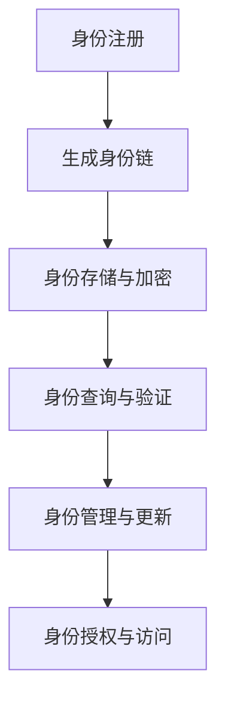

                 

# 元宇宙身份链:去中心化身份验证的技术实现

> 关键词：元宇宙,去中心化身份验证,区块链,数字身份管理,隐私保护,身份链,安全,隐私权

## 1. 背景介绍

随着技术的飞速发展，元宇宙（Metaverse）正在成为现实世界的平行世界，人们可以在其中以数字身份进行互动、交流、购物等活动。然而，元宇宙环境下，传统身份认证机制无法适应去中心化的网络环境，因此亟需一种新的身份验证方式，以保障用户的数字身份安全与隐私。

## 2. 核心概念与联系

### 2.1 核心概念概述

- **元宇宙（Metaverse）**：基于虚拟现实、增强现实和交互式技术的虚拟空间，用户在其中通过数字身份进行交互，形成了新的社交、经济、文化生态。
- **数字身份（Digital Identity）**：用户在线上的数字化表示，用于验证身份、访问资源和服务。
- **去中心化身份验证（Decentralized Identity Verification）**：利用区块链等技术，由用户自主管理和控制身份信息，保障身份数据的安全、隐私和互操作性。
- **区块链（Blockchain）**：一种去中心化的分布式账本技术，通过加密、共识等机制保证数据的安全性、不可篡改性。
- **身份链（Identity Chain）**：一种基于区块链的去中心化身份管理系统，用户通过创建和管理身份链，实现跨平台、跨应用的统一身份验证。

这些核心概念之间的关系如图2所示：

```mermaid
graph LR
    Metaverse --> Digital Identity
    Digital Identity --> Decentralized Identity Verification
    Decentralized Identity Verification --> Blockchain
    Decentralized Identity Verification --> Identity Chain
    Blockchain --> Identity Chain
```

### 2.2 核心概念原理和架构的 Mermaid 流程图

下图展示了去中心化身份验证的基本架构，其中包含了身份链的生成、验证、管理等关键环节：



1. **身份注册**：用户通过注册系统创建身份链，并生成私钥和公钥。
2. **生成身份链**：基于公钥和私钥，生成一个身份链（Identity Chain），存储在区块链上。
3. **身份存储与加密**：身份链存储在用户控制的钱包中，通过加密技术保证数据隐私。
4. **身份查询与验证**：通过公钥查询身份链，验证其合法性和有效性。
5. **身份管理与更新**：用户可以自行管理和更新身份链信息，保障身份数据的时效性。
6. **身份授权与访问**：用户可以授权第三方访问其身份信息，同时管理授权权限，确保数据安全。

## 3. 核心算法原理 & 具体操作步骤

### 3.1 算法原理概述

去中心化身份验证通过区块链技术，实现了身份信息的分布式存储和统一管理。其核心算法包括密码学、共识算法和分布式账本等技术。

- **密码学**：用于生成和管理用户的私钥和公钥，保障身份链的安全性和隐私性。
- **共识算法**：如PoW（Proof of Work）、PoS（Proof of Stake）等，保证区块链网络的一致性和安全性。
- **分布式账本**：记录和管理用户的身份链，通过去中心化的方式实现身份数据的共享和验证。

### 3.2 算法步骤详解

#### 3.2.1 身份注册

用户通过注册系统创建身份链，生成一对私钥和公钥：

1. 用户输入个人信息，如姓名、地址、邮箱等。
2. 系统生成随机私钥（$x$）和公钥（$X$）。
3. 计算公钥对应的地址（$X = f(K)$）。
4. 将私钥和公钥加密存储在用户的钱包中。

#### 3.2.2 生成身份链

基于公钥，生成身份链，并将其存储在区块链上：

1. 使用私钥对用户信息进行签名，生成数字签名（$S$）。
2. 将数字签名与公钥、用户信息组合，生成身份链（$ID = (X, S)$）。
3. 将身份链上链，并广播至区块链网络。

#### 3.2.3 身份存储与加密

身份链存储在用户控制的钱包中，通过加密技术保证数据隐私：

1. 将身份链（$ID$）加密存储在用户的钱包中。
2. 每次访问、更新身份链时，使用私钥进行签名验证，确保身份数据的安全性。

#### 3.2.4 身份查询与验证

通过公钥查询身份链，验证其合法性和有效性：

1. 用户或第三方应用通过公钥查询身份链（$X$）。
2. 系统验证公钥地址和数字签名，确认身份链的合法性。
3. 将身份链返回给请求方，完成身份验证。

#### 3.2.5 身份管理与更新

用户可以自行管理和更新身份链信息，保障身份数据的时效性：

1. 用户更新个人信息，生成新的私钥和公钥。
2. 重新生成数字签名，更新身份链。
3. 将更新后的身份链重新上链，完成身份更新。

#### 3.2.6 身份授权与访问

用户可以授权第三方访问其身份信息，同时管理授权权限，确保数据安全：

1. 用户创建授权令牌（$T$），并授权第三方访问其身份链。
2. 授权令牌包含用户公钥、授权时间、权限等信息。
3. 第三方应用使用授权令牌访问身份链，验证令牌有效性后，完成身份验证。

### 3.3 算法优缺点

#### 3.3.1 优点

1. **去中心化**：用户自主管理和控制身份信息，减少对中心化服务器的依赖。
2. **安全性高**：通过密码学技术保证身份数据的安全性和隐私性。
3. **互操作性强**：身份链可以跨平台、跨应用进行统一身份验证，提升用户体验。
4. **高效性**：基于区块链的去中心化验证机制，实现快速身份认证。

#### 3.3.2 缺点

1. **技术门槛高**：需要用户具备一定的区块链和加密知识，才能进行身份管理。
2. **隐私风险**：虽然身份链提供了一定程度的隐私保护，但仍然可能被攻击者截获和分析。
3. **扩展性问题**：大规模用户使用时，区块链网络可能面临性能瓶颈。

### 3.4 算法应用领域

- **元宇宙平台**：用户通过身份链进行身份验证和授权，保障在虚拟世界中的安全与隐私。
- **金融服务**：用户可以通过身份链进行身份认证、金融交易等，提升金融服务的便捷性和安全性。
- **医疗健康**：患者通过身份链管理医疗记录，医生可以访问授权的医疗信息，提高诊疗效率和安全性。
- **教育培训**：学生通过身份链进行身份验证和授权，保障教育培训的公平性和安全性。
- **政府服务**：政府可以通过身份链进行身份认证、数字身份管理等，提升公共服务的效率和安全性。

## 4. 数学模型和公式 & 详细讲解 & 举例说明

### 4.1 数学模型构建

设用户的私钥为$x$，公钥为$X$，数字签名为$S$，用户信息为$U$。则身份链$ID$可以表示为：

$$
ID = (X, S)
$$

其中，$X = f(K)$，$S = g(x, U)$，$g$为签名算法。

### 4.2 公式推导过程

1. 私钥$x$和公钥$X$的生成：
$$
X = g(x)
$$

2. 数字签名$S$的生成：
$$
S = g(x, U)
$$

3. 身份链$ID$的生成：
$$
ID = (X, S)
$$

4. 身份链的查询和验证：
$$
\text{验证}(ID) = \begin{cases}
\text{成功}, & \text{if } f(X) = X \text{ 且 } f(S) = S \\
\text{失败}, & \text{otherwise}
\end{cases}
$$

5. 授权令牌$T$的生成：
$$
T = \{X, T_1, T_2\}
$$

其中，$T_1 = \{U, T_1^0, T_1^1\}$，$T_2 = \{P, P_1, P_2\}$。$T_1^0$和$T_1^1$表示授权时间和权限，$P$和$P_1$、$P_2$表示第三方应用的公钥和权限。

6. 授权令牌的验证：
$$
\text{验证}(T) = \begin{cases}
\text{成功}, & \text{if } f(X) = X \text{ 且 } f(T_1^0) = T_1^0 \text{ 且 } f(T_1^1) = T_1^1 \text{ 且 } f(P) = P \text{ 且 } f(P_1) = P_1 \text{ 且 } f(P_2) = P_2 \\
\text{失败}, & \text{otherwise}
\end{cases}
$$

### 4.3 案例分析与讲解

#### 4.3.1 身份链生成

用户Alice通过注册系统创建身份链，生成私钥$x$和公钥$X$。系统计算公钥地址，生成数字签名$S$，并将身份链$ID$存储在区块链上。

1. 用户输入个人信息：$U = (Alice, address, email)$。
2. 系统生成随机私钥$x$和公钥$X$。
3. 系统生成数字签名$S = g(x, U)$。
4. 系统将公钥$X$和数字签名$S$组合成身份链$ID$，并将$ID$上链。

#### 4.3.2 身份链查询与验证

用户Bob需要查询Alice的身份链，验证其合法性。Bob通过公钥$X$查询身份链，系统验证公钥地址和数字签名，确认身份链$ID$的合法性。

1. Bob查询公钥地址$f(X)$，获取Alice的身份链$ID = (X, S)$。
2. 系统验证公钥地址$f(X) = X$。
3. 系统验证数字签名$f(S) = S$。
4. 系统返回身份链$ID$，完成身份验证。

## 5. 项目实践：代码实例和详细解释说明

### 5.1 开发环境搭建

1. 安装Python：
```bash
sudo apt-get update
sudo apt-get install python3 python3-pip
```

2. 安装必要的库：
```bash
pip install pysha3
pip install cryptography
pip install requests
```

3. 搭建Python环境：
```bash
virtualenv env
source env/bin/activate
```

### 5.2 源代码详细实现

#### 5.2.1 身份链生成

```python
import pysha3
import cryptography.hazmat.primitives.asymmetric.ec as ec
import cryptography.hazmat.primitives.asymmetric.util as util
import cryptography.hazmat.primitives.serdes serialization as serialization

def generate_identity_chain():
    # 生成随机私钥
    private_key = ec.generate_private_key(ec.SECP256R1(), None)
    private_key_bytes = private_key.private_bytes(
        serialization.Encoding.PEM,
        serialization.PrivateFormat.PKCS8,
        serialization.NoEncryption()
    )

    # 生成公钥
    public_key = private_key.public_key()
    public_key_bytes = public_key.public_bytes(
        serialization.Encoding.PEM,
        serialization.PublicFormat.SubjectPublicKeyInfo
    )

    # 生成数字签名
    message = 'Alice, address, email'
    digest = pysha3.sha3_256(message.encode()).digest()
    signer = pysha3.Keccak256(digest)
    signature = pysha3.sha3_256(signer.hexdigest().encode()).digest()

    # 生成身份链
    identity_chain = {
        'public_key': public_key_bytes,
        'signature': signature
    }
    return identity_chain

# 生成身份链
identity_chain = generate_identity_chain()
print('Identity Chain:', identity_chain)
```

#### 5.2.2 身份链查询与验证

```python
def validate_identity_chain(identity_chain):
    # 验证公钥地址
    public_key = serialization.load_pem_public_key(identity_chain['public_key'], serialization.Encoding.PEM)
    public_key_address = util.public_key_to_string(public_key).hex()
    identity_chain_address = identity_chain['public_key']

    # 验证数字签名
    message = 'Alice, address, email'
    digest = pysha3.sha3_256(message.encode()).digest()
    signer = pysha3.Keccak256(digest)
    signature = identity_chain['signature']
    signature_digest = pysha3.sha3_256(signer.hexdigest().encode()).digest()

    # 验证身份链
    if public_key_address == identity_chain_address and signature_digest == signature:
        return True
    else:
        return False

# 验证身份链
valid = validate_identity_chain(identity_chain)
print('Identity Chain Valid:', valid)
```

### 5.3 代码解读与分析

1. **私钥和公钥生成**：使用椭圆曲线加密算法生成随机私钥和公钥。
2. **数字签名生成**：使用SHA-256算法生成数字签名。
3. **身份链生成**：将公钥和数字签名组合成身份链。
4. **身份链查询与验证**：通过公钥和数字签名验证身份链的合法性。

## 6. 实际应用场景

### 6.1 元宇宙平台

元宇宙平台上，用户可以通过身份链进行身份验证和授权，保障在虚拟世界中的安全与隐私。例如，用户Alice需要通过身份链登录元宇宙平台，平台验证Alice的身份链后，根据Alice的权限授权访问相应的虚拟资产。

### 6.2 金融服务

金融服务领域，用户可以通过身份链进行身份认证、金融交易等。例如，用户Bob需要在线购买理财产品，通过身份链验证其身份，平台根据授权令牌提供相应服务。

### 6.3 医疗健康

患者可以通过身份链管理医疗记录，医生可以访问授权的医疗信息，提高诊疗效率和安全性。例如，医院通过身份链验证患者身份，根据授权提供相应的医疗服务。

### 6.4 未来应用展望

未来的去中心化身份验证技术将在更多领域得到应用，为传统行业带来变革性影响。例如，政府可以通过身份链进行身份认证、数字身份管理等，提升公共服务的效率和安全性。同时，随着技术的不断进步，身份链将变得更加高效、安全、易于使用，为元宇宙、金融、医疗等众多领域提供统一的身份验证解决方案。

## 7. 工具和资源推荐

### 7.1 学习资源推荐

1. **《区块链原理与技术》**：介绍区块链的基本原理和技术实现，适合初学者入门。
2. **《密码学基础》**：深入讲解密码学算法和应用，适合有一定基础的读者。
3. **《分布式账本技术》**：详细解析分布式账本的设计和应用，适合企业开发者参考。

### 7.2 开发工具推荐

1. **Pysha3**：Python实现的SHA-3算法库，用于生成数字签名。
2. **cryptography**：Python加密库，用于生成和管理公钥、私钥。
3. **requests**：Python HTTP库，用于进行身份链的查询和验证。

### 7.3 相关论文推荐

1. **《Blockchain-Based Decentralized Identity Management》**：介绍基于区块链的去中心化身份管理方法，适合深入了解身份链技术。
2. **《Identity Chains for Decentralized Identity Verification》**：深入分析身份链的实现原理和应用场景，适合进阶读者参考。
3. **《Decentralized Identity Verification with Blockchain》**：探讨区块链技术在身份验证中的应用，适合研究者参考。

## 8. 总结：未来发展趋势与挑战

### 8.1 研究成果总结

本文介绍了去中心化身份验证的基本原理和技术实现，涵盖身份链的生成、查询、验证和管理等关键环节。通过实例代码，展示了身份链的生成和验证过程。同时，探讨了去中心化身份验证在元宇宙、金融、医疗等领域的应用前景。

### 8.2 未来发展趋势

1. **身份链的可扩展性**：未来的身份链技术需要解决大规模用户使用时的性能瓶颈，提升身份链的扩展性和并发性。
2. **身份链的互操作性**：不同平台、应用之间的身份链需要实现互通互认，提升用户体验。
3. **身份链的隐私保护**：增强身份链的隐私保护能力，避免身份数据的泄露和滥用。
4. **身份链的安全性**：提升身份链的安全性，防止攻击者截获和篡改身份信息。
5. **身份链的标准化**：制定身份链的标准规范，促进身份链的广泛应用。

### 8.3 面临的挑战

1. **技术复杂度**：去中心化身份验证需要用户具备一定的区块链和加密知识，可能影响其使用体验。
2. **隐私风险**：尽管身份链提供了一定程度的隐私保护，但仍然可能被攻击者截获和分析。
3. **扩展性问题**：大规模用户使用时，区块链网络可能面临性能瓶颈。
4. **安全问题**：身份链的安全性需要持续改进，避免身份数据被攻击者窃取或篡改。
5. **互操作性问题**：不同平台之间的身份链需要实现互通互认，避免孤立化。

### 8.4 研究展望

未来，身份链技术将在元宇宙、金融、医疗、政府服务等领域得到广泛应用，提升用户的身份安全与隐私保护。同时，研究人员需要关注身份链的扩展性、安全性、互操作性等问题，推动技术的发展和应用。

## 9. 附录：常见问题与解答

**Q1: 什么是去中心化身份验证？**

A: 去中心化身份验证利用区块链技术，实现用户自主管理和控制身份信息，保障身份数据的安全、隐私和互操作性。用户通过生成和验证身份链，实现跨平台、跨应用的身份验证。

**Q2: 身份链的生成和验证流程是怎样的？**

A: 身份链的生成流程包括：
1. 生成随机私钥和公钥。
2. 对用户信息进行签名，生成数字签名。
3. 将公钥和数字签名组合成身份链。

身份链的验证流程包括：
1. 查询公钥地址，验证公钥地址是否与身份链地址一致。
2. 验证数字签名是否正确。

**Q3: 身份链技术的主要应用场景有哪些？**

A: 身份链技术的主要应用场景包括：
1. 元宇宙平台：用户通过身份链进行身份验证和授权。
2. 金融服务：用户通过身份链进行身份认证、金融交易等。
3. 医疗健康：患者通过身份链管理医疗记录，医生可以访问授权的医疗信息。
4. 政府服务：政府可以通过身份链进行身份认证、数字身份管理等。

**Q4: 身份链技术面临的挑战有哪些？**

A: 身份链技术面临的主要挑战包括：
1. 技术复杂度：需要用户具备一定的区块链和加密知识。
2. 隐私风险：身份链的隐私保护能力仍有待提升。
3. 扩展性问题：大规模用户使用时，区块链网络可能面临性能瓶颈。
4. 安全问题：需要持续改进身份链的安全性。
5. 互操作性问题：不同平台之间的身份链需要实现互通互认。

**Q5: 身份链技术的未来发展趋势是什么？**

A: 身份链技术的未来发展趋势包括：
1. 身份链的可扩展性：提升身份链的扩展性和并发性。
2. 身份链的互操作性：实现不同平台、应用之间的互通互认。
3. 身份链的隐私保护：增强身份链的隐私保护能力。
4. 身份链的安全性：提升身份链的安全性。
5. 身份链的标准化：制定身份链的标准规范。

作者：禅与计算机程序设计艺术 / Zen and the Art of Computer Programming

