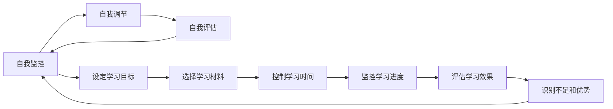

                 

# 元认知策略：提升学习效率的高阶技能

## 1. 背景介绍

### 1.1 问题由来
在快速变化的科技时代，终身学习已成为每个人的必备技能。然而，尽管学习资源和工具日益丰富，不少人依然感到学习效率低下，难以保持持续进步。如何在短时间内高效获取知识，提升学习效果，成为许多学习者共同关注的焦点。

元认知策略（Metacognitive Strategies）作为一种高阶认知技能，通过自我监控、自我调整和自我评估，帮助学习者更好地掌控学习过程，提升学习效率和效果。本博客将深入探讨元认知策略的原理、操作步骤以及其在多个场景下的应用。

### 1.2 问题核心关键点
元认知策略的核心在于自我监控和自我调节能力，通过自我评估来发现学习中的不足，并采取相应措施进行调整。关键点包括：
- **自我监控**：时刻关注学习进度、理解程度、情绪状态等，及时发现问题。
- **自我调节**：根据监控结果，灵活调整学习方法、时间分配、资源利用等，提升学习效率。
- **自我评估**：定期反思学习过程和结果，评估学习策略的有效性，进行持续改进。

## 2. 核心概念与联系

### 2.1 核心概念概述
元认知策略包括一系列的自我监控、自我调节和自我评估技巧，帮助学习者更有效地掌握学习内容。这些策略在心理学家如弗拉维尔（John Flavell）和布朗（Albert Bandura）等人的理论框架下得到了广泛研究和应用。

1. **自我监控（Metacognition）**：
   - **定义**：指个体对自己认知过程的觉察、思考和评估。
   - **关键行为**：设定学习目标、选择学习材料、控制学习时间、监控学习进度、评估学习效果等。

2. **自我调节（Regulation）**：
   - **定义**：指根据自我监控的结果，调整学习策略、资源和行为，以优化学习效果。
   - **关键行为**：时间管理、任务分解、动机激发、环境优化等。

3. **自我评估（Evaluation）**：
   - **定义**：指对学习过程和结果进行反思和评估，识别学习中的不足和优势。
   - **关键行为**：自我测验、反馈收集、自我反思、成果展示等。

### 2.2 核心概念原理和架构的 Mermaid 流程图



### 2.3 核心概念之间联系
自我监控、自我调节和自我评估相互依存、互为因果。具体来说：
- **自我监控是基础**：通过持续监控学习过程，为自我调节和自我评估提供数据支持。
- **自我调节是手段**：根据监控结果，灵活调整学习策略和行为，提升学习效率。
- **自我评估是反馈**：通过评估学习效果，发现问题，反馈给自我监控和自我调节，形成闭环。

## 3. 核心算法原理 & 具体操作步骤

### 3.1 算法原理概述
元认知策略的理论基础在于认知科学中的控制理论，认为学习者通过主动控制自己的认知过程，能够显著提高学习效果。其核心在于自我监控和自我调节，通过持续的自我评估来优化学习过程。

### 3.2 算法步骤详解

#### 3.2.1 自我监控
- **步骤一**：设定明确的学习目标。明确的学习目标可以帮助学习者集中注意力，有效规划学习时间和内容。
- **步骤二**：选择适当的学习材料。根据学习目标和自身知识水平，选择适合的教材、教程或资源。
- **步骤三**：控制学习时间和节奏。制定合理的学习计划，确保有足够的时间进行复习和巩固。
- **步骤四**：监控学习进度。记录学习时间和完成情况，实时掌握学习进展。

#### 3.2.2 自我调节
- **步骤五**：根据监控结果，调整学习策略。如果发现学习效果不佳，及时调整学习方法，如更换教材、改变学习方式等。
- **步骤六**：优化学习环境。确保学习环境安静、舒适，减少干扰因素，提高学习效率。
- **步骤七**：激发学习动机。通过设定奖励机制、寻找学习伙伴等方式，保持学习动力。

#### 3.2.3 自我评估
- **步骤八**：定期进行自我测验。通过自我测验评估学习效果，发现薄弱环节。
- **步骤九**：收集反馈信息。向老师、同学或同行求助，获取外部反馈，了解自己的学习情况。
- **步骤十**：进行自我反思。总结学习过程和成果，识别成功经验和不足之处。

### 3.3 算法优缺点

#### 3.3.1 优点
1. **提升学习效率**：通过自我监控和调节，能够及时发现和解决学习中的问题，避免无效学习。
2. **提高学习效果**：根据自我评估的结果，有针对性地优化学习策略，提高学习效果。
3. **增强学习动机**：通过设定目标和奖励机制，激发内在学习动力，保持长期学习热情。
4. **提升自我意识**：通过自我反思和评估，增强对学习过程的掌控和自我管理能力。

#### 3.3.2 缺点
1. **时间成本高**：自我监控和调节需要额外的时间进行规划和调整。
2. **依赖自我管理能力**：学习者需要具备较强的自我监控和调节能力，才能有效应用元认知策略。
3. **可能增加心理负担**：过于频繁的自我评估和反思，可能导致心理压力增加。

### 3.4 算法应用领域
元认知策略广泛应用于教育、职业培训、自我提升等多个领域，具体应用场景包括：
1. **学术学习**：帮助学生设定学习目标、选择学习材料、优化学习时间等。
2. **职业培训**：指导职场人士制定学习计划、调整学习策略、提升技能水平等。
3. **个人提升**：鼓励个人设定提升目标、自我监控进度、进行自我反思和调整等。

## 4. 数学模型和公式 & 详细讲解 & 举例说明

### 4.1 数学模型构建

元认知策略的数学模型建立在心理学理论的基础上，主要涉及学习过程的自我监控、自我调节和自我评估三个层面。

1. **自我监控**：
   - 定义：用$S$表示，表示学习者对学习过程的监控状态。$S_t$表示在时间$t$时的监控状态。
   - 状态变化：$S_{t+1}=f(S_t, X_t)$，其中$X_t$表示在时间$t$时的外部输入，如学习材料、学习时间等。

2. **自我调节**：
   - 定义：用$R$表示，表示学习者对学习过程的调节状态。$R_t$表示在时间$t$时的调节状态。
   - 状态变化：$R_{t+1}=g(R_t, S_t, X_t)$，其中$S_t$和$X_t$同上。

3. **自我评估**：
   - 定义：用$E$表示，表示学习者对学习过程的评估状态。$E_t$表示在时间$t$时的评估状态。
   - 状态变化：$E_{t+1}=h(E_t, S_t, R_t, X_t)$，其中$S_t$、$R_t$和$X_t$同上。

### 4.2 公式推导过程

以学习材料的选取为例，推导自我监控、自我调节和自我评估的公式：

- **自我监控**：
  - 设定学习目标：$T=\sum_{i=1}^n w_i A_i$，其中$T$为学习目标，$w_i$为权重，$A_i$为学习目标指标。
  - 选择学习材料：$M=\sum_{j=1}^m w_j M_j$，其中$M$为学习材料，$w_j$为权重，$M_j$为可选材料。

- **自我调节**：
  - 调整学习策略：$S'=f(S, R, X)$，其中$S'$为调整后的监控状态，$R$为调节策略。
  - 优化学习环境：$E'=h(E, S', X)$，其中$E'$为调整后的评估状态，$S'$为优化后的监控状态，$X$为环境因素。

- **自我评估**：
  - 自我测验：$P=T-D$，其中$P$为学习效果，$T$为学习目标，$D$为实际结果。
  - 反馈收集：$F=P-E'$，其中$F$为反馈信息，$P$为学习效果，$E'$为评估状态。
  - 自我反思：$L=E'-D$，其中$L$为反思结果，$E'$为评估状态，$D$为实际结果。

### 4.3 案例分析与讲解

**案例一：在线学习中的元认知策略应用**

小明是一名在线学习者，为了提升英语水平，他设定了每周学习30小时的目标，选择了多种英语学习材料，并安排了详细的学习计划。在每周的监控过程中，他记录了学习时间、完成材料和测试成绩，根据监控结果调整学习策略，如增加听力训练和口语练习，优化学习环境，减少干扰。每两周进行一次自我测验，评估学习效果，并从反馈中发现薄弱环节。通过不断的自我反思和调整，小明的英语水平显著提升。

## 5. 项目实践：代码实例和详细解释说明

### 5.1 开发环境搭建

为了实现元认知策略，可以使用Python和相关库进行开发。以下是开发环境的搭建步骤：

1. **安装Python和相关库**：
   - 安装Python 3.8及以上版本。
   - 安装Python编辑器，如PyCharm或VSCode。
   - 安装相关库，如numpy、pandas、scikit-learn等。

2. **配置开发环境**：
   - 创建虚拟环境，如conda或venv。
   - 安装必要的依赖库，如Jupyter Notebook。

3. **测试环境**：
   - 在Jupyter Notebook中创建新的notebook，导入必要的库。
   - 进行基本测试，确保开发环境正常运行。

### 5.2 源代码详细实现

以下是一个简单的元认知策略实现示例，用于设定学习目标、选择学习材料和监控学习进度：

```python
import pandas as pd
from IPython.display import display

class LearningPlan:
    def __init__(self, target_hours, materials):
        self.target_hours = target_hours
        self.materials = materials
        self.hours_spent = 0
        self.materials_completed = []
    
    def set_plan(self, hours, material):
        self.hours_spent += hours
        self.materials_completed.append(material)
    
    def get_progress(self):
        progress = (self.hours_spent / self.target_hours) * 100
        display(f"Progress: {progress:.2f}%")
    
    def evaluate(self):
        pass  # 待实现自我评估函数

# 示例使用
plan = LearningPlan(30, ["English textbook", "English podcast", "English grammar book"])
plan.set_plan(2, "English textbook")
plan.set_plan(1, "English podcast")
plan.get_progress()
```

### 5.3 代码解读与分析

**LearningPlan类**：
- **属性**：`target_hours`表示学习目标时间，`materials`表示学习材料列表，`hours_spent`表示已学习时间，`materials_completed`表示已完成材料。
- **方法**：
  - `set_plan`方法：用于记录已学习时间和完成材料。
  - `get_progress`方法：计算学习进度，并输出进度百分比。
  - `evaluate`方法：待实现自我评估函数。

**使用示例**：
- 创建`LearningPlan`对象，设定学习目标和材料。
- 使用`set_plan`方法记录已学习时间和材料。
- 调用`get_progress`方法输出学习进度。

该示例展示了如何使用类来组织学习计划，并记录学习进度。实际上，元认知策略的实现可以更加复杂，包括自我评估、反馈收集和反思等环节。

### 5.4 运行结果展示

在上述示例中，运行结果显示学习进度为6.67%，说明已学习时间占目标时间的1/4。实际应用中，可以根据需求添加更多功能，如自我评估、反馈收集等。

## 6. 实际应用场景

### 6.1 学术学习

在大中小学教育中，元认知策略可以显著提升学生的学习效果。通过自我监控和调节，学生可以更好地管理学习时间和内容，避免无效学习。例如，高中生可以通过设定每日学习目标、选择合适教材和优化学习环境，提高学习效率。

### 6.2 职业培训

在职人员进行技能提升时，元认知策略同样重要。通过设定培训目标、选择培训材料和优化培训环境，员工可以更好地掌握新技能，提高工作效率。例如，IT技术人员可以通过学习新技术、参加在线课程和进行项目实践，实现技能提升。

### 6.3 个人提升

元认知策略不仅适用于学术和职业培训，个人提升同样重要。通过设定提升目标、选择提升材料和进行自我反思，个体可以持续改进自我，实现自我价值。例如，创业者可以通过设定创业目标、学习市场营销和优化产品设计，提升企业竞争力。

### 6.4 未来应用展望

未来，随着人工智能和大数据技术的发展，元认知策略将更加智能化和个性化。以下是几个潜在的应用方向：

1. **个性化学习**：通过大数据分析，生成个性化学习计划和资源推荐，提升学习效率。
2. **智能评估**：使用AI技术进行自我评估，自动分析学习效果和薄弱环节，提供个性化反馈。
3. **多模态学习**：结合图像、音频和视频等多模态数据，丰富学习内容，提升学习体验。
4. **实时监控**：通过物联网和传感器技术，实时监控学习状态和环境，及时调整学习策略。

## 7. 工具和资源推荐

### 7.1 学习资源推荐

以下是一些推荐的学习资源，帮助读者深入了解元认知策略：

1. **《元认知与学习效率》**：介绍元认知策略的基本概念、方法和实际应用，适合各年龄段学习者。
2. **《学习科学中的元认知研究》**：详细探讨元认知理论、实验和实践，适合教育工作者和研究者。
3. **Coursera《元认知策略与学习效率》**：由斯坦福大学和密歇根大学联合开设的在线课程，提供系统化的学习资源。
4. **JSTOR《元认知策略在高性能学习中的作用》**：最新研究论文，探讨元认知策略在高性能学习中的重要性。

### 7.2 开发工具推荐

以下是几个推荐的开发工具，支持元认知策略的实现：

1. **Jupyter Notebook**：用于数据科学和人工智能开发的在线编辑器，支持Python、R等语言。
2. **PyCharm**：Python编程的IDE，支持调试、测试和集成开发。
3. **VSCode**：全功能的编程环境，支持多种语言和扩展。

### 7.3 相关论文推荐

以下是一些推荐的相关论文，深入探讨元认知策略的理论和实践：

1. **《元认知策略与学习效率：一项综合分析》**：总结了元认知策略的研究进展和应用案例。
2. **《学习者的自我监控与调节：一项实证研究》**：通过实证研究，探讨了学习者的自我监控和调节策略。
3. **《基于元认知策略的学习系统：一个案例分析》**：介绍了一个使用元认知策略的学习系统，并分析了其实际效果。

## 8. 总结：未来发展趋势与挑战

### 8.1 研究成果总结
元认知策略作为一种高阶认知技能，已被广泛应用于多个领域。其在提升学习效率、优化学习效果、增强自我管理能力方面具有重要价值。未来，元认知策略将更加智能化和个性化，结合人工智能和大数据技术，为学习者提供更高效、更个性化的学习方案。

### 8.2 未来发展趋势
1. **智能化和自动化**：结合人工智能技术，自动分析学习过程和效果，提供个性化反馈和建议。
2. **多模态和跨学科**：结合图像、音频和视频等多模态数据，丰富学习内容，提升学习体验。
3. **实时监控和调整**：通过物联网和传感器技术，实时监控学习状态和环境，及时调整学习策略。
4. **全球化和本土化**：结合本地文化和教育资源，提供适合不同地区的学习方案。

### 8.3 面临的挑战
尽管元认知策略具有广泛应用前景，但其实际应用仍面临一些挑战：

1. **数据隐私和安全**：学习过程中的数据收集和分析可能涉及隐私问题，需要加强数据保护和安全管理。
2. **个性化难度**：实现个性化学习方案需要大量数据和计算资源，且对算法的精度和效率要求较高。
3. **用户接受度**：用户对新技术的接受度较低，需要加强用户教育和培训，提升应用普及度。
4. **技术标准**：缺乏统一的技术标准和接口，导致不同系统和平台之间的兼容性较差。

### 8.4 研究展望
未来，元认知策略的研究需要关注以下几个方向：

1. **跨学科研究**：结合心理学、教育学、计算机科学等多学科知识，提升理论深度和应用广度。
2. **技术创新**：开发高效、可靠、易于使用的技术工具，支持元认知策略的实际应用。
3. **社会影响**：评估元认知策略对学习者的社会影响，包括心理健康、职业发展等方面。
4. **伦理和法律**：建立元认知策略应用中的伦理和法律规范，保障用户权益。

## 9. 附录：常见问题与解答

### Q1: 元认知策略的具体实施步骤是什么？

A: 元认知策略的实施步骤包括：
1. 设定明确的学习目标。
2. 选择适当的学习材料。
3. 控制学习时间和节奏。
4. 监控学习进度。
5. 根据监控结果，调整学习策略。
6. 优化学习环境。
7. 激发学习动机。
8. 定期进行自我测验。
9. 收集反馈信息。
10. 进行自我反思和评估。

### Q2: 如何提升元认知策略的有效性？

A: 提升元认知策略的有效性需要多方面的努力：
1. 持续学习：不断学习和掌握新的元认知策略，提高自我监控和调节能力。
2. 反思和总结：定期反思学习过程和结果，总结成功经验和不足之处。
3. 寻求反馈：主动向老师、同学或同行寻求反馈，了解自己的学习情况。
4. 持续改进：根据反馈和反思结果，不断改进学习策略，提升学习效果。

### Q3: 元认知策略是否适用于所有学习者？

A: 元认知策略适用于大多数学习者，但其效果受学习者个体差异的影响。对于自我监控和调节能力较强的学习者，元认知策略的效果更为显著。对于自我监控和调节能力较弱的学习者，可能需要更多的指导和支持。

### Q4: 元认知策略的局限性是什么？

A: 元认知策略的局限性包括：
1. 时间成本高：自我监控和调节需要额外的时间进行规划和调整。
2. 依赖自我管理能力：学习者需要具备较强的自我监控和调节能力，才能有效应用元认知策略。
3. 可能增加心理负担：过于频繁的自我评估和反思，可能导致心理压力增加。

通过系统地介绍元认知策略的原理、操作步骤和实际应用，本文旨在帮助读者提升学习效率，更好地掌握知识。尽管元认知策略存在一些局限性，但其高阶认知技能在提升学习效果方面具有重要价值。未来，随着技术的发展，元认知策略将更加智能化和个性化，为学习者提供更高效、更个性化的学习方案。

