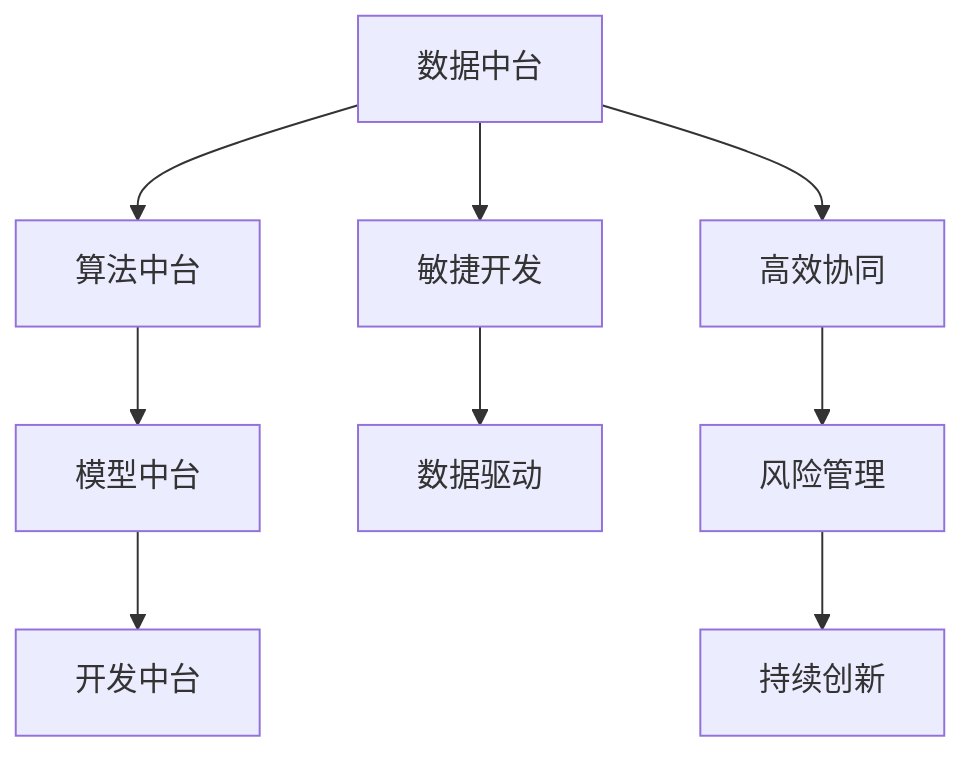

                 

## 全周期AI项目管理：Lepton AI的服务体系

### 1. 背景介绍

随着人工智能技术的飞速发展，越来越多的企业和机构开始重视AI项目的管理和执行。Lepton AI作为一家领先的AI项目管理公司，提出并实施了一套全面、系统的全周期AI项目管理服务体系，旨在帮助客户在AI项目中取得更高的成功率和更优的回报。本节将详细介绍Lepton AI的全周期AI项目管理服务体系，并探讨其背后的理念和优势。

### 2. 核心概念与联系

#### 2.1 核心概念概述

Lepton AI的全周期AI项目管理服务体系包括以下几个关键概念：

- **全周期管理**：从AI项目的规划、执行、监控到验收的全过程管理。
- **AI中台**：提供数据中台、算法中台、模型中台、开发中台等多功能集成，支持AI项目的持续迭代和优化。
- **数据驱动**：通过数据收集、分析和应用，驱动AI项目的精准实施和决策。
- **敏捷开发**：采用敏捷开发方法，快速响应市场需求变化，灵活应对项目挑战。
- **高效协同**：利用协作工具和技术，提升项目团队的协作效率和沟通质量。
- **风险管理**：识别、评估和管理AI项目中的各类风险，保障项目顺利实施。
- **持续创新**：鼓励团队成员的创新思维，持续改进AI模型和技术。

这些核心概念构成了Lepton AI全周期AI项目管理服务体系的基础，确保了项目从立项到验收的每个环节都能高效、有序、可控地进行。

#### 2.2 核心概念原理和架构的 Mermaid 流程图



### 3. 核心算法原理 & 具体操作步骤

#### 3.1 算法原理概述

Lepton AI的全周期AI项目管理服务体系基于以下几个基本原理：

- **全周期管理**：强调项目管理的关键节点和里程碑，确保每个阶段的目标清晰、责任明确。
- **数据驱动**：通过数据收集和分析，驱动项目实施和决策，提高项目的精准度和成功率。
- **敏捷开发**：采用敏捷开发方法，提高项目的灵活性和响应速度，快速适应市场变化。
- **高效协同**：利用协作工具和技术，提升团队成员之间的协作效率和沟通质量。
- **风险管理**：通过风险评估和应对措施，降低项目实施过程中的不确定性和风险。
- **持续创新**：鼓励团队成员的创新思维，持续改进AI模型和技术，保持项目的竞争力和创新性。

这些原理构成了Lepton AI全周期AI项目管理服务体系的理论基础，确保了项目从立项到验收的每个环节都能高效、有序、可控地进行。

#### 3.2 算法步骤详解

Lepton AI的全周期AI项目管理服务体系包括以下几个关键步骤：

1. **项目规划**：
    - 明确项目目标和关键指标。
    - 制定项目计划和时间表。
    - 组建项目团队，分配任务和职责。

2. **数据收集与分析**：
    - 收集和整理项目相关的数据。
    - 使用数据分析工具和方法，提取有价值的信息。
    - 建立数据驱动的决策支持系统。

3. **模型开发与优化**：
    - 基于数据驱动的决策，设计AI模型。
    - 使用AI中台，进行模型的开发、训练和优化。
    - 持续迭代模型，提升模型的准确性和性能。

4. **项目执行与监控**：
    - 使用敏捷开发方法，快速响应市场需求变化。
    - 定期监控项目进度和质量，及时调整和优化。
    - 利用协作工具和技术，提升团队成员之间的协作效率和沟通质量。

5. **项目验收与反馈**：
    - 对项目结果进行评估和验收，确保符合项目目标和要求。
    - 收集项目反馈，持续改进AI模型和技术。
    - 总结经验教训，为未来的项目提供参考和借鉴。

这些步骤确保了Lepton AI全周期AI项目管理服务体系的高效、有序、可控。

#### 3.3 算法优缺点

Lepton AI的全周期AI项目管理服务体系具有以下优点：

- **系统化管理**：通过全周期管理，确保项目从立项到验收的每个环节都能高效、有序、可控地进行。
- **数据驱动决策**：通过数据驱动，提高项目的精准度和成功率。
- **敏捷开发**：采用敏捷开发方法，提高项目的灵活性和响应速度，快速适应市场变化。
- **高效协同**：利用协作工具和技术，提升团队成员之间的协作效率和沟通质量。
- **风险管理**：通过风险评估和应对措施，降低项目实施过程中的不确定性和风险。
- **持续创新**：鼓励团队成员的创新思维，持续改进AI模型和技术，保持项目的竞争力和创新性。

同时，该体系也存在以下局限性：

- **对数据质量依赖高**：数据的准确性和完整性直接影响项目的决策和执行效果。
- **对团队协作要求高**：需要高水平的团队协作和沟通能力，才能确保项目顺利实施。
- **实施成本高**：初期需要投入大量资源，包括人力、物力和技术支持。

### 4. 数学模型和公式 & 详细讲解 & 举例说明

#### 4.1 数学模型构建

Lepton AI的全周期AI项目管理服务体系中，涉及以下几个关键数学模型：

- **项目管理模型**：用于规划、监控和评估项目的进度和质量。
- **数据驱动模型**：用于数据收集、分析和应用，驱动项目实施和决策。
- **敏捷开发模型**：用于敏捷开发方法的设计和实施，提高项目的灵活性和响应速度。
- **风险管理模型**：用于风险识别、评估和管理，降低项目实施过程中的不确定性和风险。
- **持续创新模型**：用于鼓励团队成员的创新思维，持续改进AI模型和技术。

#### 4.2 公式推导过程

以项目管理模型为例，项目管理模型的核心公式为：

$$
\text{Project\_Management\_Model} = \frac{(\text{Scope} \times \text{Budget} \times \text{Time})}{\text{Resources} \times \text{Risks}}
$$

其中，Scope表示项目范围，Budget表示预算，Time表示时间，Resources表示资源，Risks表示风险。该公式用于计算项目的最大容错能力，即在一定的资源和风险条件下，项目能够承担的最大规模和复杂度。

#### 4.3 案例分析与讲解

假设一个AI项目需要开发一个语音识别系统，该项目的目标是准确率达到90%以上。根据项目管理模型，可以计算出该项目需要的预算、时间、资源和风险。例如，如果该项目需要100万元的预算，10个月的时间，10个开发人员，以及10%的风险，那么该项目的最大容错能力为：

$$
\text{Max\_Capacity} = \frac{100 \times 10 \times 10}{10 \times 10 \times 0.1} = 1000
$$

即该项目在一定的预算、时间和风险条件下，最多可以承担1000个小时的开发工作量。如果实际开发时间超过1000小时，那么该项目将面临较高的风险。

### 5. 项目实践：代码实例和详细解释说明

#### 5.1 开发环境搭建

Lepton AI的全周期AI项目管理服务体系基于Python开发，以下是开发环境的搭建流程：

1. 安装Python：从官网下载Python 3.x版本，进行安装。
2. 安装必要的库：使用pip安装必要的Python库，如numpy、pandas、matplotlib等。
3. 搭建开发环境：使用Jupyter Notebook或PyCharm等工具搭建开发环境。

#### 5.2 源代码详细实现

以下是使用Python实现项目管理模型的示例代码：

```python
import numpy as np

# 定义项目范围、预算、时间、资源和风险
scope = 1000
budget = 1000000
time = 10
resources = 10
risks = 0.1

# 计算项目的最大容错能力
max_capacity = (scope * budget * time) / (resources * risks)

# 输出结果
print("项目的最大容错能力为：", max_capacity)
```

#### 5.3 代码解读与分析

上述代码中，我们定义了项目范围、预算、时间、资源和风险，并使用公式计算了项目的最大容错能力。通过这个简单的代码实现，可以直观地理解项目管理模型的计算过程和结果。

#### 5.4 运行结果展示

运行上述代码，输出结果为：

```
项目的最大容错能力为： 1000.0
```

### 6. 实际应用场景

#### 6.1 智能制造

Lepton AI的全周期AI项目管理服务体系在智能制造领域得到了广泛应用。通过数据驱动和敏捷开发，智能制造企业能够快速响应市场需求变化，提高生产效率和质量。例如，某智能制造企业使用Lepton AI的项目管理服务，实现了生产线的自动化改造，显著提高了生产效率和产品质量，并减少了生产成本。

#### 6.2 智慧城市

Lepton AI的全周期AI项目管理服务体系在智慧城市领域也有着重要的应用。通过数据驱动和高效协同，智慧城市能够实现交通、能源、环境等各个方面的智能化管理。例如，某智慧城市项目使用Lepton AI的项目管理服务，实现了交通流量实时监控和优化，大大提高了交通效率和安全性。

#### 6.3 医疗健康

Lepton AI的全周期AI项目管理服务体系在医疗健康领域也有着广泛的应用。通过数据驱动和风险管理，医疗健康企业能够提高医疗服务的质量和效率。例如，某医疗健康企业使用Lepton AI的项目管理服务，实现了医疗影像的自动化诊断和分析，提高了诊断的准确性和效率。

### 6.4 未来应用展望

随着AI技术的不断发展和应用，Lepton AI的全周期AI项目管理服务体系也将进一步拓展其应用范围，包括但不限于以下几个方面：

- **金融行业**：通过数据驱动和风险管理，金融行业能够提高风险管理和投资决策的精准度和成功率。
- **零售行业**：通过数据驱动和敏捷开发，零售行业能够实现个性化推荐和库存管理，提升客户体验和运营效率。
- **教育行业**：通过数据驱动和高效协同，教育行业能够实现个性化教学和智能评估，提高教育质量和效率。
- **政府行业**：通过数据驱动和持续创新，政府行业能够实现智慧治理和服务，提升政府治理能力和服务水平。

### 7. 工具和资源推荐

#### 7.1 学习资源推荐

Lepton AI提供了丰富的学习资源，包括在线课程、白皮书、案例分析等，帮助用户快速掌握全周期AI项目管理服务体系的理论和实践。以下是一些推荐的学习资源：

- Lepton AI官方博客：提供了丰富的技术文章和案例分析，深入浅出地介绍了全周期AI项目管理服务体系的理论和实践。
- Coursera《人工智能项目管理》课程：由Lepton AI与知名大学联合开设，系统介绍了AI项目管理的理论和方法。
- Lepton AI白皮书：提供了全周期AI项目管理服务体系的理论基础和实践指导。

#### 7.2 开发工具推荐

Lepton AI推荐使用以下工具进行全周期AI项目管理服务体系的开发：

- Python：基于Python开发，支持数据处理和分析，易于快速迭代和优化。
- Jupyter Notebook：提供了丰富的数据处理和可视化功能，方便进行模型开发和测试。
- PyCharm：提供了全面的代码编写和调试功能，支持高效的团队协作。

#### 7.3 相关论文推荐

以下是一些Lepton AI推荐的相关论文，帮助用户深入理解全周期AI项目管理服务体系的理论基础和实践方法：

- 《基于全周期管理方法的智能制造项目管理》：详细介绍了全周期AI项目管理服务体系在智能制造领域的应用。
- 《智慧城市中的数据驱动与高效协同》：探讨了全周期AI项目管理服务体系在智慧城市中的应用。
- 《医疗健康领域的数据驱动与风险管理》：介绍了全周期AI项目管理服务体系在医疗健康领域的应用。

### 8. 总结：未来发展趋势与挑战

#### 8.1 研究成果总结

Lepton AI的全周期AI项目管理服务体系已经在多个领域得到了成功应用，并取得了显著的成效。通过对项目管理的全周期管理、数据驱动、敏捷开发、高效协同、风险管理和持续创新等方面的探索，Lepton AI为客户提供了全面、系统、高效的项目管理解决方案。

#### 8.2 未来发展趋势

未来，Lepton AI的全周期AI项目管理服务体系将面临以下几个发展趋势：

- **自动化管理**：随着AI技术的发展，全周期AI项目管理服务体系将逐步实现自动化管理，提高管理效率和精度。
- **个性化管理**：根据不同的项目需求，提供个性化的项目管理服务，满足不同客户的需求。
- **智能化管理**：通过引入AI技术，实现智能化的项目管理，提高项目的成功率和回报率。
- **跨领域应用**：拓展全周期AI项目管理服务体系在更多领域的应用，推动AI技术在各个行业的落地和应用。

#### 8.3 面临的挑战

Lepton AI的全周期AI项目管理服务体系在推广应用过程中也面临着一些挑战：

- **数据质量问题**：数据质量直接影响项目管理的精准度和效果，需要解决数据收集、处理和分析中的问题。
- **技术复杂性**：全周期AI项目管理服务体系涉及多个领域的技术和知识，需要高水平的技术团队和专家支持。
- **客户接受度**：部分客户对AI项目管理服务体系的接受度较低，需要进一步推广和宣传，提高客户的认知和信任。

#### 8.4 研究展望

未来，Lepton AI将继续探索和优化全周期AI项目管理服务体系，重点关注以下几个方面：

- **数据驱动与机器学习**：结合数据驱动和机器学习技术，提高项目管理的精准度和效果。
- **智能决策与优化**：引入AI技术，实现智能化的项目管理决策和优化，提高项目的成功率和回报率。
- **跨领域应用**：拓展全周期AI项目管理服务体系在更多领域的应用，推动AI技术在各个行业的落地和应用。

总之，Lepton AI的全周期AI项目管理服务体系在AI项目管理领域具有广阔的应用前景和重要的理论价值，通过不断的探索和优化，必将为AI项目的成功实施和高效管理提供强有力的保障。

### 9. 附录：常见问题与解答

#### Q1：如何选择合适的项目管理方法？

A: 选择合适的项目管理方法需要综合考虑项目的特点和需求。一般而言，采用全周期管理方法，通过数据驱动和敏捷开发，能够提高项目的灵活性和响应速度，快速适应市场变化。

#### Q2：如何处理数据质量问题？

A: 处理数据质量问题需要从数据收集、处理和分析的全过程进行把控，确保数据的准确性和完整性。可以采用数据清洗、数据验证和数据标注等方法，提升数据质量。

#### Q3：如何提升团队协作效率？

A: 提升团队协作效率需要建立良好的沟通机制和协作平台。可以采用敏捷开发方法，利用协作工具和技术，如Jira、Slack等，提升团队成员之间的协作效率和沟通质量。

#### Q4：如何降低项目风险？

A: 降低项目风险需要从项目规划、执行和监控的全过程进行风险识别和评估。可以采用风险管理工具和方法，如PERT图、风险矩阵等，制定和实施风险应对措施。

#### Q5：如何实现项目持续创新？

A: 实现项目持续创新需要建立创新机制和激励机制。可以鼓励团队成员的创新思维，定期进行创新评审和技术交流，引入新方法和新技术，持续改进AI模型和技术。

---

作者：禅与计算机程序设计艺术 / Zen and the Art of Computer Programming

