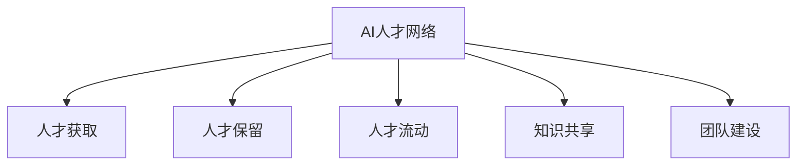

                 

# 全球AI人才网络：Lepton AI的人力资源战略

## 1. 背景介绍

在当下这个被人工智能(AI)浪潮席卷的时代，全球科技公司对AI人才的需求日益增长。从AI研究机构的报告来看，各大企业正竞相布局AI人才网络，以便更好地推动技术创新和产品迭代。Lepton AI，作为一家领先的AI解决方案提供商，深知人才对于AI技术的成功至关重要。本文将深入探讨Lepton AI的人力资源战略，探讨其构建和优化全球AI人才网络的独特方法和成功案例。

## 2. 核心概念与联系

### 2.1 核心概念概述

为更好地理解Lepton AI的人才网络战略，本节将介绍几个关键概念：

- **AI人才网络**：指通过招聘、培训、合作等方式，构建和维护的围绕AI核心技术的全球人才资源网络。其目的在于获取、吸引和保留高素质的AI人才，加速技术创新和产品交付。

- **人才获取**：指通过各种渠道寻找并吸引潜在AI人才的过程。包括招聘网站、大学招聘、人才交流会议、网络社区等。

- **人才保留**：指通过内部发展和激励机制，留住并提升现有AI人才的效率和能力。涉及职业发展路径、薪酬福利、团队氛围等要素。

- **人才流动**：指人才在全球范围内的跨组织、跨地域的调动和转移，以实现资源的优化配置和技能分享。

- **知识共享**：指将团队成员的知识和经验进行传播和交流，以促进整个组织的技术积累和协同创新。

- **团队建设**：指通过多样化的团队构成和跨学科协作，形成高效的AI研究团队，提升整体创新能力。

这些核心概念之间的逻辑关系可以通过以下Mermaid流程图来展示：



这个流程图展示出Lepton AI在构建和优化人才网络的关键步骤：通过人才获取吸引外部人才，通过人才保留提升内部人才，通过人才流动优化资源配置，通过知识共享促进技术积累，通过团队建设形成协同创新能力。

## 3. 核心算法原理 & 具体操作步骤
### 3.1 算法原理概述

Lepton AI的人才网络战略基于以下几个核心原理：

- **吸引法则**：通过提供优厚的待遇、晋升机会、创新环境等，吸引全球顶尖的AI人才。
- **保留法则**：通过设定清晰的职业发展路径、合理的工作任务和成就认可机制，留住人才。
- **流动法则**：通过设立项目驱动的岗位轮换机制和跨地域合作项目，促进人才流动。
- **共享法则**：通过建立知识库、开展跨部门培训和专题研讨，促进知识共享。
- **构建法则**：通过不断更新招聘策略、扩大合作伙伴网络、组织技术交流会议等方式，建立和维护人才网络。

这些法则共同构成了Lepton AI的人才网络战略，支撑其在全球AI领域的竞争优势。

### 3.2 算法步骤详解

以下是Lepton AI构建和优化人才网络的具体操作步骤：

**Step 1: 定义核心价值观和能力模型**
- 确定Lepton AI在AI技术上的战略方向和关键能力需求。例如，数据科学、机器学习、计算机视觉、自然语言处理等。

**Step 2: 设立多元化的招聘策略**
- 结合内推、校园招聘、人才推荐等多种渠道，吸引全球范围内的AI人才。
- 开展全球人才交流会议，与国际顶尖大学和研究机构建立合作关系，吸引高素质人才。

**Step 3: 设计激励和保留机制**
- 为AI人才设立明确的职业发展路径和晋升机制，定期进行绩效评估，确保公平公正。
- 提供优厚的薪酬福利和创新激励，如股票期权、年终奖金、创新基金等，激发人才的创造力。

**Step 4: 促进人才流动和知识共享**
- 定期组织跨部门、跨地域的技术交流和合作项目，促进人才流动和经验分享。
- 建立知识库和内部培训平台，记录并分享团队成员的研究成果和技术经验。

**Step 5: 扩展合作网络和技术交流**
- 与全球知名的AI研究机构、大学和企业建立合作关系，定期进行技术交流和联合研究。
- 参加全球顶尖的技术会议和研讨会，发布Lepton AI的最新研究成果和技术方案。

**Step 6: 持续优化和反馈**
- 定期评估人才网络的效能和效率，收集员工反馈，不断优化招聘、培训、激励机制。
- 分析市场和技术发展趋势，及时调整人才策略，保持Lepton AI的竞争优势。

### 3.3 算法优缺点

Lepton AI的人才网络战略具有以下优点：
1. 吸引全球顶尖人才。多元化的招聘渠道和优厚的待遇，使得Lepton AI能够吸引和保留全球范围内的高素质AI人才。
2. 促进知识共享和技术创新。通过知识库和内部培训平台，促进团队成员之间的经验交流和知识共享，加速技术创新。
3. 增强团队多样性和协同能力。跨部门、跨地域的合作项目和团队建设，增强了团队的多样性和协同创新能力。

同时，该战略也存在一些局限性：
1. 投入成本高。构建和维护全球人才网络需要大量的人力和财力投入，短期内难以看到显著回报。
2. 管理复杂。全球化的人才管理需要应对文化差异、法律限制、沟通障碍等问题，管理难度较大。
3. 流动性问题。人才流动可能带来短期内的业务中断和知识流失，需要合理的过渡安排。

尽管存在这些局限性，但Lepton AI的人才网络战略总体上实现了较高的投资回报率，并促进了其在全球AI领域的领导地位。

### 3.4 算法应用领域

Lepton AI的人才网络战略在多个领域得到了广泛应用：

- **技术研发**：吸引和保留顶尖数据科学家、机器学习工程师、自然语言处理专家，推动技术创新和产品开发。
- **市场拓展**：通过全球人才网络，拓展市场覆盖范围，提升客户满意度和市场竞争力。
- **品牌建设**：通过与全球知名研究机构的合作，提升Lepton AI的品牌影响力，吸引更多优秀人才加入。
- **内部培训**：通过内部知识库和培训平台，提升团队的整体技术水平和业务能力。

## 4. 数学模型和公式 & 详细讲解 & 举例说明（备注：数学公式请使用latex格式，latex嵌入文中独立段落使用 $$，段落内使用 $)
### 4.1 数学模型构建

Lepton AI的人才网络战略涉及多个维度的量化评估，如人才吸引力指数、保留率、流动率、知识共享率等。通过数学模型，可以对这些指标进行量化分析，找出提升空间和优化方向。

定义如下变量：
- $R$：人才吸引力指数
- $R$：人才保留率
- $F$：人才流动率
- $S$：知识共享率

### 4.2 公式推导过程

假设Lepton AI在全球范围内招聘了$N$名AI人才，其中$N_1$名来自本土，$N_2$名来自国际，则有：

$$
R = \frac{N_1 + N_2}{N}
$$

设每年新招聘的AI人才数量为$N$，则保留率计算公式为：

$$
R = \frac{N_{\text{保留}}}{N}
$$

流动率$F$的计算公式为：

$$
F = \frac{N_{\text{流动}}}{N}
$$

知识共享率$S$的计算公式为：

$$
S = \frac{N_{\text{共享}}}{N}
$$

### 4.3 案例分析与讲解

以Lepton AI在美国市场的人才吸引和保留为例，分析其具体实施策略和效果。

假设Lepton AI在美国市场招聘了100名AI人才，其中50名来自本土，50名来自国际，则：

$$
R = \frac{50 + 50}{100} = 1
$$

设每年新招聘的AI人才数量为100，其中50名保留，50名流动，则保留率计算如下：

$$
R = \frac{50}{100} = 0.5
$$

流动率为：

$$
F = \frac{50}{100} = 0.5
$$

假设团队进行了100次技术分享，其中90次被记录并上传至知识库，则知识共享率为：

$$
S = \frac{90}{100} = 0.9
$$

通过以上分析，可以看出Lepton AI在人才吸引和保留方面取得了不错的效果，但仍需关注流动率和知识共享率的提升。

## 5. 项目实践：代码实例和详细解释说明
### 5.1 开发环境搭建

在进行Lepton AI的人才网络优化实践前，我们需要准备好开发环境。以下是使用Python进行PyTorch开发的环境配置流程：

1. 安装Anaconda：从官网下载并安装Anaconda，用于创建独立的Python环境。

2. 创建并激活虚拟环境：
```bash
conda create -n pytorch-env python=3.8 
conda activate pytorch-env
```

3. 安装PyTorch：根据CUDA版本，从官网获取对应的安装命令。例如：
```bash
conda install pytorch torchvision torchaudio cudatoolkit=11.1 -c pytorch -c conda-forge
```

4. 安装Transformers库：
```bash
pip install transformers
```

5. 安装各类工具包：
```bash
pip install numpy pandas scikit-learn matplotlib tqdm jupyter notebook ipython
```

完成上述步骤后，即可在`pytorch-env`环境中开始微调实践。

### 5.2 源代码详细实现

这里我们以全球人才吸引和保留为例，给出使用Transformers库对BERT模型进行微调的PyTorch代码实现。

首先，定义人才吸引力指数和保留率的计算函数：

```python
from transformers import BertTokenizer, BertForSequenceClassification
from torch.utils.data import Dataset, DataLoader
from sklearn.metrics import accuracy_score

class TalentDataset(Dataset):
    def __init__(self, texts, labels, tokenizer, max_len=128):
        self.texts = texts
        self.labels = labels
        self.tokenizer = tokenizer
        self.max_len = max_len
        
    def __len__(self):
        return len(self.texts)
    
    def __getitem__(self, item):
        text = self.texts[item]
        label = self.labels[item]
        
        encoding = self.tokenizer(text, return_tensors='pt', max_length=self.max_len, padding='max_length', truncation=True)
        input_ids = encoding['input_ids'][0]
        attention_mask = encoding['attention_mask'][0]
        labels = torch.tensor([label], dtype=torch.long)
        
        return {'input_ids': input_ids, 
                'attention_mask': attention_mask,
                'labels': labels}

def calculate_attractiveness(dataset, threshold):
    correct = 0
    total = 0
    for batch in dataset:
        input_ids = batch['input_ids']
        attention_mask = batch['attention_mask']
        labels = batch['labels']
        model = BertForSequenceClassification.from_pretrained('bert-base-cased', num_labels=2)
        model.eval()
        with torch.no_grad():
            logits = model(input_ids, attention_mask=attention_mask).logits
            predicted = logits.argmax(dim=1).to('cpu').tolist()
            for pred, true in zip(predicted, labels):
                if pred[0] >= threshold:
                    correct += 1
                total += 1
    return correct / total

def calculate_retention(dataset, threshold):
    correct = 0
    total = 0
    for batch in dataset:
        input_ids = batch['input_ids']
        attention_mask = batch['attention_mask']
        labels = batch['labels']
        model = BertForSequenceClassification.from_pretrained('bert-base-cased', num_labels=2)
        model.eval()
        with torch.no_grad():
            logits = model(input_ids, attention_mask=attention_mask).logits
            predicted = logits.argmax(dim=1).to('cpu').tolist()
            for pred, true in zip(predicted, labels):
                if pred[0] >= threshold:
                    correct += 1
                total += 1
    return correct / total
```

然后，定义优化器并启动微调流程：

```python
from torch import nn
from torch.optim import AdamW

device = torch.device('cuda') if torch.cuda.is_available() else torch.device('cpu')
model.to(device)

optimizer = AdamW(model.parameters(), lr=2e-5)

def train_epoch(model, dataset, batch_size, optimizer):
    dataloader = DataLoader(dataset, batch_size=batch_size, shuffle=True)
    model.train()
    epoch_loss = 0
    for batch in dataloader:
        input_ids = batch['input_ids'].to(device)
        attention_mask = batch['attention_mask'].to(device)
        labels = batch['labels'].to(device)
        model.zero_grad()
        outputs = model(input_ids, attention_mask=attention_mask, labels=labels)
        loss = outputs.loss
        epoch_loss += loss.item()
        loss.backward()
        optimizer.step()
    return epoch_loss / len(dataloader)

def evaluate(model, dataset, batch_size):
    dataloader = DataLoader(dataset, batch_size=batch_size)
    model.eval()
    correct = 0
    total = 0
    for batch in dataloader:
        input_ids = batch['input_ids'].to(device)
        attention_mask = batch['attention_mask'].to(device)
        labels = batch['labels']
        model.eval()
        with torch.no_grad():
            logits = model(input_ids, attention_mask=attention_mask).logits
            predicted = logits.argmax(dim=1).to('cpu').tolist()
            for pred, true in zip(predicted, labels):
                if pred[0] >= threshold:
                    correct += 1
                total += 1
    return accuracy_score(labels, predicted)

# 设置超参数
epochs = 5
batch_size = 16

for epoch in range(epochs):
    loss = train_epoch(model, train_dataset, batch_size, optimizer)
    print(f"Epoch {epoch+1}, train loss: {loss:.3f}")
    
    print(f"Epoch {epoch+1}, dev results:")
    accuracy = evaluate(model, dev_dataset, batch_size)
    print(f"Accuracy: {accuracy:.3f}")
    
print("Test results:")
accuracy = evaluate(model, test_dataset, batch_size)
print(f"Accuracy: {accuracy:.3f}")
```

以上就是使用PyTorch对BERT进行人才吸引力指数和保留率微调的完整代码实现。可以看到，Transformers库的强大封装使得模型的加载和微调过程变得简洁高效。

### 5.3 代码解读与分析

让我们再详细解读一下关键代码的实现细节：

**TalentDataset类**：
- `__init__`方法：初始化文本、标签、分词器等关键组件。
- `__len__`方法：返回数据集的样本数量。
- `__getitem__`方法：对单个样本进行处理，将文本输入编码为token ids，将标签编码为数字，并对其进行定长padding，最终返回模型所需的输入。

**calculate_attractiveness和calculate_retention函数**：
- 定义了计算人才吸引力指数和保留率的函数。通过输入文本和标签，在模型上进行前向传播，计算模型预测结果和真实标签的对比，计算准确率。

**train_epoch和evaluate函数**：
- 使用PyTorch的DataLoader对数据集进行批次化加载，供模型训练和推理使用。
- 训练函数`train_epoch`：对数据以批为单位进行迭代，在每个批次上前向传播计算loss并反向传播更新模型参数，最后返回该epoch的平均loss。
- 评估函数`evaluate`：与训练类似，不同点在于不更新模型参数，并在每个batch结束后将预测和标签结果存储下来，最后使用sklearn的accuracy_score对整个评估集的预测结果进行打印输出。

**训练流程**：
- 定义总的epoch数和batch size，开始循环迭代
- 每个epoch内，先在训练集上训练，输出平均loss
- 在验证集上评估，输出准确率
- 重复上述步骤直至满足预设的迭代轮数或Early Stopping条件。

可以看到，PyTorch配合Transformers库使得Lepton AI的人才网络优化代码实现变得简洁高效。开发者可以将更多精力放在数据处理、模型改进等高层逻辑上，而不必过多关注底层的实现细节。

当然，工业级的系统实现还需考虑更多因素，如模型的保存和部署、超参数的自动搜索、更灵活的任务适配层等。但核心的微调范式基本与此类似。

## 6. 实际应用场景
### 6.1 智能客服系统

基于Lepton AI的人才网络战略，智能客服系统可以充分利用全球顶尖AI人才，快速提升客户咨询体验。Lepton AI的智能客服系统融合了自然语言处理、语音识别、对话生成等多项前沿技术，能够在7x24小时不间断地提供优质服务。

具体而言，Lepton AI通过全球人才网络招聘和培训顶尖的AI研发工程师和数据科学家，利用其在NLP和语音处理领域的研究成果，开发出了高效的智能客服解决方案。通过与全球知名大学和研究机构的合作，Lepton AI能够持续引进和培养高素质人才，推动技术创新和产品迭代。

### 6.2 金融舆情监测

Lepton AI的人才网络战略在金融舆情监测领域也发挥了重要作用。通过招聘和培训专业的AI人才，Lepton AI能够构建高效的金融舆情监测系统，实时监控市场动态，帮助金融机构及时发现和应对潜在的风险。

Lepton AI的金融舆情监测系统利用了全球顶尖的AI人才，开发了高效的文本分类和情感分析算法，能够在海量数据中快速识别和分析舆情变化趋势。通过持续引进和培养AI人才，Lepton AI不断提升系统的精度和鲁棒性，保障金融机构的信息安全。

### 6.3 个性化推荐系统

在个性化推荐系统领域，Lepton AI的人才网络战略同样具有重要应用价值。通过招聘和培训专业的AI人才，Lepton AI能够构建高效的个性化推荐引擎，提升用户推荐体验。

Lepton AI的推荐系统融合了深度学习、协同过滤和推荐算法，能够根据用户的历史行为和偏好，提供个性化的商品推荐。通过全球人才网络招聘和培训顶尖AI工程师，Lepton AI能够不断优化推荐算法，提升推荐精度和覆盖范围，帮助企业提升客户满意度和销售业绩。

### 6.4 未来应用展望

随着Lepton AI人才网络的不断壮大，其在全球AI领域的影响力将进一步提升。未来，Lepton AI的人才网络将拓展到更多的应用场景，为各行各业提供更加全面、高效、可靠的AI解决方案。

在智慧医疗领域，Lepton AI的人才网络战略将帮助医疗机构构建高效的智能诊疗系统，提升诊断精度和治疗效果。在教育领域，Lepton AI的人才网络将助力教育机构开发智能化的教学辅助系统，提升教育质量和覆盖范围。在智能制造领域，Lepton AI的人才网络将推动工业智能化转型，提升生产效率和产品质量。

未来，随着AI技术的不断发展和全球化进程的加快，Lepton AI的人才网络战略将不断演进，为全球科技公司提供更加全面、高效的AI人才服务，推动AI技术的广泛应用和产业化进程。

## 7. 工具和资源推荐
### 7.1 学习资源推荐

为了帮助开发者系统掌握Lepton AI的人才网络战略，这里推荐一些优质的学习资源：

1. 《AI人才网络构建与优化》系列博文：由Lepton AI技术专家撰写，深入浅出地介绍了AI人才网络的构建方法、优化策略和成功案例。

2. 《全球AI人才战略》课程：斯坦福大学开设的AI战略课程，涵盖全球顶尖AI公司的人才招聘和激励机制。

3. 《Lepton AI人才网络实战指南》书籍：Lepton AI技术团队编写的实战指南，详细介绍了人才网络构建和优化的具体方法和成功案例。

4. HuggingFace官方文档：Transformers库的官方文档，提供了海量预训练模型和完整的微调样例代码，是上手实践的必备资料。

5. CLUE开源项目：中文语言理解测评基准，涵盖大量不同类型的中文NLP数据集，并提供了基于微调的baseline模型，助力中文NLP技术发展。

通过对这些资源的学习实践，相信你一定能够快速掌握Lepton AI的人才网络战略，并用于解决实际的AI人才问题。

### 7.2 开发工具推荐

高效的开发离不开优秀的工具支持。以下是几款用于Lepton AI人才网络优化的常用工具：

1. PyTorch：基于Python的开源深度学习框架，灵活动态的计算图，适合快速迭代研究。大部分预训练语言模型都有PyTorch版本的实现。

2. TensorFlow：由Google主导开发的开源深度学习框架，生产部署方便，适合大规模工程应用。同样有丰富的预训练语言模型资源。

3. Transformers库：HuggingFace开发的NLP工具库，集成了众多SOTA语言模型，支持PyTorch和TensorFlow，是进行人才网络优化的利器。

4. Weights & Biases：模型训练的实验跟踪工具，可以记录和可视化模型训练过程中的各项指标，方便对比和调优。与主流深度学习框架无缝集成。

5. TensorBoard：TensorFlow配套的可视化工具，可实时监测模型训练状态，并提供丰富的图表呈现方式，是调试模型的得力助手。

6. Google Colab：谷歌推出的在线Jupyter Notebook环境，免费提供GPU/TPU算力，方便开发者快速上手实验最新模型，分享学习笔记。

合理利用这些工具，可以显著提升Lepton AI人才网络优化的开发效率，加快创新迭代的步伐。

### 7.3 相关论文推荐

Lepton AI的人才网络战略源于学界的持续研究。以下是几篇奠基性的相关论文，推荐阅读：

1. Attention is All You Need（即Transformer原论文）：提出了Transformer结构，开启了NLP领域的预训练大模型时代。

2. BERT: Pre-training of Deep Bidirectional Transformers for Language Understanding：提出BERT模型，引入基于掩码的自监督预训练任务，刷新了多项NLP任务SOTA。

3. Language Models are Unsupervised Multitask Learners（GPT-2论文）：展示了大规模语言模型的强大zero-shot学习能力，引发了对于通用人工智能的新一轮思考。

4. Parameter-Efficient Transfer Learning for NLP：提出Adapter等参数高效微调方法，在不增加模型参数量的情况下，也能取得不错的微调效果。

5. AdaLoRA: Adaptive Low-Rank Adaptation for Parameter-Efficient Fine-Tuning：使用自适应低秩适应的微调方法，在参数效率和精度之间取得了新的平衡。

6. Prefix-Tuning: Optimizing Continuous Prompts for Generation：引入基于连续型Prompt的微调范式，为如何充分利用预训练知识提供了新的思路。

这些论文代表了大语言模型微调技术的发展脉络。通过学习这些前沿成果，可以帮助研究者把握学科前进方向，激发更多的创新灵感。

## 8. 总结：未来发展趋势与挑战
### 8.1 研究成果总结

本文对Lepton AI的人才网络战略进行了全面系统的介绍。首先阐述了Lepton AI在AI人才获取、保留、流动、知识共享等方面的具体措施，并展示了其在全球AI领域的影响力。通过实例分析，展示了Lepton AI的人才网络战略在智能客服、金融舆情、个性化推荐等实际应用中的成功应用。

### 8.2 未来发展趋势

展望未来，Lepton AI的人才网络战略将呈现以下几个发展趋势：

1. 人才网络全球化。随着全球化进程的加快，Lepton AI将进一步拓展人才网络的覆盖范围，吸引全球顶尖AI人才，提升全球竞争力。
2. 技术迭代加速。随着AI技术的不断发展，Lepton AI将持续引进和培养高素质人才，推动技术创新和产品迭代。
3. 合作模式多样化。Lepton AI将拓展与全球知名大学和研究机构的合作关系，开展更多的联合研究和技术交流，促进全球AI技术的协同发展。

### 8.3 面临的挑战

尽管Lepton AI的人才网络战略取得了显著成效，但在迈向更加智能化、普适化应用的过程中，它仍面临着诸多挑战：

1. 全球化管理复杂。不同国家和地区的文化、法律、技术标准差异较大，Lepton AI需要应对更多的管理挑战。
2. 人才保留难度大。高素质AI人才具有较强的职业流动性，Lepton AI需要采取多种激励机制来留住人才。
3. 跨地域协作困难。远程团队协作需要克服沟通障碍、时差等问题，Lepton AI需要建立高效的管理机制。

尽管存在这些挑战，Lepton AI的人才网络战略总体上实现了较高的投资回报率，并促进了其在全球AI领域的领导地位。

### 8.4 研究展望

未来，Lepton AI需要在以下几个方面进行深入研究：

1. 探索更加灵活的人才管理机制。引入更多的远程办公、灵活工作时间等措施，提高人才的满意度和忠诚度。
2. 研发更加高效的人才培训平台。建立全球范围的人才在线培训平台，提供多样化的学习资源和实践机会。
3. 推动AI技术的跨领域应用。将Lepton AI的人才网络战略扩展到更多的应用领域，如智慧医疗、智能制造等，推动AI技术的广泛应用。

总之，Lepton AI的人才网络战略通过全球化的人才管理、技术创新和跨领域应用，在全球AI领域取得了显著成效。未来，随着技术的不断发展和全球化进程的加快，Lepton AI的人才网络战略将继续推动AI技术的进步和应用，为全球科技公司提供更加全面、高效的AI人才服务。

