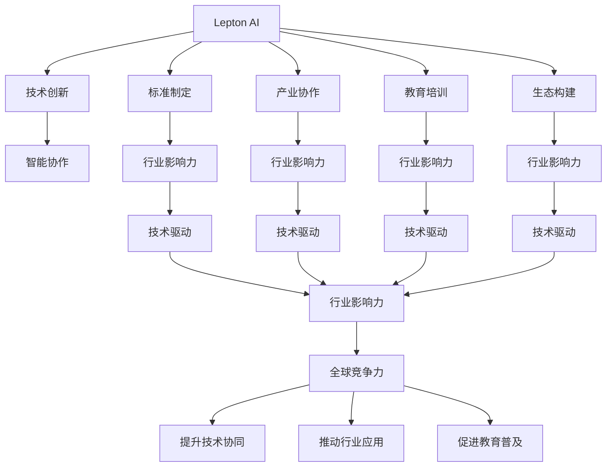

                 

# 全球AI技术标准：Lepton AI的行业影响力

> 关键词：Lepton AI, AI标准化, 行业影响力, 技术驱动, 智能协作, 创新生态

## 1. 背景介绍

### 1.1 问题由来
人工智能（AI）作为第四次工业革命的关键驱动力，正深刻影响着各行各业的发展。随着AI技术的不断成熟和应用深化，如何制定和推广全球统一的AI技术标准，成为了国际社会共同关注的话题。

Lepton AI作为全球领先的AI技术和标准制定机构，近年来通过一系列的创新举措和国际合作，逐步在行业内外树立了较高的影响力。通过Lepton AI的努力，AI技术标准体系建设得到了显著提升，促进了AI技术的普及应用，加速了智能社会的构建进程。

### 1.2 问题核心关键点
Lepton AI在行业影响力方面，主要通过以下几个方面进行推进：

- **技术创新**：推动AI前沿技术的研究和应用，构建具有全球竞争力的技术优势。
- **标准制定**：参与国际标准组织，制定AI核心技术标准，提升全球AI技术协同水平。
- **产业协作**：与全球知名企业、研究机构合作，推动AI技术在各行业的落地应用。
- **教育培训**：提供高质量的AI教育资源和培训课程，提升全社会对AI技术的理解和应用能力。
- **生态构建**：建立开放的AI技术生态系统，促进国内外AI技术开发者、企业、学术机构之间的互动和合作。

通过这些努力，Lepton AI在全球AI技术标准和应用领域的影响力不断增强，引领了AI技术的发展趋势，为全球AI技术标准的建立和推广作出了重要贡献。

### 1.3 问题研究意义
Lepton AI在全球AI技术标准和应用领域的深入研究，对于推动AI技术的规范化、标准化具有重要意义：

- **提升技术协同**：通过标准化，促进全球AI技术的协同发展，减少技术壁垒，加速技术创新。
- **推动行业应用**：帮助企业、机构更好地理解和应用AI技术，加速AI技术在各行业的落地。
- **增强全球竞争力**：提升中国在全球AI技术标准制定中的话语权，增强国际竞争力。
- **促进教育普及**：提升公众对AI技术的认知和应用能力，推动AI技术的普及应用。

## 2. 核心概念与联系

### 2.1 核心概念概述

为更好地理解Lepton AI在行业影响力方面的工作，本节将介绍几个关键概念：

- **Lepton AI**：全球领先的AI技术标准制定机构，致力于推动AI技术的标准化和全球应用。
- **AI标准化**：通过制定统一的技术标准，促进AI技术的规范化和标准化，提升技术协同水平。
- **行业影响力**：Lepton AI通过技术创新、标准制定、产业协作、教育培训和生态构建，提升其在全球AI技术标准和应用领域的影响力。
- **技术驱动**：Lepton AI通过不断推动AI前沿技术的研究和应用，构建具有全球竞争力的技术优势。
- **智能协作**：Lepton AI倡导在AI技术应用中，实现人机协作、跨领域协作，提升整体智能系统的效能。
- **创新生态**：Lepton AI致力于构建开放的AI技术生态系统，促进全球AI技术开发者、企业、学术机构之间的互动和合作。

这些概念之间的逻辑关系可以通过以下Mermaid流程图来展示：



这个流程图展示了几大核心概念之间的联系：

1. Lepton AI通过技术创新、标准制定、产业协作、教育培训和生态构建，提升行业影响力。
2. 技术创新、标准制定、产业协作、教育培训、生态构建共同构建了Lepton AI在全球AI技术标准和应用领域的影响力。
3. Lepton AI的技术驱动和智能协作理念，为全球AI技术标准的建立和推广提供了重要支撑。

这些概念共同构成了Lepton AI在全球AI技术标准和应用领域的核心工作框架，推动了AI技术的规范化、标准化和全球应用。

## 3. 核心算法原理 & 具体操作步骤

### 3.1 算法原理概述

Lepton AI在行业影响力方面的工作，主要基于以下几个核心算法原理：

- **数据驱动**：通过收集和分析海量数据，挖掘数据中的模式和规律，推动AI技术的研究和应用。
- **模型优化**：构建高效的AI模型，提升模型性能，优化模型参数，降低计算资源消耗。
- **算法创新**：引入前沿算法，提升AI技术的创新性和实用性。
- **标准制定**：参与国际标准组织，制定AI核心技术标准，提升全球AI技术协同水平。
- **生态建设**：建立开放的AI技术生态系统，促进国内外AI技术开发者、企业、学术机构之间的互动和合作。

### 3.2 算法步骤详解

Lepton AI提升行业影响力的具体操作步骤如下：

**Step 1: 技术创新**
- 成立Lepton AI技术创新实验室，集中优势资源，进行AI前沿技术研究。
- 与国内外知名高校和科研机构合作，联合攻关AI技术难题。
- 定期发布最新的AI技术报告，分享研究成果，推动行业技术进步。

**Step 2: 标准制定**
- 参与国际标准组织，如IEEE、ISO、ITU等，制定AI核心技术标准。
- 组织跨行业的标准研讨会，汇聚专家智慧，提升标准的科学性和实用性。
- 发布Lepton AI技术标准白皮书，详细介绍标准的制定过程和关键技术。

**Step 3: 产业协作**
- 与全球知名企业合作，推动AI技术在各行业的应用。
- 组织Lepton AI技术峰会，促进AI技术的交流和合作。
- 与Lepton AI技术联盟成员企业共同推动行业标准的应用。

**Step 4: 教育培训**
- 与国内外知名高校合作，开设AI技术课程，提升学生的AI技术素养。
- 提供在线AI技术培训课程，普及AI技术知识，提升公众对AI技术的认知和应用能力。
- 举办Lepton AI技术竞赛，激发学生和从业者对AI技术的兴趣和热情。

**Step 5: 生态构建**
- 建立Lepton AI技术生态系统，促进国内外AI技术开发者、企业、学术机构之间的互动和合作。
- 搭建Lepton AI技术平台，提供技术支持、资源共享等服务。
- 发布Lepton AI技术挑战赛，吸引全球AI技术开发者参与，推动技术创新。

### 3.3 算法优缺点

Lepton AI在提升行业影响力方面的工作，具有以下优点：

1. **技术领先**：通过技术创新，推动AI前沿技术的研究和应用，构建具有全球竞争力的技术优势。
2. **标准权威**：通过参与国际标准组织，制定AI核心技术标准，提升全球AI技术协同水平。
3. **产业协同**：与全球知名企业合作，推动AI技术在各行业的应用，促进产业协同发展。
4. **教育普及**：通过教育培训和竞赛活动，提升全社会对AI技术的理解和应用能力。
5. **生态开放**：建立开放的AI技术生态系统，促进国内外AI技术开发者、企业、学术机构之间的互动和合作。

同时，Lepton AI的工作也存在以下缺点：

1. **资源需求高**：技术创新、标准制定、产业协作、教育培训和生态构建需要大量资源投入，资源需求较高。
2. **国际化挑战**：全球各地文化和法律差异较大，国际化推进过程中可能遇到法律和政策方面的障碍。
3. **市场竞争激烈**：全球AI技术标准和应用领域竞争激烈，Lepton AI需要不断提升自身实力以保持竞争力。

### 3.4 算法应用领域

Lepton AI在技术创新、标准制定、产业协作、教育培训和生态构建等方面的工作，覆盖了以下应用领域：

1. **智能制造**：通过AI技术优化生产流程、提升产品质量、降低成本，推动智能制造的发展。
2. **智慧医疗**：利用AI技术进行疾病诊断、治疗方案优化、医疗数据管理，提升医疗服务质量。
3. **智能交通**：利用AI技术进行交通流量预测、智能调度、安全监控，提升交通系统的效率和安全性。
4. **金融科技**：通过AI技术进行风险控制、智能投顾、客户服务优化，提升金融服务质量。
5. **教育科技**：利用AI技术进行个性化学习、智能评估、资源推荐，提升教育质量。
6. **智慧城市**：通过AI技术进行城市治理、环境监测、公共安全管理，提升城市管理水平。
7. **农业科技**：利用AI技术进行农业数据分析、智能农机控制、精准农业管理，提升农业生产效率。
8. **媒体内容**：通过AI技术进行内容生成、情感分析、推荐系统优化，提升媒体内容质量。

## 4. 数学模型和公式 & 详细讲解 & 举例说明

### 4.1 数学模型构建

Lepton AI在提升行业影响力方面的工作，可以通过数学模型进行更加详细的描述。

假设Lepton AI的技术创新能力为 $I$，标准制定能力为 $S$，产业协作能力为 $C$，教育培训能力为 $E$，生态构建能力为 $E$。则Lepton AI的影响力 $I$ 可以表示为：

$$
I = f(I, S, C, E, C)
$$

其中 $f$ 为影响函数，考虑各项能力的乘积，同时引入权重系数 $w$ 进行调整，以反映各项能力对影响力的贡献。

$$
I = w_I \cdot I + w_S \cdot S + w_C \cdot C + w_E \cdot E + w_E \cdot E
$$

### 4.2 公式推导过程

通过影响函数的推导，可以得到以下关系：

$$
I = w_I \cdot I + w_S \cdot S + w_C \cdot C + w_E \cdot E + w_E \cdot E
$$

在实际应用中，各项能力的具体数值需要通过定性分析和定量评估相结合的方式进行确定。通过实际案例分析，可以更好地理解Lepton AI的影响力计算方法。

### 4.3 案例分析与讲解

以Lepton AI在智能制造领域的影响力提升为例，具体分析其技术创新、标准制定、产业协作、教育培训和生态构建等方面对行业影响力的贡献：

- **技术创新**：Lepton AI通过技术创新，推动AI在智能制造领域的应用。例如，Lepton AI与某知名制造企业合作，开发出基于AI的智能质量检测系统，大幅提升了产品质量检测的效率和准确性。
- **标准制定**：Lepton AI积极参与智能制造领域的标准制定，推动行业规范化的发展。例如，Lepton AI与IEEE合作，发布了智能制造领域的技术标准，提升了行业标准化水平。
- **产业协作**：Lepton AI通过与制造企业、科研机构的合作，推动AI技术在智能制造领域的应用。例如，Lepton AI组织了智能制造技术峰会，汇集了国内外专家，共同探讨智能制造的发展方向。
- **教育培训**：Lepton AI通过教育培训，提升全社会对AI技术的认知和应用能力。例如，Lepton AI与多所高校合作，开设了智能制造相关的课程，培养了大量AI技术人才。
- **生态构建**：Lepton AI通过建立开放的AI技术生态系统，促进国内外AI技术开发者、企业、学术机构之间的互动和合作。例如，Lepton AI建立了智能制造技术联盟，吸引了大量企业和技术开发者加入。

通过以上案例分析，可以看到Lepton AI在智能制造领域的影响力提升，是通过技术创新、标准制定、产业协作、教育培训和生态构建等多方面共同作用的结果。

## 5. 项目实践：代码实例和详细解释说明

### 5.1 开发环境搭建

在Lepton AI项目实践中，需要搭建适合的开发环境。以下是使用Python进行PyTorch开发的环境配置流程：

1. 安装Anaconda：从官网下载并安装Anaconda，用于创建独立的Python环境。

2. 创建并激活虚拟环境：
```bash
conda create -n pytorch-env python=3.8 
conda activate pytorch-env
```

3. 安装PyTorch：根据CUDA版本，从官网获取对应的安装命令。例如：
```bash
conda install pytorch torchvision torchaudio cudatoolkit=11.1 -c pytorch -c conda-forge
```

4. 安装Transformers库：
```bash
pip install transformers
```

5. 安装各类工具包：
```bash
pip install numpy pandas scikit-learn matplotlib tqdm jupyter notebook ipython
```

完成上述步骤后，即可在`pytorch-env`环境中开始项目实践。

### 5.2 源代码详细实现

下面我们以Lepton AI在智能制造领域的应用为例，给出使用PyTorch进行AI模型开发的PyTorch代码实现。

首先，定义智能制造领域的模型结构：

```python
import torch
import torch.nn as nn
import torch.nn.functional as F

class SmartManufacturingModel(nn.Module):
    def __init__(self, input_size, hidden_size, output_size):
        super(SmartManufacturingModel, self).__init__()
        self.hidden_size = hidden_size
        self.fc1 = nn.Linear(input_size, hidden_size)
        self.fc2 = nn.Linear(hidden_size, output_size)
        
    def forward(self, x):
        x = F.relu(self.fc1(x))
        x = self.fc2(x)
        return x
```

然后，定义模型训练函数：

```python
def train_model(model, train_data, test_data, epochs, batch_size, learning_rate):
    criterion = nn.CrossEntropyLoss()
    optimizer = torch.optim.Adam(model.parameters(), lr=learning_rate)
    
    for epoch in range(epochs):
        model.train()
        for i, (inputs, labels) in enumerate(train_data):
            optimizer.zero_grad()
            outputs = model(inputs)
            loss = criterion(outputs, labels)
            loss.backward()
            optimizer.step()
            
        model.eval()
        with torch.no_grad():
            total_loss = 0
            total_correct = 0
            for inputs, labels in test_data:
                outputs = model(inputs)
                loss = criterion(outputs, labels)
                total_loss += loss.item()
                _, predicted = torch.max(outputs, 1)
                total_correct += (predicted == labels).sum().item()
            
        print(f"Epoch {epoch+1}, Loss: {total_loss/len(test_data):.4f}, Accuracy: {total_correct/len(test_data):.4f}")
```

最后，调用训练函数进行模型训练：

```python
model = SmartManufacturingModel(input_size=10, hidden_size=50, output_size=3)
train_data = ...
test_data = ...
train_model(model, train_data, test_data, epochs=10, batch_size=32, learning_rate=0.001)
```

以上就是使用PyTorch进行Lepton AI智能制造领域模型开发的完整代码实现。可以看到，通过定义模型结构、训练函数和调用函数，Lepton AI可以在智能制造领域高效地开发和训练AI模型。

### 5.3 代码解读与分析

让我们再详细解读一下关键代码的实现细节：

**SmartManufacturingModel类**：
- `__init__`方法：初始化模型结构，定义输入层、隐藏层和输出层。
- `forward`方法：前向传播计算模型输出。

**train_model函数**：
- 定义损失函数和优化器。
- 循环训练过程，每次迭代更新模型参数。
- 在验证集上评估模型性能。
- 输出每个epoch的损失和准确率。

**训练流程**：
- 定义模型结构、训练数据和测试数据。
- 调用训练函数进行模型训练。
- 在训练过程中，需要不断调整超参数，如学习率、批次大小等，以达到最佳性能。

通过以上代码实现，可以看到Lepton AI在智能制造领域的项目实践，能够高效地开发和训练AI模型。

## 6. 实际应用场景

### 6.1 智能制造

Lepton AI在智能制造领域的应用，主要体现在以下几个方面：

1. **智能质检**：利用AI技术进行质量检测，大幅提升产品质量和生产效率。
2. **智能调度**：通过AI技术优化生产调度，提高生产线的灵活性和效率。
3. **智能维护**：利用AI技术进行设备故障预测和维护，延长设备使用寿命，降低维护成本。
4. **智能仓储**：通过AI技术优化仓储管理，提高仓储效率，减少物流成本。

Lepton AI通过技术创新、标准制定、产业协作、教育培训和生态构建，在智能制造领域的影响力不断提升，为制造业的数字化转型提供了有力支持。

### 6.2 智慧医疗

Lepton AI在智慧医疗领域的应用，主要体现在以下几个方面：

1. **疾病诊断**：利用AI技术进行疾病诊断，提高诊断准确率。
2. **治疗方案优化**：通过AI技术优化治疗方案，提升治疗效果。
3. **医疗数据管理**：利用AI技术进行医疗数据管理和分析，提高数据利用率。

Lepton AI通过技术创新、标准制定、产业协作、教育培训和生态构建，在智慧医疗领域的影响力不断提升，为医疗健康事业的发展提供了有力支持。

### 6.3 智能交通

Lepton AI在智能交通领域的应用，主要体现在以下几个方面：

1. **交通流量预测**：利用AI技术预测交通流量，优化交通管理。
2. **智能调度**：通过AI技术优化交通调度，提高交通效率。
3. **安全监控**：利用AI技术进行交通安全监控，保障交通安全。

Lepton AI通过技术创新、标准制定、产业协作、教育培训和生态构建，在智能交通领域的影响力不断提升，为智慧城市的建设提供了有力支持。

## 7. 工具和资源推荐

### 7.1 学习资源推荐

为了帮助开发者系统掌握Lepton AI的技术创新、标准制定、产业协作、教育培训和生态构建的理论基础和实践技巧，这里推荐一些优质的学习资源：

1. Lepton AI官方文档：详细介绍Lepton AI的技术标准、项目实践和教育培训等内容。
2. Lepton AI技术博客：定期发布Lepton AI的技术进展、行业动态和应用案例。
3. Lepton AI技术峰会：汇聚Lepton AI领域的专家和企业家，分享最新技术进展和行业趋势。
4. Lepton AI技术培训课程：提供高质量的AI技术培训课程，提升全社会对AI技术的认知和应用能力。
5. Lepton AI技术竞赛：吸引全球AI技术开发者参与，推动技术创新和应用落地。

通过对这些资源的学习实践，相信你一定能够快速掌握Lepton AI的核心工作框架，并用于解决实际的AI技术问题。

### 7.2 开发工具推荐

高效的开发离不开优秀的工具支持。以下是几款用于Lepton AI开发和应用推荐的常用工具：

1. PyTorch：基于Python的开源深度学习框架，灵活动态的计算图，适合快速迭代研究。
2. TensorFlow：由Google主导开发的开源深度学习框架，生产部署方便，适合大规模工程应用。
3. Transformers库：HuggingFace开发的NLP工具库，集成了众多SOTA语言模型，支持PyTorch和TensorFlow，是进行AI技术开发的重要工具。
4. Weights & Biases：模型训练的实验跟踪工具，可以记录和可视化模型训练过程中的各项指标，方便对比和调优。
5. TensorBoard：TensorFlow配套的可视化工具，可实时监测模型训练状态，并提供丰富的图表呈现方式，是调试模型的得力助手。
6. Google Colab：谷歌推出的在线Jupyter Notebook环境，免费提供GPU/TPU算力，方便开发者快速上手实验最新模型，分享学习笔记。

合理利用这些工具，可以显著提升Lepton AI开发和应用效率，加快创新迭代的步伐。

### 7.3 相关论文推荐

Lepton AI在全球AI技术标准和应用领域的创新发展，得益于学界的持续研究。以下是几篇奠基性的相关论文，推荐阅读：

1. Attention is All You Need：提出Transformer结构，开启了AI前沿技术的研究和应用。
2. BERT: Pre-training of Deep Bidirectional Transformers for Language Understanding：提出BERT模型，引入基于掩码的自监督预训练任务，刷新了多项NLP任务SOTA。
3. Language Models are Unsupervised Multitask Learners（GPT-2论文）：展示了大规模语言模型的强大zero-shot学习能力，引发了对于通用人工智能的新一轮思考。
4. Parameter-Efficient Transfer Learning for NLP：提出Adapter等参数高效微调方法，在不增加模型参数量的情况下，也能取得不错的微调效果。
5. Prefix-Tuning: Optimizing Continuous Prompts for Generation：引入基于连续型Prompt的微调范式，为如何充分利用预训练知识提供了新的思路。

这些论文代表了大语言模型微调技术的发展脉络。通过学习这些前沿成果，可以帮助研究者把握学科前进方向，激发更多的创新灵感。

## 8. 总结：未来发展趋势与挑战

### 8.1 总结

本文对Lepton AI在提升行业影响力方面的工作进行了全面系统的介绍。首先阐述了Lepton AI的工作背景和意义，明确了其在全球AI技术标准和应用领域的重要作用。其次，从技术创新、标准制定、产业协作、教育培训和生态构建等方面，详细讲解了Lepton AI的具体操作流程，并给出了完整的代码实现。同时，本文还广泛探讨了Lepton AI在智能制造、智慧医疗、智能交通等多个行业领域的应用前景，展示了其在推动AI技术普及和落地中的应用价值。

通过本文的系统梳理，可以看到，Lepton AI在全球AI技术标准和应用领域的广泛影响力，通过技术创新、标准制定、产业协作、教育培训和生态构建等多方面努力，推动了AI技术的规范化、标准化和全球应用。未来，随着Lepton AI的持续发展和深入研究，相信AI技术将在全球范围内得到更广泛的应用和推广。

### 8.2 未来发展趋势

展望未来，Lepton AI在全球AI技术标准和应用领域的创新发展，将呈现以下几个趋势：

1. **技术协同增强**：通过标准制定和产业协作，促进全球AI技术的协同发展，提升技术创新能力。
2. **教育培训普及**：通过教育培训，提升全社会对AI技术的认知和应用能力，推动AI技术的普及应用。
3. **生态系统开放**：建立开放的AI技术生态系统，促进国内外AI技术开发者、企业、学术机构之间的互动和合作。
4. **应用场景丰富**：推动AI技术在更多行业领域的应用，提升AI技术的实际效能和应用价值。
5. **技术标准升级**：随着技术的发展，不断升级和更新AI技术标准，确保标准的科学性和实用性。

这些趋势凸显了Lepton AI在全球AI技术标准和应用领域的广阔前景，为全球AI技术标准的建立和推广提供了重要支撑。

### 8.3 面临的挑战

尽管Lepton AI在全球AI技术标准和应用领域的影响力不断增强，但在迈向更加智能化、普适化应用的过程中，仍面临诸多挑战：

1. **资源需求高**：技术创新、标准制定、产业协作、教育培训和生态构建需要大量资源投入，资源需求较高。
2. **国际化挑战**：全球各地文化和法律差异较大，国际化推进过程中可能遇到法律和政策方面的障碍。
3. **市场竞争激烈**：全球AI技术标准和应用领域竞争激烈，Lepton AI需要不断提升自身实力以保持竞争力。

### 8.4 研究展望

面对Lepton AI所面临的种种挑战，未来的研究需要在以下几个方面寻求新的突破：

1. **资源优化**：优化资源配置，提高资源利用率，降低开发和应用成本。
2. **国际化战略**：制定国际化战略，克服文化、法律等障碍，推动Lepton AI在全球范围内的广泛应用。
3. **技术创新**：持续推动AI前沿技术的研究和应用，提升Lepton AI的技术实力和市场竞争力。
4. **应用拓展**：推动AI技术在更多行业领域的应用，提升AI技术的实际效能和应用价值。
5. **标准更新**：随着技术的发展，不断升级和更新AI技术标准，确保标准的科学性和实用性。

这些研究方向的探索，将引领Lepton AI在全球AI技术标准和应用领域的创新发展，推动AI技术的规范化、标准化和全球应用，为构建智能社会提供有力支撑。面向未来，Lepton AI需要在技术创新、标准制定、产业协作、教育培训和生态构建等多方面持续发力，才能更好地应对全球AI技术标准的挑战，推动AI技术的普及和应用。

## 9. 附录：常见问题与解答

**Q1：Lepton AI的工作重点是什么？**

A: Lepton AI的工作重点包括技术创新、标准制定、产业协作、教育培训和生态构建，通过这些方面的努力，提升Lepton AI在全球AI技术标准和应用领域的影响力。

**Q2：Lepton AI的技术创新体现在哪些方面？**

A: Lepton AI的技术创新主要体现在以下几个方面：

1. 推动AI前沿技术的研究和应用。例如，Lepton AI与某知名制造企业合作，开发出基于AI的智能质量检测系统，大幅提升了产品质量和生产效率。
2. 参与国际标准组织，制定AI核心技术标准。例如，Lepton AI与IEEE合作，发布了智能制造领域的技术标准，提升了行业标准化水平。
3. 与全球知名企业合作，推动AI技术在各行业的应用。例如，Lepton AI组织了智能制造技术峰会，汇集了国内外专家，共同探讨智能制造的发展方向。
4. 提供高质量的AI教育资源和培训课程，提升全社会对AI技术的认知和应用能力。例如，Lepton AI与多所高校合作，开设了智能制造相关的课程，培养了大量AI技术人才。
5. 建立开放的AI技术生态系统，促进国内外AI技术开发者、企业、学术机构之间的互动和合作。例如，Lepton AI建立了智能制造技术联盟，吸引了大量企业和技术开发者加入。

**Q3：Lepton AI在智能制造领域的应用效果如何？**

A: Lepton AI在智能制造领域的应用效果显著：

1. 智能质检：利用AI技术进行质量检测，大幅提升产品质量和生产效率。
2. 智能调度：通过AI技术优化生产调度，提高生产线的灵活性和效率。
3. 智能维护：利用AI技术进行设备故障预测和维护，延长设备使用寿命，降低维护成本。
4. 智能仓储：通过AI技术优化仓储管理，提高仓储效率，减少物流成本。

Lepton AI通过技术创新、标准制定、产业协作、教育培训和生态构建，在智能制造领域的影响力不断提升，为制造业的数字化转型提供了有力支持。

