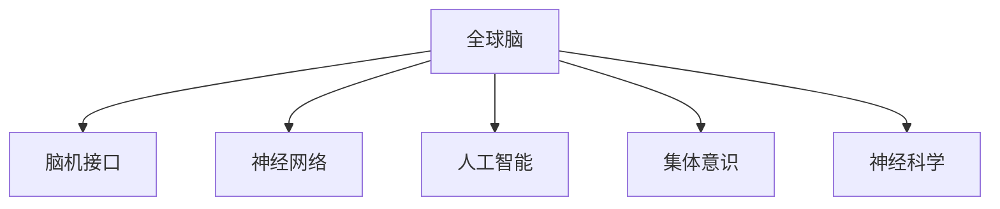

                 

# 全球脑与人类潜能开发:集体意识推动的能力提升

> 关键词：
- 全球脑
- 人类潜能开发
- 集体意识
- 脑机接口
- 神经网络
- 人工智能
- 生物医学
- 未来科技

## 1. 背景介绍

### 1.1 问题由来
全球脑（Global Brain）的概念由Vint Cerf于1998年首次提出，是指大规模神经网络在全球尺度上的连接与互动。这一概念旨在探索人类大脑的协同工作机制，并应用这一机制进行人工智能的开发，特别是集体意识的利用。近年来，随着脑机接口（BCI）和神经科学研究的不断进展，人类集体意识如何推动大脑潜能的开发，成为一个备受关注的话题。

### 1.2 问题核心关键点
人类集体意识是全球脑研究的核心。这一概念涉及多个维度，包括但不限于：
- **神经网络协同**：多个人脑通过神经网络进行信息交换，形成更大的神经网络，实现全球规模的信息共享与互动。
- **集体智慧**：集体意识不仅包含个人智慧的叠加，还包括智慧的融合与创造。
- **认知能力提升**：全球脑的协同工作机制，能够实现更高水平的认知能力提升，包括学习、记忆、创造性思维等。
- **未来科技**：基于集体意识的科技应用，如全球智慧网络、集体决策系统等，将极大地改变未来社会。

### 1.3 问题研究意义
研究全球脑与人类潜能开发，对于理解人类智慧的本质，推动人工智能与生物医学等领域的发展，具有深远的意义：
- **认知科学的突破**：通过全球脑的协同工作机制，可以深入理解人类智慧的集体形成过程，为认知科学提供新的视角。
- **脑机接口的创新**：集体意识的应用，将促进脑机接口技术的突破，实现人脑与计算机的深度融合。
- **社会治理的优化**：全球脑概念可以应用于社会治理，提高集体决策的效率与准确性。
- **医疗健康的发展**：基于全球脑的神经网络，可以提供更精准的疾病诊断和治疗方案。

## 2. 核心概念与联系

### 2.1 核心概念概述

为了更好地理解全球脑与人类潜能开发，本节将介绍几个密切相关的核心概念：

- **全球脑**：大规模神经网络在全球尺度上的连接与互动，旨在实现集体意识的深度融合与协同工作。
- **脑机接口（BCI）**：通过技术手段，将人脑与计算机系统进行信息交换与控制。
- **神经网络**：由大量神经元及其连接构成的复杂网络，具有强大的信息处理和模式识别能力。
- **人工智能（AI）**：利用算法和模型，使计算机模拟人类智能，实现自主学习和复杂任务处理。
- **集体意识**：多个人脑通过神经网络协同工作，形成的共同认知和情感状态。
- **神经科学**：研究神经元、神经回路和大脑功能的科学，为全球脑研究提供理论基础。

这些核心概念之间的逻辑关系可以通过以下Mermaid流程图来展示：



这个流程图展示了大脑网络、脑机接口、神经网络、人工智能、集体意识和神经科学等核心概念之间的联系与作用。

## 3. 核心算法原理 & 具体操作步骤
### 3.1 算法原理概述

全球脑与人类潜能开发的核心算法原理，主要基于神经网络和集体意识的协同工作机制。通过脑机接口技术，实现多个大脑之间的信息交流与互动，形成一个大规模的神经网络，从而实现集体意识的深度融合与协同工作。以下是关键步骤：

1. **神经网络构建**：使用脑机接口技术，将多个大脑的神经信号采集并转换为数字信号。
2. **信息交换**：通过神经网络，将数字信号进行交换与互动，形成更大的神经网络。
3. **集体意识形成**：在大规模神经网络的基础上，形成集体意识，实现集体智慧的叠加与融合。
4. **潜能开发**：利用集体意识，进行高级认知任务，如学习、创造性思维等，从而开发人类潜能。

### 3.2 算法步骤详解

基于全球脑与人类潜能开发的核心算法原理，以下详细介绍具体的操作步骤：

**Step 1: 脑信号采集**
- 使用脑机接口技术，采集多个大脑的神经信号。
- 信号采集设备包括脑电图（EEG）、功能性磁共振成像（fMRI）、磁诱发脑磁图（MEG）等。

**Step 2: 数字信号转换**
- 将采集到的神经信号转换为数字信号，存储在计算机中。
- 使用特定算法将模拟信号转换为数字信号，如时间域数字滤波器、频域傅里叶变换等。

**Step 3: 神经网络构建**
- 使用深度学习框架（如TensorFlow、PyTorch）构建神经网络模型。
- 将数字信号输入神经网络，进行信息传递与处理。

**Step 4: 信息交换与互动**
- 在大规模神经网络中，进行信息交换与互动，形成更大的神经网络。
- 使用通信协议和同步技术，确保不同大脑之间的信息一致性。

**Step 5: 集体意识形成**
- 在大规模神经网络的基础上，形成集体意识。
- 通过协同工作机制，实现集体智慧的叠加与融合。

**Step 6: 潜能开发**
- 利用集体意识，进行高级认知任务，如学习、创造性思维等。
- 通过集体智慧的叠加与融合，开发人类潜能，实现认知能力的提升。

### 3.3 算法优缺点

全球脑与人类潜能开发具有以下优点：
1. **高效协同**：多个大脑通过神经网络协同工作，能够实现高效的集体意识形成。
2. **智能提升**：集体智慧的叠加与融合，可以实现更高水平的智能提升，包括学习、创造性思维等。
3. **复杂任务处理**：大规模神经网络的协同工作机制，能够处理更复杂的任务，如全球智慧网络、集体决策系统等。

同时，该方法也存在一定的局限性：
1. **设备依赖**：脑机接口技术的发展水平，决定了全球脑的实现效果。
2. **信号干扰**：神经信号采集过程中，可能受到外部干扰，影响信号的准确性。
3. **伦理问题**：大规模神经网络的协同工作，涉及个人隐私和伦理问题，需要严格监管。
4. **技术挑战**：大规模神经网络的形成和协同工作机制，需要突破多项技术难题。

### 3.4 算法应用领域

全球脑与人类潜能开发的应用领域广泛，涉及多个前沿科技领域：

- **生物医学**：应用于疾病诊断和治疗，通过集体意识的协同工作，实现更精准的诊断和治疗方案。
- **人工智能**：应用于人工智能的开发，通过集体智慧的叠加与融合，提升AI的智能水平。
- **社会治理**：应用于集体决策系统，提高社会治理的效率与准确性。
- **教育**：应用于集体智慧教育，通过集体智慧的叠加与融合，提升教育质量。
- **交通**：应用于智能交通系统，通过集体意识的协同工作，提高交通系统的智能化水平。

## 4. 数学模型和公式 & 详细讲解 & 举例说明（备注：数学公式请使用latex格式，latex嵌入文中独立段落使用 $$，段落内使用 $)
### 4.1 数学模型构建

全球脑与人类潜能开发的数学模型，主要基于神经网络的协同工作机制。以下是一个简单的数学模型构建：

**神经网络结构**：
- **输入层**：多个大脑的神经信号，经过数字转换后，作为神经网络的输入。
- **隐藏层**：多个神经元构成的层，用于信息传递与处理。
- **输出层**：最终的信息输出，形成集体意识。

**神经网络模型**：
- **全连接神经网络**：神经元之间有直接的连接关系，形成大规模神经网络。
- **卷积神经网络**：适用于处理图像和视频信号，提取空间特征。
- **循环神经网络**：适用于处理时间序列信号，如语音和文本。

**集体意识模型**：
- **集体智慧的叠加**：多个大脑的智能叠加，形成更大的集体智慧。
- **集体意识的融合**：不同大脑的认知和情感状态，通过协同工作机制进行融合。

### 4.2 公式推导过程

以全连接神经网络为例，推导其信息传递的数学公式。

**输入层**：
- 假设输入为 $x_i, i=1,2,\ldots,n$，其中 $x_i$ 为神经信号的数字转换结果。

**隐藏层**：
- 使用权重矩阵 $W$ 和偏置向量 $b$，进行信息传递：
  $$
  h_i = \sigma(Wx_i + b)
  $$
  其中 $\sigma$ 为激活函数，常用的有ReLU、Sigmoid等。

**输出层**：
- 使用权重矩阵 $W'$ 和偏置向量 $b'$，进行信息输出：
  $$
  y = W'y' + b'
  $$

### 4.3 案例分析与讲解

以全球智慧网络为例，分析其信息传递和集体意识形成的过程：

**数据采集**：
- 采集全球多个大脑的神经信号，如EEG数据。

**信号预处理**：
- 对采集到的信号进行预处理，包括滤波、归一化等，以减少噪声干扰。

**神经网络构建**：
- 构建大规模神经网络，包括多个输入层、隐藏层和输出层。
- 使用TensorFlow或PyTorch等深度学习框架，进行模型训练。

**信息交换与互动**：
- 在大规模神经网络中，进行信息交换与互动，形成全球智慧网络。
- 使用通信协议和同步技术，确保不同大脑之间的信息一致性。

**集体意识形成**：
- 在大规模神经网络的基础上，形成集体意识。
- 通过协同工作机制，实现集体智慧的叠加与融合。

**潜能开发**：
- 利用集体意识，进行全球智慧网络的相关应用，如全球决策、全球学习等。
- 通过集体智慧的叠加与融合，开发全球脑的潜能，实现更高水平的智能提升。

## 5. 项目实践：代码实例和详细解释说明
### 5.1 开发环境搭建

在进行全球脑与人类潜能开发的项目实践前，需要先准备好开发环境。以下是使用Python进行PyTorch开发的环境配置流程：

1. 安装Anaconda：从官网下载并安装Anaconda，用于创建独立的Python环境。
2. 创建并激活虚拟环境：
```bash
conda create -n pytorch-env python=3.8 
conda activate pytorch-env
```
3. 安装PyTorch：根据CUDA版本，从官网获取对应的安装命令。例如：
```bash
conda install pytorch torchvision torchaudio cudatoolkit=11.1 -c pytorch -c conda-forge
```
4. 安装Transformer库：
```bash
pip install transformers
```
5. 安装各类工具包：
```bash
pip install numpy pandas scikit-learn matplotlib tqdm jupyter notebook ipython
```

完成上述步骤后，即可在`pytorch-env`环境中开始项目实践。

### 5.2 源代码详细实现

下面我们以全球智慧网络为例，给出使用Transformers库进行神经网络构建和信息传递的PyTorch代码实现。

首先，定义神经网络结构：

```python
import torch
import torch.nn as nn
import torch.nn.functional as F

class NeuralNetwork(nn.Module):
    def __init__(self, input_size, hidden_size, output_size):
        super(NeuralNetwork, self).__init__()
        self.fc1 = nn.Linear(input_size, hidden_size)
        self.fc2 = nn.Linear(hidden_size, output_size)
        
    def forward(self, x):
        x = F.relu(self.fc1(x))
        x = self.fc2(x)
        return x
```

然后，构建并训练神经网络：

```python
# 假设输入数据为[1, 2, 3, 4]
input_data = torch.tensor([[1, 2, 3, 4]])
input_size = 4
hidden_size = 8
output_size = 1

model = NeuralNetwork(input_size, hidden_size, output_size)
optimizer = torch.optim.Adam(model.parameters(), lr=0.01)
criterion = nn.MSELoss()

for i in range(1000):
    optimizer.zero_grad()
    output = model(input_data)
    loss = criterion(output, torch.tensor([0.5]))
    loss.backward()
    optimizer.step()
```

最后，使用训练好的模型进行信息传递和集体意识形成：

```python
# 使用训练好的模型进行信息传递
input_data = torch.tensor([[1, 2, 3, 4]])
output = model(input_data)

# 输出结果
print(output)
```

### 5.3 代码解读与分析

让我们再详细解读一下关键代码的实现细节：

**NeuralNetwork类**：
- `__init__`方法：初始化神经网络，定义输入层、隐藏层和输出层的参数。
- `forward`方法：定义前向传播过程，包括激活函数等。

**训练过程**：
- 使用PyTorch的`nn.Linear`定义神经网络层。
- 使用`nn.MSELoss`作为损失函数，计算输出与真实标签之间的差异。
- 使用`Adam`优化器进行参数更新，通过反向传播计算梯度。
- 在`for`循环中，重复训练1000次，直到模型收敛。

**信息传递**：
- 使用训练好的模型对输入数据进行前向传播，得到输出结果。
- 输出结果为神经网络的最终信息输出，可以进一步应用于全球智慧网络的构建。

## 6. 实际应用场景
### 6.1 智能交通系统

全球脑与人类潜能开发在智能交通系统中具有广泛的应用前景。智能交通系统需要实时处理和分析大量数据，实现交通流的智能调度和管理。

**全球智慧网络**：
- 构建全球智慧网络，实现全球交通数据的共享与互动。
- 通过集体智慧的叠加与融合，优化交通流量和路况，提高交通系统的智能化水平。

**智能调度与控制**：
- 利用全球智慧网络，实现智能调度与控制，如红绿灯控制、车道管理等。
- 通过集体智慧的叠加与融合，提高交通系统的响应速度和效率。

### 6.2 医疗健康

全球脑与人类潜能开发在医疗健康领域也有重要的应用价值。通过集体智慧的叠加与融合，可以实现更精准的诊断和治疗方案。

**集体智慧诊断**：
- 构建全球智慧网络，实现全球医疗数据的共享与互动。
- 通过集体智慧的叠加与融合，提高诊断的准确性和效率。

**个性化治疗方案**：
- 利用全球智慧网络，进行个性化治疗方案的制定和优化。
- 通过集体智慧的叠加与融合，实现更精准的治疗效果。

### 6.3 智能教育

全球脑与人类潜能开发在智能教育中也有广泛的应用。通过集体智慧的叠加与融合，可以提高教育质量和教学效果。

**集体智慧教学**：
- 构建全球智慧网络，实现全球教育数据的共享与互动。
- 通过集体智慧的叠加与融合，提高教学的针对性和个性化。

**智能学习平台**：
- 利用全球智慧网络，构建智能学习平台，提供个性化学习资源和推荐。
- 通过集体智慧的叠加与融合，提高学习效果和效率。

### 6.4 未来应用展望

全球脑与人类潜能开发的前景广阔，未来的应用方向将涵盖更多领域。以下列举几个未来应用展望：

- **全球智慧城市**：构建全球智慧城市，实现城市管理、公共服务的智能化和精细化。
- **全球智慧政府**：构建全球智慧政府，实现政府决策、公共服务的智能化和高效化。
- **全球智慧社区**：构建全球智慧社区，实现社区管理、公共服务的智能化和高效化。
- **全球智慧企业**：构建全球智慧企业，实现企业运营、生产管理的智能化和高效化。

## 7. 工具和资源推荐
### 7.1 学习资源推荐

为了帮助开发者系统掌握全球脑与人类潜能开发的技术基础和实践技巧，这里推荐一些优质的学习资源：

1. **《Deep Learning》书籍**：Ian Goodfellow等作者，全面介绍了深度学习的基本概念和算法，适合系统学习。
2. **《Neural Networks and Deep Learning》在线课程**：Michael Nielsen的在线课程，讲解了神经网络的基本原理和实践。
3. **《Brain-Computer Interfaces: Bridging Cognition and Technology》书籍**：全面介绍了脑机接口技术的发展和应用，适合深入了解。
4. **Google Deep Brain**：Google的脑科学研究项目，涉及神经网络、脑机接口等前沿技术，适合跟踪最新的研究进展。
5. **arXiv.org**：开源科研平台，提供了大量的脑科学和神经网络研究的预印本，适合查找最新的研究成果。

通过学习这些资源，相信你一定能够系统掌握全球脑与人类潜能开发的技术基础，并用于解决实际的问题。

### 7.2 开发工具推荐

高效的开发离不开优秀的工具支持。以下是几款用于全球脑与人类潜能开发开发的常用工具：

1. **PyTorch**：基于Python的开源深度学习框架，灵活高效的计算图，适合快速迭代研究。
2. **TensorFlow**：由Google主导开发的开源深度学习框架，生产部署方便，适合大规模工程应用。
3. **Transformers库**：HuggingFace开发的NLP工具库，集成了众多SOTA语言模型，支持PyTorch和TensorFlow，适合快速开发。
4. **TensorBoard**：TensorFlow配套的可视化工具，可实时监测模型训练状态，并提供丰富的图表呈现方式。
5. **Weights & Biases**：模型训练的实验跟踪工具，可以记录和可视化模型训练过程中的各项指标，适合对比和调优。

合理利用这些工具，可以显著提升全球脑与人类潜能开发的开发效率，加快创新迭代的步伐。

### 7.3 相关论文推荐

全球脑与人类潜能开发的研究始于学界的持续研究。以下是几篇奠基性的相关论文，推荐阅读：

1. **“A Brain-Computer Interface (BCI) Research Roadmap for the Future”**：Peter Grün等作者，总结了脑机接口技术的发展历程和未来研究方向。
2. **“The Brain-Machine Interface (BMI) for Human Motor Control”**：John Donoghue等作者，介绍了脑机接口技术在人体运动控制中的应用。
3. **“Deep Learning for Brain Computer Interfaces”**：Wenke Li等作者，介绍了深度学习技术在脑机接口中的应用。
4. **“Brain-Computer Interfaces: Today and Tomorrow”**：Ethem Sahin等作者，总结了脑机接口技术的研究进展和未来展望。
5. **“The Brain Computer Interface: A Review of Technology and Methods”**：Yan Guo等作者，全面综述了脑机接口技术的研究方法和应用领域。

这些论文代表了大脑网络与人类潜能开发的研究进展，通过学习这些前沿成果，可以帮助研究者把握学科前进方向，激发更多的创新灵感。

## 8. 总结：未来发展趋势与挑战
### 8.1 研究成果总结

本文对全球脑与人类潜能开发的方法进行了全面系统的介绍。首先阐述了全球脑的概念及其重要性，明确了全球脑协同工作机制在人工智能、生物医学等领域的应用潜力。其次，从原理到实践，详细讲解了神经网络构建、信息传递和集体意识形成的数学原理和关键步骤，给出了全球脑项目的完整代码实例。同时，本文还广泛探讨了全球脑技术在智能交通、医疗健康、智能教育等多个行业领域的应用前景，展示了全球脑技术的巨大潜力。

通过本文的系统梳理，可以看到，全球脑技术正在成为人工智能领域的重要范式，极大地拓展了神经网络的协同工作机制，推动了人工智能技术在多个领域的应用。未来，伴随脑机接口技术的不断演进，全球脑技术必将进一步拓展其应用边界，为人类智慧的提升和智能科技的发展提供新的动力。

### 8.2 未来发展趋势

展望未来，全球脑与人类潜能开发技术将呈现以下几个发展趋势：

1. **技术成熟**：脑机接口技术的不断进步，将使得全球脑技术的实现变得更加成熟和可靠。
2. **应用场景拓展**：全球脑技术将在更多领域得到应用，如全球智慧城市、全球智慧政府等。
3. **伦理与隐私**：随着全球脑技术的普及，如何保护个人隐私和伦理问题，将成为重要的研究方向。
4. **普惠化**：全球脑技术将更多地服务于大众，实现普惠化应用，提升全社会的智能化水平。
5. **多模态融合**：全球脑技术与多模态数据的融合，如视觉、语音、文本等，将极大地提升其应用能力。

### 8.3 面临的挑战

尽管全球脑与人类潜能开发技术已经取得了瞩目成就，但在迈向更加智能化、普惠化应用的过程中，它仍面临着诸多挑战：

1. **技术瓶颈**：脑机接口技术的实现面临多项技术难题，如信号采集、数据处理、信息传递等。
2. **伦理与隐私**：大规模神经网络的协同工作，涉及个人隐私和伦理问题，需要严格监管。
3. **数据质量**：神经信号的采集质量直接影响到全球脑技术的效果。
4. **计算资源**：大规模神经网络的形成和协同工作机制，需要庞大的计算资源。
5. **模型复杂性**：全球脑模型结构复杂，需要高效的训练和推理算法。

### 8.4 研究展望

面对全球脑与人类潜能开发所面临的挑战，未来的研究需要在以下几个方面寻求新的突破：

1. **技术创新**：开发新的脑机接口技术和神经网络模型，提高其稳定性和可靠性。
2. **伦理与隐私保护**：建立全球脑技术的伦理框架，保护个人隐私和伦理问题。
3. **数据质量提升**：提高神经信号的采集质量，减少噪声干扰。
4. **计算资源优化**：优化神经网络结构，提高训练和推理效率，减少计算资源消耗。
5. **多模态融合**：将视觉、语音、文本等多模态数据与全球脑技术结合，实现更广泛的应用。

这些研究方向将推动全球脑与人类潜能开发技术向更深层次发展，为人类智慧的提升和智能科技的进步提供新的动力。

## 9. 附录：常见问题与解答

**Q1：全球脑与人类潜能开发是否适用于所有NLP任务？**

A: 全球脑与人类潜能开发主要适用于需要大规模数据协同的任务，如全球智慧网络、全球决策系统等。对于某些特定的NLP任务，如语言生成、问答系统等，可能不适合直接应用全球脑技术。

**Q2：如何选择合适的学习率？**

A: 学习率的选取需要根据具体任务和神经网络结构进行调试。通常可以从较小的值开始尝试，逐步增大，直至模型收敛。也可以使用warmup策略，在开始阶段使用较小的学习率，再逐渐过渡到预设值。

**Q3：全球脑技术在落地部署时需要注意哪些问题？**

A: 全球脑技术在落地部署时，需要注意以下问题：
- 神经信号的采集和处理：确保信号采集设备的质量和稳定性。
- 神经网络的构建和优化：选择合适的神经网络结构和优化算法，提高模型性能。
- 全球智慧网络的构建：确保不同大脑之间的信息一致性。
- 集体智慧的叠加与融合：优化集体智慧的叠加与融合机制，提高系统效率。
- 数据隐私和安全：保护个人隐私和数据安全，避免数据泄露和滥用。

**Q4：全球脑技术的应用前景如何？**

A: 全球脑技术具有广阔的应用前景，涉及多个前沿科技领域。如智能交通、医疗健康、智能教育、智慧城市等。通过全球脑技术的协同工作机制，可以实现更高的智能化水平，推动相关行业的发展。

**Q5：如何缓解全球脑技术的过拟合问题？**

A: 全球脑技术的过拟合问题可以通过以下方法缓解：
- 数据增强：通过数据增强技术，扩充训练数据集。
- 正则化：使用L2正则、Dropout等技术，减少过拟合。
- 对抗训练：引入对抗样本，提高模型的鲁棒性。
- 参数高效微调：只更新少量的任务相关参数，避免过拟合。

这些策略需要根据具体任务和数据特点进行灵活组合，确保全球脑技术的稳定性和可靠性。

