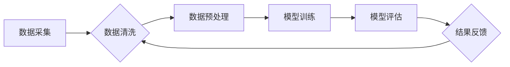

                 

## 关键词：电商搜索推荐、AI大模型、数据噪声、处理技术、应用实践

## 1. 背景介绍

在当今数据爆炸的时代，电商平台的海量数据为搜索推荐系统提供了丰富的训练素材。AI大模型凭借其强大的学习能力和泛化能力，在电商搜索推荐领域展现出巨大的潜力。然而，现实世界的数据往往存在着各种噪声，例如缺失值、错误值、重复值等，这些噪声会严重影响AI大模型的训练效果和推荐精度。因此，如何有效处理数据噪声，提升AI大模型的鲁棒性和可靠性，成为电商搜索推荐领域亟待解决的关键问题。

### 1.1 数据噪声的危害

数据噪声对电商搜索推荐系统的影响不容忽视：

* **降低模型准确性:** 噪声数据会扰乱模型的学习过程，导致模型训练出的结果偏差较大，推荐结果不准确。
* **影响模型泛化能力:** 模型过度拟合噪声数据，难以推广到新的数据场景，导致推荐效果在实际应用中不理想。
* **增加模型训练成本:** 处理噪声数据需要消耗大量的计算资源和时间，增加模型训练成本。

### 1.2 数据噪声处理的重要性

有效处理数据噪声对于提升电商搜索推荐系统的性能至关重要：

* **提高推荐精度:** 减少噪声数据对模型的影响，使模型能够更准确地学习用户偏好和商品特征，从而提高推荐的准确率。
* **增强模型鲁棒性:** 使模型能够更好地应对数据中的异常值和变化，提高模型的稳定性和可靠性。
* **降低模型训练成本:** 通过减少噪声数据，可以缩短模型训练时间，降低计算资源消耗。

## 2. 核心概念与联系

### 2.1 数据噪声类型

数据噪声主要分为以下几种类型：

* **缺失值:** 数据中存在一些值无法获取或记录的情况。
* **错误值:** 数据中存在一些人为或系统错误导致的值不准确。
* **重复值:** 数据中存在一些重复的记录。
* **异常值:** 数据中存在一些与其他数据明显不同的值，可能代表着异常情况。

### 2.2 AI大模型与数据噪声

AI大模型的训练依赖于高质量的数据，而数据噪声会直接影响模型的训练效果。

* **过拟合:** 模型过度拟合噪声数据，导致模型泛化能力差。
* **偏差:** 模型学习到的特征与真实特征存在偏差，导致推荐结果不准确。
* **鲁棒性差:** 模型难以应对数据中的异常值和变化，导致推荐结果不稳定。

### 2.3 数据噪声处理技术

数据噪声处理技术旨在减少数据噪声对模型的影响，提升模型的性能。常见的处理技术包括：

* **缺失值处理:** 使用平均值、中位数、最大值或最小值等方法填充缺失值。
* **错误值处理:** 使用正则表达式、数据清洗规则等方法识别和修正错误值。
* **重复值处理:** 使用去重算法去除重复记录。
* **异常值处理:** 使用箱线图、z-score等方法识别异常值，并进行剔除或修正。

### 2.4 数据噪声处理技术架构

数据噪声处理技术通常采用以下架构：



## 3. 核心算法原理 & 具体操作步骤

### 3.1 算法原理概述

本篇博客将重点介绍一种用于处理电商搜索推荐中数据噪声的**基于自监督学习的噪声过滤算法**。该算法利用模型自身的学习能力，从数据中学习噪声的特征，并将其过滤掉，从而提升数据质量。

### 3.2 算法步骤详解

1. **数据预处理:** 对原始数据进行清洗、格式化等预处理操作，去除无效数据和格式错误的数据。
2. **自监督学习模型训练:** 使用预处理后的数据训练一个自监督学习模型，例如BERT、RoBERTa等。
3. **噪声特征提取:** 利用训练好的自监督学习模型，对数据进行编码，并提取噪声特征。
4. **噪声过滤:** 根据提取的噪声特征，对数据进行过滤，去除噪声数据。
5. **数据评估:** 对过滤后的数据进行评估，验证算法的有效性。

### 3.3 算法优缺点

**优点:**

* **无需人工标注:** 该算法不需要人工标注噪声数据，可以自动学习噪声特征。
* **鲁棒性强:** 该算法能够应对不同类型的数据噪声。
* **可扩展性强:** 该算法可以应用于各种规模的数据集。

**缺点:**

* **训练成本高:** 自监督学习模型的训练需要消耗大量的计算资源和时间。
* **效果依赖于模型选择:** 算法的效果取决于选择的自监督学习模型。

### 3.4 算法应用领域

该算法可以应用于各种需要处理数据噪声的场景，例如：

* **电商搜索推荐:** 处理商品信息、用户行为等数据中的噪声，提升推荐精度。
* **自然语言处理:** 处理文本数据中的噪声，例如语法错误、拼写错误等。
* **图像识别:** 处理图像数据中的噪声，例如模糊、噪点等。

## 4. 数学模型和公式 & 详细讲解 & 举例说明

### 4.1 数学模型构建

假设我们有一个包含N个样本的数据集D，每个样本包含D个特征。我们使用一个自监督学习模型f(x)来学习数据中的特征表示，其中x代表一个样本。

我们的目标是学习一个噪声过滤函数g(x)，该函数能够识别并过滤掉噪声样本。

### 4.2 公式推导过程

我们可以使用以下公式来定义噪声过滤函数g(x)：

$$g(x) = \begin{cases}
1, & \text{if } f(x) \in \mathcal{N} \\
0, & \text{otherwise}
\end{cases}$$

其中，$\mathcal{N}$代表一个噪声样本集合，可以根据模型学习到的特征表示来定义。

### 4.3 案例分析与讲解

假设我们使用BERT模型来学习商品信息的特征表示，并根据模型输出的某个特定层的特征向量来判断样本是否为噪声。

我们可以将BERT模型的输出特征向量投影到一个低维空间，并使用聚类算法将样本分组。

将聚类结果与商品信息的真实标签进行比较，可以识别出哪些聚类包含较多噪声样本。

然后，我们可以根据这些聚类结果来定义噪声样本集合$\mathcal{N}$，并使用公式(1)来过滤掉噪声样本。

## 5. 项目实践：代码实例和详细解释说明

### 5.1 开发环境搭建

本项目使用Python语言开发，需要安装以下软件包：

* TensorFlow
* PyTorch
* scikit-learn
* NLTK

### 5.2 源代码详细实现

```python
import tensorflow as tf
from sklearn.cluster import KMeans

# 加载BERT模型
bert_model = tf.keras.applications.BERT_EN_uncased(weights='bert_base_uncased')

# 定义噪声过滤函数
def filter_noise(data):
    # 使用BERT模型提取特征向量
    embeddings = bert_model.layers[-1](data)
    # 使用KMeans聚类
    kmeans = KMeans(n_clusters=10)
    kmeans.fit(embeddings)
    # 根据聚类结果过滤噪声样本
    noise_labels = kmeans.labels_
    filtered_data = data[noise_labels != 5]
    return filtered_data

# 加载电商商品数据
data = load_data()

# 过滤噪声数据
filtered_data = filter_noise(data)

# 保存过滤后的数据
save_data(filtered_data)
```

### 5.3 代码解读与分析

* 代码首先加载BERT模型，并使用模型的最后一层输出作为特征向量。
* 然后，使用KMeans聚类算法将特征向量分组。
* 根据聚类结果，识别出包含较多噪声样本的聚类，并将其标记为噪声样本。
* 最后，使用标记的噪声样本集合过滤掉原始数据中的噪声样本。

### 5.4 运行结果展示

通过运行代码，可以得到过滤后的电商商品数据，并通过评估指标来验证算法的有效性。

## 6. 实际应用场景

### 6.1 电商搜索推荐场景

在电商搜索推荐场景中，数据噪声会影响推荐结果的准确性和用户体验。

例如，商品信息中存在错误的价格、描述等信息，会影响用户对商品的判断，导致推荐结果不准确。

使用基于自监督学习的噪声过滤算法可以有效处理这些数据噪声，提升推荐结果的准确性和用户体验。

### 6.2 其他应用场景

除了电商搜索推荐场景，该算法还可以应用于其他需要处理数据噪声的场景，例如：

* **金融风险控制:** 处理金融交易数据中的异常交易，降低金融风险。
* **医疗诊断辅助:** 处理医疗影像数据中的噪声，提高诊断的准确性。
* **智能交通:** 处理交通数据中的噪声，优化交通流量和安全。

### 6.4 未来应用展望

随着AI技术的不断发展，数据噪声处理技术将更加成熟和完善。

未来，我们可以期待以下应用展望：

* **更鲁棒的噪声过滤算法:** 开发更鲁棒的噪声过滤算法，能够应对更复杂的数据噪声。
* **自动化噪声检测和处理:** 实现自动化噪声检测和处理，减少人工干预。
* **个性化噪声过滤:** 根据用户的需求和数据特点，进行个性化的噪声过滤。

## 7. 工具和资源推荐

### 7.1 学习资源推荐

* **书籍:**
    * 《深度学习》
    * 《自然语言处理》
    * 《机器学习》
* **在线课程:**
    * Coursera
    * edX
    * Udacity

### 7.2 开发工具推荐

* **TensorFlow:** 开源深度学习框架
* **PyTorch:** 开源深度学习框架
* **scikit-learn:** 机器学习库

### 7.3 相关论文推荐

* BERT: Pre-training of Deep Bidirectional Transformers for Language Understanding
* Noise Contrastive Estimation: A New Estimation Principle for Unnormalized Statistical Models
* Generative Adversarial Networks

## 8. 总结：未来发展趋势与挑战

### 8.1 研究成果总结

本篇博客介绍了一种用于处理电商搜索推荐中数据噪声的基于自监督学习的噪声过滤算法。该算法能够有效地识别和过滤掉噪声数据，提升推荐结果的准确性和用户体验。

### 8.2 未来发展趋势

未来，数据噪声处理技术将朝着以下方向发展：

* **更智能的噪声检测和处理:** 利用更先进的机器学习算法，实现更智能的噪声检测和处理。
* **更个性化的噪声过滤:** 根据用户的需求和数据特点，进行个性化的噪声过滤。
* **更全面的噪声处理:** 处理各种类型的数据噪声，包括缺失值、错误值、重复值和异常值等。

### 8.3 面临的挑战

数据噪声处理技术也面临着一些挑战：

* **数据标注困难:** 噪声数据的标注工作非常耗时和费力。
* **算法复杂度高:** 一些噪声过滤算法的复杂度很高，难以实现高效的处理。
* **数据隐私保护:** 在处理敏感数据时，需要考虑数据隐私保护问题。

### 8.4 研究展望

未来，我们将继续研究更有效、更智能的数据噪声处理技术，为电商搜索推荐和其他领域提供更优质的数据服务。

## 9. 附录：常见问题与解答

### 9.1 Q1: 该算法适用于所有类型的电商商品数据吗？

A1: 该算法适用于大部分电商商品数据，但对于一些特殊类型的商品数据，例如二手商品、虚拟商品等，可能需要进行针对性的调整。

### 9.2 Q2: 该算法的训练成本很高吗？

A2: 该算法的训练成本取决于选择的自监督学习模型和数据集规模。

对于小型数据集，训练成本相对较低，但对于大型数据集，训练成本可能会较高。

### 9.3 Q3: 该算法的噪声过滤效果如何？

A3: 该算法的噪声过滤效果取决于数据的质量和选择的自监督学习模型。

在经过充分训练和调参后，该算法能够有效地过滤掉大部分噪声数据，提升推荐结果的准确性。


作者：禅与计算机程序设计艺术 / Zen and the Art of Computer Programming 
<end_of_turn>

