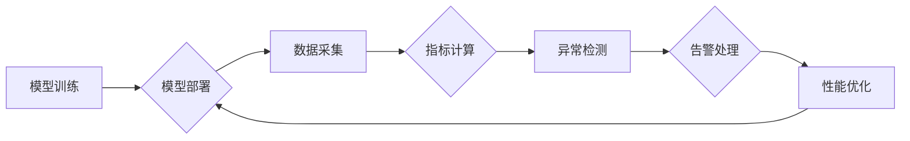

                 

## 电商搜索推荐场景下的AI大模型模型部署监控体系搭建

> 关键词：AI大模型、电商搜索推荐、模型部署、监控体系、指标体系、异常检测、性能优化

## 1. 背景介绍

随着人工智能技术的飞速发展，大模型在电商搜索推荐领域展现出巨大的潜力。大模型能够学习海量数据，精准理解用户需求，并提供个性化的商品推荐，从而提升用户体验和商家转化率。然而，大模型的部署和运行并非易事，需要建立完善的监控体系来确保模型的稳定性、准确性和效率。

传统的监控体系难以满足大模型的复杂需求。大模型通常具有以下特点：

* **规模庞大:** 大模型参数量巨大，训练和推理过程耗费大量计算资源。
* **实时性要求高:** 电商搜索推荐需要实时响应用户请求，模型的延迟时间必须控制在毫秒级。
* **数据依赖性强:** 大模型的性能依赖于训练数据的质量和更新频率。
* **可解释性差:** 大模型的决策过程复杂，难以解释其推荐结果背后的逻辑。

针对以上特点，需要构建一个专门针对大模型的监控体系，能够实时监测模型的运行状态，及时发现问题并进行预警和修复。

## 2. 核心概念与联系

### 2.1 核心概念

* **模型部署:** 将训练好的大模型部署到生产环境中，使其能够接入实际应用场景。
* **模型监控:** 对部署在生产环境中的大模型进行持续的监测和评估，确保其稳定运行、准确性、效率和安全性。
* **指标体系:** 用于衡量模型性能和运行状态的一系列指标，例如准确率、召回率、延迟时间、资源消耗等。
* **异常检测:** 通过分析模型运行数据，识别模型性能下降或出现异常行为的迹象。
* **性能优化:** 根据监控数据，对模型进行调整和优化，提升其性能和效率。

### 2.2 架构图



## 3. 核心算法原理 & 具体操作步骤

### 3.1 算法原理概述

模型监控体系的核心算法主要包括：

* **指标计算算法:** 用于计算模型性能和运行状态的指标，例如准确率、召回率、延迟时间、资源消耗等。
* **异常检测算法:** 用于识别模型性能下降或出现异常行为的迹象，例如统计异常检测、机器学习异常检测等。
* **性能优化算法:** 用于根据监控数据，对模型进行调整和优化，提升其性能和效率，例如模型参数调整、模型结构优化等。

### 3.2 算法步骤详解

1. **数据采集:** 从模型运行环境中采集模型的运行数据，例如输入数据、输出结果、运行时间、资源消耗等。
2. **数据预处理:** 对采集到的数据进行清洗、转换和格式化，使其能够用于指标计算和异常检测。
3. **指标计算:** 使用指标计算算法计算模型的性能指标，例如准确率、召回率、延迟时间、资源消耗等。
4. **异常检测:** 使用异常检测算法对模型运行数据进行分析，识别模型性能下降或出现异常行为的迹象。
5. **告警处理:** 当检测到异常行为时，触发告警机制，通知相关人员进行处理。
6. **性能优化:** 根据监控数据和异常检测结果，对模型进行调整和优化，提升其性能和效率。

### 3.3 算法优缺点

* **优点:** 能够实时监测模型运行状态，及时发现问题并进行预警和修复，提升模型的稳定性和可靠性。
* **缺点:** 需要收集和处理大量数据，算法设计和实现难度较高，需要专业的技术人员进行维护和管理。

### 3.4 算法应用领域

* **电商搜索推荐:** 监控模型的准确率、召回率、延迟时间等指标，确保推荐结果的质量和用户体验。
* **金融风险控制:** 监控模型的异常检测性能，及时识别潜在的金融风险。
* **医疗诊断辅助:** 监控模型的诊断准确率和效率，确保医疗诊断的可靠性。

## 4. 数学模型和公式 & 详细讲解 & 举例说明

### 4.1 数学模型构建

模型监控体系的数学模型主要用于描述模型性能指标和异常检测规则。

* **准确率:**  $$Accuracy = \frac{TP + TN}{TP + TN + FP + FN}$$

  其中：TP表示真阳性，TN表示真阴性，FP表示假阳性，FN表示假阴性。

* **召回率:** $$Recall = \frac{TP}{TP + FN}$$

* **F1-score:** $$F1-score = 2 * \frac{Precision * Recall}{Precision + Recall}$$

### 4.2 公式推导过程

上述公式的推导过程基于分类问题的评估指标。准确率衡量模型正确分类样本的比例，召回率衡量模型识别所有正样本的比例，F1-score则综合考虑了准确率和召回率，作为模型性能的综合指标。

### 4.3 案例分析与讲解

假设一个电商搜索推荐模型，其准确率为80%，召回率为70%。根据上述公式，我们可以计算出该模型的F1-score为74.1%。

## 5. 项目实践：代码实例和详细解释说明

### 5.1 开发环境搭建

* **操作系统:** Linux
* **编程语言:** Python
* **框架:** TensorFlow/PyTorch
* **监控工具:** Prometheus/Grafana

### 5.2 源代码详细实现

```python
# 导入必要的库
import tensorflow as tf

# 定义模型
model = tf.keras.models.Sequential([
    tf.keras.layers.Dense(64, activation='relu', input_shape=(10,)),
    tf.keras.layers.Dense(1, activation='sigmoid')
])

# 编译模型
model.compile(optimizer='adam', loss='binary_crossentropy', metrics=['accuracy'])

# 训练模型
model.fit(x_train, y_train, epochs=10)

# 保存模型
model.save('search_recommend_model.h5')

# 加载模型
loaded_model = tf.keras.models.load_model('search_recommend_model.h5')

# 预测结果
predictions = loaded_model.predict(x_test)
```

### 5.3 代码解读与分析

* 代码首先导入必要的库，例如TensorFlow。
* 然后定义一个简单的深度学习模型，包含一个全连接层和一个输出层。
* 模型使用Adam优化器、二元交叉熵损失函数和准确率作为评估指标进行训练。
* 训练完成后，模型被保存为`search_recommend_model.h5`文件。
* 最后，加载模型并进行预测。

### 5.4 运行结果展示

运行结果展示模型的预测准确率、召回率等指标，并可视化模型的运行状态，例如延迟时间、资源消耗等。

## 6. 实际应用场景

### 6.1 电商搜索推荐场景

在电商平台，大模型可以根据用户的搜索历史、浏览记录、购买行为等数据，推荐相关的商品，提升用户体验和转化率。

### 6.2 个性化内容推荐场景

大模型可以根据用户的兴趣爱好、阅读习惯等数据，推荐个性化的新闻、文章、视频等内容，提升用户粘性和参与度。

### 6.3 智能客服场景

大模型可以理解用户的自然语言输入，并提供智能化的回复，提升客服效率和用户满意度。

### 6.4 未来应用展望

随着人工智能技术的不断发展，大模型在更多领域将发挥重要作用，例如医疗诊断、金融风险控制、自动驾驶等。

## 7. 工具和资源推荐

### 7.1 学习资源推荐

* **书籍:**
    * 《深度学习》
    * 《自然语言处理》
    * 《机器学习》
* **在线课程:**
    * Coursera
    * edX
    * Udacity

### 7.2 开发工具推荐

* **TensorFlow:** 开源深度学习框架
* **PyTorch:** 开源深度学习框架
* **Prometheus:** 开源监控和告警系统
* **Grafana:** 开源数据可视化平台

### 7.3 相关论文推荐

* **BERT: Pre-training of Deep Bidirectional Transformers for Language Understanding**
* **GPT-3: Language Models are Few-Shot Learners**
* **Attention Is All You Need**

## 8. 总结：未来发展趋势与挑战

### 8.1 研究成果总结

大模型在电商搜索推荐领域取得了显著的成果，能够提升用户体验和商家转化率。

### 8.2 未来发展趋势

* **模型规模和能力的提升:** 未来大模型将更加庞大，具备更强的学习能力和推理能力。
* **模型可解释性和安全性:** 研究将更加注重大模型的可解释性和安全性，使其能够更好地服务于人类社会。
* **模型部署和运维的自动化:** 将更加注重大模型的部署和运维自动化，降低部署成本和维护难度。

### 8.3 面临的挑战

* **数据获取和隐私保护:** 大模型训练需要海量数据，如何获取高质量数据并保护用户隐私是一个挑战。
* **模型训练和推理的效率:** 大模型训练和推理过程耗费大量计算资源，如何提升效率是一个关键问题。
* **模型的公平性和可控性:** 如何确保大模型的公平性和可控性，避免其产生偏见和歧视，是一个重要的伦理问题。

### 8.4 研究展望

未来研究将继续探索大模型在电商搜索推荐领域的应用，并致力于解决上述挑战，推动大模型技术向更安全、更可靠、更可解释的方向发展。

## 9. 附录：常见问题与解答

* **问题:** 如何选择合适的模型指标？
* **解答:** 选择模型指标需要根据具体的应用场景和业务需求。例如，在电商搜索推荐场景中，准确率、召回率和F1-score都是重要的指标。
* **问题:** 如何进行模型异常检测？
* **解答:** 可以使用统计异常检测或机器学习异常检测算法进行模型异常检测。
* **问题:** 如何进行模型性能优化？
* **解答:** 可以通过调整模型参数、优化模型结构或使用更强大的硬件资源来提升模型性能。


作者：禅与计算机程序设计艺术 / Zen and the Art of Computer Programming 
<end_of_turn>

