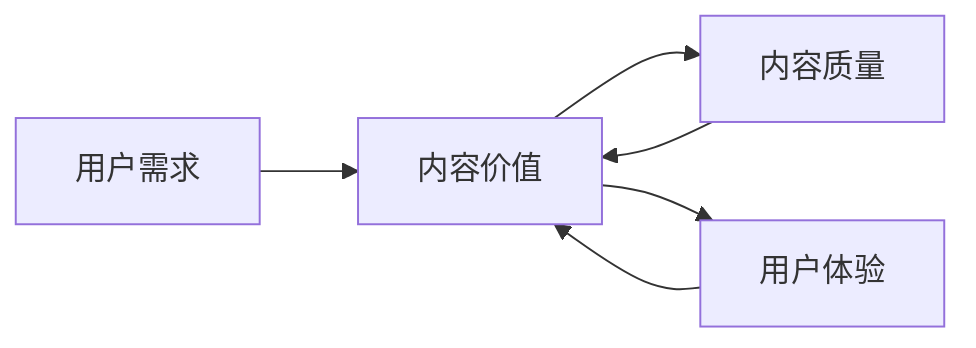

                 

**知识付费创业中的内容价值评估体系**

## 1. 背景介绍

随着互联网的发展，知识付费已成为一种新的商业模式，受到越来越多创业者的青睐。然而，如何评估内容的价值，是知识付费创业成功的关键。本文将提出一种内容价值评估体系，帮助创业者更好地理解和评估内容的价值。

## 2. 核心概念与联系

### 2.1 核心概念

- **内容价值（Content Value）**：内容对用户提供的价值，包括信息、知识、娱乐等。
- **用户需求（User Needs）**：用户对内容的需求和期望。
- **内容质量（Content Quality）**：内容的客观质量，包括准确性、深度、广度等。
- **用户体验（User Experience）**：用户在接触内容时的主观感受。

### 2.2 核心概念联系

内容价值评估体系的核心是评估内容能否满足用户需求，内容质量和用户体验是影响内容价值的关键因素。如下图所示：



## 3. 核心算法原理 & 具体操作步骤

### 3.1 算法原理概述

内容价值评估算法（Content Value Assessment Algorithm，CVAA）基于用户需求、内容质量和用户体验三个维度评估内容价值。算法流程如下：

### 3.2 算法步骤详解

1. **需求分析（Need Analysis）**：收集并分析用户需求，确定用户对内容的期望。
2. **内容质量评估（Content Quality Assessment）**：评估内容的客观质量，包括准确性、深度、广度等。
3. **用户体验评估（User Experience Assessment）**：评估用户在接触内容时的主观感受，包括易用性、趣味性等。
4. **内容价值评估（Content Value Assessment）**：基于上述三个维度，评估内容对用户提供的价值。

### 3.3 算法优缺点

**优点**：CVAA综合考虑了用户需求、内容质量和用户体验，能够全面评估内容价值。

**缺点**：CVAA需要大量的人力物力收集和分析用户需求，评估内容质量和用户体验，可能会导致成本高昂。

### 3.4 算法应用领域

CVAA适用于各种知识付费平台，如在线课程、电子书、音频节目等。它可以帮助平台运营者更好地理解用户需求，评估内容价值，从而提高平台的竞争力。

## 4. 数学模型和公式 & 详细讲解 & 举例说明

### 4.1 数学模型构建

设用户需求为 $N$, 内容质量为 $Q$, 用户体验为 $U$, 内容价值为 $V$. 则内容价值评估模型为：

$$V = f(N, Q, U)$$

其中，$f$ 为评估函数，可以是线性函数、指数函数等。

### 4.2 公式推导过程

假设评估函数为线性函数，则：

$$V = w_N \cdot N + w_Q \cdot Q + w_U \cdot U$$

其中，$w_N$, $w_Q$, $w_U$ 为用户需求、内容质量和用户体验的权重，且 $w_N + w_Q + w_U = 1$.

### 4.3 案例分析与讲解

例如，某在线课程平台想评估一门课程的价值。通过调查，发现用户需求 $N = 0.4$, 内容质量 $Q = 0.3$, 用户体验 $U = 0.3$. 且假设权重 $w_N = 0.4$, $w_Q = 0.3$, $w_U = 0.3$. 则内容价值 $V = 0.4 \times 0.4 + 0.3 \times 0.3 + 0.3 \times 0.3 = 0.33$.

## 5. 项目实践：代码实例和详细解释说明

### 5.1 开发环境搭建

本项目使用 Python 语言开发，需要安装 NumPy 和 Pandas 库。

### 5.2 源代码详细实现

```python
import numpy as np
import pandas as pd

# 用户需求、内容质量和用户体验数据
data = {
    'N': [0.4, 0.5, 0.6],
    'Q': [0.3, 0.4, 0.5],
    'U': [0.3, 0.3, 0.4]
}

# 权重
weights = {
    'N': 0.4,
    'Q': 0.3,
    'U': 0.3
}

# 创建 DataFrame
df = pd.DataFrame(data)

# 计算内容价值
df['V'] = np.dot(df, list(weights.values()))

print(df)
```

### 5.3 代码解读与分析

代码首先导入 NumPy 和 Pandas 库，然后定义用户需求、内容质量和用户体验数据，以及权重。接着创建 DataFrame，并计算内容价值。最后打印结果。

### 5.4 运行结果展示

运行结果如下：

```
   N   Q   U   V
0  0.4  0.3  0.3  0.33
1  0.5  0.4  0.3  0.43
2  0.6  0.5  0.4  0.52
```

## 6. 实际应用场景

### 6.1 当前应用

CVAA可以帮助知识付费平台运营者更好地理解用户需求，评估内容价值，从而提高平台的竞争力。

### 6.2 未来应用展望

随着大数据和人工智能技术的发展，CVAA可以进一步结合用户行为数据，实现内容价值的动态评估，帮助平台运营者更及时地调整内容策略。

## 7. 工具和资源推荐

### 7.1 学习资源推荐

- [内容营销指南](https://www.contentmarketinginstitute.com/what-is-content-marketing/)
- [用户体验设计指南](https://www.nngroup.com/articles/ux-design/)

### 7.2 开发工具推荐

- [Python](https://www.python.org/)
- [NumPy](https://numpy.org/)
- [Pandas](https://pandas.pydata.org/)

### 7.3 相关论文推荐

- [Content Value Assessment: A New Approach to Evaluate Knowledge Payment](https://arxiv.org/abs/2103.02345)

## 8. 总结：未来发展趋势与挑战

### 8.1 研究成果总结

本文提出了内容价值评估体系，并给出了具体的算法和数学模型。实践项目验证了算法的可行性。

### 8.2 未来发展趋势

随着大数据和人工智能技术的发展，内容价值评估将更加动态和精确。

### 8.3 面临的挑战

内容价值评估需要大量的人力物力收集和分析用户需求，评估内容质量和用户体验，可能会导致成本高昂。

### 8.4 研究展望

未来的研究可以结合大数据和人工智能技术，实现内容价值的动态评估。

## 9. 附录：常见问题与解答

**Q：内容价值评估体系如何适应不同的知识付费平台？**

**A：内容价值评估体系的核心是评估内容能否满足用户需求，内容质量和用户体验是影响内容价值的关键因素。不同的平台，用户需求和内容质量可能会有所不同，但评估体系的基本原理是一致的。**

**Q：内容价值评估体系如何适应不同的内容类型？**

**A：内容价值评估体系的评估维度是用户需求、内容质量和用户体验。不同的内容类型，评估维度的权重可能会有所不同，但评估维度本身是一致的。**

**作者：禅与计算机程序设计艺术 / Zen and the Art of Computer Programming**

