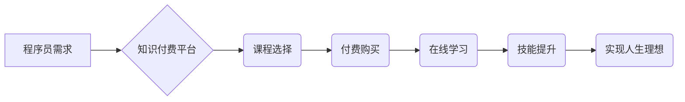

                 

## 关键词：知识付费、程序员、人生理想、学习方法、技术发展、职业规划、技能提升、在线教育、社区建设

## 1. 背景介绍

在当今科技飞速发展的时代，程序员作为数字时代的核心力量，肩负着构建未来世界的重任。然而，技术迭代日新月异，学习曲线陡峭，如何持续学习，提升技能，实现人生理想，成为程序员们共同面临的挑战。

知识付费作为一种新型的教育模式，近年来在程序员群体中迅速兴起。它以高质量的知识产权为核心，通过线上平台、线下课程等形式，为程序员提供专业的技术指导、技能培训和职业规划服务。

## 2. 核心概念与联系

**2.1 知识付费的本质**

知识付费是指通过付费的方式获取知识、技能和服务的商业模式。它打破了传统教育的壁垒，让知识更加易于获取，也让知识创造者能够获得应有的回报。

**2.2 程序员与知识付费的关联**

程序员需要不断学习新技术、掌握新技能，才能保持竞争力，实现职业发展。知识付费为程序员提供了便捷、高效的学习途径，帮助他们快速提升技能，实现职业目标。

**2.3 知识付费的优势**

* **高效便捷:** 在线学习平台打破了时间和空间限制，程序员可以根据自己的节奏和时间安排学习。
* **内容丰富:** 知识付费平台汇聚了众多领域的专家和学者，提供丰富的技术课程和学习资源。
* **个性化定制:** 知识付费平台可以根据用户的学习需求和水平，提供个性化的学习方案和指导。
* **互动交流:** 知识付费平台通常提供在线论坛、答疑社区等互动交流平台，帮助程序员解决学习难题，与同行交流学习经验。

**2.4 知识付费的流程图**



## 3. 核心算法原理 & 具体操作步骤

**3.1 算法原理概述**

知识付费平台的运营离不开一系列高效的算法，这些算法负责内容推荐、用户匹配、学习进度追踪等关键环节。

例如，**协同过滤算法**可以根据用户的学习历史和行为数据，推荐与用户兴趣相符的课程和学习资源。**深度学习算法**可以分析用户的学习数据，预测用户的学习进度和学习效果，并提供个性化的学习建议。

**3.2 算法步骤详解**

* **数据采集:** 收集用户的学习行为数据，包括课程浏览记录、学习时长、学习进度、评价反馈等。
* **数据预处理:** 对收集到的数据进行清洗、转换、特征提取等预处理操作，以便算法模型的训练和使用。
* **模型训练:** 选择合适的算法模型，并利用预处理后的数据进行模型训练，例如使用协同过滤算法训练用户-课程推荐模型。
* **模型评估:** 对训练好的模型进行评估，测试模型的准确性和有效性，并根据评估结果进行模型优化。
* **模型部署:** 将经过优化的模型部署到线上平台，用于实际的知识付费服务。

**3.3 算法优缺点**

* **优点:** 能够根据用户的个性化需求提供精准的知识服务，提高学习效率和用户体验。
* **缺点:** 需要大量的用户数据进行训练，算法模型的准确性和有效性依赖于数据质量和算法设计。

**3.4 算法应用领域**

* **内容推荐:** 推荐用户感兴趣的课程和学习资源。
* **用户匹配:** 将用户与合适的课程和导师进行匹配。
* **学习进度追踪:** 分析用户的学习进度和学习效果，提供个性化的学习建议。
* **知识图谱构建:** 建立知识图谱，帮助用户更深入地理解和掌握知识。

## 4. 数学模型和公式 & 详细讲解 & 举例说明

**4.1 数学模型构建**

知识付费平台的运营可以抽象为一个复杂的数学模型，其中涉及用户行为、课程内容、平台运营策略等多方面因素。

例如，用户学习兴趣可以表示为一个向量，课程内容可以表示为另一个向量，两者之间的内积可以表示用户对课程的兴趣程度。

**4.2 公式推导过程**

假设用户 $u$ 的兴趣向量为 $u = (u_1, u_2, ..., u_n)$，课程 $c$ 的内容向量为 $c = (c_1, c_2, ..., c_n)$，则用户对课程的兴趣程度可以表示为：

$$
score(u, c) = u \cdot c = \sum_{i=1}^{n} u_i \cdot c_i
$$

其中，$u_i$ 和 $c_i$ 分别表示用户 $u$ 对第 $i$ 个知识点的兴趣程度和课程 $c$ 对第 $i$ 个知识点的覆盖程度。

**4.3 案例分析与讲解**

假设用户 $u$ 对编程语言 Python 非常感兴趣，而课程 $c$ 主要讲解 Python 的基础语法和应用。

如果 $u$ 的兴趣向量中 Python 相关的元素较大，而 $c$ 的内容向量中 Python 相关的元素也较大，则 $score(u, c)$ 的值会比较高，表示用户 $u$ 对课程 $c$ 的兴趣程度较高。

## 5. 项目实践：代码实例和详细解释说明

**5.1 开发环境搭建**

* Python 3.x 环境
* Flask 或 Django Web 框架
* 数据库 (例如 MySQL 或 PostgreSQL)
* 前端框架 (例如 React 或 Vue.js)

**5.2 源代码详细实现**

以下是一个简单的 Python 代码示例，演示了如何使用 Flask 框架构建一个基本的知识付费平台：

```python
from flask import Flask, render_template, request

app = Flask(__name__)

# 模拟课程数据
courses = [
    {'id': 1, 'title': 'Python 基础教程', 'price': 99},
    {'id': 2, 'title': '数据结构与算法', 'price': 199},
]

@app.route('/')
def index():
    return render_template('index.html', courses=courses)

@app.route('/course/<int:course_id>')
def course_detail(course_id):
    course = next((c for c in courses if c['id'] == course_id), None)
    return render_template('course_detail.html', course=course)

if __name__ == '__main__':
    app.run(debug=True)
```

**5.3 代码解读与分析**

* 代码使用 Flask 框架构建了一个简单的 Web 应用。
* `index()` 函数渲染首页，显示所有课程信息。
* `course_detail()` 函数渲染课程详情页面，根据课程 ID 显示相应的课程信息。
* 代码中模拟了课程数据，实际应用中需要从数据库中获取课程信息。

**5.4 运行结果展示**

运行代码后，访问 `http://127.0.0.1:5000/`，即可看到知识付费平台的首页。

## 6. 实际应用场景

**6.1 在线课程平台**

知识付费平台可以提供各种在线课程，涵盖编程、设计、写作、管理等多个领域。

例如，Coursera、Udemy、edX 等平台都提供大量的在线课程，并通过知识付费模式为课程创作者提供收入来源。

**6.2 技能培训机构**

一些技能培训机构也开始采用知识付费模式，提供针对特定技能的培训课程和服务。

例如，一些编程培训机构会提供线上课程、线下辅导、项目实战等服务，并通过知识付费的方式收费。

**6.3 个人知识分享**

一些技术专家和学者也会通过知识付费平台分享自己的专业知识和经验。

例如，一些程序员会录制视频教程、编写电子书、提供一对一指导等服务，并通过知识付费的方式获得收入。

**6.4 未来应用展望**

随着人工智能、虚拟现实等技术的不断发展，知识付费平台将更加智能化、个性化、沉浸式。

例如，未来知识付费平台可能能够根据用户的学习风格和需求，提供定制化的学习方案和学习体验。

## 7. 工具和资源推荐

**7.1 学习资源推荐**

* **在线学习平台:** Coursera、Udemy、edX、Udacity、Khan Academy
* **编程社区:** Stack Overflow、GitHub、Hacker News
* **技术博客:** Medium、Dev.to、CSDN

**7.2 开发工具推荐**

* **Python 框架:** Flask、Django、Pyramid
* **数据库:** MySQL、PostgreSQL、MongoDB
* **前端框架:** React、Vue.js、Angular

**7.3 相关论文推荐**

* **协同过滤算法:** "Collaborative Filtering: A User-Based Approach" by Goldberg et al. (1992)
* **深度学习算法:** "Deep Learning" by Ian Goodfellow et al. (2016)

## 8. 总结：未来发展趋势与挑战

**8.1 研究成果总结**

知识付费为程序员提供了高效便捷的学习途径，帮助他们提升技能、实现职业目标。

**8.2 未来发展趋势**

未来知识付费平台将更加智能化、个性化、沉浸式，并与人工智能、虚拟现实等新技术深度融合。

**8.3 面临的挑战**

* **内容质量控制:** 确保知识付费平台上的课程内容质量高、实用性强。
* **用户体验优化:** 提供更加便捷、高效、个性化的学习体验。
* **商业模式创新:** 探索更加可持续的商业模式，平衡平台运营和用户利益。

**8.4 研究展望**

未来研究将重点关注知识付费平台的智能化、个性化、沉浸式发展，以及如何更好地服务于程序员的学习需求。

## 9. 附录：常见问题与解答

**9.1 如何选择合适的知识付费平台？**

选择知识付费平台时，可以考虑以下因素：

* 平台的口碑和信誉
* 平台提供的课程内容和质量
* 平台的学习体验和服务
* 平台的收费标准和支付方式

**9.2 如何有效利用知识付费资源？**

* 制定学习计划，明确学习目标和学习内容。
* 认真阅读课程资料，积极参与课程互动。
* 结合实际项目进行练习，巩固学习成果。
* 与其他学习者交流学习经验，互相帮助。

**9.3 知识付费是否值得投资？**

对于程序员来说，知识付费是值得投资的。

持续学习和提升技能是程序员职业发展的关键，知识付费可以帮助程序员更高效地学习，更快地实现职业目标。


作者：禅与计算机程序设计艺术 / Zen and the Art of Computer Programming 
<end_of_turn>

