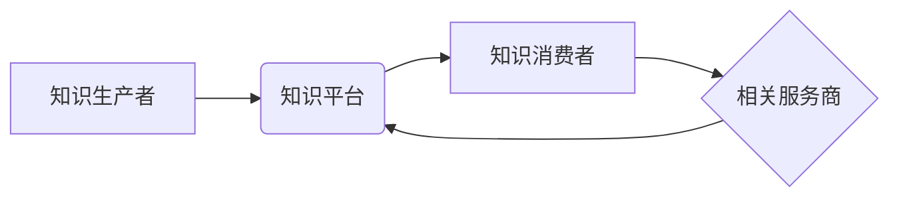

                 

## 知识付费赚钱的品牌故事与内容营销策略

> 关键词：知识付费、品牌故事、内容营销、在线教育、社区运营、IP打造、付费订阅

### 1. 背景介绍

知识经济时代，信息爆炸，知识成为最宝贵的资源。知识付费作为一种新型的商业模式，应运而生。它打破了传统教育模式的限制，让知识的生产和传播更加便捷高效。 

近年来，知识付费市场蓬勃发展，涌现出众多头部品牌，如罗辑思维、李开复、三剑客等。他们通过打造独特的品牌故事、优质的内容营销策略，成功吸引了大量用户，实现了商业化成功。

### 2. 核心概念与联系

**2.1 知识付费的核心概念**

知识付费是指通过付费的方式获取知识、技能和服务的商业模式。它涵盖了多种形式，例如在线课程、付费文章、直播讲座、会员服务等。

**2.2 内容营销与知识付费的联系**

内容营销是通过创造和分享有价值的内容，吸引目标受众，建立品牌信任，最终实现商业目标的营销策略。知识付费与内容营销有着密切的联系，优质的内容是知识付费的核心驱动力。

**2.3 品牌故事与知识付费的关联**

品牌故事是指一个品牌通过叙述其历史、价值观、使命和愿景，与用户建立情感连接，增强品牌认同感和忠诚度的营销策略。品牌故事能够赋予知识付费更深层的意义，提升用户付费意愿。

**2.4 知识付费生态系统**

知识付费生态系统是一个由知识生产者、知识平台、知识消费者和相关服务商组成的复杂网络。



### 3. 核心算法原理 & 具体操作步骤

**3.1 算法原理概述**

知识付费的成功离不开数据分析和算法的驱动。通过分析用户行为数据，我们可以了解用户的学习习惯、兴趣偏好和付费意愿，从而制定更精准的营销策略。

**3.2 算法步骤详解**

1. **数据收集:** 收集用户行为数据，例如学习时长、课程评价、付费记录等。
2. **数据清洗:** 对收集到的数据进行清洗和处理，去除无效数据和噪声。
3. **特征提取:** 从用户行为数据中提取特征，例如学习主题、学习进度、学习风格等。
4. **模型训练:** 利用机器学习算法，训练预测用户付费意愿的模型。
5. **模型评估:** 对模型进行评估，调整模型参数，提高预测精度。
6. **策略制定:** 根据模型预测结果，制定个性化的营销策略，例如推荐课程、推送优惠活动等。

**3.3 算法优缺点**

* **优点:** 能够精准预测用户付费意愿，提高营销效率。
* **缺点:** 需要大量的数据支持，模型训练复杂，需要专业的技术人员进行维护。

**3.4 算法应用领域**

* **课程推荐:** 根据用户的学习兴趣和学习进度，推荐合适的课程。
* **个性化营销:** 根据用户的付费意愿，推送个性化的优惠活动。
* **用户画像:** 建立用户的学习画像，了解用户的学习习惯和需求。

### 4. 数学模型和公式 & 详细讲解 & 举例说明

**4.1 数学模型构建**

我们可以使用逻辑回归模型来预测用户付费意愿。逻辑回归模型将用户特征作为输入，输出用户付费的概率。

**4.2 公式推导过程**

逻辑回归模型的输出概率为：

$$P(y=1|x) = \frac{1}{1 + e^{-(w^T x + b)}}$$

其中：

* $P(y=1|x)$ 是用户付费的概率。
* $x$ 是用户的特征向量。
* $w$ 是模型参数向量。
* $b$ 是模型偏置项。
* $e$ 是自然常数。

**4.3 案例分析与讲解**

假设我们有一个用户特征向量 $x = [age, income, education]$, 其中 age 表示用户的年龄，income 表示用户的收入，education 表示用户的学历。我们可以使用逻辑回归模型训练出一个模型，预测该用户的付费概率。

### 5. 项目实践：代码实例和详细解释说明

**5.1 开发环境搭建**

* Python 3.x
* Jupyter Notebook
* scikit-learn

**5.2 源代码详细实现**

```python
from sklearn.linear_model import LogisticRegression
from sklearn.model_selection import train_test_split
from sklearn.metrics import accuracy_score

# 加载数据
data = ...

# 分割数据
X_train, X_test, y_train, y_test = train_test_split(data[:, :-1], data[:, -1], test_size=0.2)

# 训练模型
model = LogisticRegression()
model.fit(X_train, y_train)

# 预测结果
y_pred = model.predict(X_test)

# 计算准确率
accuracy = accuracy_score(y_test, y_pred)
print(f"Accuracy: {accuracy}")
```

**5.3 代码解读与分析**

* 使用 `train_test_split` 函数将数据分为训练集和测试集。
* 使用 `LogisticRegression` 类创建逻辑回归模型。
* 使用 `fit` 方法训练模型。
* 使用 `predict` 方法预测测试集的标签。
* 使用 `accuracy_score` 函数计算模型的准确率。

**5.4 运行结果展示**

运行代码后，会输出模型的准确率。

### 6. 实际应用场景

**6.1 在线教育平台**

知识付费平台可以利用算法推荐课程，个性化营销，提高用户转化率。

**6.2 内容创作者**

内容创作者可以利用数据分析，了解用户的阅读习惯和付费意愿，制定更有效的创作策略。

**6.3 企业培训**

企业可以利用知识付费平台，提供内部培训课程，提升员工技能水平。

**6.4 未来应用展望**

随着人工智能技术的不断发展，知识付费的应用场景将更加广泛，例如：

* **虚拟现实/增强现实学习:** 利用 VR/AR 技术，打造沉浸式的学习体验。
* **个性化学习路径:** 根据用户的学习进度和能力，定制个性化的学习路径。
* **智能化学习助手:** 利用 AI 技术，提供智能化的学习助手，帮助用户更高效地学习。

### 7. 工具和资源推荐

**7.1 学习资源推荐**

* **书籍:** 《深度学习》、《机器学习实战》
* **在线课程:** Coursera、edX、Udemy
* **博客:** Towards Data Science、Machine Learning Mastery

**7.2 开发工具推荐**

* **Python:** 强大的数据分析和机器学习库
* **Jupyter Notebook:** 交互式编程环境
* **scikit-learn:** 机器学习库

**7.3 相关论文推荐**

* **《Logistic Regression: A Gentle Introduction》**
* **《Deep Learning》**

### 8. 总结：未来发展趋势与挑战

**8.1 研究成果总结**

知识付费市场发展迅速，算法技术在其中发挥着重要作用。通过数据分析和算法驱动，我们可以精准预测用户付费意愿，提高营销效率。

**8.2 未来发展趋势**

* **个性化学习:** 根据用户的学习习惯和需求，定制个性化的学习路径。
* **沉浸式学习:** 利用 VR/AR 技术，打造沉浸式的学习体验。
* **智能化学习助手:** 利用 AI 技术，提供智能化的学习助手，帮助用户更高效地学习。

**8.3 面临的挑战**

* **数据质量:** 知识付费平台需要收集大量的数据，数据质量直接影响算法的准确性。
* **算法复杂度:** 知识付费的算法模型越来越复杂，需要专业的技术人员进行维护。
* **用户隐私:** 知识付费平台需要保护用户的隐私信息。

**8.4 研究展望**

未来，我们将继续研究知识付费领域的算法技术，探索更精准、更有效的营销策略，为用户提供更优质的学习体验。

### 9. 附录：常见问题与解答

**9.1 如何提高知识付费的转化率？**

* **打造优质的内容:** 内容是知识付费的核心驱动力，需要保证内容的质量和价值。
* **精准的定位:** 确定目标用户群体，针对他们的需求提供合适的知识付费产品。
* **有效的营销推广:** 利用多种营销渠道，推广知识付费产品，吸引目标用户。
* **良好的用户体验:** 提供便捷的支付方式、完善的售后服务，提升用户体验。

**9.2 如何保护知识付费平台的用户隐私？**

* **明示收集用户数据的目的和范围:** 在用户注册时，明确告知用户哪些数据会被收集，以及如何使用这些数据。
* **加密存储用户数据:** 使用加密技术，保护用户数据的安全。
* **限制数据访问权限:** 只有授权人员才能访问用户数据。
* **定期对数据进行安全评估:** 定期对数据安全进行评估，及时发现和修复漏洞。


作者：禅与计算机程序设计艺术 / Zen and the Art of Computer Programming 
<end_of_turn>

