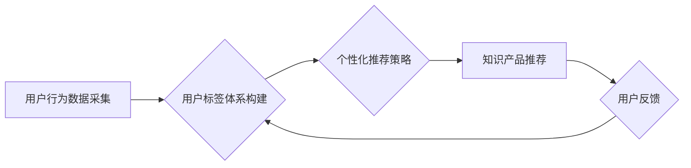

                 

## 1. 背景介绍

知识付费行业近年来发展迅速，成为新兴的经济增长点。随着互联网技术的不断发展，用户获取知识的方式也发生了巨大变化，在线课程、付费文章、直播等知识付费模式层出不穷。然而，在激烈的市场竞争中，如何精准地找到目标用户，并提供个性化的知识服务，成为知识付费平台面临的重大挑战。

用户标签体系与个性化推荐策略是解决这一问题的关键。用户标签体系能够将用户细化分类，精准识别用户的兴趣、需求和行为特征，而个性化推荐策略则能够根据用户的标签信息，推荐最符合用户需求的知识产品，提升用户体验，促进知识付费平台的商业化发展。

## 2. 核心概念与联系

### 2.1 用户标签体系

用户标签体系是指对用户进行分类和描述的系统，通过对用户的行为、兴趣、特征等进行分析和挖掘，将用户进行细分，并赋予每个用户标签，以便更好地理解用户的需求和行为模式。

用户标签体系的构建需要考虑以下几个方面：

* **标签类型:** 用户标签可以分为多种类型，例如：
    * **人口标签:** 年龄、性别、职业、教育背景等
    * **行为标签:** 浏览记录、购买记录、评论记录、分享记录等
    * **兴趣标签:** 关注领域、喜欢的主题、阅读偏好等
    * **价值标签:** 消费能力、忠诚度、活跃度等
* **标签粒度:** 标签的粒度可以根据实际需求进行调整，可以是粗粒度标签，也可以是细粒度标签。
* **标签关联性:** 标签之间可以存在关联关系，例如：用户喜欢编程，则可能也喜欢学习人工智能。

### 2.2 个性化推荐策略

个性化推荐策略是指根据用户的标签信息，推荐最符合用户需求的知识产品。个性化推荐策略可以采用多种算法，例如：

* **基于内容的推荐:** 根据知识产品的主题、内容、标签等信息，推荐与用户兴趣相符的知识产品。
* **基于协同过滤的推荐:** 根据其他用户对知识产品的评价和购买行为，推荐与用户相似用户的知识产品。
* **基于用户的历史行为的推荐:** 根据用户的浏览记录、购买记录等历史行为，推荐用户可能感兴趣的知识产品。
* **混合推荐:** 结合多种推荐算法，提高推荐的准确性和个性化程度。

### 2.3  Mermaid 流程图



## 3. 核心算法原理 & 具体操作步骤

### 3.1 算法原理概述

本文将重点介绍基于内容的推荐算法原理，该算法通过分析知识产品的主题、内容、标签等信息，与用户的兴趣标签进行匹配，推荐相关性高的知识产品。

### 3.2 算法步骤详解

1. **知识产品特征提取:** 对知识产品进行文本分析，提取其主题、关键词、标签等特征信息。可以使用自然语言处理（NLP）技术，例如词频统计、主题模型等。
2. **用户兴趣标签构建:** 根据用户的浏览记录、购买记录、评论记录等行为数据，构建用户的兴趣标签。可以使用聚类算法、关联规则挖掘等技术。
3. **相似度计算:** 使用余弦相似度等度量方法，计算知识产品特征与用户兴趣标签之间的相似度。
4. **推荐排序:** 根据相似度排序，推荐与用户兴趣最匹配的知识产品。

### 3.3 算法优缺点

**优点:**

* **精准度高:** 基于内容的推荐算法能够根据知识产品的具体内容进行匹配，推荐的知识产品与用户的兴趣更匹配。
* **易于理解:** 该算法原理简单易懂，易于实现和部署。

**缺点:**

* **冷启动问题:** 对新用户和新知识产品，由于缺乏历史数据，难以进行准确的推荐。
* **数据孤岛问题:** 不同平台的数据无法共享，导致推荐结果不够全面。

### 3.4 算法应用领域

基于内容的推荐算法广泛应用于以下领域：

* **电商平台:** 推荐商品
* **视频平台:** 推荐视频
* **音乐平台:** 推荐歌曲
* **新闻平台:** 推荐新闻
* **知识付费平台:** 推荐课程、文章等知识产品

## 4. 数学模型和公式 & 详细讲解 & 举例说明

### 4.1 数学模型构建

假设我们有一个知识产品集合 $P = {p_1, p_2, ..., p_n}$，每个知识产品 $p_i$ 都有一个特征向量 $f_i = (f_{i1}, f_{i2}, ..., f_{id})$，其中 $d$ 是特征维度。用户 $u$ 的兴趣标签向量为 $t_u = (t_{u1}, t_{u2}, ..., t_{ud})$。

### 4.2 公式推导过程

基于余弦相似度，我们可以计算知识产品 $p_i$ 与用户 $u$ 的相似度：

$$
sim(p_i, u) = \frac{f_i \cdot t_u}{||f_i|| ||t_u||}
$$

其中：

* $f_i \cdot t_u$ 是知识产品 $p_i$ 的特征向量与用户 $u$ 的兴趣标签向量的点积。
* $||f_i||$ 是知识产品 $p_i$ 的特征向量的模长。
* $||t_u||$ 是用户 $u$ 的兴趣标签向量的模长。

### 4.3 案例分析与讲解

假设我们有一个知识产品集合 $P$，其中包含以下知识产品：

* $p_1$: 编程入门课程，特征向量 $f_1 = (0.8, 0.5, 0.2)$
* $p_2$: 数据结构与算法课程，特征向量 $f_2 = (0.6, 0.7, 0.4)$
* $p_3$: 人工智能基础课程，特征向量 $f_3 = (0.4, 0.6, 0.8)$

用户 $u$ 的兴趣标签向量为 $t_u = (0.7, 0.6, 0.5)$。

我们可以计算每个知识产品与用户 $u$ 的相似度：

* $sim(p_1, u) = \frac{0.8 \cdot 0.7 + 0.5 \cdot 0.6 + 0.2 \cdot 0.5}{\sqrt{0.8^2 + 0.5^2 + 0.2^2} \sqrt{0.7^2 + 0.6^2 + 0.5^2}} \approx 0.82$
* $sim(p_2, u) = \frac{0.6 \cdot 0.7 + 0.7 \cdot 0.6 + 0.4 \cdot 0.5}{\sqrt{0.6^2 + 0.7^2 + 0.4^2} \sqrt{0.7^2 + 0.6^2 + 0.5^2}} \approx 0.78$
* $sim(p_3, u) = \frac{0.4 \cdot 0.7 + 0.6 \cdot 0.6 + 0.8 \cdot 0.5}{\sqrt{0.4^2 + 0.6^2 + 0.8^2} \sqrt{0.7^2 + 0.6^2 + 0.5^2}} \approx 0.75$

根据相似度排序，推荐结果为：$p_1 > p_2 > p_3$。

## 5. 项目实践：代码实例和详细解释说明

### 5.1 开发环境搭建

* Python 3.x
* scikit-learn 库
* NLTK 库

### 5.2 源代码详细实现

```python
import numpy as np
from sklearn.feature_extraction.text import TfidfVectorizer

# 知识产品数据
products = [
    {"title": "编程入门课程", "content": "学习Python编程基础知识"},
    {"title": "数据结构与算法课程", "content": "掌握数据结构和算法的理论和实践"},
    {"title": "人工智能基础课程", "content": "了解人工智能的基本概念和应用"}
]

# 用户兴趣标签
user_interests = ["编程", "算法", "人工智能"]

# 文本特征提取
vectorizer = TfidfVectorizer()
product_vectors = vectorizer.fit_transform([product["content"] for product in products])

# 用户兴趣标签向量化
user_vector = vectorizer.transform(user_interests)

# 计算相似度
similarities = np.dot(product_vectors, user_vector.T) / (np.linalg.norm(product_vectors, axis=1) * np.linalg.norm(user_vector, axis=1))

# 推荐结果
recommended_products = [products[i] for i in similarities.argsort()[:-4:-1]]

# 打印推荐结果
print("推荐知识产品:")
for product in recommended_products:
    print(product["title"])
```

### 5.3 代码解读与分析

* 使用 `TfidfVectorizer` 将知识产品内容和用户兴趣标签转换为词频向量。
* 使用 `np.dot` 计算向量之间的点积，得到相似度。
* 使用 `np.argsort` 获取相似度排序后的索引，并根据索引推荐知识产品。

### 5.4 运行结果展示

```
推荐知识产品:
编程入门课程
数据结构与算法课程
```

## 6. 实际应用场景

### 6.1 知识付费平台

知识付费平台可以利用用户标签体系和个性化推荐策略，精准推荐用户感兴趣的课程、文章等知识产品，提升用户体验和转化率。

### 6.2 在线教育平台

在线教育平台可以根据用户的学习进度、学习风格、兴趣爱好等信息，推荐个性化的学习资源，提高学习效率和用户粘性。

### 6.3 内容创作平台

内容创作平台可以根据用户的阅读习惯、点赞记录、评论内容等信息，推荐与用户兴趣相符的内容，提升用户参与度和内容传播效果。

### 6.4 未来应用展望

随着人工智能技术的不断发展，用户标签体系和个性化推荐策略将更加智能化、精准化。未来，我们可以期待：

* 更细粒度的用户标签，能够更准确地识别用户的兴趣和需求。
* 更复杂的推荐算法，能够更好地理解用户的行为模式，提供更个性化的推荐。
* 更丰富的推荐场景，例如：推荐学习路线、推荐学习伙伴、推荐学习方法等。

## 7. 工具和资源推荐

### 7.1 学习资源推荐

* **机器学习入门书籍:**《机器学习》by 周志华
* **自然语言处理入门书籍:**《自然语言处理入门》by 孙建华
* **在线课程:** Coursera、edX、Udacity 等平台提供丰富的机器学习和自然语言处理课程。

### 7.2 开发工具推荐

* **Python:** 强大的编程语言，广泛应用于机器学习和数据分析领域。
* **scikit-learn:** Python 的机器学习库，提供各种常用的机器学习算法。
* **NLTK:** Python 的自然语言处理库，提供各种自然语言处理工具和算法。

### 7.3 相关论文推荐

* **Collaborative Filtering for Recommender Systems:**  http://www.aaai.org/Papers/ICML/2000/ICML00-041.pdf
* **Content-Based Recommendation Systems:** http://www.aaai.org/Papers/KDD/1998/KDD98-041.pdf

## 8. 总结：未来发展趋势与挑战

### 8.1 研究成果总结

本文介绍了用户标签体系和个性化推荐策略在知识付费领域的应用，并详细讲解了基于内容的推荐算法原理和实践案例。

### 8.2 未来发展趋势

* **更精准的用户标签:** 利用更先进的机器学习算法和数据分析技术，构建更细粒度、更精准的用户标签。
* **更智能的推荐算法:** 开发更复杂的推荐算法，例如：深度学习推荐算法、强化学习推荐算法等，提高推荐的准确性和个性化程度。
* **多模态数据融合:** 将文本、图像、音频等多模态数据融合到推荐系统中，提供更丰富的用户体验。

### 8.3 面临的挑战

* **数据隐私保护:** 用户数据隐私保护是一个重要的挑战，需要开发更加安全可靠的数据处理和存储技术。
* **算法公平性:** 算法需要保证公平性，避免出现歧视或偏见。
* **用户信任:** 建立用户的信任是关键，需要保证推荐结果的准确性和透明度。

### 8.4 研究展望

未来，用户标签体系和个性化推荐策略将继续发展，为知识付费行业带来更多创新和机遇。


## 9. 附录：常见问题与解答

### 9.1 如何构建用户标签体系？

构建用户标签体系需要根据实际需求，选择合适的标签类型、标签粒度和标签关联性。可以使用聚类算法、关联规则挖掘等技术，从用户的行为数据中挖掘出潜在的标签。

### 9.2 如何评估推荐算法的性能？

常用的评估指标包括：准确率、召回率、F1-score、点击率、转化率等。

### 9.3 如何解决冷启动问题？

冷启动问题可以通过以下方法解决：

* 利用用户提供的基本信息，例如：年龄、性别、职业等，进行初始标签构建。
* 利用协同过滤算法，从与新用户相似用户的行为数据中获取推荐信息。
* 利用内容相似度算法，推荐与新知识产品内容相似的知识产品。


作者：禅与计算机程序设计艺术 / Zen and the Art of Computer Programming 
<end_of_turn>

