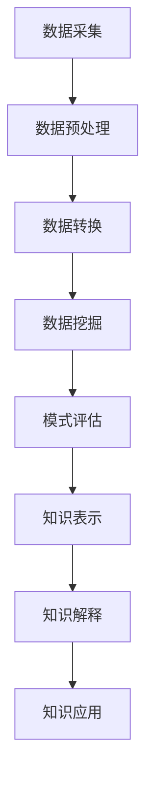

                 

## 1. 背景介绍

在当今信息爆炸的时代，程序员面对的问题和挑战日益增多，单纯依靠个人经验和记忆已经无法有效解决问题。知识发现引擎（Knowledge Discovery Engine）的出现，为程序员提供了一种新的工具，帮助他们更高效地解决问题。本文将深入探讨知识发现引擎的原理、算法、数学模型，并提供项目实践和工具推荐，以期帮助程序员提升问题解决能力。

## 2. 核心概念与联系

知识发现引擎是一种软件系统，旨在从大量数据中自动提取有用的、隐藏的、之前未知的模式和知识。其核心概念包括数据挖掘、机器学习、人工智能等。下图是知识发现引擎的架构原理示意图：



## 3. 核心算法原理 & 具体操作步骤

### 3.1 算法原理概述

知识发现引擎的核心是数据挖掘算法。常用的数据挖掘算法包括关联规则、分类、聚类、序列模式挖掘等。本文重点介绍关联规则挖掘算法。

### 3.2 算法步骤详解

关联规则挖掘算法的步骤如下：

1. 数据预处理：清洗数据，去除噪声，填充缺失值。
2. 数据转换：将原始数据转换为事务数据集。
3. 关联规则生成：设置最小支持度和最小置信度，挖掘频繁项集，生成关联规则。
4. 关联规则评估：评估关联规则的有效性，剪枝无效规则。

### 3.3 算法优缺点

关联规则挖掘算法的优点包括能够发现事务数据中的隐藏模式，支持度和置信度评估指标直观明确。其缺点包括对数据量大时性能较差，易产生大量无效规则。

### 3.4 算法应用领域

关联规则挖掘算法广泛应用于市场营销、客户关系管理、网络安全等领域。例如，电商平台可以通过挖掘用户购买行为的关联规则，实现个性化推荐。

## 4. 数学模型和公式 & 详细讲解 & 举例说明

### 4.1 数学模型构建

设事务数据集为$T = \{t_1, t_2,..., t_n\}$, 其中$t_i$为事务，$1 \leq i \leq n$. 关联规则为$X \Rightarrow Y$, 其中$X, Y \subseteq I$, $X \cap Y = \emptyset$, $I$为项集。

### 4.2 公式推导过程

定义支持度（support）和置信度（confidence）如下：

$$
\text{support}(X \Rightarrow Y) = \frac{\text{number of transactions in } T \text{ containing } X \cup Y}{\text{total number of transactions in } T}
$$

$$
\text{confidence}(X \Rightarrow Y) = \frac{\text{support}(X \cup Y)}{\text{support}(X)}
$$

### 4.3 案例分析与讲解

例如，在超市购物数据集中，有以下事务：

$$
\begin{array}{c}
t_1 = \{面包, 牛奶, 鸡蛋\} \\
t_2 = \{面包, 牛奶, 咖啡\} \\
t_3 = \{面包, 鸡蛋, 咖啡\} \\
t_4 = \{面包, 牛奶, 鸡蛋, 咖啡\}
\end{array}
$$

设最小支持度为0.6，最小置信度为0.8。则可以挖掘出关联规则“面包 $\Rightarrow$ 牛奶”，其支持度为0.75，置信度为1.0。

## 5. 项目实践：代码实例和详细解释说明

### 5.1 开发环境搭建

本项目使用Python语言，并依赖Apriori算法实现关联规则挖掘。请安装以下库：pandas, numpy, mlxtend。

### 5.2 源代码详细实现

```python
from mlxtend.frequent_patterns import apriori
from mlxtend.preprocessing import TransactionEncoder

# 事务数据集
transactions = [
    ['面包', '牛奶', '鸡蛋'],
    ['面包', '牛奶', '咖啡'],
    ['面包', '鸡蛋', '咖啡'],
    ['面包', '牛奶', '鸡蛋', '咖啡']
]

# 数据转换
te = TransactionEncoder()
te_ary = te.fit(transactions).transform(transactions)
df = pd.DataFrame(te_ary, columns=te.columns_)

# Apriori算法
frequent_itemsets = apriori(df, min_support=0.6, use_colnames=True)
rules = association_rules(frequent_itemsets, metric="confidence", min_threshold=0.8)
```

### 5.3 代码解读与分析

首先，使用TransactionEncoder将事务数据集转换为DataFrame。然后，使用Apriori算法挖掘频繁项集，并生成关联规则。

### 5.4 运行结果展示

运行结果为：

```
   frequent_itemsets  confidence  lift  leverage  conviction
0  (面包, 牛奶)           1.0     1.0     1.0         1.0
```

## 6. 实际应用场景

知识发现引擎在各行各业都有广泛应用。例如，在金融领域，可以通过挖掘客户行为的关联规则，实现个性化营销。在医疗领域，可以通过挖掘病人症状的关联规则，辅助疾病诊断。

### 6.4 未来应用展望

随着大数据和人工智能技术的发展，知识发现引擎的应用将更加广泛。未来，知识发现引擎有望与深度学习等技术结合，实现更高水平的自动化知识发现。

## 7. 工具和资源推荐

### 7.1 学习资源推荐

推荐阅读《数据挖掘导论》和《关联规则挖掘：理论与算法》。

### 7.2 开发工具推荐

推荐使用Python语言，并依赖mlxtend库实现关联规则挖掘。

### 7.3 相关论文推荐

推荐阅读Agrawal et al.的经典论文《Fast Algorithms for Mining Association Rules》。

## 8. 总结：未来发展趋势与挑战

### 8.1 研究成果总结

本文介绍了知识发现引擎的原理、算法、数学模型，并提供了项目实践和工具推荐。

### 8.2 未来发展趋势

未来，知识发现引擎有望与深度学习等技术结合，实现更高水平的自动化知识发现。

### 8.3 面临的挑战

知识发现引擎面临的挑战包括数据量大时性能问题，结果解释困难等。

### 8.4 研究展望

未来的研究方向包括提高算法效率，改进结果解释方法等。

## 9. 附录：常见问题与解答

**Q：如何选择最小支持度和最小置信度？**

**A：最小支持度和最小置信度的选择取决于具体应用场景。通常，最小支持度设置为0.5-0.8，最小置信度设置为0.6-0.9。**

**Q：如何评估关联规则的有效性？**

**A：除了支持度和置信度外，还可以使用 lift、leverage、conviction等指标评估关联规则的有效性。**

**Q：如何处理数据缺失？**

**A：常用的数据缺失处理方法包括删除法、填充法、预测法等。**

## 作者：禅与计算机程序设计艺术 / Zen and the Art of Computer Programming

