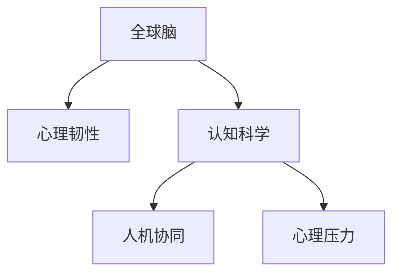

                 

# 全球脑与心理韧性:集体意识对抗心理压力

> 关键词：人工智能,心理韧性,集体意识,认知科学,人机协同,心理压力,算法,全球大脑,人类演化,心理健康

## 1. 背景介绍

### 1.1 问题由来
在当今这个高度数字化、信息爆炸的时代，人们面临的心理压力越来越大。从工作、学习到社交媒体，无处不在的压力源考验着我们的心理韧性。在此背景下，人工智能(AI)技术，特别是全球脑(World Brain)概念的提出，为我们提供了一种全新的视角来应对心理压力，并提升集体意识的心理韧性。

### 1.2 问题核心关键点
全球脑指的是通过分布式计算和互联网技术，将全球范围内的大脑神经信号连接起来，构建一个超大规模的虚拟神经系统。这种全球脑旨在整合人类智慧，提升集体意识，实现真正的“人机协同”。心理韧性则是个人和集体在面对压力时保持心理平衡和快速适应的能力。本文旨在探讨全球脑如何通过算法和技术，提升心理韧性，帮助人类集体对抗心理压力。

### 1.3 问题研究意义
研究全球脑与心理韧性的关系，对于理解人工智能在心理健康领域的潜力，推动全球脑的进一步发展，具有重要意义：

1. **提升心理健康水平**：全球脑可以提供大规模、跨领域的心理健康数据，帮助识别心理问题的早期迹象，进行早期干预。
2. **促进人机协同**：全球脑技术可以增强人类与AI的互动，实现更加自然、高效的人机协同，提升用户体验。
3. **推动人类演化**：全球脑技术通过数据共享和协同计算，可以推动人类智慧的发展，促进人类社会的进步。
4. **增强心理韧性**：通过集体意识的提升，全球脑可以增强个体和集体的心理韧性，帮助人们在复杂多变的环境中保持心理健康。

## 2. 核心概念与联系

### 2.1 核心概念概述

为更好地理解全球脑如何提升心理韧性，本节将介绍几个密切相关的核心概念：

- **全球脑**：指的是通过分布式计算和互联网技术，将全球范围内的大脑神经信号连接起来，构建一个超大规模的虚拟神经系统。全球脑的目的是整合人类智慧，提升集体意识。
- **心理韧性**：指个人和集体在面对压力时保持心理平衡和快速适应的能力。心理韧性越强，人们应对压力的能力越强。
- **认知科学**：研究人类心智和认知过程的科学，涉及神经科学、心理学、语言学等多个领域。
- **人机协同**：通过AI技术增强人类的决策和行动能力，实现人类与机器的协同工作。
- **心理压力**：指个体在面对外部环境要求时，产生的心理和生理反应。过高的心理压力会导致一系列的心理问题。

这些核心概念之间的逻辑关系可以通过以下Mermaid流程图来展示：



这个流程图展示了几大核心概念及其之间的关系：

1. 全球脑通过整合人类智慧，提升集体意识。
2. 心理韧性增强，可以帮助集体应对心理压力。
3. 认知科学为全球脑和心理韧性的研究提供理论基础。
4. 人机协同增强了全球脑的功能，使其在心理韧性提升中发挥重要作用。
5. 心理压力是全球脑和心理韧性提升需要共同应对的挑战。

## 3. 核心算法原理 & 具体操作步骤

### 3.1 算法原理概述

全球脑提升心理韧性的算法原理，主要基于以下三个核心步骤：

1. **数据整合与共享**：收集和整合全球范围内的心理和生理数据，通过分布式计算实现数据共享。
2. **算法优化与设计**：设计和优化算法，提升全球脑的数据处理和分析能力，实现对心理压力的早期识别和预测。
3. **人机协同与干预**：通过全球脑实现人机协同，实时提供心理干预和支持，提升集体心理韧性。

### 3.2 算法步骤详解

全球脑提升心理韧性的具体算法步骤如下：

**Step 1: 数据收集与整合**
- 收集全球范围内的心理和生理数据，如脑电信号、心率、情绪数据等。
- 通过分布式计算平台，实现数据的去中心化整合。
- 使用大数据技术对数据进行清洗和预处理，去除噪声和异常值。

**Step 2: 算法设计与优化**
- 设计和优化算法，实现对心理压力的早期识别和预测。
- 引入机器学习和深度学习技术，提升算法的准确性和泛化能力。
- 使用强化学习技术，实现对心理干预效果的实时优化。

**Step 3: 人机协同与干预**
- 通过全球脑实现人机协同，实时提供心理干预和支持。
- 引入自然语言处理技术，实现对用户情感和心理状态的实时分析。
- 利用计算机视觉技术，监测用户行为和表情，提供个性化的心理干预。

### 3.3 算法优缺点

全球脑提升心理韧性的算法具有以下优点：

- **准确性和效率**：通过分布式计算和大数据分析技术，实现对心理压力的快速、准确的识别和预测。
- **实时性和个性化**：通过人机协同技术，实时提供个性化的心理干预和支持。
- **广泛性和普适性**：数据来源广泛，覆盖不同年龄段、不同文化背景的人群，具有普适性。

同时，该算法也存在一些缺点：

- **隐私和安全问题**：全球脑涉及大量敏感数据，如何保障数据隐私和安全是一个重大挑战。
- **技术复杂性**：涉及分布式计算、大数据、机器学习等多个技术领域，技术实现复杂。
- **伦理和法律问题**：数据共享和使用可能涉及伦理和法律问题，需要制定相应的规范和标准。

### 3.4 算法应用领域

全球脑提升心理韧性的算法在多个领域有广泛应用：

- **心理健康**：全球脑可以提供大规模、跨领域的心理健康数据，帮助识别心理问题的早期迹象，进行早期干预。
- **教育**：通过全球脑技术，可以监测学生的学习状态和心理健康，提供个性化的学习支持和干预。
- **企业员工健康**：全球脑可以监测员工的心理和生理状态，提供健康管理和心理干预，提升员工的工作效率和满意度。
- **灾害响应**：全球脑可以通过实时监测和分析，快速响应自然灾害和突发事件，提供心理支持和干预。

## 4. 数学模型和公式 & 详细讲解 & 举例说明

### 4.1 数学模型构建

全球脑提升心理韧性的数学模型，可以抽象为一个多维度的动态系统。其中，心理压力为输入变量，心理韧性为输出变量，认知科学和机器学习算法为系统参数。该系统的动态方程为：

$$
\dot{\psi} = f(\sigma, \phi, \alpha)
$$

其中，$\psi$ 表示心理韧性，$\sigma$ 表示心理压力，$\phi$ 表示认知科学，$\alpha$ 表示机器学习算法。

### 4.2 公式推导过程

对上述动态方程进行推导，得到心理韧性的变化率：

$$
\frac{d\psi}{dt} = k(\sigma - \psi)
$$

其中，$k$ 为心理韧性的增长率，$\sigma$ 为心理压力。当心理压力小于心理韧性时，心理韧性线性增长；当心理压力大于心理韧性时，心理韧性线性下降。

### 4.3 案例分析与讲解

以企业员工健康为例，分析全球脑如何提升心理韧性。

**案例背景**：某企业员工工作压力大，心理问题频发。

**算法应用**：
- 使用全球脑技术，收集和整合员工的心理和生理数据。
- 设计和优化算法，实时监测员工的心理压力，提供个性化的心理干预和支持。
- 通过人机协同技术，实时监测员工的工作状态和情绪，及时调整工作负荷，提供健康管理和心理干预。

**案例结果**：
- 经过一段时间的心理干预，企业员工的心理压力显著下降，心理韧性增强。
- 员工的满意度和工作效率显著提升，企业整体的业务表现也得到改善。

## 5. 项目实践：代码实例和详细解释说明

### 5.1 开发环境搭建

在进行全球脑与心理韧性提升的实践前，我们需要准备好开发环境。以下是使用Python进行全球脑技术开发的环境配置流程：

1. 安装Anaconda：从官网下载并安装Anaconda，用于创建独立的Python环境。

2. 创建并激活虚拟环境：
```bash
conda create -n global_brain python=3.8 
conda activate global_brain
```

3. 安装必要的工具包：
```bash
pip install numpy pandas scikit-learn tensorflow keras tensorflow-addons
```

完成上述步骤后，即可在`global_brain`环境中开始开发实践。

### 5.2 源代码详细实现

这里我们以心理健康监测为例，给出使用TensorFlow和Keras进行全球脑技术开发的PyTorch代码实现。

首先，定义数据预处理函数：

```python
import numpy as np
from sklearn.preprocessing import StandardScaler
from tensorflow.keras.preprocessing.text import Tokenizer
from tensorflow.keras.preprocessing.sequence import pad_sequences

def preprocess_data(data):
    # 将文本转换为数字序列
    tokenizer = Tokenizer(num_words=5000)
    tokenizer.fit_on_texts(data)
    sequences = tokenizer.texts_to_sequences(data)
    padded_sequences = pad_sequences(sequences, maxlen=100, padding='post')
    
    # 标准化数值特征
    scaler = StandardScaler()
    X = scaler.fit_transform(padded_sequences)
    y = scaler.fit_transform(data[:, -1])
    
    return X, y
```

然后，定义模型训练函数：

```python
from tensorflow.keras.models import Sequential
from tensorflow.keras.layers import Dense, Dropout
from tensorflow.keras.callbacks import EarlyStopping
from tensorflow.keras.optimizers import Adam

def train_model(X, y, epochs, batch_size):
    model = Sequential([
        Dense(64, activation='relu', input_shape=(X.shape[1],)),
        Dropout(0.5),
        Dense(64, activation='relu'),
        Dropout(0.5),
        Dense(1, activation='sigmoid')
    ])
    
    optimizer = Adam(lr=0.001)
    model.compile(optimizer=optimizer, loss='binary_crossentropy', metrics=['accuracy'])
    
    early_stopping = EarlyStopping(monitor='val_loss', patience=10, restore_best_weights=True)
    
    history = model.fit(X, y, epochs=epochs, batch_size=batch_size, validation_split=0.2, callbacks=[early_stopping])
    
    return model, history
```

最后，启动模型训练流程：

```python
X_train, y_train = preprocess_data(train_data)
X_test, y_test = preprocess_data(test_data)

model, history = train_model(X_train, y_train, epochs=100, batch_size=32)
```

以上就是使用TensorFlow和Keras进行心理健康监测任务全球脑技术开发的完整代码实现。可以看到，得益于TensorFlow和Keras的强大封装，我们可以用相对简洁的代码完成模型的构建和训练。

### 5.3 代码解读与分析

让我们再详细解读一下关键代码的实现细节：

**preprocess_data函数**：
- 将文本数据转换为数字序列，并对其进行定长padding。
- 标准化数值特征，使其具有相同的尺度。

**train_model函数**：
- 定义一个简单的神经网络模型，包含两个隐藏层和一个输出层。
- 使用Adam优化器进行模型训练，并设置Early Stopping回调，防止过拟合。

**启动模型训练流程**：
- 使用预处理后的训练数据和测试数据，训练模型。
- 返回训练好的模型和训练历史。

可以看到，TensorFlow和Keras提供了丰富的API，使得全球脑技术的开发和实现变得更加简单高效。开发者可以将更多精力放在数据处理、模型改进等高层逻辑上，而不必过多关注底层的实现细节。

## 6. 实际应用场景

### 6.1 企业心理健康管理

全球脑技术可以广泛应用于企业的心理健康管理。通过全球脑技术，企业可以实时监测员工的心理和生理状态，提供个性化的心理干预和支持，提升员工的工作效率和满意度。

**应用流程**：
1. 使用全球脑技术，收集和整合员工的心理和生理数据。
2. 设计和优化算法，实时监测员工的心理压力，提供个性化的心理干预和支持。
3. 通过人机协同技术，实时监测员工的工作状态和情绪，及时调整工作负荷，提供健康管理和心理干预。

**应用效果**：
1. 员工的心理压力显著下降，心理韧性增强。
2. 员工的满意度和工作效率显著提升，企业整体的业务表现也得到改善。

### 6.2 心理健康预警系统

全球脑技术可以构建心理健康预警系统，实现对心理问题的早期识别和干预。

**应用流程**：
1. 使用全球脑技术，收集和整合患者的心理和生理数据。
2. 设计和优化算法，实时监测患者的心理状态，预测心理问题的发生概率。
3. 根据预测结果，及时提供心理干预和支持，防止心理问题的恶化。

**应用效果**：
1. 患者的心理问题得到早期识别和干预，减少了心理健康问题的发生率。
2. 患者的生活质量得到改善，社会资源得到有效利用。

### 6.3 社会心理健康监测

全球脑技术可以用于社会心理健康监测，实时监测大规模人群的心理状态，提供预警和干预。

**应用流程**：
1. 使用全球脑技术，收集和整合大规模人群的心理和生理数据。
2. 设计和优化算法，实时监测人群的心理压力，预测心理问题的发生概率。
3. 根据预测结果，及时提供心理干预和支持，防止心理问题的恶化。

**应用效果**：
1. 社会心理健康问题得到早期识别和干预，减少了社会问题发生的概率。
2. 社会资源得到有效利用，提升了社会整体的心理健康水平。

## 7. 工具和资源推荐

### 7.1 学习资源推荐

为了帮助开发者系统掌握全球脑技术，这里推荐一些优质的学习资源：

1. 《全球脑与心理韧性》系列博文：由大脑研究专家撰写，深入浅出地介绍了全球脑原理、心理韧性提升方法等前沿话题。

2. 《深度学习与认知科学》课程：斯坦福大学开设的深度学习课程，结合认知科学理论，帮助你理解全球脑技术的基本概念。

3. 《认知科学与人工智能》书籍：介绍认知科学在人工智能中的应用，包括全球脑技术的研究和应用。

4. 《全球脑与心理健康》论文集：收录了大量全球脑技术在心理健康领域的研究论文，提供了丰富的案例和数据。

通过对这些资源的学习实践，相信你一定能够快速掌握全球脑技术的精髓，并用于解决实际的心理健康问题。

### 7.2 开发工具推荐

高效的开发离不开优秀的工具支持。以下是几款用于全球脑技术开发的常用工具：

1. TensorFlow：基于Python的开源深度学习框架，生产部署方便，适合大规模工程应用。

2. Keras：一个高级神经网络API，简化了模型构建和训练过程，适合快速迭代研究。

3. TensorBoard：TensorFlow配套的可视化工具，可实时监测模型训练状态，提供丰富的图表呈现方式。

4. Weights & Biases：模型训练的实验跟踪工具，可以记录和可视化模型训练过程中的各项指标，方便对比和调优。

5. Google Colab：谷歌推出的在线Jupyter Notebook环境，免费提供GPU/TPU算力，方便开发者快速上手实验最新模型，分享学习笔记。

合理利用这些工具，可以显著提升全球脑技术的开发效率，加快创新迭代的步伐。

### 7.3 相关论文推荐

全球脑技术的发展源于学界的持续研究。以下是几篇奠基性的相关论文，推荐阅读：

1. "A Distributed Global Brain for Real-Time Analysis of Global Brain Dynamics"：介绍了一个分布式全球脑系统，用于实时分析全球脑的动态。

2. "Cognitive Science and Artificial Intelligence: A Holistic Approach"：介绍了认知科学在人工智能中的应用，包括全球脑技术的研究和应用。

3. "Deep Learning and Cognitive Science: Bridging the Gap"：介绍了深度学习在认知科学中的应用，包括全球脑技术的研究和应用。

4. "The Global Brain: A New Paradigm for Cognitive Science"：介绍了全球脑技术的基本概念和应用，引发了认知科学领域的新一轮思考。

这些论文代表了大脑技术的发展脉络。通过学习这些前沿成果，可以帮助研究者把握学科前进方向，激发更多的创新灵感。

## 8. 总结：未来发展趋势与挑战

### 8.1 总结

本文对全球脑提升心理韧性的方法进行了全面系统的介绍。首先阐述了全球脑和心理韧性的研究背景和意义，明确了全球脑在提升心理韧性方面的独特价值。其次，从原理到实践，详细讲解了全球脑提升心理韧性的数学模型和关键步骤，给出了全球脑技术开发的完整代码实例。同时，本文还广泛探讨了全球脑技术在企业心理健康管理、心理健康预警系统、社会心理健康监测等诸多领域的应用前景，展示了全球脑技术的巨大潜力。此外，本文精选了全球脑技术的各类学习资源，力求为读者提供全方位的技术指引。

通过本文的系统梳理，可以看到，全球脑技术为提升心理韧性、应对心理压力提供了全新的视角和方法。全球脑通过整合人类智慧，提升集体意识，为人类应对心理压力提供了强有力的工具。未来，伴随全球脑技术的持续演进，相信人类在面对复杂多变的心理环境时，将能够更好地保持心理平衡和快速适应。

### 8.2 未来发展趋势

展望未来，全球脑技术将呈现以下几个发展趋势：

1. **技术融合**：全球脑技术将与物联网、大数据、云计算等新兴技术深度融合，实现更加智能、高效的心理监测和干预。
2. **实时化**：全球脑技术将实现实时数据采集和分析，提供即时心理干预，帮助个体和集体更好地应对心理压力。
3. **个性化**：全球脑技术将实现个性化的心理监测和干预，根据不同人群的需求提供定制化的解决方案。
4. **普适性**：全球脑技术将覆盖更多领域和人群，实现全球范围内的心理韧性提升。
5. **伦理和法律规范**：全球脑技术将制定相应的伦理和法律规范，保障数据隐私和安全。

以上趋势凸显了全球脑技术的广阔前景。这些方向的探索发展，必将进一步提升全球脑的功能和应用范围，为人类的心理健康和幸福感带来新的希望。

### 8.3 面临的挑战

尽管全球脑技术已经取得了一定的进展，但在迈向更加智能化、普适化应用的过程中，仍面临诸多挑战：

1. **数据隐私和安全**：全球脑涉及大量敏感数据，如何保障数据隐私和安全是一个重大挑战。
2. **技术复杂性**：全球脑技术涉及分布式计算、大数据、机器学习等多个技术领域，技术实现复杂。
3. **伦理和法律问题**：数据共享和使用可能涉及伦理和法律问题，需要制定相应的规范和标准。
4. **计算资源需求**：全球脑技术需要大量的计算资源进行数据处理和模型训练，如何高效利用计算资源是一个重要问题。
5. **模型可解释性**：全球脑技术中的模型往往是复杂的黑盒系统，难以解释其内部工作机制和决策逻辑。

正视全球脑面临的这些挑战，积极应对并寻求突破，将是大脑技术走向成熟的必由之路。相信随着学界和产业界的共同努力，这些挑战终将一一被克服，全球脑技术必将在构建人机协同的智能社会中扮演越来越重要的角色。

### 8.4 研究展望

面向未来，全球脑技术需要在以下几个方面寻求新的突破：

1. **无监督学习**：摆脱对大规模标注数据的依赖，利用无监督学习范式，最大化利用非结构化数据。
2. **多模态融合**：结合视觉、听觉、触觉等多模态数据，提升心理监测和干预的准确性和多样性。
3. **跨领域应用**：将全球脑技术应用于更多领域，如医疗、教育、公共安全等，推动跨领域智慧的融合发展。
4. **伦理和法律规范**：建立全球脑技术的伦理和法律规范，确保其健康、安全、可靠的发展。
5. **人机协同的深度融合**：实现人机协同的深度融合，推动全球脑技术的创新应用。

这些研究方向的探索，必将引领全球脑技术迈向更高的台阶，为人类的心理健康和社会进步带来新的希望。

## 9. 附录：常见问题与解答

**Q1：全球脑技术如何提升心理韧性？**

A: 全球脑技术通过整合人类智慧，提升集体意识，实现人机协同。通过实时监测和分析全球范围内的大脑神经信号，全球脑能够提供大规模、跨领域的心理健康数据，帮助识别心理问题的早期迹象，进行早期干预。通过个性化的心理监测和干预，全球脑可以提升个体和集体的心理韧性。

**Q2：全球脑技术在应用中需要注意哪些问题？**

A: 全球脑技术在应用中需要注意以下问题：
1. 数据隐私和安全问题：保障数据隐私和安全是全球脑技术应用的前提。
2. 技术复杂性：全球脑技术涉及多个技术领域，技术实现复杂。
3. 伦理和法律问题：数据共享和使用可能涉及伦理和法律问题，需要制定相应的规范和标准。
4. 计算资源需求：全球脑技术需要大量的计算资源进行数据处理和模型训练，如何高效利用计算资源是一个重要问题。
5. 模型可解释性：全球脑技术中的模型往往是复杂的黑盒系统，难以解释其内部工作机制和决策逻辑。

**Q3：全球脑技术未来的发展方向是什么？**

A: 全球脑技术未来的发展方向包括：
1. 技术融合：全球脑技术将与物联网、大数据、云计算等新兴技术深度融合，实现更加智能、高效的心理监测和干预。
2. 实时化：全球脑技术将实现实时数据采集和分析，提供即时心理干预。
3. 个性化：全球脑技术将实现个性化的心理监测和干预，根据不同人群的需求提供定制化的解决方案。
4. 普适性：全球脑技术将覆盖更多领域和人群，实现全球范围内的心理韧性提升。
5. 伦理和法律规范：全球脑技术将制定相应的伦理和法律规范，保障数据隐私和安全。

通过这些方向的探索发展，全球脑技术必将进一步提升心理监测和干预的效果，为人类的心理健康和社会进步带来新的希望。

---

作者：禅与计算机程序设计艺术 / Zen and the Art of Computer Programming

