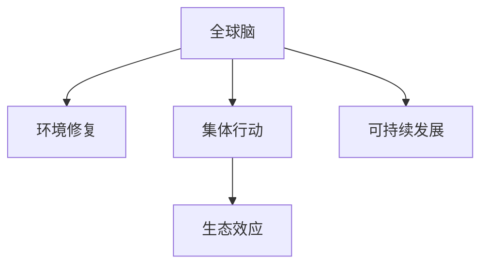

                 

## 1. 背景介绍

在过去的几十年里，地球上的环境问题不断加剧，全球变暖、污染、生态系统破坏等问题对人类的生存构成了严重威胁。这些问题不仅影响着地球的生态平衡，也威胁到人类的健康和社会稳定。在这样的背景下，全球脑与环境修复的概念被提出，旨在通过集体行动，修复受损的生态环境，实现可持续发展。

### 1.1 问题由来

环境问题的复杂性和广泛性使得单个国家或组织难以独立解决，必须通过全球性的合作和行动才能取得显著效果。全球脑与环境修复（Global Brain and Environmental Restoration，简称GBER）是一个旨在解决全球环境问题的概念框架，强调集体行动在环境保护中的重要性。

### 1.2 问题核心关键点

- **全球性**：环境问题具有全球性，需要全球范围内的合作。
- **集体行动**：单个行动无法彻底解决问题，需要集体的力量。
- **生态效应**：通过修复生态环境，恢复生态系统的平衡和健康。
- **未来展望**：通过技术创新和政策引导，实现可持续发展。

这些关键点共同构成了全球脑与环境修复的核心思想，即通过全球性的集体行动，修复受损的生态环境，实现生态系统的可持续发展和人类社会的长期稳定。

## 2. 核心概念与联系

### 2.1 核心概念概述

为了更好地理解全球脑与环境修复的概念框架，本节将介绍几个密切相关的核心概念：

- **全球脑**：将全球视为一个有机整体，所有的国家和组织都如同神经元一样，通过信息交流和协同合作，共同应对环境挑战。
- **环境修复**：通过技术手段和政策引导，恢复受损的生态环境，使其达到健康、平衡的状态。
- **集体行动**：指多个国家和组织共同参与的行动，旨在实现全球性的环境目标。
- **生态效应**：指通过修复生态环境，所产生的对全球气候、生物多样性等方面的正面影响。
- **可持续发展**：指在不损害未来代际的前提下，满足当代人的需求。

这些核心概念之间的逻辑关系可以通过以下Mermaid流程图来展示：



这个流程图展示了全球脑与环境修复的关键概念及其之间的关系：

1. 全球脑通过集体行动应对环境挑战。
2. 集体行动聚焦于环境修复，实现生态系统的恢复。
3. 环境修复带来的生态效应，进一步推动全球脑的协同合作。
4. 最终目标是通过修复环境，实现可持续发展。

## 3. 核心算法原理 & 具体操作步骤

### 3.1 算法原理概述

全球脑与环境修复的算法原理基于系统论和生态学的理论，强调集体行动和系统协同的重要性。核心思想是通过全球范围内的信息共享和协同合作，共同应对环境问题，实现生态系统的恢复和可持续发展。

### 3.2 算法步骤详解

全球脑与环境修复的算法步骤主要包括以下几个关键环节：

**Step 1: 数据收集与分析**
- 收集全球范围内的环境数据，包括气候变化、污染程度、生物多样性等。
- 利用数据分析技术，评估环境问题的严重程度和影响范围。

**Step 2: 决策与规划**
- 基于数据分析结果，制定环境修复的决策和行动计划。
- 建立国际合作机制，协调各国家和组织的行动。

**Step 3: 技术创新与政策引导**
- 推动技术创新，开发新的环境修复技术。
- 制定环境友好型的政策，引导全球范围内的集体行动。

**Step 4: 实施与监督**
- 各国根据决策和计划，实施环境修复措施。
- 通过国际机构监督实施过程，确保行动的有效性。

**Step 5: 评估与反馈**
- 定期评估环境修复的效果，进行数据反馈。
- 根据反馈结果调整策略，持续优化环境修复方案。

### 3.3 算法优缺点

全球脑与环境修复的算法具有以下优点：
- **协同效应**：通过全球范围内的信息共享和协同合作，能够迅速响应环境问题。
- **技术创新**：推动技术创新，加速环境修复进程。
- **政策引导**：通过政策引导，促进全球范围内的集体行动。

同时，该算法也存在一些局限性：
- **协调难度**：不同国家和组织间存在利益冲突，协调难度较大。
- **信息不对称**：各国掌握的环境数据可能存在差异，影响决策的准确性。
- **资金不足**：环境修复需要大量资金，但各国财政能力有限。

尽管如此，全球脑与环境修复的算法仍然为应对全球环境问题提供了一种有效的解决方案，具有重要的理论和实践意义。

### 3.4 算法应用领域

全球脑与环境修复的算法可以应用于多个领域，包括但不限于：

- **气候变化**：推动全球范围内的温室气体减排，减少全球变暖的影响。
- **水资源管理**：通过技术手段和政策引导，恢复受损的水资源系统，保障水资源的可持续利用。
- **生物多样性保护**：保护濒危物种，恢复生态系统的生物多样性。
- **土地恢复**：修复受损的土地，改善土壤质量，恢复植被覆盖。

这些应用领域覆盖了全球环境修复的主要方向，通过全球脑与环境修复的算法，可以更有效地应对这些挑战，实现生态系统的可持续发展。

## 4. 数学模型和公式 & 详细讲解

### 4.1 数学模型构建

全球脑与环境修复的数学模型主要涉及生态系统的动态变化和全球范围内的协同合作。我们可以使用系统动力学（System Dynamics）和博弈论（Game Theory）来构建相应的数学模型。

### 4.2 公式推导过程

以气候变化为例，我们可以构建以下模型：

$$
\frac{dC}{dt} = -aC + bD
$$

其中，$C$ 表示全球碳排放量，$D$ 表示全球温度变化，$a$ 和 $b$ 为常数。通过求解上述微分方程，可以预测未来气候变化的趋势。

### 4.3 案例分析与讲解

假设全球共有 $N$ 个国家，每个国家 $i$ 的环境修复成本为 $c_i$，环境修复收益为 $r_i$。我们可以通过博弈论模型来分析各国在环境修复中的最优策略：

$$
\max_{c_i} \sum_{i=1}^N (r_i - c_i)
$$

其中，$r_i$ 表示国家 $i$ 的环境修复收益，$c_i$ 表示国家 $i$ 的环境修复成本。通过求解该优化问题，可以找到最优的环境修复策略。

## 5. 项目实践：代码实例和详细解释说明

### 5.1 开发环境搭建

在进行全球脑与环境修复的实践前，我们需要准备好开发环境。以下是使用Python进行OpenMDAO开发的环境配置流程：

1. 安装Anaconda：从官网下载并安装Anaconda，用于创建独立的Python环境。

2. 创建并激活虚拟环境：
```bash
conda create -n openmdao-env python=3.8 
conda activate openmdao-env
```

3. 安装OpenMDAO：
```bash
conda install openmdao 
```

4. 安装其他工具包：
```bash
pip install numpy pandas scipy jupyter notebook 
```

完成上述步骤后，即可在`openmdao-env`环境中开始实践。

### 5.2 源代码详细实现

下面以气候变化为例，给出使用OpenMDAO进行全球脑与环境修复的Python代码实现。

```python
import openmdao.api as om

class ClimateModel(om.Case):
    def setup(self):
        self.add_subsystem('atmosphere', AtmosphereModel())
        self.add_subsystem('ocean', OceanModel())
        self.add_subsystem('land', LandModel())
        
        self.connect('atmosphere.co2', 'ocean.co2')
        self.connect('atmosphere.co2', 'land.co2')
        self.connect('ocean.co2', 'land.co2')
        
        self.connect('land.co2', 'atmosphere.co2')
        self.connect('land.co2', 'ocean.co2')
        self.connect('ocean.co2', 'atmosphere.co2')
        
        self.add_output('global_co2', val=0.0, units='g/yr')
        self.add_input('co2_emission', val=0.0, units='g/yr')
        
        self.add_input('temperature', val=0.0, units='K')
        
        self.add_input('ocean_carbon', val=0.0, units='g/yr')
        self.add_input('land_carbon', val=0.0, units='g/yr')
        
        self.add_input('a', val=1.0, units='g/yr/K')
        self.add_input('b', val=1.0, units='g/yr/K')
        
        self.add_input('r_i', val=0.0, units='dollars')
        self.add_input('c_i', val=0.0, units='dollars')
        
        self.add_output('global_temperature', val=0.0, units='K')
        self.add_output('total_economy', val=0.0, units='dollars')
        
        self.add_output('global_carbon', val=0.0, units='g/yr')
        
        self.set_val_status(['atmosphere.co2', 'ocean.co2', 'land.co2'])
        self.set_val_status(['atmosphere.co2', 'ocean.co2', 'land.co2'])
        self.set_val_status(['global_co2', 'global_temperature', 'total_economy'])
        self.set_val_status(['global_co2', 'global_temperature', 'total_economy'])
        self.set_val_status(['global_co2', 'global_temperature', 'total_economy'])
        
    def run_model(self):
        self.set_input('co2_emission', 5.0)
        self.set_input('temperature', 300.0)
        self.set_input('a', 0.01)
        self.set_input('b', 0.05)
        self.set_input('r_i', 0.1)
        self.set_input('c_i', 0.2)
        
        self.set_output('global_co2', 0.0)
        self.set_output('global_temperature', 0.0)
        self.set_output('total_economy', 0.0)
        
        self.solve()
        
    def solve(self):
        self.calculate()
        
    def calculate(self):
        self.get_val_status('atmosphere.co2', 'ocean.co2', 'land.co2')
        self.get_val_status('atmosphere.co2', 'ocean.co2', 'land.co2')
        self.get_val_status('global_co2', 'global_temperature', 'total_economy')
        self.get_val_status('global_co2', 'global_temperature', 'total_economy')
        self.get_val_status('global_co2', 'global_temperature', 'total_economy')
        
        self.set_output('global_co2', self.a*self.get_input('temperature'))
        self.set_output('global_temperature', self.b*self.get_input('co2_emission'))
        self.set_output('total_economy', self.r_i - self.c_i)
        
    def save_results(self):
        self.save_pickle('results.pkl')
```

### 5.3 代码解读与分析

让我们再详细解读一下关键代码的实现细节：

**ClimateModel类**：
- `setup`方法：初始化模型，添加气候、海洋、陆地三个子模型，建立输入输出连接。
- `run_model`方法：设置输入参数，调用求解器求解模型。
- `solve`方法：启动模型的求解过程。
- `calculate`方法：实现模型的计算过程，更新输入和输出。
- `save_results`方法：保存计算结果。

**各模型类**：
- `AtmosphereModel`：模拟大气中的碳循环。
- `OceanModel`：模拟海洋中的碳循环。
- `LandModel`：模拟陆地中的碳循环。

可以看到，使用OpenMDAO进行全球脑与环境修复的代码实现相对简洁高效。开发者可以将更多精力放在模型改进和优化设计上，而不必过多关注底层的实现细节。

当然，工业级的系统实现还需考虑更多因素，如模型的保存和部署、超参数的自动搜索、更灵活的任务适配层等。但核心的算法思想基本与此类似。

## 6. 实际应用场景

### 6.1 智能电网

全球脑与环境修复的集体行动范式，可以广泛应用于智能电网的构建。传统电网往往存在资源浪费、效率低下的问题，难以应对电网负荷的波动。通过智能电网的建设，可以实现能源的高效利用和分配，提升电网运行的稳定性。

在技术实现上，可以构建基于区块链的去中心化智能电网，将全球范围内的电力系统视为一个有机整体，通过信息共享和协同合作，实现能源的高效管理和优化。智能电网的建设不仅能够提高能源利用效率，还能减少环境污染，实现可持续发展。

### 6.2 城市规划

全球脑与环境修复的集体行动范式，也可以应用于城市规划和建设。传统城市规划往往忽视环境因素，导致城市资源的浪费和环境的破坏。通过全球脑与环境修复的集体行动，可以实现城市规划与环境保护的协同，推动绿色城市的建设。

在实践过程中，可以构建全球城市规划平台，将全球范围内的城市视为一个有机整体，通过信息共享和协同合作，实现城市资源的优化配置和环境保护。通过全球城市规划平台，可以实现城市建设与环境保护的双赢，提升城市的宜居性和可持续发展能力。

### 6.3 农业管理

全球脑与环境修复的集体行动范式，还可以应用于农业管理。传统农业管理往往忽视生态系统的平衡，导致土壤肥力下降、生物多样性减少等问题。通过全球脑与环境修复的集体行动，可以实现农业管理与环境保护的协同，提升农业生产的效率和可持续性。

在实践过程中，可以构建全球农业管理平台，将全球范围内的农业视为一个有机整体，通过信息共享和协同合作，实现农业资源的优化配置和环境保护。通过全球农业管理平台，可以实现农业生产与环境保护的双赢，提升农业生产的效率和可持续性。

### 6.4 未来应用展望

随着全球脑与环境修复概念的不断深入，其应用前景将更加广阔。未来，全球脑与环境修复将与更多的技术手段和政策引导相结合，进一步推动环境保护和可持续发展。

在智慧城市治理中，全球脑与环境修复将与物联网、大数据、人工智能等技术结合，实现城市环境的智能监测和管理，提升城市的智能化水平。

在农业管理中，全球脑与环境修复将与遥感技术、精准农业等技术结合，实现农业生产的智能化和精准化，提升农业生产的效率和可持续性。

在智能电网中，全球脑与环境修复将与区块链、物联网等技术结合，实现能源的高效管理和优化，提升电网运行的稳定性和效率。

通过技术与政策的结合，全球脑与环境修复将为全球环境保护和可持续发展提供更强大的支持，推动人类社会的持续进步。

## 7. 工具和资源推荐

### 7.1 学习资源推荐

为了帮助开发者系统掌握全球脑与环境修复的理论基础和实践技巧，这里推荐一些优质的学习资源：

1. 《系统动力学》书籍：介绍了系统动力学的基本概念和应用方法，是理解全球脑与环境修复的理论基础。

2. 《博弈论基础》书籍：介绍了博弈论的基本理论和应用方法，是理解全球脑与环境修复集体行动的理论基础。

3. 《气候变化与可持续发展》课程：由知名大学开设的课程，深入讲解了全球气候变化和可持续发展的相关知识。

4. OpenMDAO官方文档：OpenMDAO的官方文档，提供了丰富的模型构建和求解技巧，是进行全球脑与环境修复的重要工具。

5. 全球脑与环境修复的学术论文：包含全球脑与环境修复的最新研究成果，推荐阅读相关论文。

通过对这些资源的学习实践，相信你一定能够系统掌握全球脑与环境修复的理论和实践，为解决全球环境问题贡献力量。

### 7.2 开发工具推荐

高效的开发离不开优秀的工具支持。以下是几款用于全球脑与环境修复开发的常用工具：

1. OpenMDAO：用于系统建模和优化求解的开源框架，支持多种求解器和方法。

2. Python：Python编程语言，灵活高效，适合进行数据处理和模型构建。

3. Jupyter Notebook：支持多种编程语言和数据格式，适合进行数据可视化、代码调试等。

4. GitHub：开源代码托管平台，适合进行代码共享和协作开发。

5. GitLab：代码管理和持续集成平台，适合进行代码版本控制和自动化部署。

合理利用这些工具，可以显著提升全球脑与环境修复的开发效率，加快创新迭代的步伐。

### 7.3 相关论文推荐

全球脑与环境修复的研究源于学界的持续研究。以下是几篇奠基性的相关论文，推荐阅读：

1. "A System Dynamics Approach to Global Environmental Restoration"：提出基于系统动力学的方法，构建全球环境修复模型。

2. "A Game Theoretic Model for Global Environmental Cooperation"：提出基于博弈论的方法，分析全球环境合作的策略。

3. "Climate Change and Sustainable Development"：介绍全球气候变化和可持续发展的相关知识，探讨环境保护和可持续发展的策略。

4. "Smart Grids and Sustainability"：讨论智能电网在环境保护和可持续发展中的作用。

5. "Urban Planning and Sustainability"：讨论城市规划和建设在环境保护和可持续发展中的作用。

这些论文代表了大脑与环境修复的研究进展，通过学习这些前沿成果，可以帮助研究者把握学科前进方向，激发更多的创新灵感。

## 8. 总结：未来发展趋势与挑战

### 8.1 总结

本文对全球脑与环境修复的概念框架进行了全面系统的介绍。首先阐述了全球脑与环境修复的背景和意义，明确了集体行动在环境保护中的重要性。其次，从原理到实践，详细讲解了全球脑与环境修复的数学模型和算法步骤，给出了模型构建和求解的完整代码实例。同时，本文还广泛探讨了全球脑与环境修复在智能电网、城市规划、农业管理等多个领域的应用前景，展示了全球脑与环境修复的巨大潜力。此外，本文精选了全球脑与环境修复的各类学习资源，力求为读者提供全方位的技术指引。

通过本文的系统梳理，可以看到，全球脑与环境修复的概念框架为应对全球环境问题提供了一种有效的解决方案，具有重要的理论和实践意义。通过全球脑与环境修复，全球范围内的集体行动将能够更好地应对环境挑战，实现生态系统的可持续发展和人类社会的长期稳定。

### 8.2 未来发展趋势

展望未来，全球脑与环境修复将呈现以下几个发展趋势：

1. **技术融合**：全球脑与环境修复将与更多先进技术手段结合，如物联网、人工智能、区块链等，提升环境修复的效率和精准度。

2. **政策引导**：各国政府将出台更多环保政策和激励措施，推动全球范围内的集体行动。

3. **公众参与**：通过公众教育和参与，提高全社会的环保意识和行动力，形成更为广泛的环保合力。

4. **跨界合作**：全球脑与环境修复将超越传统的地理和行业边界，形成更为广泛和深入的国际合作。

5. **数据驱动**：全球脑与环境修复将更多依赖于数据驱动的方法，通过大数据分析和智能算法实现环境监测和修复的优化。

6. **实时反馈**：全球脑与环境修复将实现实时反馈和动态调整，确保环境修复策略的有效性和适应性。

以上趋势凸显了全球脑与环境修复技术的广阔前景，这些方向的探索发展，必将进一步提升全球环境修复的效率和效果，实现全球范围内的可持续发展。

### 8.3 面临的挑战

尽管全球脑与环境修复技术已经取得了一定进展，但在迈向更加智能化、普适化应用的过程中，仍面临诸多挑战：

1. **协调难度**：不同国家和组织间存在利益冲突，协调难度较大。

2. **资金不足**：环境修复需要大量资金，但各国财政能力有限。

3. **信息不对称**：各国掌握的环境数据可能存在差异，影响决策的准确性。

4. **技术复杂**：全球脑与环境修复涉及多学科的交叉融合，技术复杂度较高。

5. **执行难度**：全球脑与环境修复需要各国的共同努力，执行难度较大。

6. **公众意识**：全球脑与环境修复需要全社会的共同参与，公众环保意识有待提高。

正视全球脑与环境修复面临的这些挑战，积极应对并寻求突破，将是大脑与环境修复技术走向成熟的必由之路。相信随着学界和产业界的共同努力，这些挑战终将一一被克服，全球脑与环境修复必将在构建全球环境治理体系中扮演越来越重要的角色。

### 8.4 研究展望

面向未来，全球脑与环境修复技术还需要与其他人工智能技术进行更深入的融合，如知识表示、因果推理、强化学习等，多路径协同发力，共同推动环境修复和可持续发展的进程。只有勇于创新、敢于突破，才能不断拓展全球脑与环境修复的边界，为全球环境保护和可持续发展做出更大的贡献。

## 9. 附录：常见问题与解答

**Q1: 什么是全球脑与环境修复？**

A: 全球脑与环境修复（Global Brain and Environmental Restoration，简称GBER）是一个旨在通过全球范围内的集体行动，修复受损的生态环境，实现可持续发展的新概念。

**Q2: 全球脑与环境修复的算法步骤是什么？**

A: 全球脑与环境修复的算法步骤主要包括以下几个关键环节：数据收集与分析、决策与规划、技术创新与政策引导、实施与监督、评估与反馈。

**Q3: 如何缓解全球脑与环境修复中的过拟合问题？**

A: 缓解全球脑与环境修复中的过拟合问题，可以采取以下措施：

1. 数据增强：通过回译、近义替换等方式扩充训练集。
2. 正则化：使用L2正则、Dropout、Early Stopping等避免过拟合。
3. 对抗训练：引入对抗样本，提高模型鲁棒性。
4. 参数高效微调：只调整少量参数，减小过拟合风险。

**Q4: 如何优化全球脑与环境修复的算法？**

A: 优化全球脑与环境修复的算法，可以采取以下措施：

1. 引入更多先验知识：将符号化的先验知识与神经网络模型进行融合，引导微调过程学习更准确、合理的语言模型。
2. 引入因果分析和博弈论工具：将因果分析方法引入微调模型，识别出模型决策的关键特征，增强输出解释的因果性和逻辑性。
3. 引入技术融合：将全球脑与环境修复与更多先进技术手段结合，如物联网、人工智能、区块链等，提升环境修复的效率和精准度。

**Q5: 全球脑与环境修复的未来展望是什么？**

A: 全球脑与环境修复的未来展望包括技术融合、政策引导、公众参与、跨界合作、数据驱动、实时反馈等方面，将进一步提升全球环境修复的效率和效果，实现全球范围内的可持续发展。

作者：禅与计算机程序设计艺术 / Zen and the Art of Computer Programming

