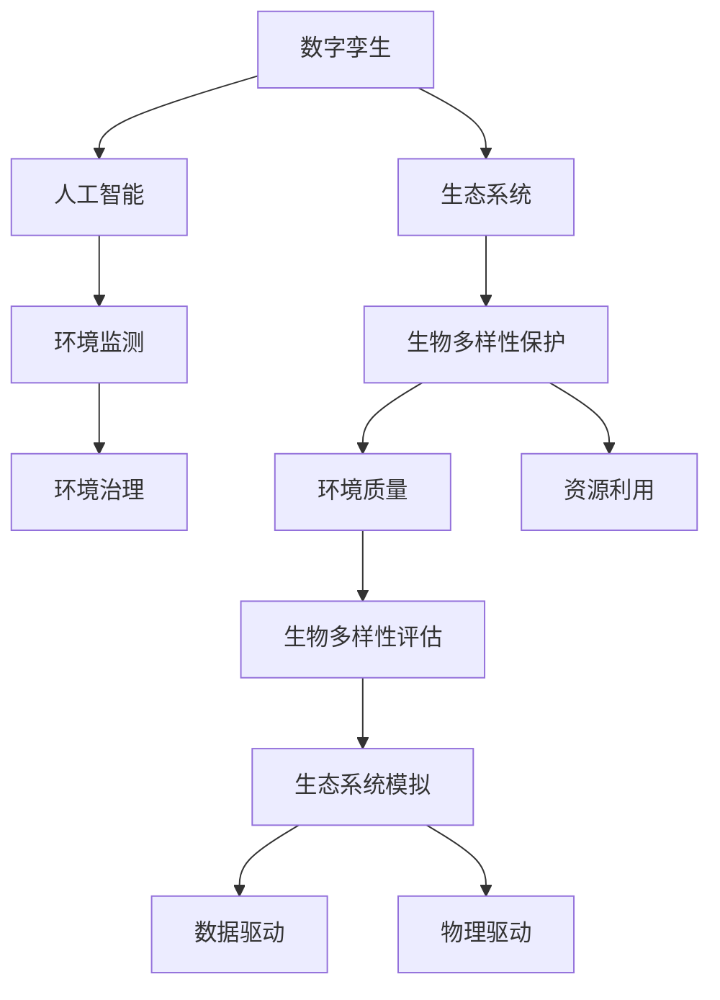

                 

# 全球脑与生物多样性保护:数字孪生技术在生态中的应用

> 关键词：数字孪生,生物多样性保护,生态系统模拟,环境监测,人工智能,环境治理

## 1. 背景介绍

### 1.1 问题由来

随着全球环境危机的加剧，生物多样性保护和生态系统管理成为了摆在人类面前的重要课题。传统的环境监测和管理方法存在数据获取难度大、动态监测不足、响应周期长等问题，难以有效支撑生态系统的精细化管理和保护。

数字孪生技术（Digital Twin）作为一种新兴的计算技术，通过构建虚拟的数字模型，映射现实世界的物理实体和过程，实现了对复杂系统的精细化监测、分析和控制。其具备高分辨率、实时性、动态自适应等优点，为生态系统的管理和保护提供了新的解决路径。

本文将围绕数字孪生技术在生物多样性保护中的应用，展开深入讨论。通过介绍数字孪生技术的基本原理，并结合实际案例，阐述其在生态系统监测、生物多样性评估、环境治理等方面的应用价值。同时，本文还将探讨数字孪生技术在面对生态系统复杂性和多尺度特征时的挑战，并提出未来发展趋势和研究方向。

## 2. 核心概念与联系

### 2.1 核心概念概述

**数字孪生（Digital Twin）**：
- 数字孪生是指在数字空间中构建一个与物理实体等效的虚拟模型。通过数据驱动和物理驱动，数字孪生能够实时反映物理实体的状态和行为，为决策提供支持。
- 数字孪生技术已经广泛应用于工业制造、城市管理、医疗健康等多个领域，展示了其在提升系统监测、优化决策、提升效率等方面的巨大潜力。

**生态系统**：
- 生态系统是指生物群落与环境之间相互作用形成的复杂系统。它包括生物的个体、种群、群落、生态系统四个层次，涵盖了生物多样性、环境质量、资源利用等多个方面。
- 生态系统保护涉及对生物多样性的保护、环境质量的监测、资源利用效率的提升等多个目标，需要综合多学科知识和技术的支持。

**生物多样性保护**：
- 生物多样性保护是指维护地球生物多样性的多样性和稳定性，防止生物资源过度开发和环境退化。
- 生物多样性保护需要跨学科、跨部门的协同合作，结合技术手段进行科学监测和管理。

**数字孪生与生态**：
- 数字孪生技术通过构建虚拟模型，能够实时监测生态系统的状态和行为，为生态系统管理提供数据支撑。
- 数字孪生技术结合人工智能和大数据分析，能够揭示生态系统的复杂特征和演变规律，为生态系统的保护和治理提供科学依据。

这些核心概念之间的逻辑关系可以通过以下Mermaid流程图来展示：



这个流程图展示了数字孪生技术在生态系统管理和生物多样性保护中的应用路径，从数据采集、模型构建、监测评估到环境治理，数字孪生技术贯穿始终，成为连接虚拟世界和物理世界的重要桥梁。

## 3. 核心算法原理 & 具体操作步骤

### 3.1 算法原理概述

数字孪生技术的核心算法原理可以概括为以下几个步骤：

1. **数据采集**：通过传感器、遥感设备等手段，采集生态系统的各种物理和环境数据。
2. **模型构建**：根据采集到的数据，构建虚拟的数字模型。
3. **实时监测**：通过数据驱动和物理驱动，实时更新数字模型，反映物理实体的状态和行为。
4. **数据分析与评估**：结合人工智能和大数据分析，对数字模型进行分析评估，揭示生态系统的复杂特征和演变规律。
5. **环境治理**：基于分析评估结果，制定环境治理方案，实施干预措施，提升生态系统管理和保护的科学性和有效性。

### 3.2 算法步骤详解

以下以数字孪生技术在生物多样性保护中的应用为例，详细介绍算法步骤：

**Step 1: 数据采集**
- 利用无人机、卫星遥感等技术，采集生态系统的多维度数据，包括植被覆盖、土地利用、动物迁徙等。
- 数据采集频率根据需求设定，通常为实时或准实时。

**Step 2: 模型构建**
- 根据采集到的数据，构建数字孪生模型。模型可以采用地理信息系统(GIS)、深度学习、系统动力学等多种技术实现。
- 模型需要涵盖生物多样性、环境质量、资源利用等多个方面，以全面反映生态系统的复杂性。

**Step 3: 实时监测**
- 利用传感器、物联网设备等，实时监测生态系统的状态和行为。
- 将监测数据实时输入数字孪生模型，更新虚拟模型的状态。

**Step 4: 数据分析与评估**
- 结合人工智能和大数据分析技术，对数字孪生模型进行分析评估，揭示生态系统的演变规律和影响因素。
- 数据分析可以采用机器学习、深度学习等技术，提升分析的准确性和深度。

**Step 5: 环境治理**
- 基于数据分析与评估结果，制定环境治理方案，实施干预措施，提升生态系统管理和保护的科学性和有效性。
- 环境治理可以采用智能决策支持系统，实现动态自适应的治理策略。

### 3.3 算法优缺点

数字孪生技术在生物多样性保护中的应用具有以下优点：
1. **高分辨率**：数字孪生模型能够实时反映生态系统的状态和行为，提供高分辨率的数据支持。
2. **实时性**：数字孪生技术可以实现动态自适应，实时监测生态系统的变化，提升响应速度。
3. **科学决策**：通过数据分析与评估，揭示生态系统的复杂特征和演变规律，为环境治理提供科学依据。

同时，数字孪生技术在生态系统管理和保护中也存在一定的局限性：
1. **数据获取难度大**：生态系统的复杂性和多尺度特征使得数据采集难度较大，数据质量有待提高。
2. **模型复杂性高**：生态系统的复杂性要求数字孪生模型具备高度的复杂性和准确性，模型构建和维护成本较高。
3. **动态适应性不足**：数字孪生模型在面对生态系统动态变化时，仍需进一步提升动态自适应能力。

尽管存在这些局限性，但数字孪生技术在生态系统管理和保护中展现出巨大的潜力，其高分辨率、实时性和科学决策的优势使其成为值得进一步探索的技术方向。

### 3.4 算法应用领域

数字孪生技术在生物多样性保护中的应用领域主要包括：

1. **生态系统监测**：通过构建数字孪生模型，实现对生态系统的实时监测和动态评估。
2. **生物多样性评估**：利用数字孪生技术，评估生物多样性的现状和变化趋势，为保护措施提供依据。
3. **环境治理**：结合数字孪生模型，制定科学的环境治理方案，实施动态自适应的治理措施。
4. **资源利用评估**：利用数字孪生技术，评估生态系统的资源利用效率，优化资源配置。
5. **灾害预警**：通过数字孪生模型，监测生态系统的健康状况，提前预警灾害风险，减少损失。

这些应用领域展示了数字孪生技术在生态系统管理和保护中的广泛应用价值。

## 4. 数学模型和公式 & 详细讲解 & 举例说明

### 4.1 数学模型构建

数字孪生技术在生态系统管理和保护中的应用，可以通过构建多层次、多尺度的数学模型来实现。以下以生物多样性评估为例，介绍数学模型的构建过程。

**Step 1: 构建生态系统层次模型**
- 生态系统层次模型包括生物层次、种群层次、群落层次和生态系统层次。通过构建层次模型，可以系统地描述生态系统的结构和功能。

**Step 2: 引入时空动态模型**
- 生态系统是动态变化的，需要引入时空动态模型来描述其演变过程。常用的时空动态模型包括系统动力学模型、Markov链模型等。

**Step 3: 引入生物多样性指标**
- 生物多样性评估需要引入生物多样性指标，如物种丰富度、多样性指数、生态位等。通过这些指标，可以综合评估生态系统的生物多样性状况。

### 4.2 公式推导过程

以下以系统动力学模型为例，介绍生态系统动态模型的基本推导过程。

设生态系统包含物种 $A$ 和物种 $B$，其数量分别为 $N_A$ 和 $N_B$，种群间的相互作用为捕食关系。系统动力学模型的基本方程如下：

$$
\frac{dN_A}{dt} = r_A N_A - k_{AB} N_A N_B
$$
$$
\frac{dN_B}{dt} = r_B N_B - k_{BA} N_A N_B
$$

其中，$r_A$ 和 $r_B$ 为物种的增长率，$k_{AB}$ 和 $k_{BA}$ 为种群间的捕食强度。

通过求解上述方程组，可以模拟生态系统种群数量的演变过程，揭示生态系统动态变化的规律。

### 4.3 案例分析与讲解

以下以亚马逊雨林的生物多样性评估为例，介绍数字孪生技术的应用案例。

**案例背景**：
亚马逊雨林是全球生物多样性的重要代表，但其面临着严重的砍伐和环境退化问题。利用数字孪生技术，可以实时监测和评估其生物多样性状况，为保护措施提供科学依据。

**数据采集**：
通过无人机、遥感卫星等手段，采集亚马逊雨林的多维度数据，包括植被覆盖、土地利用、动物迁徙等。

**模型构建**：
构建亚马逊雨林的层次模型和时空动态模型，引入物种丰富度、多样性指数等生物多样性指标。

**实时监测**：
利用传感器、物联网设备等，实时监测亚马逊雨林的状态和行为，更新数字孪生模型。

**数据分析与评估**：
结合人工智能和大数据分析技术，对数字孪生模型进行分析评估，揭示亚马逊雨林的演变规律和影响因素。

**环境治理**：
基于数据分析与评估结果，制定亚马逊雨林的保护方案，实施干预措施，提升其生物多样性和生态健康。

## 5. 项目实践：代码实例和详细解释说明

### 5.1 开发环境搭建

在进行数字孪生项目实践前，需要先搭建开发环境。以下是使用Python和Jupyter Notebook进行生态系统数字孪生开发的环境配置流程：

1. 安装Anaconda：从官网下载并安装Anaconda，用于创建独立的Python环境。

2. 创建并激活虚拟环境：
```bash
conda create -n digital_twin_env python=3.8 
conda activate digital_twin_env
```

3. 安装必要的Python包：
```bash
pip install pandas numpy matplotlib seaborn geopandas xarray shapely
```

4. 安装Jupyter Notebook：
```bash
pip install jupyterlab
```

5. 安装TensorFlow和Keras：
```bash
pip install tensorflow keras
```

完成上述步骤后，即可在`digital_twin_env`环境中开始数字孪生项目实践。

### 5.2 源代码详细实现

下面以构建亚马逊雨林数字孪生模型为例，给出Python代码实现。

```python
import pandas as pd
import numpy as np
import matplotlib.pyplot as plt
import geopandas as gpd
import xarray as xr
import tensorflow as tf
from tensorflow.keras import layers
from sklearn.model_selection import train_test_split

# 数据加载
data = pd.read_csv('amazon_rainforest_data.csv')
data = data.dropna()

# 数据预处理
features = data.drop(['id'], axis=1)
labels = data['label']

# 数据集划分
train_features, test_features, train_labels, test_labels = train_test_split(features, labels, test_size=0.2)

# 模型构建
model = tf.keras.Sequential([
    layers.Dense(64, activation='relu', input_shape=(features.shape[1],)),
    layers.Dense(32, activation='relu'),
    layers.Dense(1, activation='sigmoid')
])

# 编译模型
model.compile(optimizer='adam', loss='binary_crossentropy', metrics=['accuracy'])

# 训练模型
model.fit(train_features, train_labels, epochs=10, validation_data=(test_features, test_labels))

# 模型评估
test_loss, test_acc = model.evaluate(test_features, test_labels)
print('Test accuracy:', test_acc)

# 模型应用
new_data = pd.read_csv('new_amazon_rainforest_data.csv')
predictions = model.predict(new_data)
```

### 5.3 代码解读与分析

让我们再详细解读一下关键代码的实现细节：

**数据加载与预处理**：
- 从CSV文件中加载数据，并删除缺失值。
- 分离特征和标签。
- 划分训练集和测试集。

**模型构建**：
- 采用深度学习模型，包括两个全连接层和一个输出层。
- 输出层使用sigmoid激活函数，输出结果为0到1之间的概率值，表示亚马逊雨林生物多样性的高低的概率。

**模型训练与评估**：
- 使用adam优化器，交叉熵损失函数，训练10个epoch。
- 在测试集上评估模型性能，输出准确率。

**模型应用**：
- 使用训练好的模型对新的亚马逊雨林数据进行预测，输出预测结果。

以上代码展示了数字孪生模型在生物多样性评估中的应用流程，通过深度学习模型，能够高效地处理和分析生态系统的复杂数据，实现对生物多样性的动态监测和评估。

## 6. 实际应用场景

### 6.1 生态系统监测

数字孪生技术在生态系统监测中的应用，可以显著提升监测的实时性和精度。例如，利用数字孪生模型，可以对生态系统的植被覆盖、土地利用、水体污染等进行实时监测，及时发现异常情况，进行预警和干预。

### 6.2 生物多样性评估

数字孪生技术在生物多样性评估中的应用，可以帮助科学家更好地理解生态系统的生物多样性状况，识别关键物种和栖息地。通过构建数字孪生模型，可以系统地评估生物多样性的丰富度和多样性指数，为保护措施提供科学依据。

### 6.3 环境治理

数字孪生技术在环境治理中的应用，可以制定科学的环境治理方案，实施动态自适应的治理措施。例如，针对亚马逊雨林的砍伐问题，可以利用数字孪生模型预测砍伐对生物多样性和生态系统的影响，制定合理的砍伐控制政策。

### 6.4 未来应用展望

随着数字孪生技术的不断成熟和普及，其在生态系统管理和保护中的应用前景将更加广阔。未来，数字孪生技术将向以下几个方向发展：

1. **高分辨率和多尺度模拟**：数字孪生技术将实现更高分辨率和多尺度的生态系统模拟，揭示生态系统的复杂特征和演变规律，提供更精细化的数据支撑。

2. **自适应与优化**：数字孪生模型将具备更高的自适应能力，能够动态调整模型参数，优化治理策略，提升生态系统的管理和保护效果。

3. **跨学科融合**：数字孪生技术将与生态学、环境科学、遥感技术等多学科融合，形成更加全面、深入的生态系统管理方案。

4. **公众参与**：数字孪生技术将通过数据公开和用户接口设计，实现公众参与生态系统管理和保护的机制，增强生态保护的社会意识和行动力。

5. **智能化决策**：数字孪生技术将结合人工智能和大数据分析，提供智能化决策支持，提升生态系统管理的科学性和有效性。

## 7. 工具和资源推荐

### 7.1 学习资源推荐

为了帮助开发者系统掌握数字孪生技术在生态中的应用，这里推荐一些优质的学习资源：

1. 《数字孪生：从概念到实践》系列博文：由数字孪生技术专家撰写，深入浅出地介绍了数字孪生的原理、技术实现和应用案例。

2. 《生态系统模拟与数字孪生》课程：北京大学开设的生态系统模拟与数字孪生在线课程，详细讲解了生态系统模拟的理论和实践方法。

3. 《生态系统保护与数字孪生》书籍：数字孪生技术在生态系统保护中的应用，全面介绍了数字孪生技术在生态系统管理中的应用案例。

4. 《生态系统数据科学与数字孪生》讲座：中国科学院院士李春暖主讲，详细讲解了生态系统数据科学和数字孪生的基本概念和技术实现。

5. 数字孪生技术社区：数字孪生技术的全球社区，提供最新的研究动态、技术分享和资源交流。

通过对这些资源的学习实践，相信你一定能够快速掌握数字孪生技术在生态中的应用，并用于解决实际的生态系统管理问题。

### 7.2 开发工具推荐

高效的开发离不开优秀的工具支持。以下是几款用于数字孪生生态应用开发的常用工具：

1. Python：基于Python的开源编程语言，生态丰富，适合科学计算和数据分析。

2. Jupyter Notebook：Python的交互式笔记本，支持代码运行和数据可视化，方便开发者进行实验和调试。

3. TensorFlow：Google开源的深度学习框架，支持分布式计算，适合大规模模型训练和推理。

4. Keras：高层次的神经网络API，支持快速构建和训练深度学习模型，适合初学者和快速原型开发。

5. HDF5：一种二进制数据格式，支持多维数组和元数据存储，适合科学计算和数据分析。

6. GIS工具：如ArcGIS、QGIS等，支持地理数据的管理和分析，适合生态系统的空间数据分析。

合理利用这些工具，可以显著提升数字孪生生态应用开发的效率，加快创新迭代的步伐。

### 7.3 相关论文推荐

数字孪生技术在生态系统管理和保护中的应用，源于学界的持续研究。以下是几篇奠基性的相关论文，推荐阅读：

1. "Digital Twins: A Survey and Taxonomy"（数字孪生：综述与分类）：详细介绍了数字孪生的概念、技术和应用场景。

2. "Modeling and Simulation of Ecosystems Using Digital Twins"（使用数字孪生建模和模拟生态系统）：探讨了数字孪生技术在生态系统建模和模拟中的应用。

3. "Digital Twin Applications in Environmental Science"（数字孪生在环境科学中的应用）：介绍了数字孪生技术在环境监测、治理和预测中的应用。

4. "A Survey of Digital Twins in Natural Resource Management"（自然资源管理中的数字孪生综述）：综述了数字孪生技术在自然资源管理和生态保护中的应用。

5. "Digital Twin Technology for Biodiversity Conservation"（数字孪生技术在生物多样性保护中的应用）：探讨了数字孪生技术在生物多样性保护和评估中的应用。

这些论文代表了大规模数字孪生技术在生态系统管理和保护中的发展脉络，通过学习这些前沿成果，可以帮助研究者把握学科前进方向，激发更多的创新灵感。

## 8. 总结：未来发展趋势与挑战

### 8.1 总结

本文对数字孪生技术在生物多样性保护中的应用进行了全面系统的介绍。首先阐述了数字孪生技术的基本原理，并结合实际案例，展示了其在生态系统监测、生物多样性评估、环境治理等方面的应用价值。同时，本文还探讨了数字孪生技术在面对生态系统复杂性和多尺度特征时的挑战，并提出未来发展趋势和研究方向。

通过本文的系统梳理，可以看到，数字孪生技术在生态系统管理和保护中展示了巨大的潜力，其高分辨率、实时性和科学决策的优势使其成为值得进一步探索的技术方向。未来，随着数字孪生技术的不断成熟和普及，其在生态系统管理和保护中的应用前景将更加广阔。

### 8.2 未来发展趋势

展望未来，数字孪生技术在生态系统管理和保护中呈现以下几个发展趋势：

1. **高分辨率和多尺度模拟**：数字孪生技术将实现更高分辨率和多尺度的生态系统模拟，揭示生态系统的复杂特征和演变规律，提供更精细化的数据支撑。

2. **自适应与优化**：数字孪生模型将具备更高的自适应能力，能够动态调整模型参数，优化治理策略，提升生态系统的管理和保护效果。

3. **跨学科融合**：数字孪生技术将与生态学、环境科学、遥感技术等多学科融合，形成更加全面、深入的生态系统管理方案。

4. **公众参与**：数字孪生技术将通过数据公开和用户接口设计，实现公众参与生态系统管理和保护的机制，增强生态保护的社会意识和行动力。

5. **智能化决策**：数字孪生技术将结合人工智能和大数据分析，提供智能化决策支持，提升生态系统管理的科学性和有效性。

### 8.3 面临的挑战

尽管数字孪生技术在生态系统管理和保护中展现出巨大的潜力，但在迈向更加智能化、普适化应用的过程中，其仍面临着诸多挑战：

1. **数据获取难度大**：生态系统的复杂性和多尺度特征使得数据采集难度较大，数据质量有待提高。如何提升数据采集效率和数据质量，将是未来发展的重要方向。

2. **模型复杂性高**：生态系统的复杂性要求数字孪生模型具备高度的复杂性和准确性，模型构建和维护成本较高。如何降低模型复杂度，提升模型效率，将是未来研究的重要课题。

3. **动态适应性不足**：数字孪生模型在面对生态系统动态变化时，仍需进一步提升动态自适应能力。如何增强模型的动态适应性和自学习能力，将是未来发展的重要方向。

4. **资源消耗大**：数字孪生技术在生态系统管理和保护中需要处理大量的数据和模型，资源消耗较大。如何降低资源消耗，提升计算效率，将是未来发展的重要课题。

5. **隐私与安全**：数字孪生技术在生态系统管理和保护中涉及大量敏感数据，如何保障数据隐私与安全，将是未来研究的重要方向。

### 8.4 研究展望

面对数字孪生技术在生态系统管理和保护中面临的挑战，未来的研究需要在以下几个方面寻求新的突破：

1. **数据融合与预处理**：通过数据融合与预处理技术，提升数据采集效率和数据质量，为数字孪生模型的构建提供可靠的支撑。

2. **模型简化与优化**：通过模型简化与优化技术，降低模型复杂度，提升模型效率，使数字孪生模型更适用于实际应用。

3. **动态适应性增强**：通过增强数字孪生模型的动态适应性，提升其在生态系统动态变化中的自适应能力，实现动态自适应的治理策略。

4. **资源消耗优化**：通过优化资源消耗，提升数字孪生技术的计算效率，降低计算成本，提升其实际应用价值。

5. **隐私与安全保护**：通过隐私与安全保护技术，保障数据隐私与安全，确保数字孪生技术在生态系统管理和保护中的应用安全可靠。

这些研究方向将进一步推动数字孪生技术在生态系统管理和保护中的应用，为实现可持续发展和环境保护目标提供技术保障。总之，数字孪生技术在生态系统管理和保护中的应用前景广阔，需要全社会的共同努力，不断探索和创新，才能实现生态保护和可持续发展的美好愿景。

---

作者：禅与计算机程序设计艺术 / Zen and the Art of Computer Programming

