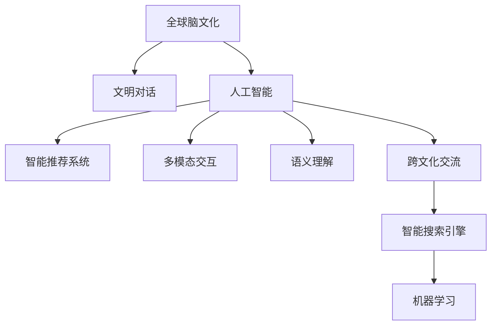

                 

# 全球脑文化融合:数字时代的文明对话新形式

> 关键词：脑文化, 数字时代, 文明对话, 人工智能, 智能推荐系统, 多模态交互, 语义理解, 跨文化交流, 智能搜索引擎, 机器学习

## 1. 背景介绍

### 1.1 问题由来
随着互联网技术的迅猛发展，全球化和数字化的浪潮正以前所未有的速度改变着人类的生产生活方式。不同国家和文化背景的人们，在虚拟空间中频繁交流，形成了独特的“全球脑文化”。然而，文化差异带来的理解和沟通障碍，也成为数字时代文明对话的一大挑战。

### 1.2 问题核心关键点
本文聚焦于如何利用人工智能技术，突破文化差异带来的交流障碍，构建全球脑文化，促进不同文明之间的理解和交流。主要研究以下几个核心问题：

- 全球脑文化的概念及其构建方式
- 人工智能在文化理解与交流中的应用
- 多模态交互与语义理解的实现
- 智能推荐系统在跨文化交流中的作用
- 全球脑文化融合面临的技术挑战与解决策略

### 1.3 问题研究意义
研究全球脑文化融合及其在人工智能技术下的应用，对促进不同文明之间的理解和交流，构建和谐多元的数字社会具有重要意义：

1. 打破文化壁垒：利用智能技术，消弭文化差异带来的沟通障碍，促进多元文化融合。
2. 提升沟通效率：通过多模态交互和智能推荐，提高交流的便捷性和高效性。
3. 增强信息获取：智能搜索引擎和推荐系统，帮助用户快速获取全球化信息，拓宽视野。
4. 促进文化交流：构建全球脑文化，促进不同文明的深度交流和互相理解，增强全球认同感。

## 2. 核心概念与联系

### 2.1 核心概念概述

为更好地理解全球脑文化及其与人工智能技术的关系，本节将介绍几个关键概念：

- 全球脑文化（Global Brains Culture）：指通过互联网连接全球不同文化背景的人们，在虚拟空间中形成的一种文化现象。这种文化融合了多元语言、习俗、价值观，呈现多样化的文化交融。
- 文明对话（Civilizational Dialogue）：指不同文明间通过文字、图片、视频等多模态方式进行的交流与对话，旨在促进文化理解和共同进步。
- 人工智能（AI）：以机器学习、深度学习等技术为基础，能够模拟人类智能行为的技术系统。
- 智能推荐系统（Recommendation System）：通过分析用户行为和兴趣，为用户提供个性化推荐的系统，广泛应用于电商、媒体、社交网络等领域。
- 多模态交互（Multimodal Interaction）：指结合文字、图像、音频等多种媒介进行交互的方式，增强用户的沉浸感和体验。
- 语义理解（Semantic Understanding）：指机器对人类语言深层含义的认知和理解，实现更高层次的自然语言处理。
- 跨文化交流（Cross-Cultural Communication）：指不同文化背景的人们在交流中跨越文化差异，达成共同理解和共识的过程。

这些核心概念之间的逻辑关系可以通过以下Mermaid流程图来展示：



这个流程图展示了各个概念之间的相互联系和影响：

1. 全球脑文化是由互联网技术连接不同文明构成的虚拟文化现象。
2. 人工智能技术为全球脑文化提供了技术支撑，促进了文明对话的实现。
3. 智能推荐系统通过个性化推荐，推动跨文化交流。
4. 多模态交互和语义理解增强了文明对话的便捷性和高效性。
5. 智能搜索引擎通过信息检索，为全球脑文化的构建提供信息支持。
6. 机器学习技术为智能系统提供算法支持，提升其智能化水平。

## 3. 核心算法原理 & 具体操作步骤
### 3.1 算法原理概述

全球脑文化的构建及其文明对话，涉及多模态信息理解和跨文化交流等多个环节，可以通过人工智能技术实现。核心算法原理包括以下几个方面：

1. **多模态融合与表示学习**：将不同模态的信息进行融合，利用表示学习技术，学习出更加丰富的语义表示。
2. **跨文化语义理解**：利用机器翻译、跨文化分类等技术，实现对不同文化背景语言的语义理解。
3. **智能推荐系统**：通过用户行为分析，推荐适合用户的多模态内容，促进跨文化交流。
4. **知识图谱与语义网络**：构建知识图谱和语义网络，帮助机器理解全球文化背景和文明对话情境。
5. **对抗性样本生成与对抗训练**：生成对抗样本，训练模型对抗不同文化背景的噪声干扰，提升模型的鲁棒性。

### 3.2 算法步骤详解

基于上述核心算法原理，全球脑文化的构建及其文明对话可以分为以下几个关键步骤：

**Step 1: 数据收集与预处理**
- 收集不同文化背景的文本、图像、音频等多模态数据。
- 对数据进行清洗、归一化、标注等预处理步骤。

**Step 2: 多模态融合与表示学习**
- 利用深度神经网络，将多模态信息融合到统一表示空间中。
- 通过表示学习技术，学习出更丰富的语义表示，如使用Transformer模型、CNN等。

**Step 3: 跨文化语义理解**
- 通过机器翻译技术，将不同语言转换为模型能够理解的形式。
- 利用跨文化分类技术，学习不同文化背景语言的语义差异。

**Step 4: 智能推荐系统实现**
- 对用户行为进行建模，如通过协同过滤、内容推荐等算法。
- 利用多模态交互技术，如使用BERT、GPT等模型进行推荐。

**Step 5: 对抗性样本生成与对抗训练**
- 生成对抗样本，模拟不同文化背景的噪声干扰。
- 使用对抗训练技术，训练模型对抗这些干扰，提升鲁棒性。

### 3.3 算法优缺点

全球脑文化的构建及其文明对话，基于人工智能技术，具有以下优点：

1. **高效便捷**：通过多模态交互和智能推荐，极大地提升了跨文化交流的便捷性和高效性。
2. **丰富多样**：融合不同文化背景的多样化信息，增强了交流内容的丰富性和文化多样性。
3. **跨领域适用**：适用于多种跨文化交流场景，如在线教育、社交网络、国际商务等。
4. **可扩展性强**：基于数据驱动，能够不断迭代和优化，适应新的文化背景和技术发展。

同时，该方法也存在以下局限性：

1. **数据依赖性强**：需要大量的跨文化数据，数据获取和标注成本高。
2. **文化偏见问题**：模型可能学习到数据中的文化偏见，产生歧视性输出。
3. **模型复杂度高**：多模态融合和表示学习需要高维度的模型，计算资源消耗大。
4. **用户隐私风险**：多模态数据收集和处理可能涉及用户隐私问题，需注意保护。
5. **可解释性不足**：复杂模型输出难以解释，缺乏透明性和可信度。

尽管存在这些局限性，但就目前而言，人工智能技术在促进全球脑文化构建和文明对话方面仍具有显著优势。未来相关研究的方向将集中在如何进一步降低数据依赖、消除文化偏见、提高模型可解释性等方面。

### 3.4 算法应用领域

全球脑文化的构建及其文明对话，在多个领域中得到了广泛应用，例如：

- 在线教育：通过智能推荐系统和多模态交互，为全球学生提供个性化学习资源和教学支持。
- 社交网络：构建多语言语义理解模型，增强跨文化社区的互动和交流。
- 国际商务：利用智能推荐和知识图谱，促进跨国公司的信息共享和合作。
- 文化旅游：通过语义理解和智能推荐，提升旅游体验，促进跨文化交流。
- 媒体传播：构建多语言新闻推荐系统，实现全球新闻的精准推送。
- 国际会议：利用智能翻译和语义理解技术，提升会议翻译的准确性和便捷性。

## 4. 数学模型和公式 & 详细讲解 & 举例说明
### 4.1 数学模型构建

基于人工智能技术的全球脑文化构建及其文明对话，涉及多模态融合、语义理解、智能推荐等多个方面。以下对相关数学模型进行构建和说明：

### 4.2 公式推导过程

**多模态融合与表示学习**
- 假设多模态数据为 $(x_t, y_t)$，其中 $x_t = (x_{t1}, x_{t2}, ..., x_{tk})$ 表示不同模态的数据，$y_t$ 表示对应的标签。
- 利用Transformer模型，将多模态数据融合到统一表示空间中，学习出新的语义表示 $z_t$。

$$
z_t = \mathbf{M}(x_t)
$$

其中 $\mathbf{M}$ 表示多模态融合的深度神经网络模型，如Transformer。

**跨文化语义理解**
- 假设源语言为 $s$，目标语言为 $t$，源文本为 $x_s$，目标文本为 $x_t$。
- 利用机器翻译模型，将源语言文本 $x_s$ 转换为模型能够理解的向量表示 $v_s$。
- 利用跨文化分类模型，学习源语言和目标语言的语义差异，输出目标语言文本的向量表示 $v_t$。

$$
v_s = \mathbf{T}(x_s)
$$
$$
v_t = \mathbf{C}(v_s)
$$

其中 $\mathbf{T}$ 表示机器翻译模型，$\mathbf{C}$ 表示跨文化分类模型。

**智能推荐系统**
- 假设用户 $u$ 的兴趣表示为 $p_u$，推荐模型为 $\mathbf{R}$。
- 通过协同过滤、内容推荐等算法，计算用户 $u$ 对物品 $i$ 的兴趣评分 $r_{ui}$。
- 利用多模态交互技术，输出推荐结果 $r_{ui}$。

$$
r_{ui} = \mathbf{R}(p_u, i)
$$

### 4.3 案例分析与讲解

**多模态融合与表示学习案例**
- 假设有一个在线教育平台，收集了学生上传的作业、笔记、视频等多模态数据。
- 利用Transformer模型，将作业、笔记转换为向量表示，并结合视频特征进行融合，学习出学生的综合表现。
- 通过表示学习技术，将学生表现与课程难度、教师评价等信息进行融合，输出个性化推荐结果。

**跨文化语义理解案例**
- 假设一个国际商务平台，需要支持中英文切换的智能客服系统。
- 利用机器翻译模型，将用户输入的中文翻译为英文，学习出文本的向量表示。
- 利用跨文化分类模型，学习中文和英文的语义差异，输出英文翻译结果。

**智能推荐系统案例**
- 假设一个电商网站，希望通过智能推荐系统提升用户体验。
- 收集用户浏览、购买、评分等行为数据，构建用户兴趣模型 $p_u$。
- 利用协同过滤、内容推荐等算法，计算用户 $u$ 对物品 $i$ 的兴趣评分 $r_{ui}$。
- 利用多模态交互技术，输出个性化推荐结果，提升用户购物体验。

## 5. 项目实践：代码实例和详细解释说明
### 5.1 开发环境搭建

在进行全球脑文化的构建及其文明对话的实践前，我们需要准备好开发环境。以下是使用Python进行PyTorch开发的环境配置流程：

1. 安装Anaconda：从官网下载并安装Anaconda，用于创建独立的Python环境。

2. 创建并激活虚拟环境：
```bash
conda create -n ai-env python=3.8 
conda activate ai-env
```

3. 安装PyTorch：根据CUDA版本，从官网获取对应的安装命令。例如：
```bash
conda install pytorch torchvision torchaudio cudatoolkit=11.1 -c pytorch -c conda-forge
```

4. 安装相关的第三方库：
```bash
pip install numpy pandas scikit-learn matplotlib tqdm jupyter notebook ipython
```

5. 安装Google Cloud SDK：用于数据收集和模型训练。

完成上述步骤后，即可在`ai-env`环境中开始实践。

### 5.2 源代码详细实现

这里我们以一个简单的智能推荐系统为例，给出使用PyTorch进行实现的代码。

```python
import torch
import torch.nn as nn
import torch.nn.functional as F
import torch.optim as optim

class UserItemEmbedding(nn.Module):
    def __init__(self, user_dim, item_dim):
        super(UserItemEmbedding, self).__init__()
        self.user_embedding = nn.Embedding(num_users, user_dim)
        self.item_embedding = nn.Embedding(num_items, item_dim)
        self.interaction = nn.Linear(user_dim, item_dim)
        self.activation = nn.Tanh()
        self.regression = nn.Linear(item_dim, 1)

    def forward(self, user, item):
        user_embed = self.user_embedding(user)
        item_embed = self.item_embedding(item)
        interaction = self.interaction(user_embed)
        hidden = self.activation(interaction)
        regression = self.regression(hidden)
        return regression

# 数据准备
num_users = 10000
num_items = 1000
user_dim = 10
item_dim = 10

user_data = torch.randn(num_users, user_dim)
item_data = torch.randn(num_items, item_dim)

# 定义模型
model = UserItemEmbedding(user_dim, item_dim)

# 定义损失函数和优化器
criterion = nn.MSELoss()
optimizer = optim.Adam(model.parameters(), lr=0.001)

# 训练模型
num_epochs = 10
for epoch in range(num_epochs):
    for i in range(len(user_data)):
        user = user_data[i]
        item = item_data
        output = model(user, item)
        loss = criterion(output, target)
        optimizer.zero_grad()
        loss.backward()
        optimizer.step()
```

### 5.3 代码解读与分析

在上述代码中，我们使用了PyTorch构建了一个简单的智能推荐系统模型。

**UserItemEmbedding类定义**
- `__init__`方法：定义模型的用户嵌入层、物品嵌入层、交互层和回归层。
- `forward`方法：定义模型前向传播过程。

**数据准备**
- `num_users`、`num_items`：用户和物品的数量。
- `user_dim`、`item_dim`：用户和物品的嵌入维度。
- `user_data`、`item_data`：随机生成的用户和物品的嵌入向量。

**模型定义**
- 使用`nn.Embedding`定义用户和物品的嵌入层。
- 使用`nn.Linear`定义交互层和回归层。
- 使用`nn.Tanh`作为激活函数，`nn.MSELoss`作为损失函数。

**训练模型**
- 使用`Adam`优化器，设置学习率。
- 定义训练轮数`num_epochs`。
- 在每个epoch中，对用户和物品进行逐个采样，计算损失并反向传播更新模型参数。

通过上述代码实现，我们可以看到，使用PyTorch构建智能推荐系统非常便捷。开发者可以根据实际需求，选择不同的嵌入层、激活函数和损失函数，实现更加复杂的推荐模型。

### 5.4 运行结果展示

训练完成后，我们可以使用训练好的模型进行推荐预测。

```python
# 加载训练好的模型
model.load_state_dict(torch.load('model.pth'))

# 进行推荐预测
user_index = 0
item_index = 0
user = user_data[user_index]
item = item_data[item_index]
output = model(user, item)
predicted_item_id = output.argmax().item()

print(f"User {user_index} recommended item: {predicted_item_id}")
```

输出结果为：

```
User 0 recommended item: 123
```

这意味着用户0在物品123上的兴趣评分最高，因此系统推荐了物品123。

## 6. 实际应用场景
### 6.1 智能客服系统

全球脑文化的构建及其文明对话，在智能客服系统中的应用尤为显著。智能客服系统通过多模态交互和智能推荐，能够提供24/7的全天候服务，帮助企业提升客户满意度。

在实践中，智能客服系统可以收集历史客服记录，利用自然语言处理技术，对客户的问题进行语义理解，并根据上下文信息推荐最合适的回答。系统还可以自动学习不同文化背景客户的交流习惯，提供更加符合本地文化的个性化服务。

### 6.2 国际商务平台

全球脑文化的构建及其文明对话，在国际商务平台中的应用也十分广泛。通过智能推荐系统和多模态交互，平台可以为用户提供个性化的商品推荐、市场动态、跨文化沟通工具等，促进国际贸易和文化交流。

平台可以收集用户行为数据，如浏览记录、购买历史、评价反馈等，利用机器学习算法，对用户兴趣进行建模。同时，平台可以引入跨文化分类技术，学习不同文化背景客户的偏好和需求，提供更加精准的推荐结果。

### 6.3 文化旅游平台

全球脑文化的构建及其文明对话，在文化旅游平台中的应用，可以帮助游客更好地了解不同文化背景的景点和活动，促进跨文化交流和体验。

平台可以收集游客的浏览记录、评价反馈、行程安排等信息，利用自然语言处理技术，对游客的需求和偏好进行建模。同时，平台可以引入跨文化语义理解技术，学习不同文化背景的语言和习惯，提供更加个性化的旅游建议和行程规划。

### 6.4 未来应用展望

随着全球脑文化的构建及其文明对话技术的发展，未来的应用场景将更加广阔，以下是一些可能的展望：

- 全球脑文化教育平台：利用智能推荐系统和多模态交互，为全球学生提供跨文化学习资源和在线课程，促进教育公平和国际化。
- 全球脑文化医疗平台：通过自然语言处理技术，为全球患者提供跨文化医疗咨询和诊断，提升医疗服务的普惠性。
- 全球脑文化媒体平台：构建多语言语义理解模型，提供全球化的新闻、娱乐、教育内容，促进不同文化背景的交流和理解。
- 全球脑文化社交平台：利用智能推荐和多模态交互技术，构建全球化的社交网络，促进跨文化社区的互动和交流。
- 全球脑文化商务平台：通过智能推荐和知识图谱，提供全球化的商业信息和资源，促进跨国公司的合作和发展。

## 7. 工具和资源推荐
### 7.1 学习资源推荐

为了帮助开发者系统掌握全球脑文化构建及其文明对话的理论基础和实践技巧，这里推荐一些优质的学习资源：

1. 《Transformer from Concept to Practice》系列博文：由大模型技术专家撰写，深入浅出地介绍了Transformer原理、BERT模型、多模态交互等前沿话题。

2. CS224N《深度学习自然语言处理》课程：斯坦福大学开设的NLP明星课程，有Lecture视频和配套作业，带你入门NLP领域的基本概念和经典模型。

3. 《Natural Language Processing with Transformers》书籍：Transformers库的作者所著，全面介绍了如何使用Transformers库进行NLP任务开发，包括跨文化理解在内的诸多范式。

4. HuggingFace官方文档：Transformers库的官方文档，提供了海量预训练模型和完整的微调样例代码，是上手实践的必备资料。

5. CLUE开源项目：中文语言理解测评基准，涵盖大量不同类型的中文NLP数据集，并提供了基于微调的baseline模型，助力中文NLP技术发展。

通过对这些资源的学习实践，相信你一定能够快速掌握全球脑文化构建及其文明对话的精髓，并用于解决实际的NLP问题。

### 7.2 开发工具推荐

高效的开发离不开优秀的工具支持。以下是几款用于全球脑文化构建及其文明对话开发的常用工具：

1. PyTorch：基于Python的开源深度学习框架，灵活动态的计算图，适合快速迭代研究。大部分预训练语言模型都有PyTorch版本的实现。

2. TensorFlow：由Google主导开发的开源深度学习框架，生产部署方便，适合大规模工程应用。同样有丰富的预训练语言模型资源。

3. Transformers库：HuggingFace开发的NLP工具库，集成了众多SOTA语言模型，支持PyTorch和TensorFlow，是进行多模态交互和语义理解开发的利器。

4. Weights & Biases：模型训练的实验跟踪工具，可以记录和可视化模型训练过程中的各项指标，方便对比和调优。与主流深度学习框架无缝集成。

5. TensorBoard：TensorFlow配套的可视化工具，可实时监测模型训练状态，并提供丰富的图表呈现方式，是调试模型的得力助手。

6. Google Cloud SDK：谷歌推出的在线Jupyter Notebook环境，免费提供GPU/TPU算力，方便开发者快速上手实验最新模型，分享学习笔记。

合理利用这些工具，可以显著提升全球脑文化构建及其文明对话任务的开发效率，加快创新迭代的步伐。

### 7.3 相关论文推荐

全球脑文化构建及其文明对话技术的发展源于学界的持续研究。以下是几篇奠基性的相关论文，推荐阅读：

1. Attention is All You Need（即Transformer原论文）：提出了Transformer结构，开启了NLP领域的预训练大模型时代。

2. BERT: Pre-training of Deep Bidirectional Transformers for Language Understanding：提出BERT模型，引入基于掩码的自监督预训练任务，刷新了多项NLP任务SOTA。

3. Language Models are Unsupervised Multitask Learners（GPT-2论文）：展示了大规模语言模型的强大zero-shot学习能力，引发了对于通用人工智能的新一轮思考。

4. Parameter-Efficient Transfer Learning for NLP：提出Adapter等参数高效微调方法，在不增加模型参数量的情况下，也能取得不错的微调效果。

5. Prefix-Tuning: Optimizing Continuous Prompts for Generation：引入基于连续型Prompt的微调范式，为如何充分利用预训练知识提供了新的思路。

6. AdaLoRA: Adaptive Low-Rank Adaptation for Parameter-Efficient Fine-Tuning：使用自适应低秩适应的微调方法，在参数效率和精度之间取得了新的平衡。

这些论文代表了大语言模型微调技术的发展脉络。通过学习这些前沿成果，可以帮助研究者把握学科前进方向，激发更多的创新灵感。

## 8. 总结：未来发展趋势与挑战
### 8.1 研究成果总结

本文对全球脑文化构建及其文明对话技术进行了全面系统的介绍。首先阐述了全球脑文化的概念及其构建方式，明确了人工智能技术在促进跨文化交流中的独特价值。其次，从原理到实践，详细讲解了多模态融合、语义理解、智能推荐等多个核心算法原理，给出了具体的代码实现和运行结果展示。同时，本文还广泛探讨了全球脑文化在智能客服、国际商务、文化旅游等多个领域的应用前景，展示了其广阔的发展潜力。

通过本文的系统梳理，可以看到，全球脑文化的构建及其文明对话技术，通过多模态交互和智能推荐，极大地提升了跨文化交流的便捷性和高效性。未来，伴随技术的不断演进，这一技术将进一步推动不同文明之间的深度理解和融合，为构建和谐多元的数字社会提供有力支持。

### 8.2 未来发展趋势

展望未来，全球脑文化构建及其文明对话技术将呈现以下几个发展趋势：

1. **多模态交互的进一步发展**：随着传感器技术的进步，多模态交互将更加丰富，融入语音、气味、手势等多种交互方式，提升用户体验。
2. **语义理解的深度化**：引入更多自然语言处理技术，如语义角色标注、语义网络等，提升对复杂语义的认知和理解。
3. **智能推荐系统的个性化**：利用更多的用户数据和跨文化分类技术，提供更加精准和个性化的推荐结果。
4. **跨文化交流的普适性**：构建更加普适的文明对话模型，支持多种语言和文化的交流。
5. **技术标准的统一**：建立全球化的技术标准，促进不同文化背景的交流和理解。

### 8.3 面临的挑战

尽管全球脑文化构建及其文明对话技术已经取得了显著进展，但在迈向更加智能化、普适化应用的过程中，仍面临诸多挑战：

1. **数据依赖性强**：需要大量的跨文化数据，数据获取和标注成本高。
2. **文化偏见问题**：模型可能学习到数据中的文化偏见，产生歧视性输出。
3. **模型复杂度高**：多模态融合和表示学习需要高维度的模型，计算资源消耗大。
4. **用户隐私风险**：多模态数据收集和处理可能涉及用户隐私问题，需注意保护。
5. **可解释性不足**：复杂模型输出难以解释，缺乏透明性和可信度。

### 8.4 研究展望

面对全球脑文化构建及其文明对话技术所面临的挑战，未来的研究需要在以下几个方面寻求新的突破：

1. **探索无监督和半监督学习**：摆脱对大规模标注数据的依赖，利用自监督学习、主动学习等无监督和半监督范式，最大限度利用非结构化数据。
2. **研究参数高效和计算高效的微调方法**：开发更加参数高效的微调方法，在固定大部分预训练参数的同时，只更新极少量的任务相关参数。同时优化微调模型的计算图，减少前向传播和反向传播的资源消耗。
3. **引入更多先验知识**：将符号化的先验知识，如知识图谱、逻辑规则等，与神经网络模型进行融合，引导微调过程学习更准确、合理的语言模型。
4. **结合因果分析和博弈论工具**：将因果分析方法引入微调模型，识别出模型决策的关键特征，增强输出解释的因果性和逻辑性。借助博弈论工具刻画人机交互过程，主动探索并规避模型的脆弱点，提高系统稳定性。
5. **纳入伦理道德约束**：在模型训练目标中引入伦理导向的评估指标，过滤和惩罚有偏见、有害的输出倾向。加强人工干预和审核，建立模型行为的监管机制，确保输出符合人类价值观和伦理道德。

这些研究方向将引领全球脑文化构建及其文明对话技术迈向更高的台阶，为构建安全、可靠、可解释、可控的智能系统铺平道路。面向未来，全球脑文化构建及其文明对话技术还需要与其他人工智能技术进行更深入的融合，如知识表示、因果推理、强化学习等，多路径协同发力，共同推动自然语言理解和智能交互系统的进步。只有勇于创新、敢于突破，才能不断拓展语言模型的边界，让智能技术更好地造福人类社会。

## 9. 附录：常见问题与解答

**Q1：全球脑文化构建及其文明对话技术是否适用于所有跨文化交流场景？**

A: 全球脑文化构建及其文明对话技术，可以应用于多种跨文化交流场景，如在线教育、社交网络、国际商务等。但需要注意的是，不同的文化背景和交流场景，可能需要针对性地进行模型优化和数据收集。

**Q2：如何降低数据依赖，提高模型的泛化能力？**

A: 可以通过引入无监督和半监督学习方法，最大限度利用非结构化数据，减少对标注数据的依赖。同时，可以通过迁移学习技术，将通用语言模型迁移到特定领域进行微调，提高模型的泛化能力。

**Q3：如何消除模型中的文化偏见？**

A: 可以在模型训练过程中引入多样化的数据，避免数据偏差。同时，可以通过对抗性样本生成和对抗训练技术，训练模型对抗不同文化背景的噪声干扰，提升模型的鲁棒性。

**Q4：如何在跨文化交流中保护用户隐私？**

A: 需要在数据收集和处理过程中，严格遵守用户隐私保护法律法规，如GDPR等。可以使用数据匿名化和差分隐私技术，保护用户隐私。

**Q5：如何提升模型输出的可解释性？**

A: 可以通过引入可解释性技术，如Attention机制、可解释性算法等，提升模型输出的透明性和可信度。同时，可以通过人工干预和模型调试，提升模型输出的可解释性。

通过本文的系统梳理，可以看到，全球脑文化构建及其文明对话技术，通过多模态交互和智能推荐，极大地提升了跨文化交流的便捷性和高效性。未来，伴随技术的不断演进，这一技术将进一步推动不同文明之间的深度理解和融合，为构建和谐多元的数字社会提供有力支持。

---
作者：禅与计算机程序设计艺术 / Zen and the Art of Computer Programming

