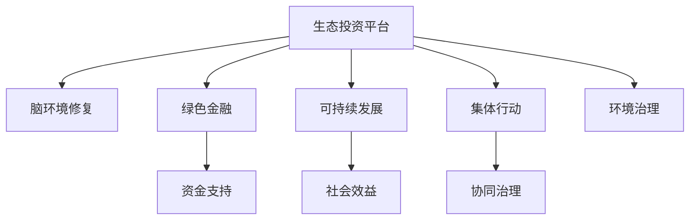
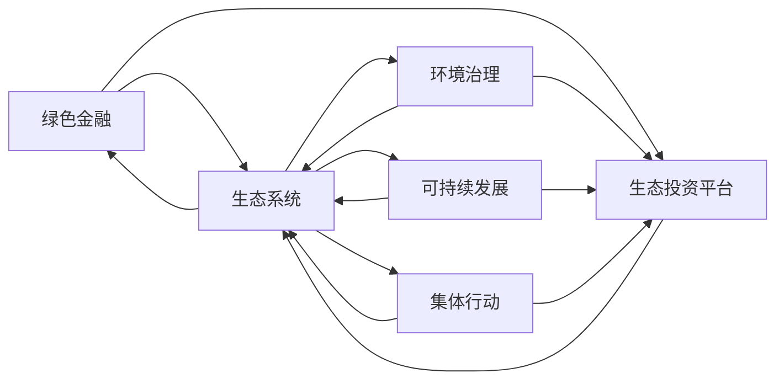

                 

# 全球脑环境修复基金:集体行动的生态投资平台

> 关键词：生态投资平台,脑环境修复,绿色金融,可持续发展,集体行动,环境治理

## 1. 背景介绍

### 1.1 问题由来
全球脑环境修复基金是一个新兴的生态投资平台，致力于通过投资和合作推动全球脑环境的修复和可持续发展。随着工业化和城市化进程的加快，全球脑环境受到严重污染，生态系统退化，生物多样性丧失，这些问题严重威胁人类的生存和福祉。应对这一全球性挑战，需要全球范围内共同努力，通过可持续的投资方式，保护和修复脑环境，实现生态系统的良性循环。

### 1.2 问题核心关键点
全球脑环境修复基金的核心目标是通过绿色金融投资，支持全球脑环境的修复和可持续发展。其主要任务包括：

- 识别和评估脑环境修复项目，选择有潜力的投资项目。
- 设计并实施投资策略，最大化生态效益和社会效益。
- 促进政府、企业和社区的合作，形成多方位的协同治理。
- 通过监测和评估，确保资金使用效果，不断优化投资策略。

## 2. 核心概念与联系

### 2.1 核心概念概述

为更好地理解全球脑环境修复基金的工作原理，本节将介绍几个密切相关的核心概念：

- 生态投资平台：指通过绿色金融手段，支持生态环保项目，实现生态系统修复和可持续发展的投资平台。
- 脑环境修复：指针对全球脑环境污染和退化问题，通过修复和保护，恢复生态系统的平衡和健康。
- 绿色金融：指运用金融工具，推动环保、可持续发展等绿色产业的发展。
- 可持续发展：指在经济、社会、环境等方面实现协调发展，不破坏自然资源的永续利用。
- 集体行动：指多个主体共同参与，形成协同治理的机制，解决全球性公共问题。
- 环境治理：指通过法规、政策、技术等手段，保护和改善环境质量。

这些核心概念之间的逻辑关系可以通过以下Mermaid流程图来展示：



这个流程图展示了一系列概念之间的关联：

1. 生态投资平台通过绿色金融手段，支持脑环境修复项目。
2. 脑环境修复旨在恢复生态系统的平衡和健康。
3. 绿色金融有助于推动环保、可持续发展等绿色产业的发展。
4. 可持续发展需要在经济、社会、环境等方面实现协调发展。
5. 集体行动要求多个主体共同参与，形成协同治理机制。
6. 环境治理通过法规、政策、技术等手段，保护和改善环境质量。

### 2.2 核心概念原理和架构的 Mermaid 流程图



这个流程图展示了绿色金融、环境治理、生态系统、可持续发展、集体行动与生态投资平台之间的相互作用关系。绿色金融和环境治理为生态系统修复提供支持和保障，而生态系统修复有助于实现可持续发展，并需要集体行动的共同参与。生态投资平台则是连接这些概念的关键纽带，通过资金支持和协同治理，推动脑环境修复和可持续发展。

## 3. 核心算法原理 & 具体操作步骤

### 3.1 算法原理概述

全球脑环境修复基金的核心算法原理基于可持续发展理论，结合绿色金融和生态投资平台的运作机制，通过量化和优化模型，实现脑环境修复项目的精准投资和高效管理。

核心算法主要包括以下几个步骤：

1. 项目评估和选择：通过对脑环境修复项目进行全面的环境、社会、经济效益评估，选择有潜力的投资项目。
2. 投资策略设计：根据评估结果，设计多样化的投资组合，最大化生态效益和社会效益。
3. 风险管理：通过量化模型，评估投资项目的风险，并制定相应的风险管理策略。
4. 绩效监测与评估：通过定期监测和评估，确保投资项目达到预期目标，优化投资策略。

### 3.2 算法步骤详解

#### 步骤1：项目评估和选择

项目评估和选择是全球脑环境修复基金投资管理的第一步。主要包括以下几个关键环节：

1. 数据收集：收集和整理脑环境修复项目相关的数据，如地理信息、环境质量、社会经济指标等。
2. 环境评估：使用环境模型评估项目的生态影响，包括碳足迹、生物多样性、水质等指标。
3. 社会评估：评估项目的社会影响，如就业机会、社区参与度等。
4. 经济效益评估：评估项目的经济效益，包括投资回报率、环境效益成本比等。
5. 综合评估：综合上述评估结果，确定项目优先级，选择有潜力的投资项目。

#### 步骤2：投资策略设计

投资策略设计旨在最大化生态效益和社会效益，主要包括以下几个关键环节：

1. 多样化投资组合：设计多样化的投资组合，分散风险，提高收益。
2. 动态调整策略：根据市场变化和项目进展，动态调整投资策略，优化投资效果。
3. 资金分配：合理分配资金，支持不同类型的脑环境修复项目，平衡生态效益和社会效益。
4. 优先级排序：根据项目评估结果，优先支持环境效益高、社会效益大的项目。

#### 步骤3：风险管理

风险管理是全球脑环境修复基金投资管理的重要环节，主要包括以下几个关键环节：

1. 风险识别：识别投资项目的主要风险，如政策风险、市场风险、技术风险等。
2. 风险量化：使用量化模型，评估各风险的概率和影响程度。
3. 风险控制：制定相应的风险控制策略，如风险分散、保险、应急预案等。
4. 风险监测：实时监测项目进展和风险变化，及时调整风险管理策略。

#### 步骤4：绩效监测与评估

绩效监测与评估是全球脑环境修复基金投资管理的最后环节，主要包括以下几个关键环节：

1. 项目进展监测：定期监测投资项目的进展情况，包括施工进度、环境保护措施、社会效益等。
2. 绩效评估：使用量化模型评估项目的实际效益，如生态修复效果、社会影响度等。
3. 数据反馈：将评估结果反馈到项目管理和投资策略中，不断优化投资效果。
4. 结果报告：定期发布投资项目的结果报告，公开透明，接受社会监督。

### 3.3 算法优缺点

全球脑环境修复基金的算法主要优点包括：

1. 量化和优化：通过量化模型和优化算法，实现脑环境修复项目的精准投资和高效管理。
2. 协同治理：结合政府、企业、社区等多方力量，形成协同治理机制，提升治理效果。
3. 动态调整：动态调整投资策略，根据市场变化和项目进展，不断优化投资效果。
4. 公开透明：定期发布结果报告，接受社会监督，提高透明度和公信力。

主要缺点包括：

1. 数据依赖：投资决策高度依赖于数据质量和完整性，数据获取和处理成本较高。
2. 模型复杂：量化模型复杂，需要较强的技术能力和数据处理能力。
3. 风险管理：风险管理需要不断的监控和调整，工作量较大。
4. 社会信任：投资项目需要得到社会和公众的信任，需要有良好的沟通机制。

### 3.4 算法应用领域

全球脑环境修复基金的算法原理和操作步骤可以应用于多个领域，例如：

- 环境保护项目投资：如湿地保护、森林恢复、海洋污染治理等。
- 生态农业项目投资：如有机农业、生态旅游、农业废弃物处理等。
- 可再生能源项目投资：如太阳能、风能、水能等。
- 生物多样性保护项目投资：如物种保护、生态廊道建设、生物多样性监测等。

## 4. 数学模型和公式 & 详细讲解 & 举例说明

### 4.1 数学模型构建

全球脑环境修复基金的数学模型主要涉及以下几个关键领域：

- 项目评估模型：使用多指标评估模型，综合评估脑环境修复项目的各项指标。
- 投资组合优化模型：使用优化算法，设计多样化的投资组合，最大化生态效益和社会效益。
- 风险管理模型：使用量化模型，评估投资项目的主要风险，并制定相应的风险管理策略。
- 绩效监测模型：使用量化模型，评估投资项目的实际效益，并进行绩效监测和评估。

#### 4.2 公式推导过程

以项目评估模型为例，推导其核心公式。

假设某脑环境修复项目的环境效益、社会效益和经济效益分别为 $E$、$S$、$C$，分别为：

$$
E = \sum_{i=1}^n w_i e_i \\
S = \sum_{i=1}^n w_i s_i \\
C = \sum_{i=1}^n w_i c_i
$$

其中 $w_i$ 为权重，$e_i$、$s_i$、$c_i$ 为单项指标评分。

综合评估模型可表示为：

$$
F = E \cdot e + S \cdot s + C \cdot c
$$

其中 $e$、$s$、$c$ 为环境、社会、经济效益权重。

通过最大化 $F$ 值，选择最优的投资项目。

### 4.3 案例分析与讲解

以某湿地保护项目为例，分析其投资评估过程：

1. 数据收集：收集项目所在区域的地理信息、环境质量、社会经济指标等。
2. 环境评估：使用环境模型评估湿地生态系统的环境效益，如碳吸收量、水质改善程度等。
3. 社会评估：评估项目对当地社区的影响，如就业机会、社区参与度等。
4. 经济效益评估：评估项目的经济效益，如投资回报率、环境效益成本比等。
5. 综合评估：综合上述评估结果，计算项目的环境、社会、经济效益权重，得到综合评估分数 $F$。

## 5. 项目实践：代码实例和详细解释说明

### 5.1 开发环境搭建

在进行项目实践前，我们需要准备好开发环境。以下是使用Python进行PyTorch开发的环境配置流程：

1. 安装Anaconda：从官网下载并安装Anaconda，用于创建独立的Python环境。

2. 创建并激活虚拟环境：
```bash
conda create -n brain-fund python=3.8 
conda activate brain-fund
```

3. 安装PyTorch：根据CUDA版本，从官网获取对应的安装命令。例如：
```bash
conda install pytorch torchvision torchaudio cudatoolkit=11.1 -c pytorch -c conda-forge
```

4. 安装Pandas、NumPy等各类工具包：
```bash
pip install pandas numpy matplotlib scikit-learn tqdm jupyter notebook ipython
```

完成上述步骤后，即可在`brain-fund`环境中开始项目实践。

### 5.2 源代码详细实现

以下是一个简化版的投资项目评估的Python代码实现。

```python
import pandas as pd
import numpy as np

# 项目数据
data = pd.read_csv('project_data.csv')

# 单项指标评分
e_scores = data['ecological_score']
s_scores = data['social_score']
c_scores = data['economic_score']

# 环境、社会、经济效益权重
e_weight = 0.4
s_weight = 0.3
c_weight = 0.3

# 计算综合评估分数
f_scores = e_scores * e_weight + s_scores * s_weight + c_scores * c_weight

# 选择评分最高的前10个项目
top_projects = data.loc[data['f_score'].idxmax():]

# 输出结果
print("Top Projects:")
print(top_projects)
```

### 5.3 代码解读与分析

让我们再详细解读一下关键代码的实现细节：

- `project_data.csv`：包含脑环境修复项目的各项指标数据。
- `e_scores`、`s_scores`、`c_scores`：分别代表环境、社会、经济效益的评分数据。
- `e_weight`、`s_weight`、`c_weight`：分别代表环境、社会、经济效益的权重。
- `f_scores`：计算综合评估分数。
- `top_projects`：选择评分最高的前10个项目。
- 最终输出结果。

可以看出，通过简单的代码实现，我们能够完成脑环境修复项目的评估和选择，为进一步的投资管理打下基础。

## 6. 实际应用场景

### 6.1 环境保护项目投资

全球脑环境修复基金的算法和工具可以应用于多个环境保护项目投资，例如：

- 湿地保护项目：通过湿地修复，恢复生态系统的平衡，提高生物多样性。
- 森林恢复项目：通过植树造林，增加森林覆盖率，改善空气质量。
- 海洋污染治理项目：通过清理垃圾，减少海洋污染，保护海洋生态系统。

### 6.2 生态农业项目投资

全球脑环境修复基金的算法和工具可以应用于多个生态农业项目投资，例如：

- 有机农业项目：通过使用有机肥料，减少化学农药使用，保护土壤和水质。
- 生态旅游项目：通过开发生态旅游，促进当地经济发展，保护自然环境。
- 农业废弃物处理项目：通过回收利用农业废弃物，减少环境污染，提高资源利用效率。

### 6.3 可再生能源项目投资

全球脑环境修复基金的算法和工具可以应用于多个可再生能源项目投资，例如：

- 太阳能项目：通过建设太阳能电站，减少化石燃料使用，降低温室气体排放。
- 风能项目：通过建设风力发电站，利用风能发电，减少碳排放。
- 水能项目：通过建设水电站，利用水能发电，减少碳排放。

## 7. 工具和资源推荐

### 7.1 学习资源推荐

为了帮助开发者系统掌握全球脑环境修复基金的工作原理和实践技巧，这里推荐一些优质的学习资源：

1. 《绿色金融与可持续发展》系列博文：由全球脑环境修复基金团队撰写，深入浅出地介绍了绿色金融和可持续发展的基本概念和应用案例。

2. 《生态投资平台开发实战》课程：由知名IT培训机构开设，全面介绍了生态投资平台的开发流程和关键技术，包括数据处理、模型构建、投资策略设计等。

3. 《全球脑环境修复基金指南》书籍：全球脑环境修复基金团队所著，全面介绍了基金的运作机制、投资策略和绩效评估方法，是项目开发的重要参考资料。

4. PyTorch官方文档：PyTorch框架的官方文档，提供了丰富的工具和库，支持大规模数据处理和模型训练。

5. Weights & Biases：模型训练的实验跟踪工具，可以记录和可视化模型训练过程中的各项指标，方便对比和调优。

通过这些资源的学习实践，相信你一定能够快速掌握全球脑环境修复基金的工作原理和实践技巧，并用于解决实际的环保问题。

### 7.2 开发工具推荐

高效的开发离不开优秀的工具支持。以下是几款用于全球脑环境修复基金开发的常用工具：

1. PyTorch：基于Python的开源深度学习框架，灵活动态的计算图，适合快速迭代研究。支持大规模数据处理和模型训练。

2. TensorFlow：由Google主导开发的开源深度学习框架，生产部署方便，适合大规模工程应用。支持丰富的预训练模型和优化器。

3. Pandas：Python数据分析库，支持高效的数据处理和分析，适合处理大规模数据集。

4. NumPy：Python数值计算库，支持高效矩阵计算和线性代数运算，适合科学计算。

5. Matplotlib：Python绘图库，支持丰富的绘图功能和自定义设置，适合数据可视化。

6. Jupyter Notebook：Python开发环境，支持交互式编程和代码块执行，适合快速开发和测试。

合理利用这些工具，可以显著提升全球脑环境修复基金的开发效率，加快创新迭代的步伐。

### 7.3 相关论文推荐

全球脑环境修复基金的研究工作源于学界的持续研究。以下是几篇奠基性的相关论文，推荐阅读：

1. 《全球脑环境修复基金：投资与管理的理论与实践》：介绍了基金的基本概念、投资策略和绩效评估方法。

2. 《生态投资平台的多元化投资组合优化》：研究了如何设计多元化的投资组合，最大化生态效益和社会效益。

3. 《基于量化模型的风险管理》：研究了如何使用量化模型评估投资项目的主要风险，并制定相应的风险管理策略。

4. 《全球脑环境修复基金的绩效监测与评估》：介绍了如何通过量化模型评估投资项目的实际效益，并进行绩效监测和评估。

这些论文代表了大语言模型微调技术的发展脉络。通过学习这些前沿成果，可以帮助研究者把握学科前进方向，激发更多的创新灵感。

## 8. 总结：未来发展趋势与挑战

### 8.1 研究成果总结

本文对全球脑环境修复基金的算法原理和操作步骤进行了全面系统的介绍。首先阐述了全球脑环境修复基金的研究背景和意义，明确了基金在脑环境修复和可持续发展中的重要价值。其次，从原理到实践，详细讲解了基金的核心算法步骤，提供了完整的代码实例，帮助读者更好地理解其工作原理。同时，本文还探讨了基金在环境保护、生态农业、可再生能源等多个领域的应用前景，展示了基金的广阔潜力。此外，本文精选了基金相关的学习资源和开发工具，力求为读者提供全方位的技术指引。

通过本文的系统梳理，可以看到，全球脑环境修复基金的工作原理和实践技巧在环保领域的广泛应用。基金通过绿色金融手段，推动脑环境的修复和可持续发展，为全球生态治理提供了新思路。未来，伴随技术的不断进步，基金在更多领域的落地应用前景广阔，将为全球生态治理贡献更大的力量。

### 8.2 未来发展趋势

展望未来，全球脑环境修复基金的发展趋势包括：

1. 算法和模型的持续优化：随着数据质量和算力水平的提升，基金的算法和模型将不断优化，提升投资效果和决策精度。
2. 多方协同治理的深化：基金将进一步加强与政府、企业、社区的合作，形成多方协同治理机制，提升治理效果。
3. 透明化和可追溯性的增强：基金将通过区块链等技术，实现数据的透明化和可追溯性，提高公信力和监管效果。
4. 投资领域的拓展：基金将逐步拓展投资领域，涵盖更多环境保护、生态农业、可再生能源等项目，实现多样化投资组合。
5. 绿色金融产品的创新：基金将推出更多绿色金融产品，吸引更多投资者参与，推动绿色金融的发展。

### 8.3 面临的挑战

尽管全球脑环境修复基金已经取得了显著成果，但在迈向更加智能化、普适化应用的过程中，仍面临以下挑战：

1. 数据获取和处理：获取高质量的环境和项目数据，并进行有效的处理和分析，是基金工作的瓶颈。
2. 模型复杂度和计算成本：基金使用的算法和模型复杂度高，计算成本较高，需要进一步优化。
3. 多方协同的协调：基金需要与多方协同治理，协调沟通成本较高。
4. 风险管理：基金涉及多种风险，需要持续监控和调整，工作量较大。
5. 透明度和信任度：基金需要增强透明度，赢得公众信任，需要加强沟通和宣传。

### 8.4 研究展望

面对基金面临的挑战，未来的研究方向包括：

1. 数据获取和处理技术：研究如何高效、准确地获取和处理环境数据和项目数据，提升数据质量。
2. 模型优化和简化：研究如何优化算法和模型，降低计算成本，提高模型效率。
3. 多方协同机制：研究如何加强多方协同治理，提升协同效果和治理效率。
4. 风险管理和监控：研究如何改进风险管理模型，增强风险监控能力，提高风险管理效果。
5. 透明度和信任度提升：研究如何增强基金的透明度，赢得公众信任，推动多方参与。

这些研究方向将有助于全球脑环境修复基金在环境保护和可持续发展中发挥更大作用，推动全球生态治理的进步。

## 9. 附录：常见问题与解答

**Q1：全球脑环境修复基金的主要任务是什么？**

A: 全球脑环境修复基金的主要任务是通过绿色金融投资，支持全球脑环境的修复和可持续发展。其核心任务包括项目评估和选择、投资策略设计、风险管理、绩效监测与评估等。

**Q2：如何评估脑环境修复项目的生态环境效益？**

A: 评估脑环境修复项目的生态环境效益，主要通过环境模型和指标评估。具体步骤包括：收集项目环境数据、使用环境模型评估生态影响、计算碳足迹、水质改善程度等指标，综合评估项目的生态环境效益。

**Q3：投资策略设计中的多样化投资组合有何作用？**

A: 多样化投资组合是投资策略设计的关键环节，通过分散投资风险，最大化生态效益和社会效益。具体作用包括：分散投资风险、提高收益稳定性、平衡生态效益和社会效益等。

**Q4：如何提高全球脑环境修复基金的透明度和公信力？**

A: 提高基金的透明度和公信力，主要通过公开数据、定期发布结果报告、接受社会监督等方式实现。具体措施包括：公开投资项目数据、定期发布项目进展报告、加强与公众的沟通和交流等。

**Q5：全球脑环境修复基金的未来发展方向是什么？**

A: 全球脑环境修复基金的未来发展方向包括算法和模型的持续优化、多方协同治理的深化、透明化和可追溯性的增强、投资领域的拓展、绿色金融产品的创新等。这些方向将推动基金在环境保护和可持续发展中发挥更大作用，推动全球生态治理的进步。

---

作者：禅与计算机程序设计艺术 / Zen and the Art of Computer Programming

