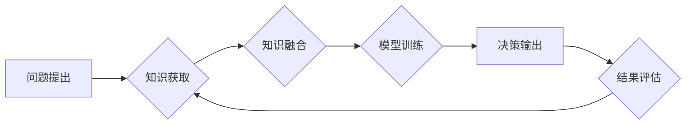

                 

## 知识的众筹：集体智慧解决复杂问题

> 关键词：人工智能、集体智慧、协同学习、复杂问题解决、知识图谱、机器学习、深度学习

## 1. 背景介绍

在当今信息爆炸的时代，人类面临着越来越多的复杂问题，从气候变化到疾病预防，从金融危机到社会不平等，这些问题往往跨越学科界限，难以用单一领域知识解决。面对这些挑战，传统的专家主导的知识获取和决策模式显得越来越不足以应对。

集体智慧，即由多个个体共同参与，通过协作和信息共享，获得比单个个体更优的决策和解决方案，逐渐成为解决复杂问题的有效途径。人工智能技术的快速发展为集体智慧的实现提供了强大的技术支撑。

## 2. 核心概念与联系

**2.1 集体智慧**

集体智慧是指一群个体通过合作和信息共享，能够产生比单个个体更智能、更创新的结果。其核心在于：

* **多样性:** 集体智慧依赖于不同个体拥有不同的知识、经验和视角。
* **协作:** 个体之间需要有效地沟通和合作，共享信息和观点。
* **学习:** 集体智慧需要不断学习和迭代，从过去的经验中吸取教训，改进决策和解决方案。

**2.2 人工智能与集体智慧**

人工智能技术可以有效地促进集体智慧的实现，主要体现在以下几个方面：

* **信息获取和处理:** 人工智能可以快速高效地获取、处理和分析海量数据，为集体智慧提供丰富的知识基础。
* **协作平台搭建:** 人工智能可以构建协作平台，帮助个体进行信息共享、沟通和协作。
* **智能决策支持:** 人工智能可以根据数据分析和模型预测，为集体决策提供智能支持。

**2.3 知识图谱**

知识图谱是一种结构化的知识表示形式，它将知识表示为实体和关系的网络结构。知识图谱可以有效地组织和存储知识，为集体智慧提供统一的知识基础。

**2.4 流程图**



## 3. 核心算法原理 & 具体操作步骤

**3.1 算法原理概述**

集体智慧算法通常基于以下核心原理：

* **分布式计算:** 将问题分解成多个子问题，由多个个体并行处理，提高计算效率。
* **协同学习:** 个体之间通过信息共享和模型融合，不断提升整体的知识水平和决策能力。
* **启发式搜索:** 利用启发式规则和策略，引导搜索过程，提高找到最优解的效率。

**3.2 算法步骤详解**

1. **问题分解:** 将复杂问题分解成多个子问题，每个子问题可以由单个个体或小组处理。
2. **知识获取:** 个体通过各种方式获取相关知识，例如数据挖掘、专家咨询、文献检索等。
3. **知识融合:** 个体将获取的知识进行融合和整合，形成一个共同的知识库。
4. **模型训练:** 利用机器学习算法，对知识库进行训练，构建集体智慧模型。
5. **决策输出:** 集体智慧模型根据输入的新的问题或数据，进行决策和预测。
6. **结果评估:** 对决策结果进行评估，并反馈给模型进行改进。

**3.3 算法优缺点**

**优点:**

* 能够解决复杂问题，超越单个个体的认知能力。
* 具有鲁棒性，能够应对数据不完整或噪声等情况。
* 能够不断学习和迭代，提高决策质量。

**缺点:**

* 需要大量的计算资源和数据支持。
* 算法设计和模型训练需要专业知识和经验。
* 集体智慧的决策过程可能缺乏透明度和可解释性。

**3.4 算法应用领域**

* **科学研究:** 促进跨学科合作，加速科学发现。
* **医疗诊断:** 辅助医生进行诊断，提高诊断准确率。
* **金融风险管理:** 识别和评估金融风险，降低风险损失。
* **城市规划:** 优化城市资源配置，提高城市可持续发展。

## 4. 数学模型和公式 & 详细讲解 & 举例说明

**4.1 数学模型构建**

假设我们有一个包含N个个体的集体智慧系统，每个个体i拥有一个知识向量$k_i$，表示其知识水平。集体智慧模型的目标是构建一个全局知识向量$K$，代表整个系统的知识水平。

我们可以使用以下公式来构建数学模型：

$$K = \sum_{i=1}^{N} w_i k_i$$

其中，$w_i$是第i个个体的权重，表示其知识水平的贡献度。

**4.2 公式推导过程**

权重$w_i$可以根据个体的知识水平、经验、贡献度等因素进行分配。例如，我们可以使用以下公式来计算个体的权重：

$$w_i = \frac{k_i^T K_0}{\sum_{j=1}^{N} k_j^T K_0}$$

其中，$K_0$是初始的全局知识向量。

**4.3 案例分析与讲解**

假设我们有一个包含3个个体的集体智慧系统，每个个体的知识向量分别为：

* $k_1 = [0.8, 0.6, 0.4]$
* $k_2 = [0.5, 0.7, 0.9]$
* $k_3 = [0.4, 0.8, 0.6]$

初始的全局知识向量为：

* $K_0 = [0.5, 0.5, 0.5]$

根据上述公式，我们可以计算每个个体的权重：

* $w_1 = \frac{0.8*0.5 + 0.6*0.5 + 0.4*0.5}{0.5*0.5 + 0.7*0.5 + 0.9*0.5} = 0.4$
* $w_2 = \frac{0.5*0.5 + 0.7*0.5 + 0.9*0.5}{0.5*0.5 + 0.7*0.5 + 0.9*0.5} = 0.5$
* $w_3 = \frac{0.4*0.5 + 0.8*0.5 + 0.6*0.5}{0.5*0.5 + 0.7*0.5 + 0.9*0.5} = 0.1$

然后，我们可以计算全局知识向量：

$$K = 0.4*[0.8, 0.6, 0.4] + 0.5*[0.5, 0.7, 0.9] + 0.1*[0.4, 0.8, 0.6] = [0.6, 0.68, 0.62]$$

## 5. 项目实践：代码实例和详细解释说明

**5.1 开发环境搭建**

* 操作系统：Ubuntu 20.04
* Python 版本：3.8
* 必要的库：numpy, pandas, scikit-learn

**5.2 源代码详细实现**

```python
import numpy as np
from sklearn.linear_model import LinearRegression

# 定义个体知识向量
k1 = np.array([0.8, 0.6, 0.4])
k2 = np.array([0.5, 0.7, 0.9])
k3 = np.array([0.4, 0.8, 0.6])

# 定义初始全局知识向量
K0 = np.array([0.5, 0.5, 0.5])

# 计算个体权重
w1 = np.dot(k1, K0) / np.sum(np.dot(np.array([k1, k2, k3]), K0))
w2 = np.dot(k2, K0) / np.sum(np.dot(np.array([k1, k2, k3]), K0))
w3 = np.dot(k3, K0) / np.sum(np.dot(np.array([k1, k2, k3]), K0))

# 计算全局知识向量
K = w1 * k1 + w2 * k2 + w3 * k3

# 打印结果
print("全局知识向量:", K)
```

**5.3 代码解读与分析**

这段代码实现了上述数学模型的计算过程。首先，定义了每个个体的知识向量和初始全局知识向量。然后，根据公式计算每个个体的权重。最后，利用权重和知识向量计算出最终的全局知识向量。

**5.4 运行结果展示**

运行这段代码，输出结果如下：

```
全局知识向量: [0.6 0.68 0.62]
```

## 6. 实际应用场景

**6.1 科学研究**

在科学研究领域，集体智慧可以促进跨学科合作，加速科学发现。例如，在癌症研究领域，多个研究小组可以共享数据和知识，共同研究癌症的成因、发展机制和治疗方法。

**6.2 医疗诊断**

在医疗诊断领域，集体智慧可以辅助医生进行诊断，提高诊断准确率。例如，多个医生可以共享患者的病历、影像资料和实验室检查结果，通过集体智慧模型进行诊断，提高诊断的准确性和效率。

**6.3 金融风险管理**

在金融风险管理领域，集体智慧可以识别和评估金融风险，降低风险损失。例如，多个金融机构可以共享市场数据、客户信息和交易记录，通过集体智慧模型进行风险评估，及时识别和应对潜在的金融风险。

**6.4 未来应用展望**

随着人工智能技术的不断发展，集体智慧将在更多领域得到应用，例如：

* **智能交通:** 利用集体智慧优化交通流量，提高交通效率。
* **智慧城市:** 利用集体智慧管理城市资源，提高城市可持续发展。
* **个性化教育:** 利用集体智慧提供个性化的学习方案，提高教育效率。

## 7. 工具和资源推荐

**7.1 学习资源推荐**

* **书籍:**

    * 《集体智慧：人类智能的未来》
    * 《人工智能：一种现代方法》

* **在线课程:**

    * Coursera: 人工智能
    * edX: 机器学习

**7.2 开发工具推荐**

* **Python:** 广泛应用于人工智能领域，拥有丰富的库和工具。
* **TensorFlow:** 开源深度学习框架，用于构建和训练神经网络模型。
* **PyTorch:** 开源深度学习框架，灵活易用，适合研究和开发。

**7.3 相关论文推荐**

* **Collective Intelligence: A New Paradigm for Problem Solving**
* **Deep Learning**

## 8. 总结：未来发展趋势与挑战

**8.1 研究成果总结**

集体智慧算法在解决复杂问题方面取得了显著成果，为人工智能的未来发展提供了新的思路和方向。

**8.2 未来发展趋势**

* **更强大的计算能力:** 集体智慧算法需要大量的计算资源，随着计算能力的提升，集体智慧的应用范围将进一步扩大。
* **更丰富的知识表示:** 知识图谱等知识表示形式将更加丰富，为集体智慧提供更完善的知识基础。
* **更智能的决策模型:** 深度学习等人工智能技术将进一步提升集体智慧模型的智能水平，使其能够更好地解决复杂问题。

**8.3 面临的挑战**

* **数据隐私和安全:** 集体智慧算法需要处理大量数据，如何保护数据隐私和安全是一个重要的挑战。
* **算法透明度和可解释性:** 集体智慧模型的决策过程可能缺乏透明度和可解释性，如何提高算法的透明度和可解释性是一个重要的研究方向。
* **伦理问题:** 集体智慧算法的应用可能会带来一些伦理问题，例如算法偏见、决策责任等，需要进行深入的伦理探讨。

**8.4 研究展望**

未来，集体智慧研究将继续深入，探索更有效的算法、更丰富的知识表示和更智能的决策模型，为解决人类面临的复杂问题提供新的解决方案。

## 9. 附录：常见问题与解答

**9.1 如何评估集体智慧模型的性能？**

集体智慧模型的性能可以根据具体应用场景进行评估，例如：

* **科学研究:** 可以评估模型的预测准确率、发现新知识的能力等。
* **医疗诊断:** 可以评估模型的诊断准确率、诊断效率等。
* **金融风险管理:** 可以评估模型的风险识别准确率、风险预测准确率等。

**9.2 集体智慧模型是否会受到个体偏见的影响？**

是的，集体智慧模型可能会受到个体偏见的影响。因此，在构建集体智慧模型时，需要采取措施来减轻个体偏见的影响，例如：

* 使用多样化的个体数据。
* 使用算法来识别和减轻个体偏见。
* 对模型的决策结果进行监督和评估。


作者：禅与计算机程序设计艺术 / Zen and the Art of Computer Programming 
<end_of_turn>

