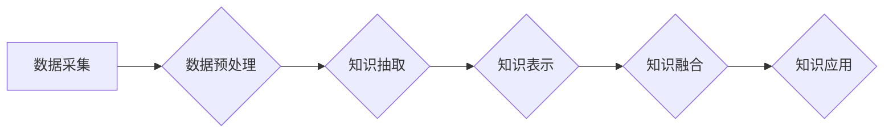

                 

## 知识的融合：跨学科研究与知识发现

> 关键词：跨学科研究、知识发现、人工智能、机器学习、数据挖掘、知识图谱、深度学习

### 1. 背景介绍

在信息爆炸的时代，海量数据无处不在，但这些数据本身并无价值，只有通过挖掘和融合才能转化为有意义的知识。知识发现 (Knowledge Discovery, KD) 作为数据挖掘的重要分支，旨在从海量数据中提取隐藏的模式、规律和知识，为人类决策提供支持。然而，传统的知识发现方法往往局限于单一领域的数据分析，难以应对跨学科研究的复杂需求。

跨学科研究 (Interdisciplinary Research) 旨在打破学科壁垒，整合不同领域的知识和方法，以解决复杂问题。随着科技的进步，跨学科研究日益重要，但其面临着知识融合的挑战。如何有效地将不同领域的知识整合在一起，形成新的知识体系，是跨学科研究的关键问题。

### 2. 核心概念与联系

**2.1 知识发现 (Knowledge Discovery)**

知识发现是指从数据中提取隐藏的知识的过程，它是一个复杂的迭代过程，包括数据预处理、数据挖掘、模式识别、知识表示和知识评估等多个步骤。

**2.2 跨学科研究 (Interdisciplinary Research)**

跨学科研究是指将不同学科的知识和方法整合在一起，以解决复杂问题。它需要跨越学科界限，打破思维模式的局限，才能获得新的见解和突破。

**2.3 知识融合 (Knowledge Integration)**

知识融合是指将不同来源、不同形式的知识整合在一起，形成一个统一的知识体系。它需要解决知识表示、知识匹配、知识推理等问题。

**2.4 知识图谱 (Knowledge Graph)**

知识图谱是一种基于知识表示的数据库，它以实体和关系为节点，构建一个知识网络。知识图谱可以有效地存储和组织知识，并支持知识查询、推理和挖掘。

**2.5 跨学科知识融合架构**



### 3. 核心算法原理 & 具体操作步骤

**3.1 算法原理概述**

跨学科知识融合的核心算法通常基于机器学习和深度学习技术，通过训练模型，学习不同领域知识之间的关系，并实现知识的整合和推理。常见的算法包括：

* **知识图谱嵌入 (Knowledge Graph Embedding)**：将知识图谱中的实体和关系映射到低维向量空间，通过向量之间的相似度计算知识关系。
* **深度神经网络 (Deep Neural Network)**：利用多层神经网络结构，学习复杂知识关系，并实现知识推理和预测。
* **迁移学习 (Transfer Learning)**：将已训练好的模型迁移到新的领域，利用已有知识加速知识融合过程。

**3.2 算法步骤详解**

1. **数据收集和预处理**: 从不同领域收集相关数据，并进行清洗、转换和格式化，以便于后续算法处理。
2. **知识抽取**: 利用自然语言处理 (NLP) 技术，从文本数据中提取实体、关系和事件等知识。
3. **知识表示**: 将提取的知识表示为机器可理解的形式，例如知识图谱、向量表示等。
4. **知识融合**: 利用机器学习或深度学习算法，将不同领域知识进行融合，构建一个统一的知识体系。
5. **知识应用**: 将融合后的知识应用于实际问题，例如知识问答、推荐系统、决策支持等。

**3.3 算法优缺点**

* **优点**: 能够有效地整合不同领域知识，发现隐藏的知识关系，并支持知识推理和应用。
* **缺点**: 需要大量的训练数据，算法训练复杂，对计算资源要求较高。

**3.4 算法应用领域**

* **医疗保健**: 将医学文献、患者数据、基因信息等不同领域知识融合，辅助疾病诊断、治疗方案制定等。
* **金融**: 将金融市场数据、客户行为数据、风险评估模型等不同领域知识融合，进行风险管理、投资决策等。
* **教育**: 将教学内容、学生学习数据、教育资源等不同领域知识融合，个性化教学、学习评估等。

### 4. 数学模型和公式 & 详细讲解 & 举例说明

**4.1 数学模型构建**

知识融合可以建模为一个图论问题，其中实体和关系作为图的节点和边。

* **实体**: 代表知识中的基本概念或对象。
* **关系**: 代表实体之间的连接或关联。

**4.2 公式推导过程**

知识图谱嵌入算法通常使用矩阵分解方法，将实体和关系映射到低维向量空间。例如，TransE 模型使用以下公式：

$$h + r \approx t$$

其中，h、r、t 分别代表实体 h、关系 r 和实体 t 的向量表示。

**4.3 案例分析与讲解**

假设我们有一个知识图谱，包含实体 "苹果"、"香蕉"、"水果" 和关系 "是"。

* 实体向量：
    * 苹果: [0.2, 0.5, 0.1]
    * 香蕉: [0.3, 0.4, 0.2]
    * 水果: [0.1, 0.3, 0.5]
* 关系向量：
    * 是: [0.1, 0.2, 0.3]

根据 TransE 模型公式，我们可以计算出 "苹果 是 水果" 的预测向量：

* 苹果 + 是 ≈ 水果
* [0.2, 0.5, 0.1] + [0.1, 0.2, 0.3] ≈ [0.1, 0.3, 0.5]

结果表明，"苹果 是 水果" 的预测向量与实际的 "水果" 向量相近，说明模型能够正确预测知识关系。

### 5. 项目实践：代码实例和详细解释说明

**5.1 开发环境搭建**

* Python 3.x
* TensorFlow 或 PyTorch 深度学习框架
* NetworkX 图论库

**5.2 源代码详细实现**

```python
import networkx as nx
from tensorflow.keras.models import Sequential
from tensorflow.keras.layers import Embedding, Dot

# 构建知识图谱
graph = nx.Graph()
graph.add_nodes_from(["苹果", "香蕉", "水果"])
graph.add_edge("苹果", "是", "水果")

# 实体和关系向量化
num_entities = len(graph.nodes)
num_relations = len(list(graph.edges))
embedding_dim = 100

entity_embeddings = Embedding(num_entities, embedding_dim)(
    np.arange(num_entities)
)
relation_embeddings = Embedding(num_relations, embedding_dim)(
    np.arange(num_relations)
)

# 构建 TransE 模型
model = Sequential()
model.add(Dot(axes=1, normalize=True))

# 训练模型
# ...

# 预测知识关系
# ...
```

**5.3 代码解读与分析**

* 构建知识图谱：使用 NetworkX 库构建一个简单的知识图谱，包含实体和关系。
* 向量化：使用 TensorFlow 的 Embedding 层将实体和关系映射到低维向量空间。
* 构建 TransE 模型：使用 Dot 层计算实体和关系的向量和，预测知识关系。
* 训练模型：使用训练数据训练 TransE 模型，学习实体和关系之间的关系。
* 预测知识关系：使用训练好的模型预测新的知识关系。

**5.4 运行结果展示**

训练好的模型可以用于预测新的知识关系，例如 "香蕉 是 水果"。模型的预测结果可以评估其准确性，并进行进一步的优化。

### 6. 实际应用场景

**6.1 医疗保健**

* 辅助疾病诊断：将患者症状、病史、医学文献等知识融合，提高疾病诊断的准确性。
* 个性化治疗方案：根据患者基因信息、生活习惯等知识，制定个性化的治疗方案。

**6.2 金融**

* 风险管理：将金融市场数据、客户行为数据、风险评估模型等知识融合，识别和评估金融风险。
* 投资决策：根据市场趋势、公司财务数据等知识，进行智能投资决策。

**6.3 教育**

* 个性化教学：根据学生的学习进度、兴趣爱好等知识，提供个性化的教学内容和学习路径。
* 学习评估：利用学生的学习数据、考试成绩等知识，进行更加精准的学习评估。

**6.4 未来应用展望**

随着人工智能技术的不断发展，跨学科知识融合将应用于更多领域，例如：

* 科学研究：将不同学科的知识融合，加速科学发现。
* 社会治理：将社会数据、政策法规等知识融合，提高社会治理效率。
* 人机交互：将自然语言处理、计算机视觉等知识融合，实现更加自然的人机交互。

### 7. 工具和资源推荐

**7.1 学习资源推荐**

* **书籍**:
    * 《知识发现与数据挖掘》
    * 《深度学习》
    * 《图神经网络》
* **在线课程**:
    * Coursera: 数据挖掘与机器学习
    * edX: 深度学习
    * Udacity: 图神经网络

**7.2 开发工具推荐**

* **Python**: 广泛应用于数据科学和人工智能领域。
* **TensorFlow**: 开源深度学习框架，提供丰富的工具和资源。
* **PyTorch**: 开源深度学习框架，以其灵活性和易用性而闻名。
* **NetworkX**: 图论库，用于构建和分析知识图谱。

**7.3 相关论文推荐**

* 《TransE: Embedding entities and relations for learning and reasoning in knowledge graphs》
* 《Knowledge Graph Embedding: A Survey》
* 《Graph Neural Networks》

### 8. 总结：未来发展趋势与挑战

**8.1 研究成果总结**

跨学科知识融合取得了显著进展，在医疗保健、金融、教育等领域取得了应用成功。

**8.2 未来发展趋势**

* **更强大的模型**: 开发更强大的深度学习模型，能够学习更复杂和更丰富的知识关系。
* **跨语言知识融合**: 实现跨语言知识融合，打破语言障碍，促进全球知识共享。
* **解释性 AI**: 开发能够解释其推理过程的知识融合模型，提高模型的可信度和可解释性。

**8.3 面临的挑战**

* **数据质量**: 跨学科数据往往质量参差不齐，需要进行有效的数据清洗和预处理。
* **知识表示**: 如何有效地表示不同领域知识，并进行融合，仍然是一个挑战。
* **模型可解释性**: 深度学习模型的复杂性使得其推理过程难以解释，需要开发更可解释的模型。

**8.4 研究展望**

未来，跨学科知识融合将继续是一个重要的研究方向，需要跨学科合作，推动人工智能技术的发展，并为人类社会带来更多价值。

### 9. 附录：常见问题与解答

* **Q1: 跨学科知识融合与数据挖掘有什么区别？**

* **A1**: 数据挖掘侧重于从单一领域的数据中发现模式和规律，而跨学科知识融合则将不同领域知识整合在一起，形成更完整的知识体系。

* **Q2: 如何评估跨学科知识融合模型的性能？**

* **A2**: 可以使用准确率、召回率、F1-score等指标评估知识关系预测的性能。

* **Q3: 跨学科知识融合有哪些应用场景？**

* **A3**: 跨学科知识融合应用于医疗保健、金融、教育等多个领域，例如辅助疾病诊断、个性化治疗方案、风险管理、投资决策、个性化教学等。


作者：禅与计算机程序设计艺术 / Zen and the Art of Computer Programming 
<end_of_turn>

