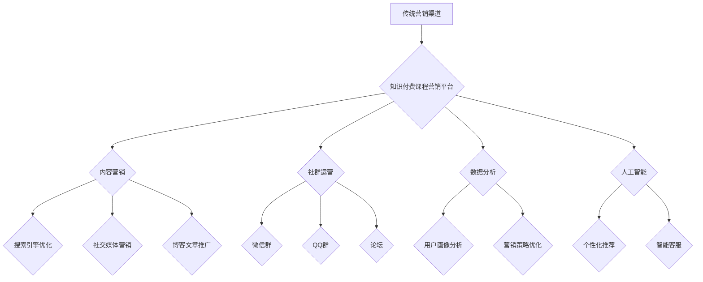

                 

## 知识经济时代下的知识付费创新课程营销渠道拓展

> 关键词：知识付费、课程营销、在线教育、数字化转型、内容营销、社群运营、数据分析、人工智能

### 1. 背景介绍

知识经济时代，知识成为最宝贵的生产要素。在线教育平台的兴起，为知识付费提供了广阔的市场空间。然而，知识付费市场竞争激烈，如何有效地推广课程，吸引用户付费成为摆在平台和创作者面前的难题。传统课程营销模式面临着诸多挑战，例如信息传播受限、用户触达成本高、转化率低等。因此，探索新的课程营销渠道，创新营销模式，是知识付费行业发展的重要趋势。

### 2. 核心概念与联系

**2.1 知识付费的核心概念**

知识付费是指以知识、技能、经验等为核心内容，通过付费的方式获取知识和服务的商业模式。它涵盖了各种形式的知识产品，例如在线课程、电子书、付费咨询、会员服务等。

**2.2 课程营销的核心概念**

课程营销是指围绕知识付费产品，通过一系列的营销活动，吸引目标用户，促成付费购买的商业活动。它包括课程推广、用户引流、转化提升、用户关系维护等环节。

**2.3 知识付费课程营销渠道拓展的联系**

知识付费课程营销渠道拓展是指在传统营销渠道的基础上，探索和利用新的营销渠道，扩大课程的传播范围，提升用户触达效率，最终实现课程销售目标。

**2.4 课程营销渠道拓展的架构**



### 3. 核心算法原理 & 具体操作步骤

**3.1 算法原理概述**

知识付费课程营销渠道拓展的核心算法原理是基于用户行为数据分析和人工智能技术，实现精准用户画像、个性化推荐和智能化营销。

**3.2 算法步骤详解**

1. **数据采集:** 收集用户行为数据，例如浏览记录、购买记录、评论反馈等。
2. **数据清洗:** 对收集到的数据进行清洗和处理，去除无效数据和噪声数据。
3. **用户画像构建:** 利用机器学习算法，对用户行为数据进行分析，构建用户画像，包括用户兴趣、偏好、购买习惯等。
4. **课程推荐:** 根据用户画像，利用推荐算法，推荐用户可能感兴趣的课程。
5. **营销策略优化:** 分析用户行为数据和营销活动效果，优化营销策略，提高营销效率。

**3.3 算法优缺点**

**优点:**

* 精准用户定位: 基于数据分析，精准识别目标用户群体。
* 个性化推荐: 根据用户兴趣和偏好，提供个性化课程推荐。
* 提高转化率: 通过精准营销，提高用户付费意愿和转化率。
* 降低营销成本: 通过数据分析和智能化营销，降低营销成本。

**缺点:**

* 数据依赖性强: 算法效果依赖于数据质量和数据量。
* 算法复杂度高: 需要专业的技术人员进行算法开发和维护。
* 隐私安全问题: 需要妥善处理用户隐私数据，避免泄露和滥用。

**3.4 算法应用领域**

* 在线教育平台
* 电商平台
* 内容平台
* 社交媒体平台

### 4. 数学模型和公式 & 详细讲解 & 举例说明

**4.1 数学模型构建**

知识付费课程营销渠道拓展的数学模型可以基于用户行为数据和营销活动效果进行构建。例如，可以构建一个用户转化率模型，预测用户在不同营销渠道下的转化率。

**4.2 公式推导过程**

用户转化率模型可以采用逻辑回归模型进行构建。逻辑回归模型将用户特征作为输入，预测用户是否转化为付费用户。模型的输出是一个概率值，表示用户转化为付费用户的可能性。

**公式:**

$$P(y=1|x) = \frac{1}{1 + e^{-(w^T x + b)}}$$

其中:

* $P(y=1|x)$ 是用户转化为付费用户的概率。
* $x$ 是用户的特征向量。
* $w$ 是模型的权重向量。
* $b$ 是模型的偏置项。

**4.3 案例分析与讲解**

假设一个在线教育平台想要预测用户在社交媒体广告下的转化率。可以收集用户在社交媒体平台上的行为数据，例如用户年龄、性别、兴趣爱好、浏览记录、点击记录等。然后，利用逻辑回归模型对这些数据进行训练，构建用户转化率模型。

通过模型预测，可以得到不同用户群体的转化率，例如，18-25岁女性用户在社交媒体广告下的转化率可能比其他用户群体更高。平台可以根据模型预测结果，优化社交媒体广告投放策略，提高广告效果。

### 5. 项目实践：代码实例和详细解释说明

**5.1 开发环境搭建**

* Python 3.x
* Jupyter Notebook
* scikit-learn

**5.2 源代码详细实现**

```python
from sklearn.linear_model import LogisticRegression
from sklearn.model_selection import train_test_split
from sklearn.metrics import accuracy_score

# 加载数据
data = pd.read_csv('user_data.csv')

# 划分训练集和测试集
X = data.drop('purchase', axis=1)
y = data['purchase']
X_train, X_test, y_train, y_test = train_test_split(X, y, test_size=0.2, random_state=42)

# 训练逻辑回归模型
model = LogisticRegression()
model.fit(X_train, y_train)

# 预测测试集结果
y_pred = model.predict(X_test)

# 计算模型准确率
accuracy = accuracy_score(y_test, y_pred)
print('模型准确率:', accuracy)
```

**5.3 代码解读与分析**

* 首先，加载用户数据，并划分训练集和测试集。
* 然后，使用逻辑回归模型训练模型，并预测测试集结果。
* 最后，计算模型准确率，评估模型性能。

**5.4 运行结果展示**

运行代码后，可以得到模型的准确率，例如，模型准确率为0.85，表示模型在预测用户是否购买课程方面准确率为85%。

### 6. 实际应用场景

**6.1 在线教育平台**

在线教育平台可以利用知识付费课程营销渠道拓展，通过内容营销、社群运营、数据分析等方式，吸引用户注册、学习课程，最终实现付费购买。

**6.2 电商平台**

电商平台可以利用知识付费课程营销渠道拓展，为用户提供产品使用技巧、产品知识等课程，提升用户粘性，促进产品销售。

**6.3 内容平台**

内容平台可以利用知识付费课程营销渠道拓展，将优质内容转化为付费课程，增加平台收入。

**6.4 社交媒体平台**

社交媒体平台可以利用知识付费课程营销渠道拓展，为用户提供专业技能培训、兴趣爱好课程等，增加平台用户活跃度和收入。

**6.5 未来应用展望**

随着人工智能技术的不断发展，知识付费课程营销渠道拓展将更加智能化、个性化。例如，可以利用人工智能技术，实现自动生成课程推荐、自动生成营销文案、自动进行用户画像分析等，进一步提升营销效率和用户体验。

### 7. 工具和资源推荐

**7.1 学习资源推荐**

* 在线课程平台：Coursera、edX、Udemy
* 博客网站：Towards Data Science、Machine Learning Mastery
* 书籍：《Python Machine Learning》、《Hands-On Machine Learning with Scikit-Learn, Keras & TensorFlow》

**7.2 开发工具推荐**

* Python 编程语言
* Jupyter Notebook
* scikit-learn 机器学习库
* TensorFlow 深度学习库

**7.3 相关论文推荐**

* 《Collaborative Filtering for Implicit Feedback Datasets》
* 《Deep Learning for Recommender Systems》
* 《Personalized Recommendations Using Matrix Factorization Techniques》

### 8. 总结：未来发展趋势与挑战

**8.1 研究成果总结**

知识付费课程营销渠道拓展是一个快速发展的领域，已经取得了一些显著成果。例如，利用数据分析和人工智能技术，可以实现精准用户定位、个性化推荐和智能化营销，提高营销效率和用户体验。

**8.2 未来发展趋势**

未来，知识付费课程营销渠道拓展将朝着以下几个方向发展：

* **更加智能化:** 利用人工智能技术，实现自动生成课程推荐、自动生成营销文案、自动进行用户画像分析等，进一步提升营销效率和用户体验。
* **更加个性化:** 根据用户的个性化需求，提供更加个性化的课程推荐和营销服务。
* **更加多元化:** 探索新的营销渠道，例如元宇宙、虚拟现实等，拓展知识付费的应用场景。

**8.3 面临的挑战**

知识付费课程营销渠道拓展也面临一些挑战：

* **数据安全和隐私保护:** 需要妥善处理用户隐私数据，避免泄露和滥用。
* **算法模型的准确性和可靠性:** 需要不断改进算法模型，提高其准确性和可靠性。
* **用户信任和接受度:** 需要不断提升用户对知识付费的信任和接受度。

**8.4 研究展望**

未来，需要进一步研究知识付费课程营销渠道拓展的理论和实践，探索新的营销模式和技术，推动知识付费行业健康发展。

### 9. 附录：常见问题与解答

**9.1 如何选择合适的营销渠道？**

选择合适的营销渠道需要根据目标用户群体、课程内容、平台资源等因素进行综合考虑。

**9.2 如何提高用户转化率？**

提高用户转化率需要从以下几个方面入手：

* 精准用户定位
* 个性化推荐
* 优质课程内容
* 优惠促销活动

**9.3 如何保障用户数据安全？**

保障用户数据安全需要采取以下措施：

* 加密传输数据
* 加密存储数据
* 严格控制数据访问权限
* 定期进行安全 audits


作者：禅与计算机程序设计艺术 / Zen and the Art of Computer Programming 
<end_of_turn>

