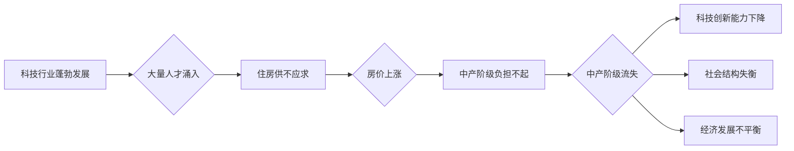

                 

## 硅谷高房价影响:中产阶级的流失

> 关键词：硅谷、房价、中产阶级、流失、技术人才、经济发展、社会影响、可持续发展

## 1. 背景介绍

硅谷，作为全球科技创新中心，一直以其蓬勃发展的经济和吸引人的工作机会闻名。然而，近年来，硅谷的房价飞涨，已经成为一个严重影响该地区经济和社会发展的关键问题。高房价导致中产阶级难以负担住房成本，被迫离开硅谷，这不仅会削弱硅谷的科技创新能力，还会对整个美国经济造成负面影响。

### 1.1 硅谷房价上涨趋势

自2000年以来，硅谷的房价已经上涨了超过 500%，远超其他地区的平均水平。这主要得益于硅谷科技行业的蓬勃发展，大量高薪工作吸引了大量人才涌入，导致住房供不应求。

### 1.2 中产阶级流失现状

高房价导致许多中产阶级家庭难以负担住房成本，被迫离开硅谷。根据一些研究数据，近年来硅谷的中产阶级流失率显著提高，许多技术人才选择前往其他城市或国家寻找更经济实惠的居住环境。

### 1.3 影响与挑战

硅谷中产阶级流失对该地区经济和社会发展带来了诸多挑战：

* **科技创新能力下降:** 中产阶级是科技创新的重要力量，他们的流失将削弱硅谷的科技创新能力。
* **社会结构失衡:** 中产阶级流失会导致硅谷社会结构失衡，加剧贫富差距。
* **经济发展不平衡:** 中产阶级流失将影响硅谷的经济发展，导致经济增长放缓。

## 2. 核心概念与联系

### 2.1 房价上涨机制

硅谷房价上涨是一个复杂的系统性问题，涉及多个因素的相互作用。

* **供需失衡:** 硅谷科技行业的蓬勃发展吸引了大量人才涌入，导致住房供不应求，房价上涨。
* **金融杠杆:** 低利率和宽松的贷款政策使得购房者更容易获得贷款，加剧了房价上涨。
* **投资炒房:** 房地产投资成为一种热门投资方式，炒房行为也推高了房价。

### 2.2 中产阶级流失影响

中产阶级流失对硅谷经济和社会发展的影响是多方面的：

* **人才流失:** 中产阶级是科技创新的重要力量，他们的流失将削弱硅谷的科技创新能力。
* **消费下降:** 中产阶级是消费的主要群体，他们的流失将导致消费下降，影响经济增长。
* **社会稳定性下降:** 中产阶级流失会导致社会结构失衡，加剧贫富差距，影响社会稳定性。

### 2.3  Mermaid 流程图



## 3. 核心算法原理 & 具体操作步骤

为了更好地理解硅谷房价上涨和中产阶级流失的复杂机制，我们可以使用一些算法模型进行分析和预测。

### 3.1 算法原理概述

* **房价预测模型:** 可以使用机器学习算法，例如线性回归、支持向量机、神经网络等，对硅谷房价进行预测。这些模型需要大量的历史房价数据作为训练样本，并根据房价影响因素，例如地理位置、房屋面积、房龄等，建立预测模型。
* **人才流失模型:** 可以使用人口流动模型，例如微分方程模型、Agent-based模型等，模拟人才流失的动态过程。这些模型需要考虑人才流失的驱动因素，例如房价、工资水平、生活成本等，并模拟人才在不同城市之间的流动。

### 3.2 算法步骤详解

* **数据收集:** 收集硅谷房价、人口流动、经济发展等相关数据。
* **数据预处理:** 对收集到的数据进行清洗、转换、标准化等预处理操作。
* **模型构建:** 选择合适的算法模型，并根据数据特征进行模型训练。
* **模型评估:** 使用测试数据对模型进行评估，并调整模型参数以提高预测精度。
* **结果分析:** 分析模型预测结果，并结合实际情况进行解释和解读。

### 3.3 算法优缺点

* **优点:** 算法模型可以帮助我们更好地理解硅谷房价上涨和中产阶级流失的复杂机制，并提供预测和分析结果，为制定政策和应对挑战提供参考。
* **缺点:** 算法模型的预测结果仅供参考，需要结合实际情况进行判断。此外，算法模型的准确性取决于数据质量和模型选择，需要不断改进和完善。

### 3.4 算法应用领域

* **房地产市场分析:** 预测房价趋势、评估房产价值、分析市场风险。
* **城市规划:** 规划城市发展方向、优化城市布局、解决住房问题。
* **人才流动研究:** 分析人才流失原因、预测人才流动趋势、制定人才引进政策。

## 4. 数学模型和公式 & 详细讲解 & 举例说明

### 4.1 数学模型构建

我们可以使用以下数学模型来描述硅谷房价上涨和中产阶级流失的动态过程：

* **房价上涨模型:**

$$
\frac{dP}{dt} = kP(1-\frac{P}{K})
$$

其中：

* $P$ 表示房价
* $t$ 表示时间
* $k$ 表示房价上涨的速率
* $K$ 表示房价的上限

* **人才流失模型:**

$$
\frac{dN}{dt} = \alpha N - \beta N
$$

其中：

* $N$ 表示中产阶级人口数量
* $t$ 表示时间
* $\alpha$ 表示人口增长率
* $\beta$ 表示人口流失率

### 4.2 公式推导过程

* **房价上涨模型:** 该模型基于Logistic增长模型，假设房价上涨的速率与当前房价和房价上限成正比。

* **人才流失模型:** 该模型假设人口增长率和人口流失率是常数，并根据人口数量的变化率来描述人才流失的动态过程。

### 4.3 案例分析与讲解

* **房价上涨模型:** 假设硅谷的房价上限为 $K=1000000$ 美元，房价上涨的速率为 $k=0.05$，初始房价为 $P(0)=500000$ 美元。根据公式，我们可以计算出房价随时间的变化趋势。

* **人才流失模型:** 假设硅谷的中产阶级人口数量为 $N(0)=1000000$ 人，人口增长率为 $\alpha=0.02$，人口流失率为 $\beta=0.03$。根据公式，我们可以计算出人口数量随时间的变化趋势。

## 5. 项目实践：代码实例和详细解释说明

为了更好地理解上述算法模型，我们可以使用Python语言实现代码实例。

### 5.1 开发环境搭建

* Python 3.x 环境
* NumPy、Matplotlib 等数据科学库

### 5.2 源代码详细实现

```python
import numpy as np
import matplotlib.pyplot as plt

# 房价上涨模型
def house_price_model(P0, K, k, t):
    P = P0 * np.exp(k * t * (1 - P0 / K))
    return P

# 人才流失模型
def talent_loss_model(N0, alpha, beta, t):
    N = N0 * np.exp((alpha - beta) * t)
    return N

# 参数设置
P0 = 500000  # 初始房价
K = 1000000  # 房价上限
k = 0.05  # 房价上涨速率
t = np.linspace(0, 10, 100)  # 时间范围
N0 = 1000000  # 初始人口数量
alpha = 0.02  # 人口增长率
beta = 0.03  # 人口流失率

# 计算房价和人口变化
P = house_price_model(P0, K, k, t)
N = talent_loss_model(N0, alpha, beta, t)

# 绘制图表
plt.plot(t, P, label='房价')
plt.plot(t, N, label='人口')
plt.xlabel('时间')
plt.ylabel('值')
plt.legend()
plt.show()
```

### 5.3 代码解读与分析

* 该代码首先定义了房价上涨模型和人才流失模型的函数。
* 然后设置了模型参数，例如初始房价、房价上限、房价上涨速率、初始人口数量、人口增长率和人口流失率。
* 使用NumPy库生成时间范围，并调用模型函数计算房价和人口随时间的变化趋势。
* 使用Matplotlib库绘制图表，展示房价和人口的变化趋势。

### 5.4 运行结果展示

运行代码后，会生成一个图表，展示房价和人口随时间的变化趋势。

## 6. 实际应用场景

### 6.1 房地产投资决策

* 房价预测模型可以帮助房地产投资者预测未来房价趋势，做出更明智的投资决策。

### 6.2 城市规划

* 人才流失模型可以帮助城市规划者了解人才流失的原因，制定相应的政策措施，吸引人才留住。

### 6.3 政策制定

* 硅谷房价上涨和中产阶级流失问题是一个复杂的社会问题，需要政府、企业和个人共同努力解决。

### 6.4 未来应用展望

* 未来，随着人工智能技术的不断发展，我们可以开发出更精准、更有效的算法模型，更好地解决硅谷房价上涨和中产阶级流失问题。

## 7. 工具和资源推荐

### 7.1 学习资源推荐

* **书籍:**
    * 《Python数据科学手册》
    * 《机器学习实战》
* **在线课程:**
    * Coursera: 数据科学
    * edX: 机器学习

### 7.2 开发工具推荐

* **Python:** 
    * Jupyter Notebook
    * PyCharm
* **数据可视化工具:**
    * Matplotlib
    * Seaborn

### 7.3 相关论文推荐

* **房价预测:**
    * "A Deep Learning Approach to Housing Price Prediction"
* **人才流失:**
    * "Modeling Talent Mobility: A Review of the Literature"

## 8. 总结：未来发展趋势与挑战

### 8.1 研究成果总结

* 通过分析硅谷房价上涨和中产阶级流失的机制，我们可以更好地理解该地区经济和社会发展面临的挑战。
* 使用算法模型可以帮助我们预测房价趋势和人才流失趋势，为制定政策和应对挑战提供参考。

### 8.2 未来发展趋势

* 人工智能技术将继续发展，为解决硅谷房价上涨和中产阶级流失问题提供更精准、更有效的解决方案。
* 数据分析和可视化技术将更加成熟，帮助我们更好地理解和分析该地区复杂问题。

### 8.3 面临的挑战

* 数据质量和模型选择对算法模型的准确性至关重要，需要不断改进和完善。
* 硅谷房价上涨和中产阶级流失问题是一个复杂的社会问题，需要政府、企业和个人共同努力解决。

### 8.4 研究展望

* 未来研究可以更加深入地探讨硅谷房价上涨和中产阶级流失的社会影响，并提出更有效的解决方案。
* 可以研究其他城市面临的类似问题，并探索可推广的解决方案。

## 9. 附录：常见问题与解答

* **Q1: 硅谷房价上涨的主要原因是什么？**

* **A1:** 硅谷房价上涨的主要原因是供需失衡，科技行业蓬勃发展吸引了大量人才涌入，导致住房供不应求。

* **Q2: 中产阶级流失对硅谷有什么影响？**

* **A2:** 中产阶级流失将削弱硅谷的科技创新能力，加剧社会结构失衡，影响经济发展。

* **Q3: 如何解决硅谷房价上涨和中产阶级流失问题？**

* **A3:** 需要政府、企业和个人共同努力，例如增加住房供应、提高工资水平、完善社会保障体系等。


作者：禅与计算机程序设计艺术 / Zen and the Art of Computer Programming 
<end_of_turn>

