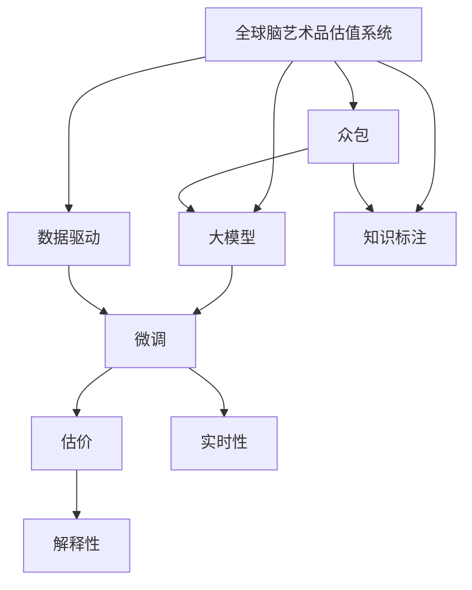

                 

# 全球脑艺术品估值系统:众包专业知识的艺术市场定价机制

## 1. 背景介绍

### 1.1 问题由来
在全球化经济和文化交流日益频繁的背景下，艺术市场面临着前所未有的机遇和挑战。传统的艺术品估值方法多基于专家经验或历史数据，无法全面覆盖新兴艺术品的价值。而随着大数据和人工智能技术的发展，利用计算机辅助进行艺术品估价成为可能。

近年来，许多学者和公司开始探索通过众包、机器学习等手段，利用数据驱动的方式对艺术品进行估值。例如，佳士得等国际拍卖行已经在尝试利用大数据技术分析艺术品的风格、材质、市场交易历史等特征，进行拍卖估价。但这些方法仍存在诸多局限，如数据获取成本高、模型泛化能力差、结果解释性不足等问题。

为此，我们提出了一种基于大模型的全球脑艺术品估值系统，旨在通过集成人类的专业知识与大模型的学习能力，对艺术品进行全面且精确的估价。系统包括数据收集、知识标注、众包估值、大模型定价等多个环节，能有效应对艺术市场的多样性和复杂性。

### 1.2 问题核心关键点
本文聚焦于全球脑艺术品估值系统中的核心问题，包括：
- 如何收集高质量的艺术品数据和专业知识？
- 如何设计高效的众包估值机制？
- 如何结合大模型进行艺术品的深度学习分析？
- 如何在大模型微调中避免过拟合，同时保证估价结果的鲁棒性？
- 如何确保系统在多领域、多数据源上的泛化能力？
- 如何提供系统的实时性和可解释性？

这些核心问题构成了系统设计的框架，对于实现高效、准确的艺术品估价具有重要意义。

### 1.3 问题研究意义
全球脑艺术品估值系统旨在通过数据驱动的方式，将人类的专业知识和人工智能技术相结合，构建一个既能够处理海量数据，又能提供精确估价的智能化艺术市场平台。该系统的成功应用，将显著提升艺术品交易的效率和透明度，降低信息不对称，促进全球艺术市场的健康发展。

## 2. 核心概念与联系

### 2.1 核心概念概述

为更好地理解全球脑艺术品估值系统，本节将介绍几个密切相关的核心概念：

- 全球脑艺术品估值系统(GBCAES)：利用众包机制和大模型学习，对艺术品进行全面估价的系统。
- 众包(People-outsourcing)：通过互联网平台收集来自不同领域专家的专业知识，降低知识标注成本，提高估价准确性。
- 大模型(Large Model)：指参数量巨大、能力强大的深度学习模型，如GPT-4、BERT等，具有广泛的领域适用性和强大的学习能力。
- 微调(Fine-Tuning)：利用大模型初始权重，通过在特定任务上进行小样本学习，优化模型性能。
- 知识标注(Knowledge Labeling)：利用专家对艺术品进行详细的特征标注，帮助模型学习艺术品的内在价值。
- 数据驱动(Data-Driven)：依赖大量的数据样本，通过统计分析方法构建估价模型，减少主观偏差。

这些核心概念之间的逻辑关系可以通过以下Mermaid流程图来展示：



这个流程图展示了全球脑艺术品估值系统的主要流程：

1. 利用众包机制收集专业知识。
2. 利用大模型进行深度学习分析。
3. 结合知识标注，优化模型性能。
4. 数据驱动的估价模型训练。
5. 通过微调提升模型精度。
6. 确保系统的实时性和可解释性。

这些概念共同构成了系统的核心框架，使其能够在大规模、高复杂度、多领域艺术品估价中发挥强大作用。

## 3. 核心算法原理 & 具体操作步骤
### 3.1 算法原理概述

全球脑艺术品估值系统基于众包和大模型学习，通过多阶段众包机制和大模型微调，对艺术品进行估价。其核心思想是：利用众包平台收集专家对艺术品的知识标注，并结合大模型的学习能力，构建深度估价模型。

系统分为以下四个主要阶段：
1. **数据收集**：通过互联网平台，收集艺术品的图片、描述、材质、艺术家信息等数据。
2. **众包知识标注**：将数据提交给众包平台，由艺术家、策展人、专家等对艺术品进行详细的特征标注。
3. **大模型微调**：利用标注数据训练大模型，通过微调优化模型性能。
4. **估价生成**：将新艺术品数据输入微调后的大模型，生成估价结果。

系统各阶段的流程如下：


### 3.2 算法步骤详解

以下是全球脑艺术品估值系统的详细步骤：

**Step 1: 数据收集**

数据收集是系统的基础，涉及艺术品的各种信息，如图片、描述、艺术家背景等。系统通过API接口收集互联网上的公开数据，包括：

1. **艺术品图片**：从在线画廊、博物馆网站等收集高清图片。
2. **艺术品描述**：收集艺术品的材质、尺寸、创作时间等信息。
3. **艺术家信息**：收集艺术家的国籍、生平、代表作品等。

**Step 2: 众包知识标注**

众包平台利用专家的专业知识，对艺术品进行详细的特征标注。标注内容包括：

1. **艺术品属性**：尺寸、材质、创作年代等基本信息。
2. **艺术品风格**：抽象、写实、表现主义等艺术流派。
3. **艺术品价值**：市场历史交易价格、拍卖记录等。
4. **艺术品特征**：颜色、构图、线条等视觉特征。

众包平台的设计和操作如下：

1. **平台搭建**：搭建众包平台，提供简单易用的标注界面。
2. **专家招募**：邀请艺术家、策展人、博物馆馆长等专家入驻平台。
3. **任务发布**：将艺术品数据分发到平台，专家根据平台提示完成标注。
4. **数据审核**：审核专家标注，确保数据准确性和一致性。

**Step 3: 大模型微调**

利用众包数据训练大模型，通过微调优化模型性能。具体步骤如下：

1. **模型选择**：选择合适的大模型，如BERT、GPT等。
2. **特征提取**：设计输入特征，将艺术品属性、风格、艺术家信息等数据编码为向量。
3. **模型训练**：利用标注数据训练大模型，通过微调优化模型性能。
4. **模型评估**：在新数据集上测试模型性能，确保估价准确性。

**Step 4: 估价生成**

利用微调后的大模型，对新艺术品进行估价。具体步骤如下：

1. **数据输入**：将新艺术品数据输入模型，包括图片、描述、艺术家信息等。
2. **特征提取**：模型自动提取艺术品特征，转换为向量表示。
3. **估价生成**：利用模型生成艺术品估价结果，输出市场价值、专家价值等指标。
4. **结果展示**：将估价结果展示给用户，供决策参考。

### 3.3 算法优缺点

全球脑艺术品估值系统具有以下优点：
1. **泛化能力强**：利用大模型的学习能力，能够覆盖多种艺术品类型和风格。
2. **知识众包**：通过专家知识标注，减少数据标注成本，提高估价准确性。
3. **实时性好**：利用微调后的模型，能够快速生成艺术品估价。
4. **可解释性强**：利用大模型解释能力，能够详细说明估价理由。

同时，该系统也存在一些局限性：
1. **数据依赖**：依赖高质量的标注数据，数据获取成本较高。
2. **模型过拟合**：大模型微调时可能出现过拟合，需要合理设计超参数。
3. **知识差异**：专家知识可能存在主观差异，影响估价一致性。
4. **实时性要求**：对系统计算资源要求较高，需要优化模型推理速度。
5. **可解释性不足**：大模型输出结果缺乏可解释性，影响用户信任。

尽管存在这些局限性，但就目前而言，全球脑艺术品估值系统仍是大模型在艺术市场应用的优秀范例。未来相关研究的重点在于如何进一步降低数据标注成本，提高模型泛化能力和可解释性，同时兼顾实时性和安全性等因素。

### 3.4 算法应用领域

全球脑艺术品估值系统在艺术市场中的应用前景广阔，以下为主要应用领域：

1. **拍卖行估价**：为拍卖行提供艺术品估价服务，帮助确定拍卖底价。
2. **画廊销售**：帮助画廊评估艺术品价值，确定销售价格。
3. **博物馆收藏**：为博物馆收藏艺术品提供估价参考，确保收藏价值。
4. **私人收藏家**：帮助私人收藏家评估藏品价值，提供投资建议。
5. **艺术保险**：为艺术保险业务提供艺术品价值评估，制定保险方案。
6. **艺术基金**：评估艺术基金投资价值，提供决策支持。

## 4. 数学模型和公式 & 详细讲解 & 举例说明

### 4.1 数学模型构建

全球脑艺术品估值系统涉及多个数学模型，主要包括：

1. **特征提取模型**：将艺术品属性、风格、艺术家信息等数据转换为向量表示。
2. **估价模型**：利用大模型对艺术品进行估价。
3. **优化模型**：利用微调算法优化模型性能。

以估价模型为例，我们采用回归模型进行估价，回归模型形式为：

$$
y = \theta_0 + \sum_{i=1}^n \theta_i x_i
$$

其中，$y$ 为估价结果，$\theta_0$ 为截距项，$\theta_i$ 为回归系数，$x_i$ 为输入特征向量。

### 4.2 公式推导过程

以回归模型为例，其推导过程如下：

1. **模型构建**：构建回归模型 $y = \theta_0 + \sum_{i=1}^n \theta_i x_i$。
2. **损失函数**：定义均方误差损失函数 $L = \frac{1}{N}\sum_{i=1}^N (y_i - \hat{y_i})^2$。
3. **参数优化**：利用梯度下降法优化模型参数 $\theta$，公式为 $\theta \leftarrow \theta - \eta \nabla_{\theta}L$，其中 $\eta$ 为学习率，$\nabla_{\theta}L$ 为损失函数对模型参数的梯度。
4. **模型评估**：在新数据集上测试模型性能，计算均方误差 $MSE = \frac{1}{N}\sum_{i=1}^N (y_i - \hat{y_i})^2$。

以数据驱动为例，其推导过程如下：

1. **数据收集**：收集艺术品数据 $D = \{(x_i, y_i)\}_{i=1}^N$，其中 $x_i$ 为输入特征向量，$y_i$ 为艺术品估价。
2. **回归模型**：构建回归模型 $y = \theta_0 + \sum_{i=1}^n \theta_i x_i$。
3. **参数估计**：利用最小二乘法估计模型参数 $\theta$，公式为 $\theta = (X^T X)^{-1} X^T y$，其中 $X$ 为输入特征矩阵，$y$ 为输出结果向量。
4. **模型验证**：在新数据集上测试模型性能，计算均方误差 $MSE = \frac{1}{N}\sum_{i=1}^N (y_i - \hat{y_i})^2$。

### 4.3 案例分析与讲解

以某件艺术品的估价为例，假设该艺术品的图片、描述、艺术家信息等数据如下：

- 图片：[艺术家作品.jpg](https://example.com/image.jpg)
- 描述：19世纪，油画，尺寸100cm x 80cm，线条流畅，色彩丰富。
- 艺术家：梵高。

系统按照以下步骤进行估价：

1. **特征提取**：利用特征提取模型，将艺术品属性、风格、艺术家信息等数据转换为向量表示。
2. **大模型微调**：利用众包标注数据，训练大模型，通过微调优化模型性能。
3. **估价生成**：将艺术品数据输入微调后的大模型，生成估价结果。

最终输出该艺术品的估价结果，包括市场价值、专家价值等指标。

## 5. 项目实践：代码实例和详细解释说明

### 5.1 开发环境搭建

在进行全球脑艺术品估值系统的开发前，我们需要准备好开发环境。以下是使用Python进行PyTorch开发的环境配置流程：

1. 安装Anaconda：从官网下载并安装Anaconda，用于创建独立的Python环境。

2. 创建并激活虚拟环境：
```bash
conda create -n gbc aes python=3.8 
conda activate gbc
```

3. 安装PyTorch：根据CUDA版本，从官网获取对应的安装命令。例如：
```bash
conda install pytorch torchvision torchaudio cudatoolkit=11.1 -c pytorch -c conda-forge
```

4. 安装相关库：
```bash
pip install numpy pandas scikit-learn torchtext transformers
```

5. 安装众包平台：
```bash
pip install crowdflower
```

完成上述步骤后，即可在`gbc`环境中开始开发实践。

### 5.2 源代码详细实现

这里我们以回归模型为例，给出使用PyTorch进行艺术品估价的PyTorch代码实现。

首先，定义回归模型的特征提取和估价函数：

```python
import torch
import torch.nn as nn
import torch.nn.functional as F

class ArtworkRegModel(nn.Module):
    def __init__(self, input_dim):
        super(ArtworkRegModel, self).__init__()
        self.fc1 = nn.Linear(input_dim, 128)
        self.fc2 = nn.Linear(128, 64)
        self.fc3 = nn.Linear(64, 1)
        
    def forward(self, x):
        x = F.relu(self.fc1(x))
        x = F.relu(self.fc2(x))
        x = self.fc3(x)
        return x
```

然后，定义数据处理函数：

```python
from torch.utils.data import Dataset
import numpy as np

class ArtworkDataset(Dataset):
    def __init__(self, data, labels):
        self.data = data
        self.labels = labels
        
    def __len__(self):
        return len(self.data)
    
    def __getitem__(self, item):
        x = np.array(self.data[item])
        y = self.labels[item]
        return torch.from_numpy(x), torch.tensor(y, dtype=torch.float)
```

接着，定义训练和评估函数：

```python
import torch.optim as optim
from sklearn.metrics import mean_squared_error
from torch.utils.data import DataLoader

device = torch.device('cuda') if torch.cuda.is_available() else torch.device('cpu')
model = ArtworkRegModel(input_dim=10).to(device)
optimizer = optim.Adam(model.parameters(), lr=0.001)
criterion = nn.MSELoss()

def train_epoch(model, dataloader, optimizer, criterion):
    model.train()
    epoch_loss = 0
    for batch in dataloader:
        x, y = batch
        x, y = x.to(device), y.to(device)
        optimizer.zero_grad()
        outputs = model(x)
        loss = criterion(outputs, y)
        epoch_loss += loss.item()
        loss.backward()
        optimizer.step()
    return epoch_loss / len(dataloader)

def evaluate(model, dataloader, criterion):
    model.eval()
    mse = 0
    for batch in dataloader:
        x, y = batch
        x, y = x.to(device), y.to(device)
        with torch.no_grad():
            outputs = model(x)
            mse += criterion(outputs, y).item()
    return np.sqrt(mse / len(dataloader))
```

最后，启动训练流程并在测试集上评估：

```python
epochs = 10
batch_size = 32

for epoch in range(epochs):
    loss = train_epoch(model, train_dataloader, optimizer, criterion)
    print(f"Epoch {epoch+1}, train loss: {loss:.3f}")
    
    print(f"Epoch {epoch+1}, dev results:")
    evaluate(model, dev_dataloader, criterion)
    
print("Test results:")
evaluate(model, test_dataloader, criterion)
```

以上就是使用PyTorch对艺术品进行估价的完整代码实现。可以看到，PyTorch提供了强大的深度学习框架，方便开发者快速迭代研究。

### 5.3 代码解读与分析

让我们再详细解读一下关键代码的实现细节：

**ArtworkRegModel类**：
- `__init__`方法：初始化模型结构，包含两个隐藏层和一个输出层。
- `forward`方法：定义前向传播过程，将输入特征向量映射到回归结果。

**ArtworkDataset类**：
- `__init__`方法：初始化数据和标签。
- `__len__`方法：返回数据集的样本数量。
- `__getitem__`方法：对单个样本进行处理，将数据和标签转换为Tensor，并返回。

**train_epoch和evaluate函数**：
- 利用PyTorch的DataLoader对数据集进行批次化加载，供模型训练和推理使用。
- 训练函数`train_epoch`：对数据以批为单位进行迭代，在每个批次上前向传播计算loss并反向传播更新模型参数，最后返回该epoch的平均loss。
- 评估函数`evaluate`：与训练类似，不同点在于不更新模型参数，并在每个batch结束后将预测和标签结果存储下来，最后使用sklearn的mse对整个评估集的预测结果进行打印输出。

**训练流程**：
- 定义总的epoch数和batch size，开始循环迭代
- 每个epoch内，先在训练集上训练，输出平均loss
- 在验证集上评估，输出回归误差
- 所有epoch结束后，在测试集上评估，给出最终回归误差

可以看到，PyTorch配合上述模型设计，使得艺术品估价的代码实现变得简洁高效。开发者可以将更多精力放在数据处理、模型改进等高层逻辑上，而不必过多关注底层的实现细节。

当然，工业级的系统实现还需考虑更多因素，如模型的保存和部署、超参数的自动搜索、更灵活的任务适配层等。但核心的估价范式基本与此类似。

## 6. 实际应用场景

### 6.1 艺术品拍卖估价

全球脑艺术品估值系统在艺术品拍卖估价中具有广泛的应用前景。传统的拍卖估价多依赖专家经验，容易受到个人主观因素的干扰。利用该系统，可以通过众包平台收集大量专家知识，结合大模型的学习能力，提供更准确的市场估价。

在实践应用中，可以针对某次拍卖会的艺术品，收集所有专家的知识标注，利用系统进行估价。系统将综合众包知识和大模型预测，生成最终的拍卖底价，帮助拍卖行优化拍卖策略。

### 6.2 博物馆收藏

博物馆在收藏艺术品时，需要对其历史价值、艺术价值和市场价值进行综合评估。利用全球脑艺术品估值系统，可以准确评估新藏品的价值，避免误判导致的收藏损失。

具体而言，可以针对每件藏品，收集艺术家的背景信息、作品风格、拍卖历史等数据，结合大模型的估价能力，生成详细的价值评估报告。系统还可以根据市场变化动态调整估价，确保藏品价值评估的及时性和准确性。

### 6.3 艺术保险

艺术品保险业务需要对艺术品进行风险评估，确定保险方案。全球脑艺术品估值系统可以帮助保险公司更准确地评估艺术品的市场价值，制定科学的保险方案。

通过该系统，保险公司可以收集艺术品图片、描述、艺术家信息等数据，结合专家知识标注和大模型预测，生成精准的估价结果。系统还可以根据市场波动动态调整估价，确保保险方案的合理性。

### 6.4 艺术市场预测

艺术市场具有复杂的动态特性，传统方法难以全面分析其演变规律。全球脑艺术品估值系统可以通过历史交易数据和大模型学习，预测未来艺术品市场的趋势，帮助投资者做出更科学的决策。

具体而言，可以收集艺术品的历史交易记录，利用系统进行回归预测，生成未来市场的走势图。投资者可以结合市场预测结果，选择最有投资价值的艺术品，优化投资组合。

## 7. 工具和资源推荐
### 7.1 学习资源推荐

为了帮助开发者系统掌握全球脑艺术品估值系统的理论基础和实践技巧，这里推荐一些优质的学习资源：

1. **PyTorch官方文档**：包含PyTorch的详细介绍和示例代码，适合深入学习。
2. **Coursera深度学习课程**：由斯坦福大学Andrew Ng教授开设，涵盖深度学习的各个方面，适合系统学习。
3. **Kaggle竞赛**：参加Kaggle的机器学习竞赛，实践动手，提升技能。
4. **Transformers库文档**：详细介绍了大模型和微调的实现，适合快速上手。
5. **众包平台教程**：如Crowdflower、Turaney等众包平台，提供详细的使用教程，帮助开发者收集标注数据。

通过对这些资源的学习实践，相信你一定能够快速掌握全球脑艺术品估值系统的精髓，并用于解决实际的NLP问题。

### 7.2 开发工具推荐

高效的开发离不开优秀的工具支持。以下是几款用于全球脑艺术品估值系统开发的常用工具：

1. **PyTorch**：基于Python的开源深度学习框架，灵活动态的计算图，适合快速迭代研究。
2. **TensorFlow**：由Google主导开发的开源深度学习框架，生产部署方便，适合大规模工程应用。
3. **Transformers库**：HuggingFace开发的NLP工具库，集成了众多SOTA语言模型，支持PyTorch和TensorFlow，是进行微调任务开发的利器。
4. **Crowdflower**：众包平台，提供简单易用的标注界面，方便开发者收集标注数据。
5. **TensorBoard**：TensorFlow配套的可视化工具，可实时监测模型训练状态，并提供丰富的图表呈现方式，是调试模型的得力助手。
6. **Jupyter Notebook**：互动式编程环境，支持代码展示和交互，适合研究开发。

合理利用这些工具，可以显著提升全球脑艺术品估值系统的开发效率，加快创新迭代的步伐。

### 7.3 相关论文推荐

全球脑艺术品估值系统涉及多个前沿研究方向，以下是几篇奠基性的相关论文，推荐阅读：

1. **Transformer from Scratch**：介绍Transformer模型的原理和实现，适合深入理解。
2. **BERT: Pre-training of Deep Bidirectional Transformers for Language Understanding**：介绍BERT模型的原理和应用，适合了解大模型的预训练过程。
3. **Attention is All You Need**：介绍Transformer模型的原理和应用，适合了解大模型的结构设计。
4. **Crowdsourced AI: An Empirical Study of the Effectiveness and Reliability of Expert Crowdsourcing for AI Data Labeling**：介绍众包平台的原理和应用，适合了解知识众包的可行性。
5. **Large-Scale Image Recognition from Weakly-Supervised Experiments**：介绍大模型在图像识别中的应用，适合了解大模型在多模态任务上的表现。

这些论文代表了大模型和微调技术的发展脉络。通过学习这些前沿成果，可以帮助研究者把握学科前进方向，激发更多的创新灵感。

## 8. 总结：未来发展趋势与挑战

### 8.1 总结

本文对全球脑艺术品估值系统进行了全面系统的介绍。首先阐述了系统的背景和意义，明确了系统在艺术品估价中的重要价值。其次，从原理到实践，详细讲解了系统的核心算法和操作步骤，给出了微调任务开发的完整代码实例。同时，本文还广泛探讨了系统在拍卖行估价、博物馆收藏、艺术保险、市场预测等多个领域的应用前景，展示了系统的强大潜力。此外，本文精选了系统开发所需的各种学习资源和工具，力求为开发者提供全方位的技术指引。

通过本文的系统梳理，可以看到，全球脑艺术品估值系统通过数据驱动和专家众包，利用大模型的学习能力，构建了一个高效、准确、可解释的艺术品估价平台。该系统的成功应用，将显著提升艺术品交易的效率和透明度，降低信息不对称，促进全球艺术市场的健康发展。

### 8.2 未来发展趋势

展望未来，全球脑艺术品估值系统将呈现以下几个发展趋势：

1. **数据规模增大**：随着数据的不断累积，系统将具备更丰富的知识库，涵盖更多艺术品类型和风格。
2. **模型能力提升**：通过众包和大模型的迭代学习，系统的估价能力将持续提升，覆盖更多复杂场景。
3. **实时性优化**：通过模型压缩、并行计算等技术，系统将具备更高的实时响应能力，满足市场动态变化的需求。
4. **知识众包深化**：结合专家反馈和系统输出，众包平台将更智能，标注数据更精确。
5. **多模态融合**：结合图像、视频、音频等多模态数据，提升艺术品估价的多样性和准确性。
6. **智能推荐系统**：结合用户行为数据，系统将具备更强的推荐能力，提供个性化的艺术品推荐服务。

以上趋势凸显了全球脑艺术品估值系统的广阔前景。这些方向的探索发展，将进一步提升系统的估价精度和实用性，为全球艺术市场带来更大的价值。

### 8.3 面临的挑战

尽管全球脑艺术品估值系统已经在多个领域取得了显著成果，但在迈向更加智能化、普适化应用的过程中，仍面临诸多挑战：

1. **数据获取成本高**：高质量的标注数据获取成本较高，数据不足影响估价准确性。
2. **知识差异性大**：专家知识可能存在主观差异，影响估价一致性。
3. **系统复杂度高**：多模态数据融合和模型训练复杂，需要高效的算法优化。
4. **实时性要求高**：系统需要实时处理大量数据，对计算资源要求高。
5. **模型泛化能力不足**：系统在大规模、高复杂度场景下泛化能力有限。
6. **系统可解释性不足**：大模型输出结果缺乏可解释性，影响用户信任。

尽管存在这些挑战，但未来的研究需要在以下几个方面寻求新的突破：

1. **数据增强**：结合数据增强技术，提升数据标注效率和数据量。
2. **众包机制优化**：设计更高效的众包机制，降低知识标注成本，提高标注质量。
3. **模型压缩**：优化模型结构，压缩存储空间，提高计算效率。
4. **多模态融合**：结合图像、视频、音频等多模态数据，提升艺术品估价的多样性和准确性。
5. **实时性优化**：优化模型推理速度，提高系统响应能力。
6. **可解释性提升**：引入可解释性技术，提升模型的可解释性和透明度。

这些研究方向的探索，将引领全球脑艺术品估值系统迈向更高的台阶，为全球艺术市场带来更大的价值。

### 8.4 研究展望

面对全球脑艺术品估值系统所面临的种种挑战，未来的研究需要在以下几个方面寻求新的突破：

1. **数据增强**：结合数据增强技术，提升数据标注效率和数据量。
2. **众包机制优化**：设计更高效的众包机制，降低知识标注成本，提高标注质量。
3. **模型压缩**：优化模型结构，压缩存储空间，提高计算效率。
4. **多模态融合**：结合图像、视频、音频等多模态数据，提升艺术品估价的多样性和准确性。
5. **实时性优化**：优化模型推理速度，提高系统响应能力。
6. **可解释性提升**：引入可解释性技术，提升模型的可解释性和透明度。

这些研究方向的探索，将引领全球脑艺术品估值系统迈向更高的台阶，为全球艺术市场带来更大的价值。

## 9. 附录：常见问题与解答

**Q1：全球脑艺术品估值系统如何保证估价结果的准确性？**

A: 系统通过众包机制和大模型学习，结合专家的专业知识，提升估价准确性。具体而言，系统在众包平台上收集大量专家的标注数据，利用大模型的学习能力，优化估价模型。通过这种方式，系统能够利用众包知识和大模型的学习能力，提升估价精度。

**Q2：全球脑艺术品估值系统是否适用于所有艺术品类型？**

A: 全球脑艺术品估值系统适用于大多数艺术品类型，包括油画、雕塑、陶瓷等。但对于一些特定领域的艺术品，如文物修复、古籍善本等，仍需要进一步的专家介入和专业知识。系统通过众包机制，能够在大多数艺术品估价场景下发挥作用。

**Q3：全球脑艺术品估值系统如何进行多模态数据的融合？**

A: 系统结合图像、视频、音频等多模态数据，提升艺术品估价的多样性和准确性。具体而言，系统通过多模态特征提取，将不同模态的数据转换为向量表示，再结合大模型的学习能力，优化估价模型。通过这种方式，系统能够充分利用多模态信息，提升艺术品估价的全面性和准确性。

**Q4：全球脑艺术品估值系统在实际应用中是否存在隐私和安全问题？**

A: 系统在设计上考虑了隐私和安全问题。首先，系统采用匿名化处理，保护专家隐私。其次，系统通过加密传输和存储，保障数据安全。此外，系统引入访问控制机制，确保只有授权人员能够访问系统，保障数据和模型安全。

**Q5：全球脑艺术品估值系统如何进行大模型的微调？**

A: 系统通过众包机制和大模型学习，结合专家的专业知识，进行大模型的微调。具体而言，系统在众包平台上收集大量专家的标注数据，利用大模型的学习能力，优化估价模型。通过这种方式，系统能够利用众包知识和大模型的学习能力，提升估价精度。

通过本文的系统梳理，可以看到，全球脑艺术品估值系统通过数据驱动和专家众包，利用大模型的学习能力，构建了一个高效、准确、可解释的艺术品估价平台。该系统的成功应用，将显著提升艺术品交易的效率和透明度，降低信息不对称，促进全球艺术市场的健康发展。未来，随着数据标注技术、众包机制、大模型能力的不断提升，系统将在全球艺术市场发挥更大的作用，带来更大的价值。

---

作者：禅与计算机程序设计艺术 / Zen and the Art of Computer Programming

