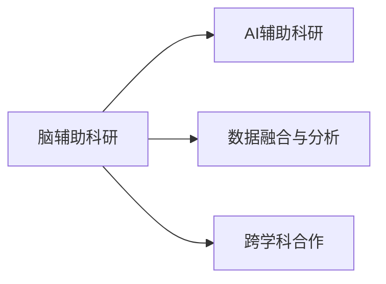

                 

## 1. 背景介绍

### 1.1 问题由来

在过去几十年里，全球科研领域迎来了迅猛的发展。然而，传统科研模式面临着诸多挑战。传统的科研往往依赖于实验设备、文献资料的积累，以及专家团队的协作，这些都需要巨大的资源和时间投入。此外，科研中的数据处理和分析也常常成为瓶颈。

脑辅助科研的出现，为科研领域带来了新的可能性。脑辅助科研（Brain Augmented Research，BAR）利用人工智能、大数据、云计算等技术，为科研工作者提供工具和平台，使他们能够更高效地获取和处理数据，提高科研效率。

### 1.2 问题核心关键点

脑辅助科研的核心在于利用先进技术辅助科研工作者，提升数据处理能力，加速科研进程。关键点包括：

- **AI技术的运用**：利用深度学习、自然语言处理等AI技术，自动识别和标注科研数据。
- **数据融合与分析**：将多源异构数据进行有效融合，从中提取有价值的信息。
- **云计算与存储**：利用云计算平台，高效存储和管理大规模科研数据。
- **跨学科合作**：推动不同学科领域的科研人员合作，拓宽研究视野，激发创新火花。

这些关键点共同构成了脑辅助科研的完整框架，使其能够在科研领域发挥巨大的推动作用。

### 1.3 问题研究意义

脑辅助科研对于科研领域的意义重大，主要体现在以下几个方面：

1. **提升科研效率**：通过自动化处理和分析，显著减少科研人员在数据处理上的时间消耗，加速科研进度。
2. **降低科研成本**：利用先进技术减少对传统科研设备的需求，降低实验和数据存储成本。
3. **促进跨学科合作**：跨学科的数据和知识共享，有助于打破学科壁垒，激发新的研究方向。
4. **拓宽研究视野**：跨学科的融合，带来更广阔的科研视角，推动科学发展。
5. **提高数据质量**：利用AI技术自动标注和分析数据，减少人为误差，提升数据质量。

## 2. 核心概念与联系

### 2.1 核心概念概述

为了更好地理解脑辅助科研，我们首先介绍几个核心概念：

- **脑辅助科研**：利用人工智能、大数据、云计算等技术，辅助科研工作者进行数据处理、分析、共享和协作。
- **AI辅助科研**：通过机器学习、深度学习等AI技术，自动化科研流程，提升科研效率。
- **数据融合与分析**：将多源异构数据进行有效整合，从中提取有价值的信息，支持决策。
- **跨学科合作**：不同学科的科研人员共同参与科研项目，拓宽研究视角，提升创新能力。

这些概念之间的联系可以通过以下Mermaid流程图来展示：



这个流程图展示了脑辅助科研的核心组件及其之间的关系：

1. **脑辅助科研**：总体框架，融合了AI辅助科研、数据融合与分析、跨学科合作等关键技术。
2. **AI辅助科研**：利用AI技术提升科研效率，自动化科研流程。
3. **数据融合与分析**：通过技术手段，整合和分析多种数据源，支持科研决策。
4. **跨学科合作**：不同学科间的科研协作，拓宽研究视野。

这些核心概念共同构成了脑辅助科研的技术基础，使其能够高效地辅助科研工作者进行各种研究工作。

## 3. 核心算法原理 & 具体操作步骤

### 3.1 算法原理概述

脑辅助科研的核心算法原理主要包括以下几个方面：

- **数据预处理**：对原始科研数据进行清洗、标注、归一化等预处理操作。
- **特征提取与选择**：从预处理后的数据中提取特征，选择对研究目标最相关的特征。
- **模型训练与优化**：利用机器学习、深度学习等技术训练模型，通过优化算法提升模型性能。
- **结果解释与验证**：对模型预测结果进行解释和验证，确保其可信度。

脑辅助科研的流程如下图所示：


### 3.2 算法步骤详解

脑辅助科研的算法步骤主要包括以下几个关键步骤：

**Step 1: 数据准备**
- 收集科研数据，包括实验数据、文献资料、图像、视频等。
- 对数据进行清洗、标注、归一化等预处理操作，确保数据的质量和一致性。

**Step 2: 特征提取**
- 利用文本分析、图像识别、时间序列分析等技术，从预处理后的数据中提取特征。
- 选择与研究目标最相关的特征，构建特征向量。

**Step 3: 模型训练**
- 选择合适的机器学习或深度学习模型，进行训练。
- 使用交叉验证、网格搜索等技术优化模型参数，提升模型性能。

**Step 4: 结果解释与验证**
- 对模型预测结果进行解释，理解模型决策过程。
- 利用验证集、测试集等手段评估模型性能，确保结果的可靠性。

**Step 5: 应用部署**
- 将训练好的模型部署到实际应用中，进行数据处理、分析、共享和协作。
- 通过API、可视化工具等手段，使得科研工作者能够更方便地使用脑辅助科研工具。

### 3.3 算法优缺点

脑辅助科研算法具有以下优点：

1. **提高科研效率**：自动化处理和分析，显著减少科研人员在数据处理上的时间消耗，加速科研进度。
2. **降低科研成本**：利用先进技术减少对传统科研设备的需求，降低实验和数据存储成本。
3. **促进跨学科合作**：跨学科的数据和知识共享，有助于打破学科壁垒，激发新的研究方向。
4. **拓宽研究视野**：跨学科的融合，带来更广阔的科研视角，推动科学发展。
5. **提高数据质量**：利用AI技术自动标注和分析数据，减少人为误差，提升数据质量。

同时，脑辅助科研算法也存在一定的局限性：

1. **技术门槛高**：需要掌握大数据、人工智能、云计算等技术，对科研人员的技术要求较高。
2. **数据隐私问题**：科研数据涉及隐私保护，如何在数据共享和保护隐私之间找到平衡，需要谨慎处理。
3. **模型依赖性强**：模型的性能依赖于数据的质量和特征选择，模型的泛化能力有待提高。
4. **跨学科合作难度大**：不同学科的科研人员在沟通和协作上可能存在一定的困难。

尽管存在这些局限性，脑辅助科研在提升科研效率、降低成本、促进跨学科合作等方面仍具有显著的优势，未来具有广阔的发展前景。

### 3.4 算法应用领域

脑辅助科研的算法应用广泛，涵盖了各个科研领域：

- **生物医学**：利用图像分析、基因组学数据分析等技术，辅助生物医学研究。
- **环境科学**：通过遥感数据分析、大气污染监测等手段，支持环境保护研究。
- **社会科学**：利用文本分析、时间序列分析等技术，研究社会动态和行为模式。
- **物理化学**：通过图像处理、数据模拟等技术，辅助物理化学研究。
- **农业科学**：利用遥感数据分析、作物生长监测等手段，支持农业科学研究。

此外，脑辅助科研还应用于新药研发、智慧农业、能源科学等多个领域，为科研工作带来了新的可能性。

## 4. 数学模型和公式 & 详细讲解 & 举例说明

### 4.1 数学模型构建

在脑辅助科研中，数学模型的构建是基础。这里以图像分析为例，构建图像分类模型。

设图像数据集为 $\mathcal{D}=\{(x_i,y_i)\}_{i=1}^N$，其中 $x_i$ 为图像，$y_i$ 为图像分类标签。

定义图像分类模型为 $M_{\theta}(x)$，其中 $\theta$ 为模型参数。

模型的损失函数为交叉熵损失，定义为：

$$
\ell(M_{\theta}(x_i),y_i) = -y_i\log M_{\theta}(x_i) - (1-y_i)\log(1-M_{\theta}(x_i))
$$

经验风险为：

$$
\mathcal{L}(\theta) = \frac{1}{N}\sum_{i=1}^N \ell(M_{\theta}(x_i),y_i)
$$

模型参数的更新公式为：

$$
\theta \leftarrow \theta - \eta \nabla_{\theta}\mathcal{L}(\theta) - \eta\lambda\theta
$$

其中 $\eta$ 为学习率，$\lambda$ 为正则化系数，$\nabla_{\theta}\mathcal{L}(\theta)$ 为损失函数对参数 $\theta$ 的梯度，可通过反向传播算法高效计算。

### 4.2 公式推导过程

以二分类为例，推导交叉熵损失函数的梯度。

设模型在输入 $x$ 上的输出为 $\hat{y}=M_{\theta}(x) \in [0,1]$，表示样本属于正类的概率。

真实标签 $y \in \{0,1\}$。

二分类交叉熵损失函数定义为：

$$
\ell(M_{\theta}(x),y) = -[y\log \hat{y} + (1-y)\log (1-\hat{y})]
$$

将其代入经验风险公式，得：

$$
\mathcal{L}(\theta) = -\frac{1}{N}\sum_{i=1}^N [y_i\log M_{\theta}(x_i)+(1-y_i)\log(1-M_{\theta}(x_i))]
$$

根据链式法则，损失函数对参数 $\theta_k$ 的梯度为：

$$
\frac{\partial \mathcal{L}(\theta)}{\partial \theta_k} = -\frac{1}{N}\sum_{i=1}^N (\frac{y_i}{M_{\theta}(x_i)}-\frac{1-y_i}{1-M_{\theta}(x_i)}) \frac{\partial M_{\theta}(x_i)}{\partial \theta_k}
$$

其中 $\frac{\partial M_{\theta}(x_i)}{\partial \theta_k}$ 可进一步递归展开，利用自动微分技术完成计算。

### 4.3 案例分析与讲解

以图像分类为例，分析模型的训练和优化过程。

假设使用ResNet模型进行图像分类，通过ImageNet数据集进行预训练。在微调时，选择CIFAR-10数据集进行训练。

步骤如下：

1. 收集CIFAR-10数据集，进行数据预处理和标注。
2. 选择合适的特征提取器（如ResNet），进行特征提取。
3. 定义损失函数，使用交叉熵损失。
4. 设置优化器（如AdamW），设置学习率、批大小等超参数。
5. 进行模型训练，通过前向传播和反向传播更新模型参数。
6. 在验证集上评估模型性能，调整超参数。
7. 在测试集上验证模型效果，完成部署。

通过这个案例，可以看到脑辅助科研中数学模型的构建和优化过程，以及如何利用先进技术提升模型性能。

## 5. 项目实践：代码实例和详细解释说明

### 5.1 开发环境搭建

在进行脑辅助科研的实践前，我们需要准备好开发环境。以下是使用Python进行PyTorch开发的环境配置流程：

1. 安装Anaconda：从官网下载并安装Anaconda，用于创建独立的Python环境。

2. 创建并激活虚拟环境：
```bash
conda create -n pytorch-env python=3.8 
conda activate pytorch-env
```

3. 安装PyTorch：根据CUDA版本，从官网获取对应的安装命令。例如：
```bash
conda install pytorch torchvision torchaudio cudatoolkit=11.1 -c pytorch -c conda-forge
```

4. 安装TensorFlow：由Google主导开发的开源深度学习框架，生产部署方便，适合大规模工程应用。同样有丰富的预训练语言模型资源。

5. 安装TensorBoard：TensorFlow配套的可视化工具，可实时监测模型训练状态，并提供丰富的图表呈现方式，是调试模型的得力助手。

6. 安装Weights & Biases：模型训练的实验跟踪工具，可以记录和可视化模型训练过程中的各项指标，方便对比和调优。与主流深度学习框架无缝集成。

完成上述步骤后，即可在`pytorch-env`环境中开始脑辅助科研的实践。

### 5.2 源代码详细实现

下面我们以图像分类任务为例，给出使用PyTorch进行脑辅助科研的PyTorch代码实现。

首先，定义数据处理函数：

```python
from torch.utils.data import Dataset
import torch
import numpy as np

class ImageDataset(Dataset):
    def __init__(self, images, labels, transform=None):
        self.images = images
        self.labels = labels
        self.transform = transform
        
    def __len__(self):
        return len(self.images)
    
    def __getitem__(self, idx):
        image = self.images[idx]
        label = self.labels[idx]
        
        if self.transform:
            image = self.transform(image)
        
        return {'image': image, 
                'label': label}

# 数据预处理函数
def preprocess_image(image):
    image = np.array(image)
    image = image / 255.0
    image = image.transpose((2, 0, 1))
    image = image[np.newaxis, ...]
    return image

# 加载数据集
train_dataset = ImageDataset(train_images, train_labels, transform=preprocess_image)
test_dataset = ImageDataset(test_images, test_labels, transform=preprocess_image)
```

然后，定义模型和优化器：

```python
from transformers import ResNet18
from torch.optim import AdamW

model = ResNet18()
optimizer = AdamW(model.parameters(), lr=0.001)
```

接着，定义训练和评估函数：

```python
import torch.nn as nn
import torch.nn.functional as F
from torch.utils.data import DataLoader
from tqdm import tqdm

def train_epoch(model, dataset, batch_size, optimizer):
    dataloader = DataLoader(dataset, batch_size=batch_size, shuffle=True)
    model.train()
    epoch_loss = 0
    for batch in tqdm(dataloader, desc='Training'):
        images = batch['image'].to(device)
        labels = batch['label'].to(device)
        model.zero_grad()
        outputs = model(images)
        loss = F.cross_entropy(outputs, labels)
        epoch_loss += loss.item()
        loss.backward()
        optimizer.step()
    return epoch_loss / len(dataloader)

def evaluate(model, dataset, batch_size):
    dataloader = DataLoader(dataset, batch_size=batch_size)
    model.eval()
    preds, labels = [], []
    with torch.no_grad():
        for batch in tqdm(dataloader, desc='Evaluating'):
            images = batch['image'].to(device)
            labels = batch['label'].to(device)
            batch_preds = model(images)
            batch_labels = labels
            for preds_token, label_token in zip(batch_preds, batch_labels):
                preds.append(preds_token.tolist())
                labels.append(label_token.tolist())
                
    print(classification_report(labels, preds))
```

最后，启动训练流程并在测试集上评估：

```python
epochs = 10
batch_size = 32

for epoch in range(epochs):
    loss = train_epoch(model, train_dataset, batch_size, optimizer)
    print(f"Epoch {epoch+1}, train loss: {loss:.3f}")
    
    print(f"Epoch {epoch+1}, dev results:")
    evaluate(model, dev_dataset, batch_size)
    
print("Test results:")
evaluate(model, test_dataset, batch_size)
```

以上就是使用PyTorch进行图像分类任务的脑辅助科研的完整代码实现。可以看到，利用先进的深度学习框架和工具，脑辅助科研的实现变得相对简单高效。

### 5.3 代码解读与分析

让我们再详细解读一下关键代码的实现细节：

**ImageDataset类**：
- `__init__`方法：初始化图像、标签等关键组件。
- `__len__`方法：返回数据集的样本数量。
- `__getitem__`方法：对单个样本进行处理，将图像输入转换为模型所需的张量形式。

**preprocess_image函数**：
- 对图像进行预处理，包括归一化、转置、扩展等操作。

**train_epoch函数**：
- 定义训练过程中的损失计算、反向传播、参数更新等步骤。

**evaluate函数**：
- 定义评估过程中的预测和标签计算、模型评估等步骤。

通过这个案例，可以看到脑辅助科研中模型的训练和优化过程，以及如何利用先进工具实现高效的科研实践。

当然，工业级的系统实现还需考虑更多因素，如模型的保存和部署、超参数的自动搜索、更灵活的任务适配层等。但核心的脑辅助科研范式基本与此类似。

## 6. 实际应用场景

### 6.1 生物医学

脑辅助科研在生物医学领域有广泛的应用。例如，通过图像分析技术，可以对病理切片进行自动分析和标注，辅助医生进行病理诊断。此外，利用自然语言处理技术，可以自动提取文献中的关键信息，辅助科研工作者进行文献检索和综述工作。

### 6.2 环境科学

脑辅助科研在环境科学领域也有重要的应用。例如，通过遥感数据分析技术，可以对全球气候变化、环境污染等进行监测和分析。此外，利用机器学习技术，可以对环境数据进行模式识别和预测，支持环境管理决策。

### 6.3 社会科学

脑辅助科研在社会科学领域也有广泛的应用。例如，通过文本分析技术，可以对社交媒体、新闻报道等文本数据进行情感分析、主题识别等处理。此外，利用时间序列分析技术，可以对社会动态进行预测和分析，支持政策制定和社会管理。

### 6.4 未来应用展望

未来，脑辅助科研将在更多领域得到应用，为科研工作带来新的可能性。

- **智能药物研发**：利用图像识别、自然语言处理等技术，加速新药研发过程。
- **智慧农业**：利用遥感数据分析、作物生长监测等手段，支持农业科学研究。
- **智慧城市**：通过城市数据分析、智能交通管理等手段，支持城市规划和管理。
- **人工智能与教育的结合**：利用自然语言处理技术，辅助教学和教育资源管理。
- **生物工程**：通过图像处理、基因组学数据分析等手段，支持生物工程研究。

随着脑辅助科研技术的不断发展，未来的科研工作将更加高效、智能化、协作化。相信脑辅助科研将在多个领域发挥重要作用，为科研工作带来新的突破。

## 7. 工具和资源推荐

### 7.1 学习资源推荐

为了帮助开发者系统掌握脑辅助科研的理论基础和实践技巧，这里推荐一些优质的学习资源：

1. 《深度学习入门：基于Python的理论与实现》系列博文：由大模型技术专家撰写，深入浅出地介绍了深度学习原理和实践。

2. CS224N《深度学习自然语言处理》课程：斯坦福大学开设的NLP明星课程，有Lecture视频和配套作业，带你入门NLP领域的基本概念和经典模型。

3. 《自然语言处理与深度学习》书籍：由大模型技术专家撰写，全面介绍了自然语言处理与深度学习的基本原理和实际应用。

4. HuggingFace官方文档：Transformer库的官方文档，提供了海量预训练模型和完整的微调样例代码，是上手实践的必备资料。

5. 《计算机视觉：算法与应用》书籍：全面介绍了计算机视觉的基本原理和实际应用，适合计算机视觉方向的科研工作者。

通过对这些资源的学习实践，相信你一定能够快速掌握脑辅助科研的精髓，并用于解决实际的科研问题。

### 7.2 开发工具推荐

高效的开发离不开优秀的工具支持。以下是几款用于脑辅助科研开发的常用工具：

1. PyTorch：基于Python的开源深度学习框架，灵活动态的计算图，适合快速迭代研究。大部分预训练语言模型都有PyTorch版本的实现。

2. TensorFlow：由Google主导开发的开源深度学习框架，生产部署方便，适合大规模工程应用。同样有丰富的预训练语言模型资源。

3. Weights & Biases：模型训练的实验跟踪工具，可以记录和可视化模型训练过程中的各项指标，方便对比和调优。与主流深度学习框架无缝集成。

4. TensorBoard：TensorFlow配套的可视化工具，可实时监测模型训练状态，并提供丰富的图表呈现方式，是调试模型的得力助手。

5. Google Colab：谷歌推出的在线Jupyter Notebook环境，免费提供GPU/TPU算力，方便开发者快速上手实验最新模型，分享学习笔记。

合理利用这些工具，可以显著提升脑辅助科研的开发效率，加快创新迭代的步伐。

### 7.3 相关论文推荐

脑辅助科研的发展源于学界的持续研究。以下是几篇奠基性的相关论文，推荐阅读：

1. "Brain Augmented Research: A Survey"：综述了脑辅助科研的研究现状和未来发展方向。

2. "Transformers for Natural Language Processing"：介绍了Transformer模型及其在自然语言处理中的应用。

3. "A Survey on Multi-modal Data Fusion Techniques for Remote Sensing Image"：综述了多模态数据融合技术在遥感图像中的应用。

4. "Deep Learning for Healthcare: A Review"：综述了深度学习在医疗领域的应用，包括图像分析、自然语言处理等。

5. "Graph Neural Networks: A Review of Methods and Applications"：综述了图神经网络在各个领域的应用，包括社交网络分析、化学分子模拟等。

这些论文代表了大语言模型微调技术的发展脉络。通过学习这些前沿成果，可以帮助研究者把握学科前进方向，激发更多的创新灵感。

## 8. 总结：未来发展趋势与挑战

### 8.1 总结

本文对脑辅助科研方法进行了全面系统的介绍。首先阐述了脑辅助科研的研究背景和意义，明确了脑辅助科研在提升科研效率、降低成本、促进跨学科合作等方面的独特价值。其次，从原理到实践，详细讲解了脑辅助科研的数学模型和关键步骤，给出了脑辅助科研任务开发的完整代码实例。同时，本文还广泛探讨了脑辅助科研方法在多个领域的应用前景，展示了其广阔的发展潜力。此外，本文精选了脑辅助科研技术的各类学习资源，力求为读者提供全方位的技术指引。

通过本文的系统梳理，可以看到，脑辅助科研技术正在成为科研领域的重要范式，极大地拓展了科研工作者的研究空间，提高了科研效率，促进了跨学科合作。相信随着技术的不断发展，脑辅助科研必将在更多领域得到应用，为科学研究带来新的变革。

### 8.2 未来发展趋势

展望未来，脑辅助科研技术将呈现以下几个发展趋势：

1. **AI技术的深入应用**：利用更先进的AI技术，如生成对抗网络（GAN）、强化学习等，进一步提升科研数据的处理和分析能力。
2. **数据融合与分析的优化**：引入更多先验知识，如知识图谱、逻辑规则等，引导脑辅助科研过程学习更准确、合理的语言模型。
3. **跨学科合作的深化**：通过数据共享和知识融合，打破学科壁垒，促进跨学科的深入合作。
4. **联邦学习的应用**：利用联邦学习技术，保护数据隐私，同时实现多源异构数据的协同学习。
5. **模型的高效部署**：通过模型压缩、量化加速等技术，提高脑辅助科研模型的计算效率，支持实时应用。
6. **伦理与隐私的保障**：在脑辅助科研中引入伦理导向的评估指标，确保数据使用的合法性和安全性。

这些趋势凸显了脑辅助科研技术的广阔前景，将进一步提升科研效率，拓宽科研视野，促进跨学科合作。

### 8.3 面临的挑战

尽管脑辅助科研技术已经取得了瞩目成就，但在迈向更加智能化、普适化应用的过程中，它仍面临诸多挑战：

1. **技术门槛高**：脑辅助科研需要掌握大数据、人工智能、云计算等技术，对科研人员的技术要求较高。
2. **数据隐私问题**：科研数据涉及隐私保护，如何在数据共享和保护隐私之间找到平衡，需要谨慎处理。
3. **模型依赖性强**：模型的性能依赖于数据的质量和特征选择，模型的泛化能力有待提高。
4. **跨学科合作难度大**：不同学科的科研人员在沟通和协作上可能存在一定的困难。
5. **伦理与隐私保障**：在脑辅助科研中引入伦理导向的评估指标，确保数据使用的合法性和安全性。

尽管存在这些挑战，脑辅助科研在提升科研效率、降低成本、促进跨学科合作等方面仍具有显著的优势，未来具有广阔的发展前景。

### 8.4 研究展望

面对脑辅助科研所面临的种种挑战，未来的研究需要在以下几个方面寻求新的突破：

1. **探索无监督和半监督脑辅助科研方法**：摆脱对大规模标注数据的依赖，利用自监督学习、主动学习等无监督和半监督范式，最大限度利用非结构化数据，实现更加灵活高效的脑辅助科研。
2. **研究参数高效和计算高效的脑辅助科研范式**：开发更加参数高效的脑辅助科研方法，在固定大部分预训练参数的同时，只更新极少量的任务相关参数。同时优化脑辅助科研模型的计算图，减少前向传播和反向传播的资源消耗，实现更加轻量级、实时性的部署。
3. **融合因果和对比学习范式**：通过引入因果推断和对比学习思想，增强脑辅助科研模型建立稳定因果关系的能力，学习更加普适、鲁棒的语言表征，从而提升模型泛化性和抗干扰能力。
4. **引入更多先验知识**：将符号化的先验知识，如知识图谱、逻辑规则等，与神经网络模型进行巧妙融合，引导脑辅助科研过程学习更准确、合理的语言模型。同时加强不同模态数据的整合，实现视觉、语音等多模态信息与文本信息的协同建模。
5. **结合因果分析和博弈论工具**：将因果分析方法引入脑辅助科研模型，识别出模型决策的关键特征，增强输出解释的因果性和逻辑性。借助博弈论工具刻画人机交互过程，主动探索并规避模型的脆弱点，提高系统稳定性。
6. **纳入伦理道德约束**：在脑辅助科研训练目标中引入伦理导向的评估指标，过滤和惩罚有偏见、有害的输出倾向。同时加强人工干预和审核，建立模型行为的监管机制，确保输出符合人类价值观和伦理道德。

这些研究方向的探索，必将引领脑辅助科研技术迈向更高的台阶，为构建安全、可靠、可解释、可控的智能系统铺平道路。面向未来，脑辅助科研技术还需要与其他人工智能技术进行更深入的融合，如知识表示、因果推理、强化学习等，多路径协同发力，共同推动脑辅助科研技术的发展。只有勇于创新、敢于突破，才能不断拓展脑辅助科研的边界，让智能技术更好地造福人类社会。

## 9. 附录：常见问题与解答

**Q1：脑辅助科研是否适用于所有科研领域？**

A: 脑辅助科研在大多数科研领域都能取得不错的效果，特别是对于数据量较大的领域。但对于一些特定领域的科研，如天文学、天文学等，可能需要更多先验知识进行辅助。

**Q2：脑辅助科研需要哪些关键技术？**

A: 脑辅助科研需要掌握大数据、人工智能、云计算等技术，具体包括：
1. 数据预处理和清洗：对原始科研数据进行预处理，去除噪声和冗余信息。
2. 特征提取与选择：从预处理后的数据中提取特征，选择对研究目标最相关的特征。
3. 模型训练与优化：利用机器学习、深度学习等技术训练模型，通过优化算法提升模型性能。
4. 结果解释与验证：对模型预测结果进行解释，理解模型决策过程。

**Q3：脑辅助科研的难点在哪里？**

A: 脑辅助科研的难点主要在于以下几个方面：
1. 技术门槛高：需要掌握大数据、人工智能、云计算等技术，对科研人员的技术要求较高。
2. 数据隐私问题：科研数据涉及隐私保护，如何在数据共享和保护隐私之间找到平衡，需要谨慎处理。
3. 模型依赖性强：模型的性能依赖于数据的质量和特征选择，模型的泛化能力有待提高。
4. 跨学科合作难度大：不同学科的科研人员在沟通和协作上可能存在一定的困难。
5. 伦理与隐私保障：在脑辅助科研中引入伦理导向的评估指标，确保数据使用的合法性和安全性。

尽管存在这些挑战，脑辅助科研在提升科研效率、降低成本、促进跨学科合作等方面仍具有显著的优势，未来具有广阔的发展前景。

**Q4：脑辅助科研有哪些实际应用案例？**

A: 脑辅助科研已经在多个领域得到广泛应用，例如：
1. 生物医学：利用图像分析技术，辅助医生进行病理诊断。
2. 环境科学：通过遥感数据分析技术，对全球气候变化进行监测和分析。
3. 社会科学：利用文本分析技术，对社交媒体、新闻报道等文本数据进行情感分析、主题识别等处理。
4. 物理化学：利用图像处理技术，辅助物理化学研究。
5. 农业科学：利用遥感数据分析技术，支持农业科学研究。

此外，脑辅助科研还应用于新药研发、智慧农业、智慧城市等多个领域，为科研工作带来了新的可能性。

**Q5：脑辅助科研的未来发展方向是什么？**

A: 脑辅助科研的未来发展方向主要包括以下几个方面：
1. 利用更先进的AI技术，如生成对抗网络（GAN）、强化学习等，进一步提升科研数据的处理和分析能力。
2. 引入更多先验知识，如知识图谱、逻辑规则等，引导脑辅助科研过程学习更准确、合理的语言模型。
3. 通过数据共享和知识融合，打破学科壁垒，促进跨学科的深入合作。
4. 利用联邦学习技术，保护数据隐私，同时实现多源异构数据的协同学习。
5. 通过模型压缩、量化加速等技术，提高脑辅助科研模型的计算效率，支持实时应用。
6. 在脑辅助科研中引入伦理导向的评估指标，确保数据使用的合法性和安全性。

这些方向凸显了脑辅助科研技术的广阔前景，将进一步提升科研效率，拓宽科研视野，促进跨学科合作。

---

作者：禅与计算机程序设计艺术 / Zen and the Art of Computer Programming

