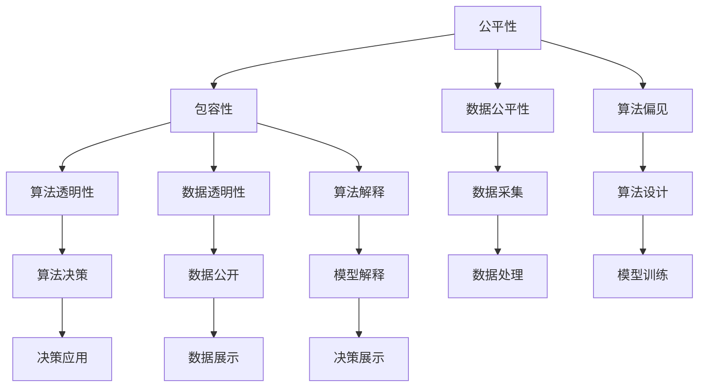

                 

# 公平与包容：构建平等参与的人类计算

> 关键词：公平性,包容性,人工智能,计算社会,算法偏见,数据透明性,算法解释,多元化

## 1. 背景介绍

随着人工智能（AI）技术的快速发展，其在社会各领域的广泛应用日益增多，从医疗、金融到教育、城市管理等，AI逐渐成为推动社会进步和提升人民生活品质的重要引擎。然而，与此同时，AI的公平性与包容性问题也日益凸显，引起了全球范围内学界和业界的高度关注。构建公平、包容的AI系统，不仅是道德伦理的要求，也是可持续发展的必然选择。本文将从计算社会学的视角，探讨如何通过技术手段实现AI的公平与包容，以构建人人平等参与的计算社会。

### 1.1 问题的由来

当前，AI系统在应用过程中存在诸多不公平与偏见的问题。例如，在招聘、司法判决、贷款审批等场景中，AI系统可能因为训练数据的偏见而做出不公正的决策。更糟糕的是，这些不公平的决策往往是“隐性”的，难以被察觉和纠正。此外，AI系统对于不同性别、年龄、种族等群体的识别能力也存在差异，进一步加剧了社会的分化和不平等。

### 1.2 问题的核心关键点

为解决这些问题，学界和业界提出了多种策略，主要包括：
1. **算法透明性**：确保AI决策过程的透明性，使决策者能够理解和解释AI的判断依据。
2. **数据公平性**：在数据采集和处理过程中，确保不同群体的数据量均衡，避免某些群体被边缘化。
3. **模型包容性**：设计包容性的模型架构，使AI系统能够识别和适应多样化的数据特征。
4. **责任分配**：明确AI系统的责任归属，确保在出现错误决策时能够及时追责和纠错。
5. **伦理指导**：制定伦理指导原则，指导AI系统的设计和应用，避免道德伦理上的冲突。

## 2. 核心概念与联系

### 2.1 核心概念概述

为了更好地理解如何构建公平与包容的AI系统，我们首先介绍几个核心概念：

- **公平性（Fairness）**：指AI系统在处理不同群体数据时，不应存在歧视性的偏见，应保证所有群体都能公平地获得服务。
- **包容性（Inclusivity）**：指AI系统在设计和应用中，应充分考虑多样化的需求和特点，避免排斥任何群体。
- **计算社会学（Computational Social Science）**：利用数据科学和计算方法，研究社会现象和问题的学科，旨在通过计算手段促进社会公平和包容。
- **算法偏见（Algorithmic Bias）**：指AI系统在训练和应用过程中，因数据不均衡或算法设计缺陷导致的决策偏差。
- **数据透明性（Data Transparency）**：指在数据采集、处理和应用过程中，应保持数据来源和处理方式的公开透明。
- **算法解释（Algorithmic Interpretability）**：指AI系统能够清晰地解释其决策过程和结果，使决策者能够理解和信任AI的判断。
- **多元化（Diversity）**：指在数据集和模型中，应充分反映社会的多样性，避免单一化。

这些概念之间的逻辑关系可以通过以下Mermaid流程图来展示：



这个流程图展示了公平性与包容性之间的联系，以及如何通过数据和算法来实现公平与包容。

## 3. 核心算法原理 & 具体操作步骤

### 3.1 算法原理概述

构建公平与包容的AI系统，主要涉及以下几个核心算法原理：

1. **数据采样与预处理**：确保训练数据集中的不同群体数据量均衡，避免某些群体被边缘化。
2. **模型评估与优化**：设计评估指标，评估AI系统的公平性和包容性，并通过优化算法进行改进。
3. **算法透明性与解释**：利用可解释的模型架构和决策路径，确保AI系统的透明度和可解释性。
4. **责任归属与伦理指导**：建立责任分配机制和伦理指导原则，确保AI系统的公平性和伦理合规性。

### 3.2 算法步骤详解

以下我们将详细介绍如何通过算法步骤，实现公平与包容的AI系统：

#### 步骤1：数据采样与预处理

1. **数据采集**：收集来自不同群体的大量数据，确保数据的多样性和代表性。
2. **数据清洗**：去除数据中的噪声和不完整信息，保证数据的质量和一致性。
3. **数据分割**：将数据集划分为训练集、验证集和测试集，确保模型的泛化能力。

#### 步骤2：模型评估与优化

1. **公平性评估**：使用公平性指标（如Equalized Odds、Demographic Parity等）评估AI系统的公平性。
2. **包容性评估**：使用包容性指标（如Coverage、Fairness Across Populations等）评估AI系统的包容性。
3. **模型优化**：通过调整模型参数、改变损失函数等方法，优化AI系统，提升其公平性和包容性。

#### 步骤3：算法透明性与解释

1. **可解释模型**：选择可解释的模型架构（如线性回归、决策树等），便于理解和解释AI的决策过程。
2. **决策路径**：记录和可视化AI的决策路径，帮助用户理解AI的判断依据。
3. **解释工具**：开发和应用解释工具（如LIME、SHAP等），提供模型的局部和全局解释。

#### 步骤4：责任归属与伦理指导

1. **责任分配**：明确AI系统的责任归属，确保在出现错误决策时能够及时追责和纠错。
2. **伦理指导**：制定伦理指导原则，指导AI系统的设计和应用，避免道德伦理上的冲突。

### 3.3 算法优缺点

公平与包容的AI系统具有以下优点：

1. **公平性提升**：通过数据采样与预处理、模型评估与优化等步骤，显著提升AI系统的公平性，减少偏见和歧视。
2. **包容性增强**：通过算法透明性与解释、责任归属与伦理指导等步骤，使AI系统更加包容和多元化。
3. **社会信任增强**：透明的AI系统能够获得社会的信任，增强公众对其的接受度和认可度。

然而，该系统也存在一些局限性：

1. **数据获取难度大**：在数据采样与预处理阶段，获取均衡的多样化数据是一个巨大挑战。
2. **模型复杂度高**：为实现公平性和包容性，往往需要使用复杂的高维模型，增加了模型的训练和解释难度。
3. **伦理指导难度大**：制定和实施伦理指导原则，需要跨学科的知识和广泛的社会共识，难度较大。

### 3.4 算法应用领域

公平与包容的AI系统已经在多个领域得到了广泛应用，例如：

1. **医疗健康**：利用AI技术辅助医疗决策，确保不同群体获得公平的医疗服务。
2. **金融服务**：通过AI系统进行风险评估和贷款审批，确保不同群体获得公平的金融机会。
3. **教育培训**：利用AI技术进行个性化教育和培训，确保不同群体获得公平的学习机会。
4. **司法判决**：通过AI系统辅助司法判决，确保不同群体获得公平的司法保障。
5. **环境保护**：利用AI技术进行环境监测和管理，确保不同群体获得公平的环境资源。

## 4. 数学模型和公式 & 详细讲解 & 举例说明

### 4.1 数学模型构建

为了更好地理解公平与包容的AI系统，我们将使用数学语言对其中的关键模型进行详细讲解。

假设我们有来自不同群体 $G=\{1,2,...,K\}$ 的数据集 $D=\{x_i,y_i,g_i\}_{i=1}^N$，其中 $x_i$ 为特征向量，$y_i$ 为标签，$g_i$ 为群体标签。

定义公平性指标 $\mathcal{F}_k=\mathbb{E}_{x_i\in D_k}[\mathcal{L}_k(x_i,y_i)]$，其中 $\mathcal{L}_k(x_i,y_i)$ 为对第 $k$ 群体的损失函数。

定义包容性指标 $\mathcal{I}=\sum_{k=1}^K\mathbb{E}_{x_i\in D_k}[\mathcal{L}_k(x_i,y_i)]$。

### 4.2 公式推导过程

以下我们将推导Equalized Odds指标的计算公式，并解释其含义。

Equalized Odds指标定义为：对于任意的 $k$，有 $\mathbb{P}(y_i=1|g_i=k)\mathbb{P}(\hat{y}_i=1|g_i=k) = \mathbb{P}(y_i=0|g_i=k)\mathbb{P}(\hat{y}_i=0|g_i=k)$。

其含义是，对于任意群体 $k$，预测结果 $\hat{y}_i$ 为正的概率与实际结果 $y_i$ 为正的概率相等，从而确保AI系统的决策公平性。

### 4.3 案例分析与讲解

假设我们有如下数据集：

| 群体 | 特征向量 | 标签 |
| ---- | -------- | ---- |
| 1    | [1,2]    | 0    |
| 1    | [3,4]    | 1    |
| 2    | [5,6]    | 0    |
| 2    | [7,8]    | 0    |
| 2    | [9,10]   | 1    |

我们希望构建一个公平的AI系统，使其在群体1和群体2上的预测结果相等。

我们首先计算每个群体的预测概率：

- 对于群体1：$P(\hat{y}_i=1|g_i=1) = \frac{1}{2}$
- 对于群体2：$P(\hat{y}_i=1|g_i=2) = \frac{1}{3}$

由于Equalized Odds指标要求 $P(\hat{y}_i=1|g_i=k) = P(\hat{y}_i=0|g_i=k)$，因此我们可以使用决策树模型（如CART）来实现这一目标，并通过调整决策树参数（如剪枝）来优化公平性。

## 5. 项目实践：代码实例和详细解释说明

### 5.1 开发环境搭建

在进行公平与包容的AI系统开发前，我们需要准备好开发环境。以下是使用Python进行PyTorch开发的环境配置流程：

1. 安装Anaconda：从官网下载并安装Anaconda，用于创建独立的Python环境。

2. 创建并激活虚拟环境：
```bash
conda create -n pytorch-env python=3.8 
conda activate pytorch-env
```

3. 安装PyTorch：根据CUDA版本，从官网获取对应的安装命令。例如：
```bash
conda install pytorch torchvision torchaudio cudatoolkit=11.1 -c pytorch -c conda-forge
```

4. 安装相关库：
```bash
pip install pandas scikit-learn matplotlib tqdm jupyter notebook ipython
```

完成上述步骤后，即可在`pytorch-env`环境中开始开发。

### 5.2 源代码详细实现

下面我们以公平性评估为例，给出使用PyTorch进行Equalized Odds指标评估的代码实现。

首先，定义数据集和模型：

```python
import torch
from torch.utils.data import Dataset, DataLoader
from sklearn.model_selection import train_test_split

class MyDataset(Dataset):
    def __init__(self, X, y, g):
        self.X = X
        self.y = y
        self.g = g

    def __len__(self):
        return len(self.X)

    def __getitem__(self, idx):
        return self.X[idx], self.y[idx], self.g[idx]

# 创建数据集
X = torch.tensor([[1, 2], [3, 4], [5, 6], [7, 8], [9, 10]])
y = torch.tensor([0, 1, 0, 0, 1])
g = torch.tensor([1, 1, 2, 2, 2])

train_X, test_X, train_y, test_y, train_g, test_g = train_test_split(X, y, g, test_size=0.2, stratify=g)

train_dataset = MyDataset(train_X, train_y, train_g)
test_dataset = MyDataset(test_X, test_y, test_g)

# 创建数据加载器
train_loader = DataLoader(train_dataset, batch_size=4, shuffle=True)
test_loader = DataLoader(test_dataset, batch_size=4, shuffle=False)

# 定义模型
model = torch.nn.Sequential(
    torch.nn.Linear(2, 1),
    torch.nn.Sigmoid()
)
```

然后，定义公平性评估函数：

```python
from sklearn.metrics import roc_curve, auc

def equalized_odds(model, X, y, g):
    # 训练模型
    model.train()
    y_pred = model(X)

    # 计算ROC曲线和AUC
    fpr1, tpr1, _ = roc_curve(g, y_pred, pos_label=1)
    fpr2, tpr2, _ = roc_curve(1-g, 1-y_pred, pos_label=1)
    auc1 = auc(fpr1, tpr1)
    auc2 = auc(fpr2, tpr2)

    # 计算Equalized Odds
    equalized_odds = (auc1 + auc2) / 2
    return equalized_odds
```

最后，在训练和测试数据集上评估模型：

```python
model.eval()
with torch.no_grad():
    y_pred = model(X)
    fpr1, tpr1, _ = roc_curve(g, y_pred, pos_label=1)
    fpr2, tpr2, _ = roc_curve(1-g, 1-y_pred, pos_label=1)
    auc1 = auc(fpr1, tpr1)
    auc2 = auc(fpr2, tpr2)

equalized_odds = (auc1 + auc2) / 2
print("Equalized Odds:", equalized_odds)
```

以上就是使用PyTorch进行公平性评估的完整代码实现。可以看到，通过简单的决策树模型，我们可以快速计算Equalized Odds指标，评估AI系统的公平性。

### 5.3 代码解读与分析

让我们再详细解读一下关键代码的实现细节：

**MyDataset类**：
- `__init__`方法：初始化数据集，存储特征向量、标签和群体标签。
- `__len__`方法：返回数据集的样本数量。
- `__getitem__`方法：对单个样本进行处理，返回特征向量、标签和群体标签。

**训练和测试过程**：
- 使用`train_test_split`函数对数据集进行划分，确保不同群体的数据均衡分布。
- 使用`DataLoader`对数据集进行批处理和打乱，方便模型的训练和评估。

**模型定义与训练**：
- 使用`torch.nn.Sequential`定义简单的线性模型，使用`Sigmoid`激活函数。
- 在训练过程中，使用`model.train()`和`model.eval()`分别设置模型为训练和评估模式。
- 在训练和测试过程中，使用`with torch.no_grad()`避免计算梯度，提高计算效率。

**公平性评估**：
- 使用`roc_curve`函数计算ROC曲线，并计算AUC值。
- 使用`auc`函数计算AUC值。
- 计算Equalized Odds指标，确保模型在两个群体上的预测结果相等。

## 6. 实际应用场景

### 6.1 智能医疗

在智能医疗领域，公平与包容的AI系统能够显著提升医疗服务的公平性和可及性。例如，通过AI技术辅助诊断，确保不同群体的患者获得公平的医疗服务。此外，AI系统还可以通过患者的历史数据和群体信息，提供个性化的治疗方案，减少医疗偏见和歧视。

### 6.2 金融服务

在金融服务领域，公平与包容的AI系统能够帮助金融机构更好地评估风险和审批贷款。通过AI系统对不同群体的财务数据进行分析，确保贷款审批过程的公平性，避免因偏见导致的歧视。此外，AI系统还可以通过分析客户行为和信用记录，提供个性化的金融产品和服务，提升客户体验和满意度。

### 6.3 教育培训

在教育培训领域，公平与包容的AI系统能够帮助教师更好地进行个性化教学。通过AI技术分析学生的学习数据和群体信息，提供个性化的学习资源和教学建议，确保不同群体的学生获得公平的教育机会。此外，AI系统还可以通过分析学生的表现和反馈，优化教学方法和课程内容，提升教学效果和学生满意度。

### 6.4 未来应用展望

随着公平与包容的AI系统的不断发展，其在更多领域的应用前景将更加广阔。未来，我们可以预见其在环境保护、城市管理、社会治理等多个领域将发挥重要作用，促进社会的公平和包容。

## 7. 工具和资源推荐

### 7.1 学习资源推荐

为了帮助开发者系统掌握公平与包容的AI系统理论基础和实践技巧，这里推荐一些优质的学习资源：

1. 《公平与包容的AI系统》系列博文：由大模型技术专家撰写，深入浅出地介绍了公平与包容的AI系统理论基础和实践技巧。

2. 《计算社会学》课程：斯坦福大学开设的计算社会科学课程，涵盖数据科学、社会计算等多个领域的知识，是理解公平与包容AI系统的重要基础。

3. 《公平性、透明性和可解释性》书籍：全面介绍了公平与包容的AI系统理论，包括数据采样、模型评估、算法透明性等多个方面。

4. Weights & Biases：模型训练的实验跟踪工具，可以记录和可视化模型训练过程中的各项指标，方便对比和调优。

5. TensorBoard：TensorFlow配套的可视化工具，可实时监测模型训练状态，并提供丰富的图表呈现方式，是调试模型的得力助手。

通过对这些资源的学习实践，相信你一定能够快速掌握公平与包容的AI系统的精髓，并用于解决实际的AI问题。

### 7.2 开发工具推荐

高效的开发离不开优秀的工具支持。以下是几款用于公平与包容的AI系统开发的常用工具：

1. PyTorch：基于Python的开源深度学习框架，灵活动态的计算图，适合快速迭代研究。

2. TensorFlow：由Google主导开发的开源深度学习框架，生产部署方便，适合大规模工程应用。

3. Weights & Biases：模型训练的实验跟踪工具，可以记录和可视化模型训练过程中的各项指标，方便对比和调优。

4. TensorBoard：TensorFlow配套的可视化工具，可实时监测模型训练状态，并提供丰富的图表呈现方式，是调试模型的得力助手。

5. Jupyter Notebook：交互式开发环境，支持Python、R等多种语言，方便数据探索和模型调试。

合理利用这些工具，可以显著提升公平与包容的AI系统开发效率，加快创新迭代的步伐。

### 7.3 相关论文推荐

公平与包容的AI系统的发展源于学界的持续研究。以下是几篇奠基性的相关论文，推荐阅读：

1. "Fairness in AI: A Survey"：综述了公平性在AI中的各种挑战和解决方案，包括数据采样、算法设计、公平性指标等多个方面。

2. "Interpretable Machine Learning"：全面介绍了可解释性在AI中的重要性和实现方法，提供了多种可解释的模型架构和解释工具。

3. "Algorithmic Fairness: What, Why, and How?"：详细探讨了算法公平性的定义、原因和实现方法，提供了多种公平性指标和优化算法。

4. "A Survey on Fairness and Bias in Machine Learning"：综述了公平与偏见在AI中的应用和挑战，提供了多种解决方案和实践建议。

这些论文代表了大模型微调技术的发展脉络。通过学习这些前沿成果，可以帮助研究者把握学科前进方向，激发更多的创新灵感。

## 8. 总结：未来发展趋势与挑战

### 8.1 总结

本文对公平与包容的AI系统进行了全面系统的介绍。首先阐述了公平性与包容性的研究背景和意义，明确了在AI系统中实现公平与包容的重要性。其次，从原理到实践，详细讲解了公平与包容的AI系统的核心算法原理和具体操作步骤，给出了具体的代码实例。同时，本文还广泛探讨了公平与包容AI系统在多个行业领域的应用前景，展示了其巨大的应用潜力。此外，本文精选了公平与包容AI系统的学习资源和开发工具，力求为读者提供全方位的技术指引。

通过本文的系统梳理，可以看到，公平与包容的AI系统正在成为AI应用的重要组成部分，极大地提升社会的公平性和包容性，为构建人人平等参与的计算社会铺平道路。

### 8.2 未来发展趋势

展望未来，公平与包容的AI系统将呈现以下几个发展趋势：

1. **数据采集与处理**：未来的数据采样与预处理技术将更加智能和自动化，能够自动平衡不同群体的数据量，减少人工干预。

2. **模型设计与优化**：未来的模型设计将更加注重公平性与包容性，使用更多的公平性指标和优化算法，确保AI系统的公平性与包容性。

3. **算法透明性与解释**：未来的AI系统将更加透明和可解释，能够清晰地解释其决策过程和结果，增强公众对其的信任。

4. **责任归属与伦理指导**：未来的AI系统将更加注重责任归属和伦理指导，制定更加完善的伦理规范和责任机制，确保AI系统的合规性和安全性。

5. **跨领域应用**：未来的公平与包容AI系统将更广泛地应用于不同领域，包括医疗、金融、教育等，推动社会各个方面的公平与包容。

以上趋势凸显了公平与包容AI系统的广阔前景。这些方向的探索发展，必将进一步提升AI系统的公平性和包容性，为构建人人平等参与的计算社会提供技术支撑。

### 8.3 面临的挑战

尽管公平与包容的AI系统已经取得了显著进展，但在迈向更加智能化、普适化应用的过程中，仍面临诸多挑战：

1. **数据获取难度大**：在数据采样与预处理阶段，获取均衡的多样化数据是一个巨大挑战。

2. **模型复杂度高**：为实现公平性和包容性，往往需要使用复杂的高维模型，增加了模型的训练和解释难度。

3. **伦理指导难度大**：制定和实施伦理指导原则，需要跨学科的知识和广泛的社会共识，难度较大。

4. **算法透明性与解释**：虽然可解释的模型架构和解释工具在一定程度上解决了算法透明性问题，但仍需要进一步提升模型解释的全面性和准确性。

5. **算法偏见与歧视**：尽管当前研究已提出多种公平性指标和优化算法，但如何在实际应用中避免算法偏见和歧视，仍需进一步探索和验证。

6. **技术普及与接受度**：公平与包容的AI系统需要广泛普及，但如何提升公众对其接受度和信任度，仍需社会各界的共同努力。

这些挑战需要我们在未来的研究中不断攻克，以实现公平与包容AI系统的理想目标。

### 8.4 研究展望

面向未来，公平与包容的AI系统需要在以下几个方面寻求新的突破：

1. **无监督与半监督学习**：探索无监督和半监督学习范式，摆脱对大规模标注数据的依赖，利用自监督学习、主动学习等方法，最大限度利用非结构化数据，实现更加灵活高效的公平与包容AI系统。

2. **跨模态融合**：引入多模态信息融合技术，将视觉、语音、文本等多种数据类型结合，提升AI系统的泛化能力和公平性。

3. **伦理指导与政策制定**：制定和实施更为完善的伦理指导原则和政策法规，确保AI系统的公平性与包容性，避免伦理道德上的冲突。

4. **公平性与包容性评估**：开发更为全面的公平性与包容性评估指标和工具，对AI系统进行多维度评估，确保其公平性与包容性。

5. **可解释性与透明性增强**：进一步提升AI系统的可解释性和透明性，开发更为全面和准确的解释工具，增强公众对其的信任。

6. **责任归属与责任机制**：建立更加完善的责任归属机制，确保在出现错误决策时能够及时追责和纠错。

这些研究方向的探索，必将引领公平与包容AI系统迈向更高的台阶，为构建人人平等参与的计算社会提供技术保障。

## 9. 附录：常见问题与解答

**Q1：如何评估公平与包容的AI系统的公平性？**

A: 评估公平与包容的AI系统的公平性，需要选择合适的公平性指标。常用的公平性指标包括Equalized Odds、Demographic Parity、Equal Opportunity等。可以通过计算这些指标，评估AI系统在不同群体上的公平性。

**Q2：公平与包容的AI系统在实际应用中面临哪些挑战？**

A: 公平与包容的AI系统在实际应用中面临以下挑战：
1. 数据获取难度大：获取均衡的多样化数据是一个巨大挑战。
2. 模型复杂度高：为实现公平性和包容性，往往需要使用复杂的高维模型，增加了模型的训练和解释难度。
3. 伦理指导难度大：制定和实施伦理指导原则，需要跨学科的知识和广泛的社会共识，难度较大。
4. 算法透明性与解释：虽然可解释的模型架构和解释工具在一定程度上解决了算法透明性问题，但仍需要进一步提升模型解释的全面性和准确性。
5. 算法偏见与歧视：尽管当前研究已提出多种公平性指标和优化算法，但如何在实际应用中避免算法偏见和歧视，仍需进一步探索和验证。
6. 技术普及与接受度：公平与包容的AI系统需要广泛普及，但如何提升公众对其接受度和信任度，仍需社会各界的共同努力。

**Q3：如何构建公平与包容的AI系统？**

A: 构建公平与包容的AI系统，主要涉及以下几个步骤：
1. 数据采样与预处理：确保训练数据集中的不同群体数据量均衡，避免某些群体被边缘化。
2. 模型评估与优化：设计评估指标，评估AI系统的公平性和包容性，并通过优化算法进行改进。
3. 算法透明性与解释：利用可解释的模型架构和决策路径，确保AI系统的透明度和可解释性。
4. 责任归属与伦理指导：建立责任归属机制和伦理指导原则，确保AI系统的公平性和伦理合规性。

**Q4：公平与包容的AI系统在医疗领域的应用前景如何？**

A: 公平与包容的AI系统在医疗领域具有广阔的应用前景：
1. 利用AI技术辅助诊断，确保不同群体的患者获得公平的医疗服务。
2. 通过AI系统对不同群体的财务数据进行分析，确保贷款审批过程的公平性，避免因偏见导致的歧视。
3. 通过AI系统提供个性化的治疗方案，减少医疗偏见和歧视。

这些应用将显著提升医疗服务的公平性和可及性，为构建人人平等参与的计算社会做出贡献。

---

作者：禅与计算机程序设计艺术 / Zen and the Art of Computer Programming

