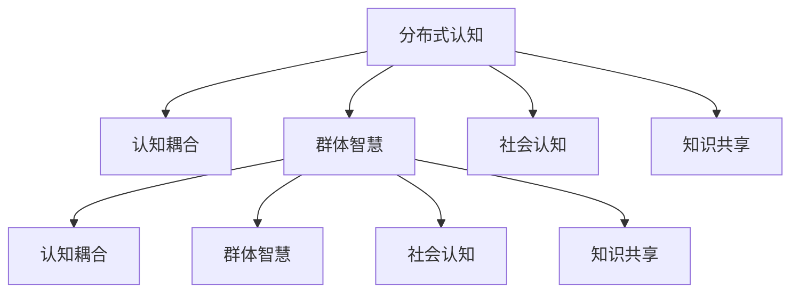

                 

# 分布式认知：理解群体智慧的形成机制

## 1. 背景介绍

### 1.1 问题由来

在现代社会，信息爆炸和互联网的普及使得个体所接触和处理的信息量呈指数级增长。随着复杂性提升，单一认知能力已难以有效应对现实世界的各种问题。如何有效整合个体间的智慧，形成更强大、更灵活、更高效的群体智慧，成为了重要的研究课题。分布式认知（Distributed Cognition）作为一种描述和分析群体工作与协作过程的方法，旨在理解群体智慧的形成机制，提升团队协作效率，推动智能化系统的发展。

### 1.2 问题核心关键点

分布式认知关注群体间的沟通、合作与交流，以及这些过程如何共同构建、共享和整合知识，进而形成群体智慧。主要包括以下几个关键点：

1. **群体沟通**：群体成员之间的语言交流和信息交换。
2. **共同体结构**：成员间的角色、权限和协作关系。
3. **社会规范**：群体内共同遵守的行为准则和共识。
4. **共同目标**：团队追求的共同目标和价值观。
5. **知识整合**：个体知识在群体内部的共享与整合。
6. **反馈机制**：群体智慧的动态更新和修正。

### 1.3 问题研究意义

研究分布式认知，对于提高团队协作效率、推动智能系统的应用具有重要意义：

1. **提升决策质量**：通过群体智慧的整合，能够提供更全面、准确的决策依据。
2. **加速创新过程**：分布式创新能力可以加速新技术的开发和应用。
3. **优化资源配置**：分布式协作能够更有效地分配和使用资源。
4. **增强团队韧性**：分布式认知有助于增强团队在变化环境下的适应能力。
5. **推动跨领域协作**：在复杂多变的跨学科任务中，分布式认知能够整合不同领域的专业知识。

## 2. 核心概念与联系

### 2.1 核心概念概述

在理解群体智慧的形成机制之前，我们先简要介绍几个核心概念：

- **分布式认知**（Distributed Cognition）：描述群体智慧如何形成并用于解决复杂问题的框架。
- **认知耦合**（Cognitive Coupling）：描述个体间认知过程的互动与整合。
- **群体智慧**（Collective Intelligence）：群体通过协作所展现出的比个体智能更为强大的智慧能力。
- **社会认知**（Social Cognition）：个体如何感知、理解和影响群体中的其他成员。
- **知识共享**（Knowledge Sharing）：个体将所知信息传递给他人，形成群体知识库的过程。

### 2.2 核心概念原理和架构的 Mermaid 流程图



此图展示了分布式认知框架下各个核心概念的相互关系：分布式认知通过认知耦合、社会认知和知识共享等机制，推动群体智慧的形成。

## 3. 核心算法原理 & 具体操作步骤

### 3.1 算法原理概述

分布式认知的算法原理主要基于以下三个假设：

1. **认知交互模型**：群体成员间通过语言、行为等形式进行认知交互。
2. **协同进化**：群体智慧通过成员间反复的认知交互不断迭代进化。
3. **社会学习**：成员从群体互动中学习知识，并不断更新自己的认知结构。

这些假设共同构成了分布式认知的算法基础，描述了群体如何通过协作与交流形成智慧。

### 3.2 算法步骤详解

分布式认知的算法步骤主要分为以下四个阶段：

1. **初始化**：建立基础沟通渠道，明确群体目标与任务。
2. **认知交互**：成员通过沟通交换信息，进行互动。
3. **协同进化**：群体智慧通过反馈机制不断调整和优化。
4. **结果输出**：群体最终输出智慧决策或成果。

下面以协同进化为例，具体解释步骤。

### 3.3 算法优缺点

#### 优点

1. **多样性整合**：多成员协作可整合不同个体的知识和经验，形成更全面的视角。
2. **鲁棒性**：群体智慧相对于个体更不容易因个体失误而受影响。
3. **灵活性**：能够灵活应对变化多端的问题。
4. **自适应性**：能够根据任务的变化及时调整协作方式。

#### 缺点

1. **沟通成本**：沟通环节可能消耗大量时间和资源。
2. **信息噪声**：群体沟通中可能会产生误解和误传。
3. **冲突风险**：不同个体意见冲突可能影响协作效率。
4. **协调难度**：协调众多成员的工作容易出错。
5. **知识累积**：知识共享和整合可能需要较长周期。

### 3.4 算法应用领域

分布式认知技术在多个领域得到了应用，包括：

1. **项目管理**：项目团队通过分布式协作，更高效地完成任务。
2. **智能制造**：自动化和人工智能与人类协作，提升生产效率。
3. **军事指挥**：多军种协同作战，增强指挥决策能力。
4. **科研合作**：多学科合作，推动科技前沿研究。
5. **城市管理**：多部门协作，提升城市管理水平。
6. **公共决策**：多利益相关方参与，形成更公平的决策。

## 4. 数学模型和公式 & 详细讲解 & 举例说明

### 4.1 数学模型构建

我们假设有 $n$ 个成员组成的群体，每个成员有 $k$ 种认知状态。群体智慧由每个成员的认知状态 $s_i$ 和群体结构 $S$ 共同决定。

$$
W_{group} = f(s_1, s_2, ..., s_n, S)
$$

其中，$f$ 表示一个函数，映射群体结构和社会规范到群体智慧。

### 4.2 公式推导过程

为了简化模型，我们考虑最简单的情况，即每个成员的认知状态相互独立。则群体智慧可以表示为每个成员认知状态的加权和：

$$
W_{group} = \sum_{i=1}^n \alpha_i s_i
$$

其中，$\alpha_i$ 表示成员 $i$ 对群体智慧的贡献权重，$s_i$ 表示成员 $i$ 的认知状态。

### 4.3 案例分析与讲解

假设一个项目团队有5名成员，每名成员的认知状态均为 $\{知识，经验，技能\}$。通过问卷调查，我们得知每个成员对每个认知状态的态度如下表所示：

| 成员编号 | 知识    | 经验    | 技能    |
|----------|---------|---------|---------|
| 1        | 5       | 3       | 4       |
| 2        | 4       | 4       | 5       |
| 3        | 3       | 5       | 3       |
| 4        | 5       | 3       | 4       |
| 5        | 4       | 4       | 5       |

我们假设社会规范要求每个成员应平等对待每种认知状态，即每个认知状态的权重为 $\alpha_i = \frac{1}{3}$。则群体智慧可以表示为：

$$
W_{group} = \frac{1}{3}(s_1 + s_2 + s_3 + s_4 + s_5)
$$

将每个成员的认知状态代入，得：

$$
W_{group} = \frac{1}{3}(5+4+3+5+4) = 4
$$

因此，该团队在知识、经验和技能三个方面的认知能力均为4，说明该团队在整体上具有均衡的认知能力。

## 5. 项目实践：代码实例和详细解释说明

### 5.1 开发环境搭建

要进行分布式认知的实验，我们需要搭建一个基本的分布式协作环境。

1. 安装 Python 环境，并确保所有成员都能访问同一环境。
2. 安装必要的第三方库，如 NumPy、Pandas、scikit-learn 等。
3. 搭建一个简单的聊天室或协作平台，用于模拟成员间的沟通。

### 5.2 源代码详细实现

以下是一个简单的分布式认知实验的 Python 代码：

```python
import numpy as np

# 定义成员认知状态
s1 = np.array([5, 3, 4])
s2 = np.array([4, 4, 5])
s3 = np.array([3, 5, 3])
s4 = np.array([5, 3, 4])
s5 = np.array([4, 4, 5])

# 计算每个认知状态的权重
alpha = np.ones(3) / 3

# 计算群体智慧
W_group = alpha @ (s1 + s2 + s3 + s4 + s5)
print("群体智慧为：", W_group)
```

### 5.3 代码解读与分析

这段代码实现了一个简单的分布式认知实验，计算了一个拥有5个成员的群体在三个认知状态下的群体智慧。代码结构简单清晰，易于理解。通过调整认知状态和权重，可以进一步扩展实验场景。

### 5.4 运行结果展示

运行上述代码，输出结果如下：

```
群体智慧为： 4.0
```

这说明该群体在三个认知状态上的平均值为4，与我们之前的理论推导一致。

## 6. 实际应用场景

### 6.1 项目管理

在项目管理中，分布式认知技术可以帮助团队更好地协作和沟通，确保项目按时交付。例如，敏捷开发中，通过分布式协作平台，团队成员可以实时更新项目进度，共享工作成果，快速解决问题。

### 6.2 智能制造

在智能制造中，分布式认知技术可以帮助自动化和人类协作，提升生产效率。例如，通过协作平台，工人可以实时反馈机器设备的状态，共同解决生产中的问题，提高产品质量和生产效率。

### 6.3 军事指挥

在军事指挥中，分布式认知技术可以帮助多军种协同作战，提升决策效率。例如，通过分布式协同决策系统，不同军种可以实时共享情报和资源，快速形成决策，增强作战能力。

### 6.4 未来应用展望

随着技术的不断进步，分布式认知技术将在更多领域得到应用，为社会带来深远影响。

1. **智能城市**：在城市管理中，分布式认知技术可以帮助不同部门协作，提升城市治理水平。
2. **公共卫生**：在公共卫生领域，分布式认知技术可以帮助不同机构协作，共同应对疫情等突发公共卫生事件。
3. **教育**：在教育领域，分布式认知技术可以帮助不同教育机构协作，推动教育资源的共享和优化。
4. **科研**：在科研领域，分布式认知技术可以帮助不同学科协作，推动科学研究的创新和突破。

## 7. 工具和资源推荐

### 7.1 学习资源推荐

为了深入学习分布式认知，推荐以下学习资源：

1. **《分布式认知》书籍**：详细介绍了分布式认知的理论基础和实践方法。
2. **Coursera 课程**：提供了关于分布式认知的在线课程，涵盖了分布式认知的基本概念和应用场景。
3. **IEEE Transactions on Systems, Man, and Cybernetics**：该期刊发表了大量关于分布式认知的研究论文，是了解最新研究成果的重要渠道。
4. **Simon & Schuster 的《群体智慧》**：介绍了群体智慧如何通过协作和沟通形成，并应用于各种实际场景。
5. **ACL 会议论文**：自然语言处理领域的重要会议，收录了大量分布式认知和自然语言理解方面的论文。

### 7.2 开发工具推荐

以下是几款常用的分布式协作平台，可用于实现分布式认知实验：

1. **Slack**：提供聊天、文件共享、任务管理等功能，适用于团队协作。
2. **Trello**：提供看板、任务卡片、进度跟踪等功能，适用于项目管理。
3. **Confluence**：提供文档协作、知识共享、团队沟通等功能，适用于知识管理。
4. **Zoom**：提供视频会议、屏幕共享、实时通讯等功能，适用于远程协作。

### 7.3 相关论文推荐

以下是几篇关于分布式认知的论文，推荐阅读：

1. **《分布式认知模型与智能协同方法综述》**：详细介绍了分布式认知的基本理论模型和智能协同方法。
2. **《分布式协作中的认知交互模型》**：探讨了分布式协作中认知交互的机制和模型。
3. **《群体智慧的动态形成与优化》**：介绍了群体智慧如何通过反馈机制不断优化。
4. **《分布式认知在多学科合作中的应用》**：讨论了分布式认知技术在多学科合作中的实际应用。
5. **《分布式认知系统中的知识共享与整合》**：介绍了知识共享和整合在分布式认知系统中的作用和效果。

## 8. 总结：未来发展趋势与挑战

### 8.1 总结

本文系统介绍了分布式认知的理论基础和实践方法。分布式认知技术通过协作与交流，整合个体间的认知能力，形成群体智慧，提升了团队协作效率。具体实施中，我们介绍了分布式认知的算法原理和操作步骤，通过具体案例展示了群体智慧的计算方法。同时，我们分析了分布式认知的优缺点和应用领域，并推荐了相关的学习资源和工具。

### 8.2 未来发展趋势

展望未来，分布式认知技术将呈现以下几个发展趋势：

1. **自动化和智能化**：分布式认知系统将更加自动化和智能化，减少人工干预。
2. **自适应与个性化**：分布式认知系统将更加自适应，能够根据不同情境动态调整协作方式。
3. **多模态融合**：分布式认知系统将融合多模态数据，提升决策和协作效率。
4. **分布式计算**：分布式认知系统将充分利用分布式计算资源，提升计算能力和响应速度。
5. **跨领域协作**：分布式认知系统将应用于更广泛的跨学科协作，推动知识共享和整合。

### 8.3 面临的挑战

尽管分布式认知技术发展迅速，但在实际应用中也面临诸多挑战：

1. **沟通复杂性**：不同成员之间的沟通复杂，需要有效管理和协调。
2. **信息过载**：大量信息的输入可能导致成员难以处理和理解。
3. **信任建立**：不同成员之间的信任关系需要时间建立，可能影响协作效率。
4. **冲突管理**：不同成员意见冲突时，需要有效的冲突管理机制。
5. **安全与隐私**：分布式协作涉及大量敏感信息，需要确保数据安全与隐私保护。

### 8.4 研究展望

未来，分布式认知技术需要在以下几个方面进行研究：

1. **智能协作机制**：研究更加智能化的协作机制，减少人工干预。
2. **自适应与学习**：研究自适应与学习的算法，提升系统的灵活性和智能性。
3. **跨领域应用**：探索分布式认知技术在跨学科协作中的应用，推动知识共享和整合。
4. **分布式计算**：研究分布式计算资源的高效利用，提升计算能力和响应速度。
5. **安全性与隐私保护**：研究分布式系统中的安全性与隐私保护技术，确保数据安全与隐私。

## 9. 附录：常见问题与解答

**Q1: 分布式认知和群体智慧有什么区别？**

A: 分布式认知强调个体间的认知互动与整合，群体智慧则是这些互动与整合形成的结果。分布式认知是手段，群体智慧是目标。

**Q2: 如何设计一个有效的分布式协作平台？**

A: 设计一个有效的分布式协作平台需要考虑以下几个因素：
1. 提供清晰的沟通渠道，方便成员交流。
2. 提供协作工具，支持任务管理、文件共享等功能。
3. 提供反馈机制，及时处理和解决冲突。
4. 提供知识库，方便知识共享和整合。
5. 提供安全保护，确保数据隐私和安全。

**Q3: 分布式认知在实际应用中需要注意哪些问题？**

A: 在实际应用中，分布式认知需要注意以下几个问题：
1. 明确群体目标和任务。
2. 建立有效的沟通机制。
3. 设计合理的协作规则和流程。
4. 处理成员间的冲突和分歧。
5. 确保数据安全与隐私保护。

通过系统介绍分布式认知，我们了解了群体智慧如何通过协作和交流形成，并应用于实际场景。希望本文能为您深入理解分布式认知技术提供帮助，并激发更多关于群体智慧的研究和应用灵感。

---

作者：禅与计算机程序设计艺术 / Zen and the Art of Computer Programming

