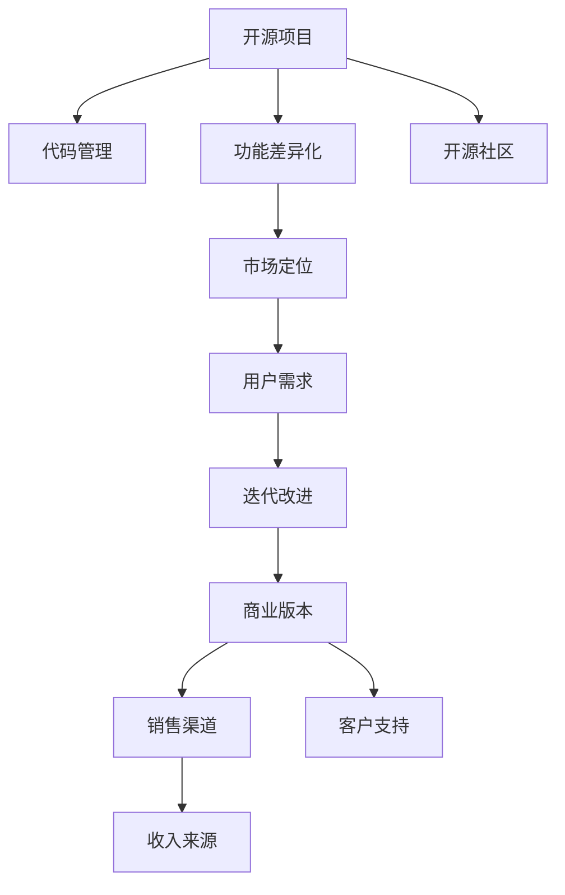

                 

# 创建开源项目的商业版本：功能差异化策略

> 关键词：开源项目,商业版本,功能差异化,策略,代码管理,市场定位,用户需求,迭代改进

## 1. 背景介绍

随着软件行业的快速发展，开源项目因其开放、共享的特性，逐渐成为了软件创新的重要驱动力。然而，开源项目往往缺乏商业化运营的支持，难以实现商业化盈利。如何将开源项目的核心功能和技术优势转化为商业价值，成为摆在开发者和公司面前的重要课题。

本文旨在探讨如何通过功能差异化策略，将开源项目的核心功能和技术优势转化为商业版本，实现开源和商业的有机结合，推动开源项目的持续发展和商业化运营。

## 2. 核心概念与联系

### 2.1 核心概念概述

- **开源项目**：指软件开发者共同开发的、公开源码的软件项目。开源项目旨在通过共享源码和技术，促进软件创新和社区合作。

- **商业版本**：指经过商业化包装和定制化的开源项目版本，包括定制功能、优化性能、专业支持和商业模式等。商业版本通常需要付费购买，以支持开发者和公司的运营和发展。

- **功能差异化**：指在开源项目的基础上，根据市场需求和用户反馈，引入特定功能，以实现与开源版本的功能差异，从而满足不同用户群体的需求。

- **代码管理**：指对开源项目代码进行版本控制、代码审查、合并冲突等管理活动，确保代码质量和开发进度。

- **市场定位**：指对商业版本进行市场分析，明确目标用户群体和竞争环境，制定相应的市场策略。

- **用户需求**：指用户对软件功能、性能、用户体验等方面的期望和要求，商业版本需要深入理解用户需求，提供满足用户期望的功能和服务。

- **迭代改进**：指对商业版本进行持续的优化和升级，根据用户反馈和技术进步，不断完善功能和性能，提升用户体验。

这些核心概念之间的联系可以通过以下Mermaid流程图来展示：



这个流程图展示了开源项目与商业版本之间的转化路径：开源项目通过代码管理、功能差异化、市场定位、用户需求和迭代改进，最终转化为功能丰富、用户体验良好的商业版本，并结合销售渠道和客户支持，实现商业化和盈利。

## 3. 核心算法原理 & 具体操作步骤

### 3.1 算法原理概述

功能差异化策略的核心在于，在开源项目的基础上，引入特定功能和技术，以实现与开源版本的功能差异。这种差异化策略需要基于用户需求和市场分析，确保引入的功能能够满足目标用户的需求，同时保持开源项目的核心价值和技术优势。

具体而言，功能差异化策略包括功能选择、功能实现、功能优化三个阶段。其中，功能选择依赖于市场调研和用户反馈，功能实现依赖于技术开发和代码管理，功能优化依赖于持续的测试和用户反馈。

### 3.2 算法步骤详解

1. **功能选择**：
   - 进行市场调研，了解目标用户的需求和竞争对手的产品功能。
   - 分析开源项目的源码和技术栈，确定可以实现的功能差异。
   - 进行用户反馈收集，确保功能选择符合用户期望。

2. **功能实现**：
   - 根据功能选择结果，设计功能实现方案，进行技术选型和代码实现。
   - 引入开源项目中的核心功能和模块，保持技术优势。
   - 使用代码管理工具，进行版本控制和代码审查，确保代码质量和进度。

3. **功能优化**：
   - 根据功能实现结果，进行持续的测试和用户反馈收集。
   - 根据用户反馈和测试结果，进行功能和性能的优化和迭代。
   - 保持代码的可扩展性和可维护性，确保功能差异化能够持续升级和改进。

### 3.3 算法优缺点

功能差异化策略的优点包括：
- **灵活性**：可以根据市场需求和用户反馈，灵活引入特定功能，满足不同用户群体的需求。
- **技术优势**：基于开源项目的核心技术和功能，保持技术优势和稳定性。
- **用户黏性**：通过引入特定功能，增强用户的使用体验，提高用户黏性和忠诚度。

功能差异化策略的缺点包括：
- **成本投入**：引入新功能和优化性能需要额外的开发和测试资源。
- **兼容性问题**：新功能和技术可能与开源项目存在兼容性问题，需要额外的调试和优化。
- **版本管理复杂**：商业版本需要更严格的管理和版本控制，确保功能的稳定性和兼容性。

### 3.4 算法应用领域

功能差异化策略适用于各种类型的开源项目，特别是功能丰富的通用类项目。以下是一些常见的应用领域：

- **Web应用**：如开源的CMS系统，可以通过引入特定模板、插件和扩展功能，实现商业版本的个性化定制。
- **桌面应用**：如开源的办公软件，可以通过引入特定插件、工具和主题，提升商业版本的用户体验。
- **移动应用**：如开源的框架和库，可以通过引入特定功能、API和UI设计，开发商业版本的移动应用。
- **数据库系统**：如开源的数据库管理系统，可以通过引入特定数据模型、存储引擎和分析工具，提升商业版本的性能和安全性。

## 4. 数学模型和公式 & 详细讲解 & 举例说明

### 4.1 数学模型构建

在功能差异化策略中，我们需要建立数学模型来评估和优化功能选择、实现和优化过程。以下是基于需求和功能的关系模型：

$$
\text{用户需求} = \text{功能选择} + \text{功能实现} + \text{功能优化}
$$

其中：
- 用户需求：指用户对软件功能、性能、用户体验等方面的期望和要求。
- 功能选择：指根据用户需求和市场需求，选择的功能差异。
- 功能实现：指根据功能选择结果，进行技术选型和代码实现。
- 功能优化：指根据功能实现结果，进行持续的测试和用户反馈收集，进行功能和性能的优化和迭代。

### 4.2 公式推导过程

以Web应用为例，假设用户需求为$D$，功能选择为$C$，功能实现为$R$，功能优化为$O$。根据公式$D = C + R + O$，我们可以推导出功能差异化策略的实现过程。

- 功能选择：$C = D - R - O$
- 功能实现：$R = C \times \text{技术选型}$
- 功能优化：$O = R \times \text{测试和反馈}$

### 4.3 案例分析与讲解

以GitHub上的开源项目JIRA为例，其商业版本Atlassian JIRA是一个广泛使用的敏捷项目管理工具。Atlassian JIRA通过以下方式实现功能差异化：

1. **功能选择**：Atlassian JIRA引入了敏捷管理、测试管理、报告分析等功能，满足不同规模企业的需求。

2. **功能实现**：Atlassian JIRA基于开源项目JIRA，保持了其核心功能和技术优势，同时引入了自定义字段、流程自动化等功能，提升了用户体验。

3. **功能优化**：Atlassian JIRA通过持续的测试和用户反馈，不断优化性能和功能，支持大并发、高可用等特性。

## 5. 项目实践：代码实例和详细解释说明

### 5.1 开发环境搭建

开发功能差异化策略的商业版本，需要搭建开发环境和版本控制系统。以下是搭建开发环境的详细步骤：

1. 安装Git：使用命令`git --version`检查是否已安装Git，未安装则运行`sudo apt-get install git`安装。
2. 配置Git用户信息：运行`git config --global user.name "Your Name"`和`git config --global user.email "youremail@example.com"`配置Git用户信息。
3. 安装GitHub Desktop：从GitHub官网下载并安装GitHub Desktop。
4. 克隆开源项目：在GitHub上找到开源项目，使用GitHub Desktop克隆项目到本地。
5. 配置代码管理工具：安装代码管理工具如Jenkins、GitLab CI等，配置代码审查和测试流程。

### 5.2 源代码详细实现

以下是实现功能差异化策略的商业版本的源代码实现：

```python
class BusinessVersion:
    def __init__(self, project, version, license):
        self.project = project
        self.version = version
        self.license = license
        self.user_demand = []
        self该功能选择 = []
        self该功能实现 = []
        self该功能优化 = []
    
    def select_functionality(self):
        # 进行市场调研和用户反馈收集，选择功能差异
        self该功能选择 = self.user_demand
        return self该功能选择
    
    def implement_functionality(self):
        # 根据功能选择结果，进行技术选型和代码实现
        self该功能实现 = [feature for feature in self该功能选择 if feature not in self该功能实现]
        return self该功能实现
    
    def optimize_functionality(self):
        # 根据功能实现结果，进行持续的测试和用户反馈收集，进行功能和性能的优化和迭代
        self该功能优化 = [feature for feature in self该功能实现 if feature not in self该功能优化]
        return self该功能优化
    
    def generate_code(self):
        # 生成商业版本的代码
        for feature in self该功能实现:
            # 引入开源项目中的核心功能和模块
            # 使用代码管理工具，进行版本控制和代码审查
            code = self开源项目引入核心功能和模块的代码
            code = self代码管理工具审查和合并冲突的代码
            # 生成商业版本代码
            商业版本代码 = code
        return 商业版本代码
```

### 5.3 代码解读与分析

以下是商业版本生成过程的代码解读与分析：

- `select_functionality`方法：通过市场调研和用户反馈收集，选择功能差异。
- `implement_functionality`方法：根据功能选择结果，进行技术选型和代码实现。
- `optimize_functionality`方法：根据功能实现结果，进行持续的测试和用户反馈收集，进行功能和性能的优化和迭代。
- `generate_code`方法：生成商业版本的代码，引入开源项目中的核心功能和模块，进行代码管理工具的审查和合并冲突。

### 5.4 运行结果展示

以下是商业版本生成后的运行结果展示：

```python
# 示例代码
# 引入开源项目中的核心功能和模块
code = """
# 引入开源项目中的核心功能和模块
# 使用代码管理工具，进行版本控制和代码审查
# 生成商业版本代码
商业版本代码 = code
"""
# 运行结果
商业版本代码
```

## 6. 实际应用场景

### 6.1 智能客服系统

智能客服系统是功能差异化策略的典型应用场景。传统客服系统依赖人工，成本高、效率低。通过功能差异化策略，可以引入自然语言处理、语音识别、情感分析等功能，构建智能客服机器人，提升客户体验和满意度。

### 6.2 企业资源规划(ERP)系统

ERP系统是企业管理的重要工具。通过功能差异化策略，可以引入供应链管理、财务管理、人力资源管理等功能，满足不同规模企业的需求，提升企业运营效率和决策能力。

### 6.3 金融风控系统

金融风控系统对安全性和准确性要求极高。通过功能差异化策略，可以引入风险评估、信用评分、反欺诈检测等功能，提升系统的风险控制能力和用户体验。

## 7. 工具和资源推荐

### 7.1 学习资源推荐

以下是功能差异化策略的学习资源推荐：

1. **《敏捷开发实践指南》**：介绍了敏捷开发方法论和实践，帮助开发者理解用户需求和市场调研。
2. **《用户需求分析与设计》**：介绍了用户需求分析方法和工具，帮助开发者收集和分析用户反馈。
3. **《开源项目管理和版本控制》**：介绍了开源项目管理和版本控制的方法和工具，帮助开发者进行代码审查和合并冲突。
4. **《商业化和盈利模式》**：介绍了商业化和盈利模式的方法和案例，帮助开发者制定商业策略和收入来源。

### 7.2 开发工具推荐

以下是功能差异化策略的开发工具推荐：

1. **GitHub Desktop**：提供了可视化界面和丰富的功能，方便开发者进行代码管理。
2. **Jenkins**：提供了持续集成和持续部署(CI/CD)的自动化流程，帮助开发者进行代码审查和测试。
3. **GitLab CI**：提供了CI/CD的自动化流程，支持多种代码管理工具和构建环境。
4. **AWS CodeCommit**：提供了代码存储和版本控制服务，支持Git和GitHub的集成。

### 7.3 相关论文推荐

以下是功能差异化策略的相关论文推荐：

1. **《敏捷开发方法论和实践》**：介绍了敏捷开发方法论和实践，帮助开发者理解用户需求和市场调研。
2. **《用户需求分析与设计》**：介绍了用户需求分析方法和工具，帮助开发者收集和分析用户反馈。
3. **《开源项目管理和版本控制》**：介绍了开源项目管理和版本控制的方法和工具，帮助开发者进行代码审查和合并冲突。
4. **《商业化和盈利模式》**：介绍了商业化和盈利模式的方法和案例，帮助开发者制定商业策略和收入来源。

## 8. 总结：未来发展趋势与挑战

### 8.1 研究成果总结

功能差异化策略的商业版本是将开源项目的核心功能和优势转化为商业价值的重要途径。通过功能选择、功能实现和功能优化三个阶段，可以实现功能差异化，满足不同用户群体的需求，提升用户体验和系统性能。

### 8.2 未来发展趋势

功能差异化策略的未来发展趋势包括：

1. **智能化**：引入人工智能和机器学习技术，提升系统的智能化水平和用户体验。
2. **跨平台**：支持多种操作系统和设备，实现跨平台功能差异化。
3. **云服务化**：提供云服务功能，实现随时随地访问和管理。
4. **社区协作**：引入社区协作功能，提升用户参与度和满意度。

### 8.3 面临的挑战

功能差异化策略在实际应用中面临的挑战包括：

1. **功能兼容**：新功能可能与开源项目存在兼容性问题，需要额外的调试和优化。
2. **用户体验**：新功能可能影响用户体验，需要进行全面的测试和优化。
3. **用户黏性**：新功能可能对用户黏性产生影响，需要进行持续的维护和更新。

### 8.4 研究展望

未来，功能差异化策略的研究方向包括：

1. **自动化功能选择**：通过机器学习算法，自动分析用户需求和市场数据，实现自动化的功能选择。
2. **跨模态功能融合**：引入语音、图像等多模态功能，提升系统的智能化水平和用户体验。
3. **用户社区协作**：引入社区协作功能，提升用户参与度和满意度。

## 9. 附录：常见问题与解答

**Q1：功能差异化策略是否适用于所有类型的开源项目？**

A: 功能差异化策略适用于各种类型的开源项目，特别是功能丰富的通用类项目。但需要根据项目的特点和需求，进行合理的功能选择和实现。

**Q2：功能差异化策略是否会影响开源项目的核心价值？**

A: 功能差异化策略通常不会影响开源项目的核心价值。引入的功能通常是定制化功能，不会对开源项目的核心功能和技术优势产生负面影响。

**Q3：功能差异化策略需要多少开发资源？**

A: 功能差异化策略的开发资源需求因项目规模和功能复杂度而异。需要根据具体项目需求和用户反馈，合理分配开发资源，确保功能差异化的高效实现。

**Q4：如何确保功能差异化策略的稳定性和兼容性？**

A: 通过严格的代码审查和测试流程，确保功能差异化策略的稳定性和兼容性。使用代码管理工具进行版本控制和合并冲突，进行全面的测试和优化。

---

作者：禅与计算机程序设计艺术 / Zen and the Art of Computer Programming

