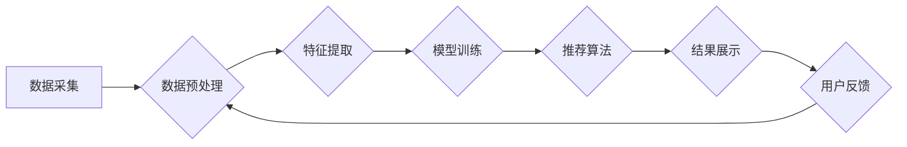

                 

## 社交网络推荐系统的发展：连接用户兴趣

> 关键词：社交网络推荐系统、协同过滤、内容过滤、深度学习、矩阵分解、用户画像、兴趣关联、个性化推荐、算法优化、数据挖掘

### 1. 背景介绍

社交网络平台的蓬勃发展，为用户提供了海量信息和丰富的社交体验。然而，信息爆炸也带来了新的挑战：如何帮助用户快速找到自己感兴趣的内容，并与志同道合的人建立连接？社交网络推荐系统应运而生，它通过分析用户的行为数据、兴趣偏好和社交关系，为用户提供个性化的内容推荐，从而提升用户体验和平台粘性。

从最初简单的基于内容的推荐到如今复杂的基于深度学习的推荐，社交网络推荐系统经历了长足的发展。随着算法的不断优化和数据量的激增，推荐系统的精准度和用户满意度也在不断提升。

### 2. 核心概念与联系

社交网络推荐系统的核心是理解用户的兴趣，并将其与平台上的内容和用户进行关联。

**2.1 核心概念**

* **用户:**  社交网络平台上的注册用户，拥有独特的兴趣、偏好和行为模式。
* **内容:**  平台上提供的各种信息资源，例如文章、视频、图片、商品等。
* **兴趣:**  用户对特定内容的偏好程度，可以由用户行为、点赞、评论等数据反映。
* **社交关系:**  用户之间的连接关系，例如朋友、粉丝、关注者等，可以反映用户的共同兴趣和信任关系。

**2.2 系统架构**

社交网络推荐系统通常由以下几个模块组成：



* **数据采集:** 从平台上收集用户行为数据、内容信息和社交关系数据。
* **数据预处理:** 对收集到的数据进行清洗、转换和格式化，以便后续的分析和处理。
* **特征提取:** 从数据中提取用户、内容和社交关系的特征，例如用户年龄、性别、兴趣标签、内容类别、作者信息、评论内容等。
* **模型训练:** 利用机器学习算法对提取的特征进行训练，构建推荐模型。
* **推荐算法:** 根据用户的兴趣和平台上的内容，利用训练好的模型生成推荐结果。
* **结果展示:** 将推荐结果以用户友好的方式展示给用户，例如推荐列表、个性化首页等。
* **用户反馈:** 收集用户对推荐结果的反馈，例如点击、点赞、收藏等，并将其反馈到数据预处理环节，用于模型的持续优化。

### 3. 核心算法原理 & 具体操作步骤

社交网络推荐系统常用的算法主要包括协同过滤和内容过滤。

**3.1 算法原理概述**

* **协同过滤:** 基于用户的行为相似性进行推荐。如果用户A和用户B对某些内容都表现出兴趣，那么用户A可能也会对用户B喜欢的其他内容感兴趣。
* **内容过滤:** 基于内容的相似性进行推荐。如果用户A喜欢某个类型的文章，那么系统可能会推荐其他同类型文章。

**3.2 算法步骤详解**

**协同过滤算法:**

1. **构建用户-物品交互矩阵:** 将用户和物品作为矩阵的行和列，用户对物品的交互行为（例如评分、购买、点赞）作为矩阵的元素。
2. **计算用户相似度:** 利用余弦相似度、皮尔逊相关系数等方法计算用户之间的相似度。
3. **寻找邻居用户:** 根据用户相似度，找到与目标用户相似的邻居用户。
4. **生成推荐列表:** 从邻居用户的交互行为中，找出目标用户未交互过的物品，并根据邻居用户的交互行为对这些物品进行排序，生成推荐列表。

**内容过滤算法:**

1. **提取内容特征:** 对每个物品提取特征，例如文章主题、作者信息、评论内容等。
2. **构建用户-特征向量:** 将每个用户对特征的偏好程度表示为向量。
3. **计算物品-特征向量:** 将每个物品的特征表示为向量。
4. **计算用户-物品相似度:** 利用余弦相似度等方法计算用户和物品之间的相似度。
5. **生成推荐列表:** 从与目标用户相似度高的物品中，找出目标用户未交互过的物品，并生成推荐列表。

**3.3 算法优缺点**

**协同过滤算法:**

* **优点:** 可以发现用户之间的隐性关联，推荐更个性化的内容。
* **缺点:** 数据稀疏性问题，当用户交互数据较少时，难以准确计算用户相似度。

**内容过滤算法:**

* **优点:** 不需要用户交互数据，可以推荐新用户或新物品。
* **缺点:** 难以捕捉用户之间的隐性关联，推荐结果可能缺乏个性化。

**3.4 算法应用领域**

* **电商平台:** 推荐商品、优惠券、促销活动。
* **视频网站:** 推荐视频、电视剧、电影。
* **音乐平台:** 推荐歌曲、专辑、音乐人。
* **社交网络平台:** 推荐好友、群组、话题。

### 4. 数学模型和公式 & 详细讲解 & 举例说明

**4.1 数学模型构建**

协同过滤算法的核心是用户-物品交互矩阵，可以用矩阵 $R$ 表示，其中 $R_{ui}$ 表示用户 $u$ 对物品 $i$ 的交互行为。

**4.2 公式推导过程**

用户相似度可以使用余弦相似度来计算：

$$
\text{相似度}(u,v) = \frac{R_u \cdot R_v}{||R_u|| ||R_v||}
$$

其中：

* $R_u$ 和 $R_v$ 分别表示用户 $u$ 和 $v$ 的交互行为向量。
* $||R_u||$ 和 $||R_v||$ 分别表示用户 $u$ 和 $v$ 的交互行为向量的模长。

**4.3 案例分析与讲解**

假设有两个用户 $u$ 和 $v$，他们的交互行为矩阵如下：

$$
R_u = \begin{bmatrix} 5 & 3 & 0 & 2 \\ \end{bmatrix}
$$

$$
R_v = \begin{bmatrix} 4 & 2 & 1 & 3 \\ \end{bmatrix}
$$

则用户 $u$ 和 $v$ 的余弦相似度为：

$$
\text{相似度}(u,v) = \frac{5 \cdot 4 + 3 \cdot 2 + 0 \cdot 1 + 2 \cdot 3}{\sqrt{5^2 + 3^2 + 0^2 + 2^2} \sqrt{4^2 + 2^2 + 1^2 + 3^2}} = \frac{32}{\sqrt{38} \sqrt{30}}
$$

### 5. 项目实践：代码实例和详细解释说明

**5.1 开发环境搭建**

* Python 3.x
* scikit-learn
* pandas
* numpy

**5.2 源代码详细实现**

```python
import pandas as pd
from sklearn.metrics.pairwise import cosine_similarity

# 加载用户-物品交互数据
data = pd.read_csv('user_item_interaction.csv')

# 构建用户-物品交互矩阵
user_item_matrix = data.pivot_table(index='user_id', columns='item_id', values='rating')

# 计算用户相似度
user_similarity = cosine_similarity(user_item_matrix)

# 寻找邻居用户
# ...

# 生成推荐列表
# ...
```

**5.3 代码解读与分析**

* 使用 pandas 库加载用户-物品交互数据。
* 使用 pivot_table 方法构建用户-物品交互矩阵。
* 使用 cosine_similarity 方法计算用户相似度。
* 根据用户相似度，寻找邻居用户。
* 根据邻居用户的交互行为，生成推荐列表。

**5.4 运行结果展示**

运行代码后，可以得到用户之间的相似度矩阵和推荐列表。

### 6. 实际应用场景

社交网络推荐系统广泛应用于各种场景，例如：

* **个性化新闻推荐:** 根据用户的阅读历史和兴趣偏好，推荐相关的新闻文章。
* **社交关系推荐:** 根据用户的兴趣和社交关系，推荐潜在的朋友或群组。
* **商品推荐:** 根据用户的购买历史和浏览记录，推荐相关的商品。
* **音乐推荐:** 根据用户的音乐偏好，推荐相关的歌曲、专辑和音乐人。

### 6.4 未来应用展望

随着人工智能技术的不断发展，社交网络推荐系统将朝着以下方向发展：

* **更精准的推荐:** 利用深度学习等先进算法，挖掘用户兴趣的更深层次特征，提供更精准的推荐。
* **更个性化的体验:** 基于用户的上下文信息和行为模式，提供更个性化的推荐体验。
* **更丰富的交互方式:** 支持语音、图像、视频等多模态交互，提供更丰富的推荐方式。
* **更安全的推荐:** 加强数据隐私保护，防止推荐结果被恶意利用。

### 7. 工具和资源推荐

**7.1 学习资源推荐**

* **书籍:**
    * 《推荐系统》 -  周志华
    * 《机器学习》 -  周志华
* **在线课程:**
    * Coursera: Recommender Systems
    * edX: Machine Learning

**7.2 开发工具推荐**

* **Python:** 
    * scikit-learn
    * pandas
    * numpy
* **Spark:** 
    * MLlib

**7.3 相关论文推荐**

* **协同过滤:**
    * "Collaborative Filtering: A User-Based Approach" -  Resnick et al. (1994)
* **内容过滤:**
    * "Content-Based Recommendation Systems" -  Ricci et al. (2011)
* **深度学习推荐:**
    * "Deep Learning for Recommender Systems" -  Wang-Cheng Kang et al. (2019)

### 8. 总结：未来发展趋势与挑战

**8.1 研究成果总结**

社交网络推荐系统的发展取得了显著成果，为用户提供了更便捷、更个性化的信息获取和社交体验。

**8.2 未来发展趋势**

未来，社交网络推荐系统将朝着更精准、更个性化、更安全的方向发展。

**8.3 面临的挑战**

* 数据稀疏性问题
* 冷启动问题
* 算法解释性和可解释性
* 数据隐私和安全问题

**8.4 研究展望**

未来研究将重点关注以下几个方面：

* 开发更有效的算法，解决数据稀疏性和冷启动问题。
* 提高算法的解释性和可解释性，增强用户对推荐结果的信任。
* 加强数据隐私保护，确保用户数据安全。
* 探索新的推荐场景和应用模式。

### 9. 附录：常见问题与解答

* **什么是冷启动问题？**

冷启动问题是指在推荐系统刚开始运行时，由于用户和物品数据不足，难以准确计算用户相似度或物品相似度，导致推荐结果不准确。

* **如何解决数据稀疏性问题？**

可以采用以下方法解决数据稀疏性问题：

* 利用协同过滤算法中的矩阵分解技术，将用户-物品交互矩阵分解成低维向量，从而降低数据稀疏性。
* 利用内容过滤算法，结合物品的特征信息进行推荐。
* 利用深度学习算法，挖掘用户兴趣的更深层次特征。


作者：禅与计算机程序设计艺术 / Zen and the Art of Computer Programming 
<end_of_turn>

