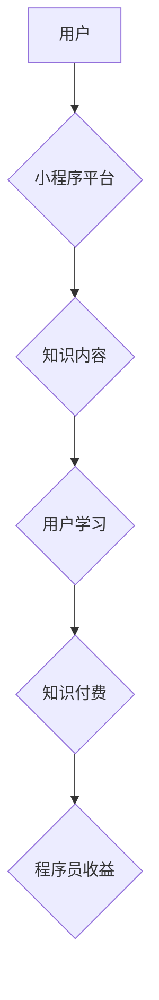

                 

## 程序员如何利用小程序进行知识变现

> 关键词：小程序、知识变现、程序员、技术分享、在线教育、内容创作、商业模式

## 1. 背景介绍

随着移动互联网的快速发展，小程序作为一种轻量级、便捷的应用形式，逐渐成为程序员分享知识、变现的重要平台。小程序拥有用户群体庞大、开发门槛低、部署便捷等优势，为程序员提供了丰富的知识变现机会。

**1.1 小程序的优势**

* **用户群体庞大:** 微信拥有超过12亿活跃用户，小程序作为微信生态的一部分，也拥有庞大的用户群体，为知识变现提供了广阔的市场。
* **开发门槛低:** 小程序开发语言为 JavaScript，程序员只需掌握基本的 JavaScript 知识即可快速开发小程序。
* **部署便捷:** 小程序无需下载安装，用户可直接在微信中使用，部署便捷，用户体验良好。
* **运营成本低:** 小程序的运营成本相对较低，程序员可通过自身知识和资源进行运营，降低运营风险。

**1.2 知识变现的趋势**

随着互联网的普及，人们对知识的需求不断增长，知识变现成为一种重要的商业模式。程序员作为技术人才，拥有丰富的技术知识和经验，可以通过小程序平台将知识变现。

## 2. 核心概念与联系

**2.1 小程序知识变现模式**

小程序知识变现模式主要包括以下几种：

* **在线教育:** 利用小程序平台提供在线课程、直播教学、知识付费等服务，帮助用户学习技术知识。
* **技术分享:** 通过小程序发布技术文章、代码示例、技术博客等内容，分享技术经验，吸引用户关注。
* **工具开发:** 开发实用的小程序工具，提供给用户使用，并通过广告、会员、付费功能等方式进行变现。
* **社区运营:** 建立小程序社区，聚集技术爱好者，提供技术交流、资源分享等服务，并通过会员、广告等方式进行变现。

**2.2 小程序知识变现架构**



## 3. 核心算法原理 & 具体操作步骤

**3.1 算法原理概述**

小程序知识变现的核心算法原理主要围绕用户需求分析、内容推荐、知识付费等方面。

* **用户需求分析:** 通过分析用户行为数据、兴趣偏好等信息，了解用户对哪些知识有需求。
* **内容推荐:** 根据用户需求，推荐相关知识内容，提高用户学习效率。
* **知识付费:** 设计合理的知识付费模式，例如订阅制、课程购买、会员制度等，实现知识变现。

**3.2 算法步骤详解**

1. **数据收集:** 收集用户行为数据、兴趣偏好等信息。
2. **数据分析:** 利用机器学习算法分析用户数据，挖掘用户需求。
3. **内容推荐:** 根据用户需求，推荐相关知识内容。
4. **知识付费:** 设计合理的知识付费模式，实现知识变现。
5. **用户反馈:** 收集用户反馈，不断优化算法和内容。

**3.3 算法优缺点**

* **优点:** 能够精准推荐用户所需知识，提高用户学习效率，实现知识变现。
* **缺点:** 需要大量数据支持，算法模型需要不断优化，才能达到最佳效果。

**3.4 算法应用领域**

* 在线教育
* 技术分享
* 内容创作
* 社区运营

## 4. 数学模型和公式 & 详细讲解 & 举例说明

**4.1 数学模型构建**

知识推荐系统通常采用协同过滤算法，其核心思想是基于用户的相似度或物品的相似度进行推荐。

**4.2 公式推导过程**

协同过滤算法的推荐公式可以表示为：

$$
r_{u,i} = \frac{\sum_{j \in N(u)} \frac{r_{u,j} * r_{j,i}}{\sqrt{\sum_{k \in N(u)} (r_{u,k})^2} * \sqrt{\sum_{l \in N(i)} (r_{l,i})^2}}}{ \sum_{j \in N(u)} \frac{1}{\sqrt{\sum_{k \in N(u)} (r_{u,k})^2}}}
$$

其中：

* $r_{u,i}$ 表示用户 $u$ 对物品 $i$ 的评分。
* $N(u)$ 表示与用户 $u$ 相似的用户集合。
* $N(i)$ 表示与物品 $i$ 相似的物品集合。

**4.3 案例分析与讲解**

假设有一个用户 $u$ 喜欢电影 $A$ 和 $B$，另一个用户 $v$ 喜欢电影 $B$ 和 $C$，则可以推断出用户 $u$ 也可能喜欢电影 $C$。

## 5. 项目实践：代码实例和详细解释说明

**5.1 开发环境搭建**

* 安装微信开发者工具
* 创建小程序项目

**5.2 源代码详细实现**

```javascript
// 小程序页面代码
Page({
  data: {
    // 知识内容数据
    knowledgeList: [
      {
        title: '小程序开发入门',
        content: '...',
        price: 9.9
      },
      // ...
    ]
  },
  // 获取知识内容列表
  getKnowledgeList: function() {
    // ...
  },
  // 购买知识内容
  buyKnowledge: function(e) {
    // ...
  }
});
```

**5.3 代码解读与分析**

* `data` 属性存储知识内容数据。
* `getKnowledgeList` 方法用于获取知识内容列表。
* `buyKnowledge` 方法用于处理用户购买知识内容的操作。

**5.4 运行结果展示**

小程序页面展示知识内容列表，用户可点击购买按钮进行购买。

## 6. 实际应用场景

**6.1 在线教育平台**

程序员可利用小程序平台开发在线教育平台，提供编程课程、技术培训等服务。

**6.2 技术博客平台**

程序员可利用小程序平台发布技术文章、代码示例、技术博客等内容，分享技术经验。

**6.3 工具开发平台**

程序员可开发实用的小程序工具，例如代码编辑器、调试工具、版本控制工具等，并通过广告、会员、付费功能等方式进行变现。

**6.4 社区运营平台**

程序员可建立小程序社区，聚集技术爱好者，提供技术交流、资源分享等服务，并通过会员、广告等方式进行变现。

**6.5 未来应用展望**

随着小程序技术的不断发展，程序员将有更多机会利用小程序平台进行知识变现。例如，可以开发基于人工智能的知识推荐系统，提供更精准的知识服务；可以开发基于区块链技术的知识版权保护系统，保障知识产权；可以开发基于虚拟现实技术的沉浸式学习体验，提升用户学习兴趣。

## 7. 工具和资源推荐

**7.1 学习资源推荐**

* 微信小程序官方文档: https://developers.weixin.qq.com/miniprogram/dev/
* 小程序开发教程: https://www.bilibili.com/video/BV147411q72K

**7.2 开发工具推荐**

* 微信开发者工具: https://developers.weixin.qq.com/miniprogram/dev/devtools/
* 小程序IDE: https://www.dcloud.net.cn/

**7.3 相关论文推荐**

* **协同过滤算法:** https://www.researchgate.net/publication/220835668_Collaborative_Filtering_Algorithms_for_Recommender_Systems
* **知识推荐系统:** https://www.sciencedirect.com/science/article/pii/S095070511930049X

## 8. 总结：未来发展趋势与挑战

**8.1 研究成果总结**

小程序知识变现模式已初具规模，为程序员提供了新的变现途径。

**8.2 未来发展趋势**

* 人工智能技术将被更加广泛应用于小程序知识变现领域，例如个性化推荐、智能问答等。
* 小程序平台将更加注重用户体验，提供更便捷、更丰富的知识服务。
* 小程序知识变现模式将更加多元化，例如直播带货、知识竞赛等。

**8.3 面临的挑战**

* 如何提高知识内容的质量和原创性。
* 如何解决知识付费的信任问题。
* 如何应对竞争激烈的市场环境。

**8.4 研究展望**

未来，小程序知识变现领域将继续发展壮大，程序员需要不断学习新技术，提升自身竞争力，才能在知识变现领域取得成功。

## 9. 附录：常见问题与解答

**9.1 如何开发小程序知识变现应用？**

* 学习小程序开发基础知识。
* 确定知识变现模式和目标用户。
* 设计知识内容和付费机制。
* 开发小程序应用并进行测试。
* 推广小程序应用并进行运营。

**9.2 小程序知识变现有哪些风险？**

* 知识内容质量问题。
* 用户隐私安全问题。
* 平台政策风险。

**9.3 如何规避小程序知识变现风险？**

* 确保知识内容的原创性和质量。
* 严格遵守用户隐私安全政策。
* 关注平台政策变化，及时调整运营策略。


作者：禅与计算机程序设计艺术 / Zen and the Art of Computer Programming 
<end_of_turn>

