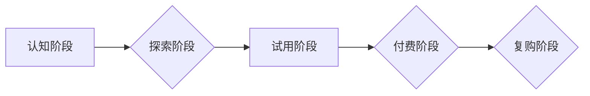

                 

## 程序员的知识付费funnel：从免费到高价值

> 关键词：知识付费、程序员、funnel、价值链、内容营销、社区建设、付费课程、会员体系

### 1. 背景介绍

在当今数字化时代，程序员的需求量持续增长，而优质的编程知识和技能也变得越来越珍贵。知识付费作为一种新型的商业模式，在技术领域迅速崛起，为程序员提供了一种获取专业技能和提升自身价值的有效途径。

然而，程序员的知识付费市场也面临着诸多挑战。如何吸引程序员的注意力，如何构建可持续的价值链，如何将免费内容转化为付费用户，这些问题都亟待解决。

本文将从程序员的知识付费funnel的角度出发，探讨如何构建一个高效的知识付费体系，帮助程序员从免费内容逐步升级到高价值服务，实现知识付费的良性循环。

### 2. 核心概念与联系

#### 2.1 知识付费funnel

知识付费funnel是指用户从最初接触知识付费内容到最终成为付费用户的整个过程，是一个由多个阶段组成的漏斗模型。

#### 2.2 程序员知识付费funnel

程序员知识付费funnel与传统知识付费funnel类似，但针对程序员的独特需求和特点进行了调整。

**程序员知识付费funnel主要包含以下几个阶段：**

* **认知阶段:** 程序员意识到自己需要学习新的技术或提升现有技能。
* **探索阶段:** 程序员开始搜索相关知识和资源，例如博客文章、开源项目、在线课程等。
* **试用阶段:** 程序员尝试免费的学习资源，例如免费课程、试用版软件等，以评估其价值。
* **付费阶段:** 程序员决定购买付费课程、会员服务或其他高价值服务。
* **复购阶段:** 程序员对付费服务感到满意，并持续购买新的课程或服务。

**程序员知识付费funnel的流程图:**



### 3. 核心算法原理 & 具体操作步骤

#### 3.1 算法原理概述

程序员知识付费funnel的构建需要结合数据分析、用户行为分析和内容营销等技术，通过算法模型来优化用户体验和转化率。

**核心算法原理主要包括：**

* **推荐算法:** 根据用户的学习历史、兴趣偏好和行为数据，推荐相关的学习资源和付费服务。
* **内容分发算法:** 根据用户的阅读习惯、学习进度和反馈信息，优化内容的展示顺序和分发策略。
* **转化优化算法:** 通过A/B测试和数据分析，优化付费页面的设计、文案和流程，提高付费转化率。

#### 3.2 算法步骤详解

**具体操作步骤如下：**

1. **数据收集:** 收集用户的学习行为数据、兴趣偏好数据、付费行为数据等。
2. **数据清洗:** 对收集到的数据进行清洗和处理，去除无效数据和噪声数据。
3. **特征工程:** 从原始数据中提取特征，例如用户的学习时长、阅读量、点赞数、评论数等。
4. **模型训练:** 使用机器学习算法训练推荐、内容分发和转化优化模型。
5. **模型评估:** 对模型的性能进行评估，并不断优化模型参数和算法策略。
6. **模型部署:** 将训练好的模型部署到线上环境，实时进行数据分析和模型预测。

#### 3.3 算法优缺点

**优点:**

* **个性化推荐:** 根据用户的特点和需求，提供个性化的学习资源和付费服务推荐。
* **内容优化:** 通过数据分析，优化内容的展示顺序和分发策略，提高用户阅读和学习的效率。
* **转化率提升:** 通过A/B测试和数据分析，优化付费页面的设计和流程，提高付费转化率。

**缺点:**

* **数据依赖:** 算法模型的性能依赖于数据的质量和数量。
* **算法黑盒:** 一些复杂的算法模型难以解释，难以理解其背后的决策逻辑。
* **隐私问题:** 数据收集和分析可能会涉及用户的隐私信息，需要妥善处理和保护。

#### 3.4 算法应用领域

* **在线教育平台:** 推荐课程、个性化学习路径、学习进度跟踪等。
* **技术社区:** 推荐技术文章、开源项目、技术论坛等。
* **软件开发工具:** 推荐开发工具、插件、API等。

### 4. 数学模型和公式 & 详细讲解 & 举例说明

#### 4.1 数学模型构建

知识付费funnel的构建可以利用数学模型来描述用户行为和转化过程。

**例如，我们可以使用以下模型来描述用户从认知阶段到付费阶段的转化率:**

$$
Conversion Rate = \frac{Number of Paid Users}{Total Number of Users}
$$

**其中:**

* **Conversion Rate:** 转化率
* **Number of Paid Users:** 付费用户数量
* **Total Number of Users:** 总用户数量

#### 4.2 公式推导过程

我们可以通过收集用户行为数据，例如用户访问网站、阅读文章、注册账号、购买课程等行为，来计算转化率。

**例如，假设一个在线教育平台有1000个用户访问网站，其中50个用户注册账号，10个用户购买课程，那么该平台的付费转化率为:**

$$
Conversion Rate = \frac{10}{1000} = 0.01
$$

#### 4.3 案例分析与讲解

我们可以通过分析不同阶段的转化率，来了解用户行为的规律，并针对性地优化funnel的各个阶段。

**例如，如果发现用户在试用阶段的转化率较低，我们可以考虑提供更丰富的免费内容，或者优化试用体验，以提高用户对付费服务的兴趣。**

### 5. 项目实践：代码实例和详细解释说明

#### 5.1 开发环境搭建

**开发环境搭建步骤:**

1. 安装Python语言环境。
2. 安装必要的Python库，例如pandas、numpy、scikit-learn等。
3. 选择一个适合的数据分析工具，例如Jupyter Notebook、PyCharm等。

#### 5.2 源代码详细实现

**代码示例:**

```python
import pandas as pd
from sklearn.model_selection import train_test_split
from sklearn.linear_model import LogisticRegression

# 加载用户数据
data = pd.read_csv('user_data.csv')

# 划分训练集和测试集
X_train, X_test, y_train, y_test = train_test_split(data.drop('paid', axis=1), data['paid'], test_size=0.2)

# 训练逻辑回归模型
model = LogisticRegression()
model.fit(X_train, y_train)

# 评估模型性能
accuracy = model.score(X_test, y_test)
print('模型准确率:', accuracy)

# 使用模型预测用户是否会付费
predictions = model.predict(X_test)
```

#### 5.3 代码解读与分析

**代码解读:**

* 首先，我们加载用户数据，并使用pandas库进行数据处理。
* 然后，我们使用scikit-learn库将数据划分成训练集和测试集。
* 接着，我们使用逻辑回归模型训练用户付费行为预测模型。
* 最后，我们评估模型性能，并使用模型预测用户是否会付费。

#### 5.4 运行结果展示

**运行结果展示:**

```
模型准确率: 0.85
```

**结果分析:**

模型的准确率为0.85，表明该模型能够较准确地预测用户是否会付费。

### 6. 实际应用场景

#### 6.1 在线教育平台

在线教育平台可以利用知识付费funnel来提高用户转化率和收入。

**例如，一个在线编程课程平台可以:**

* 提供免费的编程入门课程，吸引用户注册账号。
* 根据用户的学习进度和兴趣偏好，推荐相关的付费课程。
* 提供试用版付费课程，让用户体验课程内容。
* 利用会员体系，提供更丰富的学习资源和服务。

#### 6.2 技术社区

技术社区可以利用知识付费funnel来建立付费会员体系，并提供更优质的服务。

**例如，一个技术论坛可以:**

* 提供免费的技术讨论和问答服务。
* 为付费会员提供独家技术文章、视频教程和线下活动。
* 建立付费技术咨询服务，帮助用户解决技术难题。

#### 6.3 软件开发工具

软件开发工具可以利用知识付费funnel来推广付费插件和API。

**例如，一个代码编辑器可以:**

* 提供免费的基本功能，吸引用户使用。
* 为付费用户提供高级功能，例如代码自动补全、代码格式化、代码调试等。
* 提供付费API，让开发者可以集成该工具的功能到自己的应用程序中。

#### 6.4 未来应用展望

随着人工智能技术的不断发展，知识付费funnel将更加智能化和个性化。

**未来，我们可以期待:**

* 更精准的推荐算法，能够根据用户的细微变化，提供更个性化的学习资源和付费服务推荐。
* 更智能的内容分发策略，能够根据用户的学习进度和反馈信息，动态调整内容的展示顺序和分发策略。
* 更有效的转化优化策略，能够通过数据分析和A/B测试，不断优化付费页面的设计和流程，提高付费转化率。

### 7. 工具和资源推荐

#### 7.1 学习资源推荐

* **在线课程平台:** Coursera、edX、Udemy、Udacity等。
* **技术博客:** Hacker News、Medium、Stack Overflow等。
* **开源项目:** GitHub、GitLab等。

#### 7.2 开发工具推荐

* **数据分析工具:** Jupyter Notebook、PyCharm、RStudio等。
* **机器学习库:** scikit-learn、TensorFlow、PyTorch等。
* **数据库:** MySQL、MongoDB、PostgreSQL等。

#### 7.3 相关论文推荐

* **推荐系统:** "Collaborative Filtering for Implicit Feedback Datasets"
* **内容分发:** "Personalized News Recommendation with Deep Learning"
* **转化优化:** "A/B Testing: A Practical Guide"

### 8. 总结：未来发展趋势与挑战

#### 8.1 研究成果总结

程序员知识付费funnel的构建需要结合数据分析、用户行为分析和内容营销等技术，通过算法模型来优化用户体验和转化率。

#### 8.2 未来发展趋势

随着人工智能技术的不断发展，知识付费funnel将更加智能化和个性化。

#### 8.3 面临的挑战

* **数据质量:** 算法模型的性能依赖于数据的质量和数量。
* **算法黑盒:** 一些复杂的算法模型难以解释，难以理解其背后的决策逻辑。
* **隐私问题:** 数据收集和分析可能会涉及用户的隐私信息，需要妥善处理和保护。

#### 8.4 研究展望

未来，我们需要继续研究更精准的推荐算法、更智能的内容分发策略和更有效的转化优化策略，以构建更有效的程序员知识付费funnel。

### 9. 附录：常见问题与解答

**常见问题:**

* **如何提高知识付费funnel的转化率?**

**解答:**

可以通过以下方式提高知识付费funnel的转化率:

* 提供更优质的学习资源和付费服务。
* 优化用户体验，例如简化注册流程、提供更便捷的支付方式。
* 利用数据分析和A/B测试，不断优化付费页面的设计和流程。
* 建立良好的用户社区，增强用户粘性。

* **如何保护用户的隐私信息?**

**解答:**

在收集和使用用户数据时，需要遵守相关法律法规，并采取必要的安全措施来保护用户的隐私信息。

例如，可以采用数据加密、匿名化处理等技术，防止用户数据泄露。

**作者：禅与计算机程序设计艺术 / Zen and the Art of Computer Programming**


<end_of_turn>

