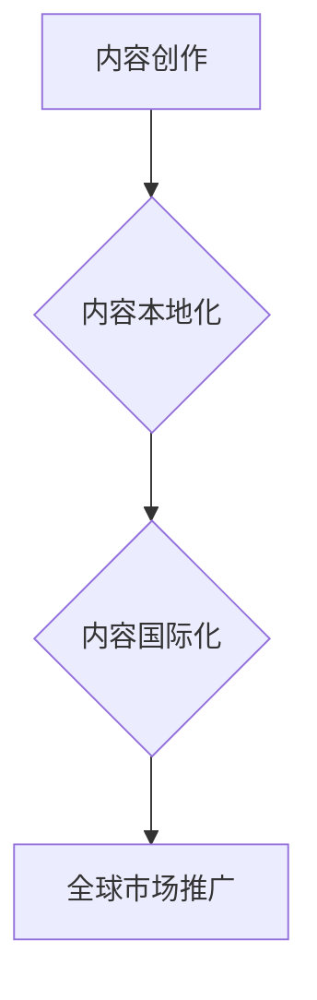

                 

## 程序员知识付费的内容本地化与国际化策略

> 关键词：程序员知识付费、内容本地化、国际化策略、跨文化传播、市场拓展、技术社区、语言翻译、文化差异

## 1. 背景介绍

近年来，随着互联网技术的快速发展和普及，程序员知识付费市场蓬勃发展。在线课程、书籍、博客等形式的知识付费内容为程序员提供了便捷的学习途径，也为知识创作者带来了新的收入模式。然而，在全球化背景下，如何将程序员知识付费内容有效地本地化和国际化，拓展海外市场，成为一个亟待解决的问题。

程序员知识付费内容的本地化和国际化，本质上是跨文化传播的挑战。程序员群体虽然拥有共通的技术语言，但其文化背景、学习习惯、认知方式等方面存在着显著差异。因此，单纯的翻译和语言适配无法满足程序员知识付费内容的本地化需求。

## 2. 核心概念与联系

### 2.1 内容本地化

内容本地化是指将内容根据目标受众的文化背景、语言习惯、认知方式等进行调整和适配，使其更符合当地用户的需求和喜好。

### 2.2 内容国际化

内容国际化是指将内容推广到全球市场，使其能够被不同文化背景的用户理解和接受。

**Mermaid 流程图**



### 2.3 核心概念联系

内容本地化和国际化是相辅相成的两个概念。内容本地化是国际化推广的基础，只有将内容本地化，才能更好地融入目标市场的文化环境，提高用户接受度。而内容国际化则是将本地化后的内容推广到全球市场，扩大影响力。

## 3. 核心算法原理 & 具体操作步骤

### 3.1 算法原理概述

在程序员知识付费内容的本地化和国际化过程中，需要运用多种算法和技术手段，例如：

* **机器翻译算法**: 用于将内容从源语言翻译成目标语言。
* **文本分析算法**: 用于分析内容的主题、关键词、情感等，以便进行针对性的本地化调整。
* **文化敏感度算法**: 用于识别和避免文化冲突，确保内容在目标文化中能够被正确理解。

### 3.2 算法步骤详解

1. **内容分析**: 对目标内容进行深入分析，了解其主题、关键词、情感、文化背景等信息。
2. **目标市场调研**: 对目标市场的文化背景、语言习惯、认知方式等进行调研，了解用户的需求和喜好。
3. **本地化策略制定**: 根据内容分析和目标市场调研结果，制定具体的本地化策略，包括语言翻译、文化调整、内容结构优化等。
4. **内容翻译**: 使用机器翻译算法或人工翻译将内容翻译成目标语言。
5. **文化调整**: 对翻译后的内容进行文化调整，例如替换文化敏感词语、修改文化背景相关的描述等。
6. **内容优化**: 对本地化后的内容进行结构优化，使其更符合目标市场的阅读习惯。
7. **测试和迭代**: 对本地化后的内容进行测试，收集用户反馈，并根据反馈进行迭代优化。

### 3.3 算法优缺点

* **优点**: 可以快速、高效地将内容本地化，降低成本。
* **缺点**: 机器翻译算法的准确率有限，文化调整需要专业人员进行，存在一定的误差和风险。

### 3.4 算法应用领域

* **程序员知识付费平台**: 将课程、书籍、博客等内容本地化，拓展海外市场。
* **技术社区**: 将社区内容翻译成多种语言，吸引更多用户参与。
* **软件开发公司**: 将软件文档、用户手册等内容本地化，方便用户使用。

## 4. 数学模型和公式 & 详细讲解 & 举例说明

### 4.1 数学模型构建

在程序员知识付费内容的本地化和国际化过程中，可以使用信息论和语言模型等数学模型来衡量内容的本地化程度和国际化潜力。

* **信息熵**: 可以用来衡量内容的复杂性和多样性。
* **语言模型**: 可以用来预测用户对内容的理解和接受程度。

### 4.2 公式推导过程

* **信息熵**:

$$H(X) = - \sum_{i=1}^{n} p(x_i) \log_2 p(x_i)$$

其中，$X$ 是一个随机变量，$x_i$ 是 $X$ 的取值，$p(x_i)$ 是 $x_i$ 的概率。

* **语言模型**:

$$P(w_1, w_2, ..., w_n) = \prod_{i=1}^{n} P(w_i | w_1, w_2, ..., w_{i-1})$$

其中，$w_i$ 是一个单词，$P(w_i | w_1, w_2, ..., w_{i-1})$ 是给定前 $i-1$ 个单词的条件下，第 $i$ 个单词出现的概率。

### 4.3 案例分析与讲解

例如，我们可以使用信息熵来衡量不同语言版本的程序员知识付费内容的复杂性和多样性。如果一个内容的熵值较高，则表示其内容更加丰富多样，更容易被不同文化背景的用户理解和接受。

## 5. 项目实践：代码实例和详细解释说明

### 5.1 开发环境搭建

* **操作系统**: Linux/macOS/Windows
* **编程语言**: Python
* **开发工具**: VS Code/Atom/Sublime Text
* **库依赖**: NLTK/spaCy/Transformers

### 5.2 源代码详细实现

```python
import nltk
from nltk.corpus import stopwords
from nltk.tokenize import word_tokenize

# 下载 NLTK 数据包
nltk.download('punkt')
nltk.download('stopwords')

# 文本内容
text = "This is a sample text for content localization and internationalization."

# Tokenize the text
tokens = word_tokenize(text)

# Remove stop words
stop_words = set(stopwords.words('english'))
filtered_tokens = [word for word in tokens if word.lower() not in stop_words]

# Calculate the information entropy
# ...

# Print the filtered tokens
print(filtered_tokens)
```

### 5.3 代码解读与分析

* **Tokenization**: 将文本分割成单词或句子等基本单元。
* **Stop word removal**: 去除一些常见的无意义词语，例如“a”、“the”、“is”等，提高文本的语义浓度。
* **Information entropy calculation**: 使用信息熵公式计算文本的复杂性和多样性。

### 5.4 运行结果展示

运行上述代码后，将输出过滤后的单词列表，以及文本的信息熵值。

## 6. 实际应用场景

### 6.1 程序员知识付费平台

* 将课程、书籍、博客等内容翻译成多种语言，拓展海外市场。
* 根据目标用户的文化背景和学习习惯，对内容进行针对性的本地化调整。

### 6.2 技术社区

* 将社区内容翻译成多种语言，吸引更多用户参与。
* 建立跨文化交流平台，促进技术交流和合作。

### 6.3 软件开发公司

* 将软件文档、用户手册等内容本地化，方便用户使用。
* 提供多语言支持，提高软件的国际化竞争力。

### 6.4 未来应用展望

随着人工智能技术的不断发展，程序员知识付费内容的本地化和国际化将更加智能化和自动化。例如，可以使用机器学习算法自动识别文化敏感词语，并进行精准的替换和调整。

## 7. 工具和资源推荐

### 7.1 学习资源推荐

* **Coursera**: 提供各种程序员知识付费课程，包括编程语言、软件开发、数据科学等。
* **Udemy**: 一家在线学习平台，提供大量的程序员知识付费课程，价格相对便宜。
* **GitHub**: 一个开源代码托管平台，可以学习开源项目代码，并与其他程序员交流。

### 7.2 开发工具推荐

* **Google Translate API**: 用于机器翻译的API，可以将文本翻译成多种语言。
* **DeepL**: 一款专业的机器翻译工具，翻译质量较高。
* **Crowdin**: 一款开源的本地化平台，可以用于管理多语言内容。

### 7.3 相关论文推荐

* **"Cross-Cultural Adaptation of Educational Materials"**
* **"Machine Translation for Programmers"**
* **"Localization Strategies for Software Development"**

## 8. 总结：未来发展趋势与挑战

### 8.1 研究成果总结

程序员知识付费内容的本地化和国际化是一个不断发展的领域，近年来取得了显著的进展。机器翻译算法的不断改进，以及人工智能技术的应用，为内容本地化和国际化提供了新的技术支撑。

### 8.2 未来发展趋势

* **更智能化的本地化**: 使用人工智能技术，自动识别文化敏感词语，并进行精准的替换和调整。
* **更个性化的内容**: 根据用户的文化背景、学习习惯和兴趣爱好，提供个性化的学习内容。
* **更丰富的交互体验**: 使用虚拟现实、增强现实等技术，打造更丰富的交互体验。

### 8.3 面临的挑战

* **文化差异**: 不同文化背景的用户对内容的理解和接受程度存在差异，需要进行针对性的本地化调整。
* **语言复杂性**: 一些语言具有复杂的语法和词汇，机器翻译的准确率有限。
* **成本问题**: 内容本地化和国际化需要投入一定的成本，例如翻译、文化调整、测试等。

### 8.4 研究展望

未来，程序员知识付费内容的本地化和国际化将更加智能化、个性化和交互式。随着人工智能技术的不断发展，我们将看到更多创新性的技术应用，为程序员提供更优质的学习体验。

## 9. 附录：常见问题与解答

**Q1: 如何选择合适的机器翻译工具？**

**A1:** 选择机器翻译工具时，需要考虑翻译质量、支持的语言种类、价格等因素。一些常用的机器翻译工具包括 Google Translate API、DeepL、Microsoft Translator 等。

**Q2: 如何进行文化敏感度调整？**

**A2:** 文化敏感度调整需要专业人员进行，例如翻译人员、文化专家等。他们需要了解目标文化的习俗、禁忌和价值观，并根据这些知识对内容进行调整。

**Q3: 程序员知识付费内容的本地化和国际化需要投入多少成本？**

**A3:** 程序员知识付费内容的本地化和国际化成本取决于多种因素，例如内容的长度、语言种类、文化调整的复杂度等。一般来说，需要投入一定的翻译、文化调整、测试等成本。


作者：禅与计算机程序设计艺术 / Zen and the Art of Computer Programming 
<end_of_turn>

