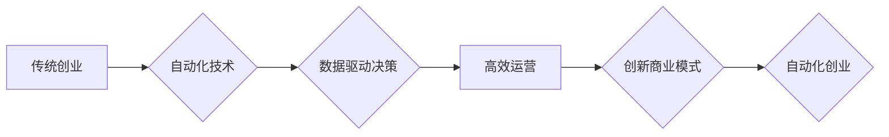

                 

## 自动化创业：未来商业的新范式

> 关键词：自动化、创业、人工智能、机器学习、流程自动化、数据驱动、商业模式创新

### 1. 背景介绍

在当今科技飞速发展的时代，自动化正在深刻地改变着商业模式和创业方式。人工智能（AI）、机器学习（ML）等技术的快速发展，为自动化创业提供了强大的技术支撑。自动化创业是指利用自动化技术，构建高效、可扩展、数据驱动的商业模式，从而降低创业成本、提高运营效率，并创造新的商业价值。

传统创业模式往往依赖于人力投入和经验积累，存在着效率低下、成本高昂、难以规模化等问题。而自动化创业则通过自动化技术，将重复性、规则性、数据驱动的任务交给机器，解放人力，提高效率。

### 2. 核心概念与联系

#### 2.1 自动化创业的核心概念

* **自动化:** 利用技术手段，使商业流程、任务和决策自动化，减少人工干预。
* **创业:** 创立新的企业或商业模式，创造新的价值。
* **数据驱动:** 基于数据分析和预测，指导决策和运营。

#### 2.2 自动化创业的联系

自动化创业将自动化技术与创业理念相结合，构建了一种新的商业模式。

**流程图:**



### 3. 核心算法原理 & 具体操作步骤

#### 3.1 算法原理概述

自动化创业的核心算法原理主要包括：

* **机器学习:** 利用算法从数据中学习模式和规律，自动完成任务。
* **自然语言处理:** 使计算机能够理解和处理人类语言。
* **计算机视觉:** 使计算机能够“看”图像和视频，并从中提取信息。
* **流程自动化:** 自动化重复性任务，提高效率。

#### 3.2 算法步骤详解

1. **数据收集:** 收集相关数据，例如用户行为数据、市场数据、财务数据等。
2. **数据预处理:** 对数据进行清洗、转换、格式化等处理，使其适合算法训练。
3. **模型训练:** 利用机器学习算法，从数据中训练模型，使其能够完成特定任务。
4. **模型评估:** 对模型进行评估，验证其准确性和性能。
5. **模型部署:** 将训练好的模型部署到生产环境中，用于自动化执行任务。

#### 3.3 算法优缺点

**优点:**

* **提高效率:** 自动化任务可以显著提高效率，释放人力资源。
* **降低成本:** 自动化可以减少人工成本、运营成本等。
* **提高准确性:** 机器学习算法可以实现更高的准确性，减少人为错误。
* **数据驱动:** 自动化创业基于数据分析和预测，决策更加科学和精准。

**缺点:**

* **技术门槛:** 需要一定的技术知识和经验才能进行自动化创业。
* **数据依赖:** 自动化算法依赖于高质量的数据，数据质量问题会影响算法性能。
* **伦理风险:** 自动化创业可能带来一些伦理风险，例如算法偏见、数据隐私等问题。

#### 3.4 算法应用领域

自动化创业的应用领域非常广泛，例如：

* **电商:** 自动化商品推荐、订单处理、物流配送等。
* **金融:** 自动化风险控制、欺诈检测、投资决策等。
* **医疗:** 自动化诊断、病历分析、药物研发等。
* **教育:** 自动化教学、个性化学习、学生评估等。

### 4. 数学模型和公式 & 详细讲解 & 举例说明

#### 4.1 数学模型构建

在自动化创业中，可以使用数学模型来描述和预测商业现象。例如，可以使用回归模型来预测销售额，可以使用分类模型来预测客户流失率。

#### 4.2 公式推导过程

假设我们想要预测销售额，可以使用线性回归模型。线性回归模型的公式如下：

$$y = mx + b$$

其中：

* $y$ 是销售额
* $x$ 是预测变量（例如，广告支出）
* $m$ 是回归系数
* $b$ 是截距

我们可以通过最小二乘法来估计回归系数 $m$ 和 $b$。

#### 4.3 案例分析与讲解

假设我们收集了以下数据：

| 广告支出 (x) | 销售额 (y) |
|---|---|
| 1000 | 5000 |
| 2000 | 10000 |
| 3000 | 15000 |

我们可以使用线性回归模型来预测销售额。通过最小二乘法，我们可以得到回归系数 $m = 5$ 和截距 $b = 0$。因此，线性回归模型的方程为：

$$y = 5x$$

如果广告支出为 4000，则预测的销售额为：

$$y = 5 * 4000 = 20000$$

### 5. 项目实践：代码实例和详细解释说明

#### 5.1 开发环境搭建

* **操作系统:** Ubuntu 20.04
* **编程语言:** Python 3.8
* **库:** scikit-learn, pandas, matplotlib

#### 5.2 源代码详细实现

```python
import pandas as pd
from sklearn.linear_model import LinearRegression
from sklearn.model_selection import train_test_split
import matplotlib.pyplot as plt

# 加载数据
data = pd.read_csv('sales_data.csv')

# 分割数据
X = data[['广告支出']]
y = data['销售额']
X_train, X_test, y_train, y_test = train_test_split(X, y, test_size=0.2, random_state=42)

# 创建线性回归模型
model = LinearRegression()

# 训练模型
model.fit(X_train, y_train)

# 预测测试数据
y_pred = model.predict(X_test)

# 评估模型
print('模型系数:', model.coef_)
print('截距:', model.intercept_)

# 可视化结果
plt.scatter(X_test, y_test, color='blue')
plt.plot(X_test, y_pred, color='red')
plt.xlabel('广告支出')
plt.ylabel('销售额')
plt.title('线性回归预测')
plt.show()
```

#### 5.3 代码解读与分析

* 代码首先加载数据，然后将数据分割成训练集和测试集。
* 然后，创建线性回归模型，并使用训练集训练模型。
* 训练完成后，使用测试集预测销售额，并评估模型性能。
* 最后，使用 matplotlib 库可视化预测结果。

#### 5.4 运行结果展示

运行代码后，会生成一个散点图，其中蓝色点表示实际销售额，红色线表示模型预测的销售额。

### 6. 实际应用场景

#### 6.1 自动化创业案例

* **无人零售店:** 利用机器学习算法，实现商品识别、支付结算等自动化流程，降低运营成本，提高效率。
* **个性化推荐引擎:** 利用用户行为数据，构建个性化推荐引擎，为用户推荐更符合其需求的商品或服务。
* **智能客服机器人:** 利用自然语言处理技术，构建智能客服机器人，自动回答用户常见问题，提高客户服务效率。

#### 6.2 未来应用展望

自动化创业的应用场景将更加广泛，例如：

* **自动驾驶:** 利用机器学习和计算机视觉技术，实现自动驾驶汽车，改变交通出行方式。
* **医疗诊断:** 利用机器学习算法，辅助医生进行疾病诊断，提高诊断准确率。
* **个性化教育:** 利用机器学习算法，提供个性化学习方案，提高学习效率。

### 7. 工具和资源推荐

#### 7.1 学习资源推荐

* **在线课程:** Coursera, edX, Udemy 等平台提供丰富的机器学习、人工智能等课程。
* **书籍:** 《Python机器学习实战》、《深度学习》等书籍。
* **开源项目:** TensorFlow, PyTorch 等开源项目。

#### 7.2 开发工具推荐

* **Python:** 广泛应用于机器学习和人工智能开发。
* **Jupyter Notebook:** 用于编写和运行 Python 代码，可视化数据分析结果。
* **云计算平台:** AWS, Azure, GCP 等云计算平台提供强大的计算资源和机器学习服务。

#### 7.3 相关论文推荐

* **《ImageNet Classification with Deep Convolutional Neural Networks》**
* **《Attention Is All You Need》**
* **《BERT: Pre-training of Deep Bidirectional Transformers for Language Understanding》**

### 8. 总结：未来发展趋势与挑战

#### 8.1 研究成果总结

自动化创业已经取得了显著的成果，例如无人零售店、个性化推荐引擎等应用场景得到了广泛推广。

#### 8.2 未来发展趋势

* **更强大的算法:** 机器学习算法将更加强大，能够处理更复杂的数据，实现更精准的预测。
* **更广泛的应用场景:** 自动化创业将应用于更多领域，例如自动驾驶、医疗诊断等。
* **更智能的系统:** 自动化系统将更加智能，能够自主学习和决策。

#### 8.3 面临的挑战

* **数据安全:** 自动化创业依赖于大量数据，数据安全问题需要得到重视。
* **算法偏见:** 机器学习算法可能存在偏见，需要进行公平性评估和改进。
* **伦理风险:** 自动化创业可能带来一些伦理风险，例如工作岗位替代等问题。

#### 8.4 研究展望

未来，自动化创业的研究将更加注重算法的公平性、安全性、可解释性等方面，并探索自动化创业与人类合作共赢的模式。

### 9. 附录：常见问题与解答

* **什么是自动化创业？**

自动化创业是指利用自动化技术，构建高效、可扩展、数据驱动的商业模式，从而降低创业成本、提高运营效率，并创造新的商业价值。

* **自动化创业有哪些优势？**

自动化创业可以提高效率、降低成本、提高准确性、数据驱动决策等优势。

* **自动化创业有哪些挑战？**

自动化创业面临着数据安全、算法偏见、伦理风险等挑战。


作者：禅与计算机程序设计艺术 / Zen and the Art of Computer Programming 
<end_of_turn>

