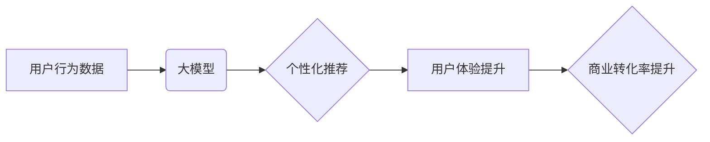

                 

## AI 大模型在电商搜索推荐中的用户行为分析：理解用户需求与购买偏好

> 关键词：电商搜索推荐、用户行为分析、大模型、深度学习、推荐系统、自然语言处理、个性化推荐

## 1. 背景介绍

在当今数字经济时代，电商平台已成为人们获取商品和服务的首选方式。搜索推荐系统作为电商平台的核心功能之一，直接影响着用户体验和商业转化率。传统的搜索推荐系统主要依赖于基于规则和基于内容的算法，但随着用户行为数据的爆炸式增长和用户需求的多样化，这些传统方法逐渐难以满足用户的个性化需求。

近年来，大模型技术在自然语言处理、计算机视觉等领域取得了突破性进展，为电商搜索推荐带来了新的机遇。大模型能够学习和理解用户行为数据的复杂模式，并生成更精准、更个性化的推荐结果。

## 2. 核心概念与联系

### 2.1 用户行为分析

用户行为分析是指通过收集、分析用户在电商平台上的各种行为数据，如搜索历史、浏览记录、购买记录、评价信息等，以了解用户的兴趣、偏好、需求等，并将其应用于个性化推荐、用户画像构建等领域。

### 2.2 大模型

大模型是指参数规模庞大、训练数据海量的人工智能模型。大模型能够学习和理解复杂的模式，并应用于各种自然语言处理任务，如文本分类、机器翻译、问答系统等。

### 2.3 电商搜索推荐

电商搜索推荐是指根据用户的搜索关键词和历史行为数据，推荐与用户需求相匹配的商品或服务。

**核心概念与联系流程图**



## 3. 核心算法原理 & 具体操作步骤

### 3.1 算法原理概述

大模型在电商搜索推荐中的核心算法主要包括：

* **深度学习**: 利用多层神经网络学习用户行为数据的复杂模式，并预测用户的兴趣和偏好。
* **自然语言处理**: 对用户搜索关键词进行分析和理解，提取关键词的语义信息，并将其与商品信息进行匹配。
* **协同过滤**: 根据用户的历史行为数据，预测用户对其他商品的兴趣。

### 3.2 算法步骤详解

1. **数据收集与预处理**: 收集用户行为数据，如搜索历史、浏览记录、购买记录、评价信息等，并进行清洗、转换、编码等预处理操作。
2. **特征工程**: 从用户行为数据中提取特征，如用户 demographics 信息、商品类别、价格、评价等，并构建特征向量。
3. **模型训练**: 利用深度学习算法，训练大模型，并使用训练数据进行模型评估和调优。
4. **推荐结果生成**: 根据用户的搜索关键词和历史行为数据，利用训练好的大模型生成推荐结果。
5. **结果展示与反馈**: 将推荐结果展示给用户，并收集用户反馈信息，用于模型迭代优化。

### 3.3 算法优缺点

**优点**:

* **个性化推荐**: 大模型能够学习和理解用户的个性化需求，提供更精准的推荐结果。
* **提升用户体验**: 个性化推荐能够提高用户购物体验，增加用户粘性。
* **提升商业转化率**: 精准的推荐能够提高用户购买意愿，提升电商平台的商业转化率。

**缺点**:

* **数据依赖**: 大模型的性能依赖于训练数据的质量和数量。
* **计算资源**: 训练大模型需要大量的计算资源和时间。
* **可解释性**: 大模型的决策过程较为复杂，难以解释其推荐结果背后的逻辑。

### 3.4 算法应用领域

大模型在电商搜索推荐领域的应用场景广泛，包括：

* **商品推荐**: 根据用户的搜索历史和浏览记录，推荐与用户兴趣相匹配的商品。
* **个性化搜索**: 根据用户的搜索习惯和偏好，优化搜索结果排序，提供更精准的搜索结果。
* **用户画像构建**: 利用大模型分析用户的行为数据，构建用户画像，用于精准营销和用户分群。

## 4. 数学模型和公式 & 详细讲解 & 举例说明

### 4.1 数学模型构建

在电商搜索推荐中，常用的数学模型包括协同过滤模型和深度学习模型。

**协同过滤模型**:

协同过滤模型基于用户的历史行为数据，预测用户对其他商品的兴趣。常用的协同过滤算法包括基于用户的协同过滤和基于物品的协同过滤。

**基于用户的协同过滤**:

假设用户 $u$ 对商品 $i$ 的评分为 $r_{ui}$，则用户 $u$ 和用户 $v$ 的相似度可以计算为：

$$
Sim(u,v) = \frac{\sum_{i \in I(u) \cap I(v)} (r_{ui} - \bar{r}_u)(r_{vi} - \bar{r}_v)}{\sqrt{\sum_{i \in I(u)} (r_{ui} - \bar{r}_u)^2} \sqrt{\sum_{i \in I(v)} (r_{vi} - \bar{r}_v)^2}}
$$

其中，$I(u)$ 和 $I(v)$ 分别表示用户 $u$ 和用户 $v$ 评分过的商品集合，$\bar{r}_u$ 和 $\bar{r}_v$ 分别表示用户 $u$ 和用户 $v$ 的平均评分。

**基于物品的协同过滤**:

假设商品 $i$ 和商品 $j$ 的相似度可以计算为：

$$
Sim(i,j) = \frac{\sum_{u \in U(i) \cap U(j)} (r_{ui} - \bar{r}_i)(r_{uj} - \bar{r}_j)}{\sqrt{\sum_{u \in U(i)} (r_{ui} - \bar{r}_i)^2} \sqrt{\sum_{u \in U(j)} (r_{uj} - \bar{r}_j)^2}}
$$

其中，$U(i)$ 和 $U(j)$ 分别表示商品 $i$ 和商品 $j$ 被评分过的用户集合，$\bar{r}_i$ 和 $\bar{r}_j$ 分别表示商品 $i$ 和商品 $j$ 的平均评分。

**深度学习模型**:

深度学习模型可以学习用户行为数据的复杂模式，并生成更精准的推荐结果。常用的深度学习模型包括多层感知机 (MLP)、卷积神经网络 (CNN) 和循环神经网络 (RNN)。

### 4.2 公式推导过程

深度学习模型的公式推导过程较为复杂，涉及到微积分、线性代数等数学知识。

### 4.3 案例分析与讲解

**案例**:

假设一个电商平台想要推荐用户购买的书籍。

**方法**:

1. 收集用户购买书籍的历史数据，包括书籍类别、作者、价格等信息。
2. 利用协同过滤算法，计算用户之间的相似度，并推荐与相似用户购买过的书籍。
3. 利用深度学习模型，学习用户行为数据的复杂模式，并生成更精准的推荐结果。

**结果**:

通过大模型的推荐，用户能够获得更个性化的书籍推荐，提升用户购物体验和商业转化率。

## 5. 项目实践：代码实例和详细解释说明

### 5.1 开发环境搭建

* **操作系统**: Linux 或 macOS
* **编程语言**: Python
* **深度学习框架**: TensorFlow 或 PyTorch
* **数据存储**: MySQL 或 MongoDB

### 5.2 源代码详细实现

```python
# 导入必要的库
import tensorflow as tf

# 定义模型结构
model = tf.keras.Sequential([
    tf.keras.layers.Embedding(input_dim=vocab_size, output_dim=embedding_dim),
    tf.keras.layers.LSTM(units=128),
    tf.keras.layers.Dense(units=num_classes, activation='softmax')
])

# 编译模型
model.compile(optimizer='adam',
              loss='sparse_categorical_crossentropy',
              metrics=['accuracy'])

# 训练模型
model.fit(x_train, y_train, epochs=10)

# 预测结果
predictions = model.predict(x_test)
```

### 5.3 代码解读与分析

* **Embedding层**: 将用户行为数据转化为向量表示。
* **LSTM层**: 学习用户行为数据的时序特征。
* **Dense层**: 输出推荐结果。
* **Adam优化器**: 用于优化模型参数。
* **SparseCategoricalCrossentropy损失函数**: 用于计算模型预测结果与真实结果之间的误差。

### 5.4 运行结果展示

训练完成后，可以将模型应用于实际场景，并展示推荐结果。

## 6. 实际应用场景

### 6.1 个性化商品推荐

根据用户的搜索历史、浏览记录、购买记录等数据，推荐与用户兴趣相匹配的商品。

### 6.2 个性化搜索结果排序

根据用户的搜索习惯和偏好，优化搜索结果排序，提供更精准的搜索结果。

### 6.3 用户画像构建

利用大模型分析用户的行为数据，构建用户画像，用于精准营销和用户分群。

### 6.4 未来应用展望

* **多模态推荐**: 将文本、图像、视频等多模态数据融合，提供更丰富的推荐体验。
* **实时推荐**: 利用实时数据流，提供更及时、更精准的推荐结果。
* **解释性推荐**: 解释大模型推荐结果背后的逻辑，提高用户对推荐结果的信任度。

## 7. 工具和资源推荐

### 7.1 学习资源推荐

* **书籍**:
    * Deep Learning by Ian Goodfellow
    * Natural Language Processing with Python by Steven Bird
* **在线课程**:
    * Coursera: Deep Learning Specialization
    * Udacity: Deep Learning Nanodegree

### 7.2 开发工具推荐

* **深度学习框架**: TensorFlow, PyTorch
* **数据处理工具**: Pandas, NumPy
* **云计算平台**: AWS, Azure, GCP

### 7.3 相关论文推荐

* Attention Is All You Need
* BERT: Pre-training of Deep Bidirectional Transformers for Language Understanding
* Transformer-XL: Attentive Language Modeling Beyond Millions of Tokens

## 8. 总结：未来发展趋势与挑战

### 8.1 研究成果总结

大模型在电商搜索推荐领域取得了显著的成果，能够提供更精准、更个性化的推荐结果，提升用户体验和商业转化率。

### 8.2 未来发展趋势

* **模型规模与性能**: 大模型规模将继续扩大，模型性能将进一步提升。
* **多模态融合**: 将文本、图像、视频等多模态数据融合，提供更丰富的推荐体验。
* **解释性推荐**: 解释大模型推荐结果背后的逻辑，提高用户对推荐结果的信任度。

### 8.3 面临的挑战

* **数据隐私**: 大模型训练需要大量用户数据，如何保护用户隐私是一个重要的挑战。
* **模型可解释性**: 大模型的决策过程较为复杂，难以解释其推荐结果背后的逻辑。
* **计算资源**: 训练大模型需要大量的计算资源，成本较高。

### 8.4 研究展望

未来，大模型在电商搜索推荐领域将继续发展，并应用于更多场景，为用户提供更智能、更便捷的购物体验。


## 9. 附录：常见问题与解答

**Q1: 大模型的训练需要多少数据？**

A1: 大模型的训练数据量通常非常庞大，通常需要百万甚至数十亿条数据。

**Q2: 如何评估大模型的性能？**

A2: 大模型的性能可以评估指标包括准确率、召回率、F1-score等。

**Q3: 如何解释大模型的推荐结果？**

A3: 解释大模型的推荐结果是一个开放性问题，目前还没有完美的解决方案。一些研究方法包括：

* **注意力机制**: 分析大模型在处理用户数据时关注哪些部分。
* **特征重要性**: 分析哪些特征对大模型的预测结果影响最大。
* **局部解释**: 对单个推荐结果进行解释，分析其背后的逻辑。

**作者：禅与计算机程序设计艺术 / Zen and the Art of Computer Programming**<end_of_turn>

