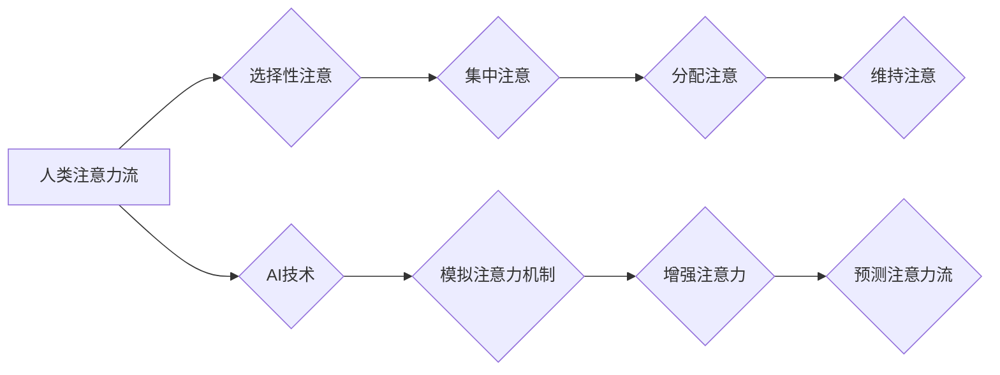

                 

## 关键词：

人工智能、注意力流、人类认知、工作技能、注意力管理技术、未来趋势、深度学习、神经网络、可解释性

## 1. 背景介绍

在信息爆炸的时代，人类面临着前所未有的注意力挑战。来自互联网、社交媒体、电子邮件等各种渠道的信息洪流，不断冲击着我们的注意力，导致专注力下降、信息过载、工作效率降低等问题日益突出。与此同时，人工智能（AI）技术飞速发展，其强大的计算能力和学习能力正在深刻地改变着我们的生活和工作方式。

AI技术的应用，一方面可以帮助我们更高效地处理信息，例如智能搜索、个性化推荐等，另一方面也可能加剧注意力分散的问题，例如社交媒体算法的推送机制、个性化广告的精准投放等。因此，理解AI与人类注意力流之间的关系，并探索如何利用AI技术更好地管理注意力，成为当今社会面临的重要课题。

## 2. 核心概念与联系

### 2.1 人类注意力流

人类注意力流是指我们对信息进行选择性感知、加工和记忆的过程。它是一个动态且复杂的认知过程，受多种因素影响，例如个体差异、环境刺激、任务要求等。

注意力流可以分为以下几个阶段：

* **选择性注意:** 从众多信息中选择关注特定信息。
* **集中注意:** 将注意力集中在特定信息上，排除干扰。
* **分配注意:** 将注意力分配到多个信息上，并进行切换。
* **维持注意:** 保持注意力集中在特定信息上，克服注意力分散的趋势。

### 2.2 人工智能与注意力流

AI技术，特别是深度学习和神经网络，在模拟和理解人类注意力流方面取得了显著进展。例如，注意力机制被广泛应用于自然语言处理、计算机视觉等领域，能够帮助模型更好地关注输入信息中的关键部分，提高模型的性能。

AI技术与人类注意力流的联系可以从以下几个方面理解：

* **模拟人类注意力机制:** AI模型可以通过学习人类注意力机制，模拟人类选择性注意、集中注意等行为。
* **增强人类注意力:** AI技术可以开发出注意力管理工具，帮助用户提高专注力、减少信息过载。
* **预测人类注意力流:** AI模型可以分析用户行为数据，预测用户的注意力流走向，为个性化信息推送和内容推荐提供支持。

**Mermaid 流程图：AI与人类注意力流的联系**



## 3. 核心算法原理 & 具体操作步骤

### 3.1 算法原理概述

注意力机制是一种模仿人类注意力机制的机器学习算法，它允许模型在处理信息时，将注意力集中在对任务最重要的部分。

注意力机制的核心思想是，在处理输入序列时，模型会为每个元素分配一个权重，权重越高，模型对该元素的关注度就越高。这些权重可以通过训练得到，并随着模型的学习而不断调整。

### 3.2 算法步骤详解

1. **输入序列:** 将输入序列（例如文本、图像等）转换为模型可以理解的格式。
2. **编码器:** 使用编码器网络将输入序列编码成一个隐藏表示，该表示包含了序列中每个元素的信息。
3. **注意力计算:** 计算每个元素的注意力权重，权重表示模型对该元素的关注程度。
4. **解码器:** 使用解码器网络和注意力权重，生成输出序列（例如翻译文本、生成图像等）。

### 3.3 算法优缺点

**优点:**

* **提高模型性能:** 注意力机制可以帮助模型更好地关注输入信息中的关键部分，从而提高模型的性能。
* **可解释性增强:** 注意力权重可以直观地反映模型对输入信息的关注程度，提高模型的可解释性。

**缺点:**

* **计算复杂度高:** 注意力机制的计算复杂度较高，尤其是在处理长序列数据时。
* **参数量大:** 注意力机制通常需要大量的参数，这可能会导致模型训练时间长、内存占用大。

### 3.4 算法应用领域

注意力机制在许多领域都有广泛的应用，例如：

* **自然语言处理:** 机器翻译、文本摘要、问答系统等。
* **计算机视觉:** 图像识别、目标检测、图像 Captioning 等。
* **语音识别:** 语音转文本、语音合成等。

## 4. 数学模型和公式 & 详细讲解 & 举例说明

### 4.1 数学模型构建

注意力机制的数学模型通常基于以下几个核心概念：

* **查询 (Query):** 用于表示模型想要关注的信息。
* **键 (Key):** 用于表示输入序列中每个元素的信息。
* **值 (Value):** 用于表示输入序列中每个元素的具体内容。

### 4.2 公式推导过程

注意力机制的核心公式是计算每个元素的注意力权重。常用的注意力机制类型包括：

* **点积注意力:** 计算查询向量与每个键向量的点积，然后通过softmax函数将其归一化得到注意力权重。

$$
\text{Attention}(Q, K, V) = \text{softmax}\left(\frac{Q K^T}{\sqrt{d_k}}\right) V
$$

其中：

* $Q$ 是查询向量。
* $K$ 是键向量矩阵。
* $V$ 是值向量矩阵。
* $d_k$ 是键向量的维度。

* **多头注意力:** 将多个点积注意力机制并行执行，每个注意力头关注不同的信息方面，然后将多个头的输出进行融合。

### 4.3 案例分析与讲解

例如，在机器翻译任务中，查询向量可以表示目标语言中的词，键向量可以表示源语言中的词，值向量可以表示源语言词的语义信息。通过计算注意力权重，模型可以将源语言中的关键词与目标语言中的词进行匹配，从而生成更准确的翻译结果。

## 5. 项目实践：代码实例和详细解释说明

### 5.1 开发环境搭建

* Python 3.x
* TensorFlow 或 PyTorch 深度学习框架
* Jupyter Notebook 或 VS Code 代码编辑器

### 5.2 源代码详细实现

```python
import tensorflow as tf

# 定义点积注意力机制
def scaled_dot_product_attention(query, key, value, mask=None):
    # 计算点积
    scores = tf.matmul(query, key, transpose_b=True) / tf.math.sqrt(tf.cast(key.shape[-1], tf.float32))
    # 应用掩码
    if mask is not None:
        scores += (mask * -1e9)
    # 计算注意力权重
    attention_weights = tf.nn.softmax(scores, axis=-1)
    # 计算加权值
    context_vector = tf.matmul(attention_weights, value)
    return context_vector, attention_weights

# 定义多头注意力机制
def multi_head_attention(query, key, value, num_heads):
    # 将查询、键、值矩阵分解成多个头
    query = tf.reshape(query, shape=[-1, num_heads, query.shape[-1] // num_heads])
    key = tf.reshape(key, shape=[-1, num_heads, key.shape[-1] // num_heads])
    value = tf.reshape(value, shape=[-1, num_heads, value.shape[-1] // num_heads])
    # 计算每个头的注意力权重
    attention_outputs = []
    for i in range(num_heads):
        head_query = query[:, i, :]
        head_key = key[:, i, :]
        head_value = value[:, i, :]
        head_context_vector, head_attention_weights = scaled_dot_product_attention(head_query, head_key, head_value)
        attention_outputs.append(head_context_vector)
    # 合并多个头的输出
    attention_output = tf.concat(attention_outputs, axis=-1)
    return attention_output, attention_weights

```

### 5.3 代码解读与分析

* `scaled_dot_product_attention` 函数实现点积注意力机制，计算每个元素的注意力权重。
* `multi_head_attention` 函数实现多头注意力机制，将多个点积注意力机制并行执行，并融合多个头的输出。

### 5.4 运行结果展示

运行上述代码，可以得到注意力权重矩阵，以及注意力机制输出的上下文向量。

## 6. 实际应用场景

### 6.1 智能搜索引擎

注意力机制可以帮助搜索引擎更好地理解用户搜索意图，并返回更相关的搜索结果。例如，Google的BERT模型就利用了注意力机制，能够更好地理解搜索词之间的语义关系，从而提高搜索结果的准确性。

### 6.2 个性化推荐系统

注意力机制可以帮助推荐系统更好地理解用户的偏好，并推荐更个性化的内容。例如，Netflix的推荐系统就利用了注意力机制，能够根据用户的观看历史、评分等信息，推荐更符合用户口味的电影和电视剧。

### 6.3 教育领域

注意力机制可以帮助教育软件更好地理解学生的学习状态，并提供个性化的学习建议。例如，一些在线学习平台就利用了注意力机制，能够根据学生的学习进度、答题情况等信息，提供更精准的学习指导。

### 6.4 未来应用展望

随着AI技术的不断发展，注意力机制将在更多领域得到应用，例如：

* **医疗诊断:** 利用注意力机制分析病人的医学影像数据，辅助医生进行诊断。
* **金融风险管理:** 利用注意力机制分析金融数据的异常行为，降低金融风险。
* **自动驾驶:** 利用注意力机制帮助自动驾驶系统更好地感知周围环境，提高驾驶安全性。

## 7. 工具和资源推荐

### 7.1 学习资源推荐

* **书籍:**

    * 《深度学习》 by Ian Goodfellow, Yoshua Bengio, and Aaron Courville
    * 《Attention Is All You Need》 by Vaswani et al.

* **在线课程:**

    * Coursera: Deep Learning Specialization
    * Udacity: Deep Learning Nanodegree

### 7.2 开发工具推荐

* **TensorFlow:** https://www.tensorflow.org/
* **PyTorch:** https://pytorch.org/

### 7.3 相关论文推荐

* **Attention Is All You Need:** https://arxiv.org/abs/1706.03762
* **BERT: Pre-training of Deep Bidirectional Transformers for Language Understanding:** https://arxiv.org/abs/1810.04805

## 8. 总结：未来发展趋势与挑战

### 8.1 研究成果总结

近年来，注意力机制在AI领域取得了显著进展，并在许多应用场景中取得了优异的性能。

### 8.2 未来发展趋势

未来，注意力机制的研究将朝着以下几个方向发展：

* **更有效的注意力机制:** 研究更有效的注意力机制，提高模型的性能和效率。
* **可解释性增强:** 研究更可解释的注意力机制，提高模型的可理解性和信任度。
* **跨模态注意力:** 研究跨模态注意力机制，能够处理不同模态（例如文本、图像、音频）的信息。

### 8.3 面临的挑战

注意力机制也面临着一些挑战：

* **计算复杂度:** 现有的注意力机制计算复杂度较高，难以处理长序列数据。
* **参数量大:** 注意力机制通常需要大量的参数，这可能会导致模型训练时间长、内存占用大。
* **可解释性:** 现有的注意力机制的可解释性有限，难以理解模型是如何进行决策的。

### 8.4 研究展望

未来，需要进一步研究更有效的、可解释的、跨模态的注意力机制，以更好地理解和模拟人类注意力流，并将其应用于更多领域。

## 9. 附录：常见问题与解答

### 9.1 什么是注意力机制？

注意力机制是一种模仿人类注意力机制的机器学习算法，它允许模型在处理信息时，将注意力集中在对任务最重要的部分。

### 9.2 注意力机制有哪些类型？

常用的注意力机制类型包括点积注意力、多头注意力、自注意力等。

### 9.3 注意力机制的应用场景有哪些？

注意力机制在许多领域都有广泛的应用，例如自然语言处理、计算机视觉、语音识别等。


作者：禅与计算机程序设计艺术 / Zen and the Art of Computer Programming 
<end_of_turn>

