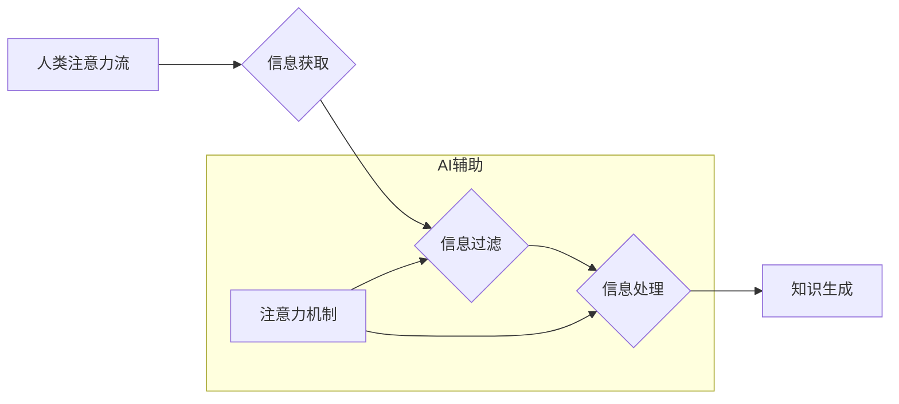

                 

## AI与人类注意力流：未来的教育、工作与技能

> 关键词：人工智能、注意力流、认知科学、教育科技、未来工作、技能发展、深度学习、神经网络、Transformer模型

## 1. 背景介绍

在信息爆炸的时代，人类的注意力资源变得越来越稀缺。我们每天被来自各种渠道的信息轰炸，从社交媒体的通知到电子邮件的提醒，从新闻网站的滚动条到视频平台的推荐，无处不在的干扰让我们难以集中精力完成任务。与此同时，人工智能（AI）技术飞速发展，其强大的计算能力和学习能力正在深刻地改变着我们的生活。AI能够自动分析海量数据，识别模式，并做出预测，这为我们提供了一种全新的视角去理解和应对注意力流的挑战。

## 2. 核心概念与联系

### 2.1 人类注意力流

注意力流是指人类对信息进行选择性感知和处理的过程。它是一个动态的、复杂的认知过程，受多种因素影响，包括个体差异、环境刺激、任务要求等。注意力流的核心在于过滤信息噪音，将重要的信息提取出来，并将其转化为有意义的知识和理解。

### 2.2 人工智能与注意力机制

人工智能，特别是深度学习领域，近年来取得了令人瞩目的进展。其中，注意力机制（Attention Mechanism）是深度学习模型中一个重要的创新，它能够模拟人类的注意力机制，帮助模型更好地理解和处理序列数据。注意力机制的核心思想是，在处理序列数据时，模型应该关注那些与当前任务最相关的部分，并对这些部分给予更多的权重。

### 2.3 AI与人类注意力流的联系

AI与人类注意力流的联系在于，AI可以通过模拟人类注意力机制，帮助我们更好地理解和管理注意力流。例如，AI可以帮助我们识别和过滤信息噪音，将重要的信息突出显示，并根据我们的兴趣和需求个性化推荐内容。

**Mermaid 流程图**



## 3. 核心算法原理 & 具体操作步骤

### 3.1 算法原理概述

注意力机制的核心思想是，在处理序列数据时，模型应该关注那些与当前任务最相关的部分，并对这些部分给予更多的权重。

注意力机制通常由三个部分组成：查询（Query）、键（Key）和值（Value）。查询、键和值都是从输入序列中提取出来的向量。

注意力机制计算每个键与查询之间的相似度，然后根据相似度计算每个值的权重。最后，将所有值的权重加权平均，得到最终的输出。

### 3.2 算法步骤详解

1. **输入序列：** 将输入序列转换为一系列向量。
2. **查询、键和值计算：** 对每个向量分别计算查询、键和值向量。
3. **注意力计算：** 计算每个键与查询之间的相似度，通常使用点积或余弦相似度。
4. **权重计算：** 将相似度转换为权重，通常使用softmax函数。
5. **加权平均：** 将所有值的权重加权平均，得到最终的输出。

### 3.3 算法优缺点

**优点：**

* 可以有效地捕捉序列数据中的长距离依赖关系。
* 可以提高模型的准确性和效率。
* 可以解释模型的决策过程。

**缺点：**

* 计算复杂度较高。
* 需要大量的训练数据。
* 容易受到噪声数据的影响。

### 3.4 算法应用领域

注意力机制在自然语言处理、计算机视觉、语音识别等领域都有广泛的应用。

* **自然语言处理：** 机器翻译、文本摘要、问答系统、情感分析等。
* **计算机视觉：** 图像分类、目标检测、图像分割等。
* **语音识别：** 语音转文本、语音合成等。

## 4. 数学模型和公式 & 详细讲解 & 举例说明

### 4.1 数学模型构建

注意力机制的数学模型可以表示为以下公式：

$$
\text{Attention}(Q, K, V) = \text{softmax}\left(\frac{Q K^T}{\sqrt{d_k}}\right) V
$$

其中：

* $Q$：查询向量
* $K$：键向量
* $V$：值向量
* $d_k$：键向量的维度
* $\text{softmax}$：softmax函数

### 4.2 公式推导过程

注意力机制的公式推导过程可以分为以下几个步骤：

1. 计算查询向量 $Q$ 与每个键向量 $K_i$ 之间的相似度，通常使用点积或余弦相似度。
2. 将相似度转换为权重，通常使用softmax函数。
3. 将所有值向量 $V_i$ 与其对应的权重相乘，并求和，得到最终的输出。

### 4.3 案例分析与讲解

假设我们有一个句子 "The cat sat on the mat"，我们想要计算每个词语对句子最后一个词语 "mat" 的注意力权重。

我们可以将句子中的每个词语转换为向量，然后计算每个词语的查询向量与 "mat" 的键向量的相似度。

使用softmax函数将相似度转换为权重，然后将每个词语的值向量与其对应的权重相乘，并求和，得到最终的输出。

最终的输出是一个向量，每个元素代表句子中每个词语对 "mat" 的注意力权重。

## 5. 项目实践：代码实例和详细解释说明

### 5.1 开发环境搭建

* Python 3.6+
* TensorFlow 2.0+
* PyTorch 1.0+

### 5.2 源代码详细实现

```python
import tensorflow as tf

# 定义注意力机制层
class AttentionLayer(tf.keras.layers.Layer):
    def __init__(self, units):
        super(AttentionLayer, self).__init__()
        self.W_q = tf.keras.layers.Dense(units)
        self.W_k = tf.keras.layers.Dense(units)
        self.W_v = tf.keras.layers.Dense(units)
        self.softmax = tf.keras.layers.Softmax()

    def call(self, inputs):
        # 分别计算查询、键和值向量
        q = self.W_q(inputs)
        k = self.W_k(inputs)
        v = self.W_v(inputs)

        # 计算注意力权重
        attention_weights = self.softmax(tf.matmul(q, k, transpose_b=True) / tf.math.sqrt(tf.cast(units, tf.float32)))

        # 加权平均得到最终输出
        output = tf.matmul(attention_weights, v)
        return output

# 实例化注意力机制层
attention_layer = AttentionLayer(units=128)

# 输入数据
inputs = tf.random.normal(shape=(1, 10, 128))

# 通过注意力机制层进行处理
output = attention_layer(inputs)

# 打印输出结果
print(output.shape)
```

### 5.3 代码解读与分析

* 我们定义了一个 `AttentionLayer` 类，继承自 `tf.keras.layers.Layer`，实现注意力机制层。
* 在 `__init__` 方法中，我们定义了三个稠密层 `W_q`、`W_k` 和 `W_v`，用于计算查询、键和值向量。
* 在 `call` 方法中，我们首先计算查询、键和值向量，然后计算注意力权重，最后使用加权平均得到最终输出。
* 我们实例化了一个 `AttentionLayer` 对象，并使用随机数据进行测试。

### 5.4 运行结果展示

运行代码后，我们可以看到输出结果的形状为 `(1, 10, 128)`，这与输入数据的形状相同。

## 6. 实际应用场景

### 6.1 教育领域

* **个性化学习：** AI可以根据学生的学习进度和兴趣，个性化推荐学习内容，提高学习效率。
* **智能辅导：** AI可以提供智能辅导，帮助学生解决学习难题，并及时反馈学习情况。
* **自动批改：** AI可以自动批改作业，节省教师的时间，并提供更精准的反馈。

### 6.2 工作领域

* **信息筛选：** AI可以帮助我们过滤信息噪音，快速找到我们需要的信息。
* **任务管理：** AI可以帮助我们管理任务，提高工作效率。
* **决策支持：** AI可以分析数据，提供决策支持，帮助我们做出更明智的决策。

### 6.3 其他领域

* **医疗保健：** AI可以帮助医生诊断疾病，制定治疗方案。
* **金融服务：** AI可以帮助金融机构进行风险管理，识别欺诈行为。
* **交通运输：** AI可以帮助自动驾驶汽车感知周围环境，做出安全决策。

### 6.4 未来应用展望

随着AI技术的不断发展，AI与人类注意力流的结合将会有更广泛的应用场景。例如，未来我们可能会看到：

* **沉浸式学习体验：** AI可以根据学生的学习风格和需求，创造沉浸式的学习体验。
* **个性化工作环境：** AI可以根据用户的喜好和工作习惯，个性化定制工作环境。
* **增强现实（AR）和虚拟现实（VR）应用：** AI可以增强AR和VR体验，帮助我们更好地理解和交互信息。

## 7. 工具和资源推荐

### 7.1 学习资源推荐

* **书籍：**
    * 《深度学习》 by Ian Goodfellow, Yoshua Bengio, Aaron Courville
    * 《Attention Is All You Need》 by Vaswani et al.
* **在线课程：**
    * Coursera: Deep Learning Specialization
    * Udacity: Deep Learning Nanodegree
* **博客和网站：**
    * TensorFlow Blog
    * PyTorch Blog
    * Towards Data Science

### 7.2 开发工具推荐

* **TensorFlow:** 开源机器学习框架
* **PyTorch:** 开源机器学习框架
* **Keras:** 高级API，可以用于TensorFlow和Theano

### 7.3 相关论文推荐

* 《Attention Is All You Need》
* 《BERT: Pre-training of Deep Bidirectional Transformers for Language Understanding》
* 《Transformer-XL: Attentive Language Models Beyond a Fixed-Length Context》

## 8. 总结：未来发展趋势与挑战

### 8.1 研究成果总结

近年来，AI与人类注意力流的研究取得了显著进展，注意力机制成为深度学习领域的重要创新，并在自然语言处理、计算机视觉等领域取得了成功应用。

### 8.2 未来发展趋势

未来，AI与人类注意力流的研究将朝着以下几个方向发展：

* **更有效的注意力机制：** 研究更有效的注意力机制，提高模型的效率和准确性。
* **跨模态注意力：** 研究跨模态注意力机制，能够处理不同模态的数据，例如文本、图像、音频等。
* **可解释性注意力：** 研究可解释性注意力机制，能够解释模型的决策过程，提高模型的透明度和可信度。

### 8.3 面临的挑战

AI与人类注意力流的研究也面临着一些挑战：

* **数据获取和标注：** 训练有效的注意力机制模型需要大量的标注数据，而获取和标注这些数据成本较高。
* **计算资源：** 训练大型注意力机制模型需要大量的计算资源，这对于资源有限的机构来说是一个挑战。
* **伦理问题：** AI与人类注意力流的结合可能引发一些伦理问题，例如数据隐私、算法偏见等，需要引起重视和研究。

### 8.4 研究展望

尽管面临着挑战，但AI与人类注意力流的研究前景广阔。随着技术的不断发展，我们相信AI将能够更好地理解和管理人类注意力流，为教育、工作和生活带来更多便利和福祉。

## 9. 附录：常见问题与解答

**Q1：注意力机制是如何工作的？**

A1：注意力机制通过计算查询向量与键向量的相似度，来确定哪些信息对当前任务最相关，并对这些信息给予更多的权重。

**Q2：注意力机制有哪些应用场景？**

A2：注意力机制在自然语言处理、计算机视觉、语音识别等领域都有广泛的应用，例如机器翻译、文本摘要、图像分类等。

**Q3：如何选择合适的注意力机制？**

A3：选择合适的注意力机制需要根据具体的应用场景和任务需求来决定。例如，对于长序列数据，Transformer模型中的自注意力机制效果较好。

**Q4：注意力机制有哪些局限性？**

A4：注意力机制的计算复杂度较高，需要大量的训练数据，并且容易受到噪声数据的影响。

**Q5：未来注意力机制的发展趋势是什么？**

A5：未来注意力机制的发展趋势包括：更有效的注意力机制、跨模态注意力、可解释性注意力等。


作者：禅与计算机程序设计艺术 / Zen and the Art of Computer Programming 
<end_of_turn>

