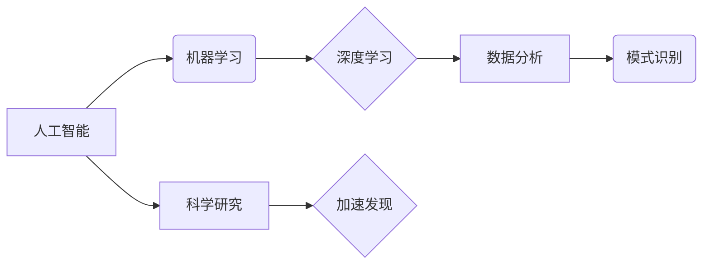

                 

## AI在科学研究中的应用：加速发现

> 关键词：人工智能、机器学习、深度学习、科学发现、数据分析、模式识别

### 1. 背景介绍

科学研究的本质是探索未知，揭示规律，推动人类文明进步。传统科学研究依靠人类的智慧和经验，往往耗时费力，效率低下。随着大数据时代的到来，海量数据涌现，为科学研究提供了前所未有的机遇。人工智能（AI）作为一种新兴技术，凭借其强大的数据处理能力和模式识别能力，正在深刻地改变着科学研究的模式，加速着科学发现的步伐。

### 2. 核心概念与联系

**2.1  人工智能（AI）**

人工智能是指模拟人类智能行为的计算机系统。它涵盖了多个领域，包括机器学习、深度学习、自然语言处理、计算机视觉等。

**2.2  机器学习（ML）**

机器学习是人工智能的一个重要分支，它通过算法训练模型，使模型能够从数据中学习，并根据学习到的知识进行预测或决策。

**2.3  深度学习（DL）**

深度学习是机器学习的一个子领域，它利用多层神经网络来模拟人类大脑的学习过程，能够处理更复杂的数据，并取得更优的性能。

**2.4  科学研究**

科学研究是指通过系统观察、实验、分析和推理等方法，探索自然规律和社会现象，并建立科学理论的过程。

**2.5  数据分析**

数据分析是指对数据进行收集、整理、分析和解释，以发现数据中的规律和趋势，并为决策提供支持的过程。

**2.6  模式识别**

模式识别是指识别数据中的模式和特征，并将其分类或预测的过程。

**核心概念与联系流程图**



### 3. 核心算法原理 & 具体操作步骤

**3.1  算法原理概述**

在科学研究中，AI算法主要用于数据分析、模式识别和预测。常见的AI算法包括：

* **监督学习算法:** 

   例如线性回归、逻辑回归、支持向量机、决策树、随机森林等，用于训练模型，使模型能够根据已知数据进行预测。

* **无监督学习算法:** 

   例如k-means聚类、主成分分析等，用于发现数据中的隐藏模式和结构。

* **强化学习算法:** 

   例如Q学习、SARSA等，用于训练模型，使模型能够通过与环境交互学习最佳策略。

**3.2  算法步骤详解**

以监督学习算法为例，其具体操作步骤如下：

1. **数据收集和预处理:** 收集相关数据，并进行清洗、转换、特征工程等预处理操作，以确保数据质量和算法性能。
2. **模型选择:** 根据研究问题和数据特点，选择合适的监督学习算法模型。
3. **模型训练:** 使用训练数据训练模型，调整模型参数，使模型能够准确地进行预测。
4. **模型评估:** 使用测试数据评估模型的性能，例如准确率、召回率、F1-score等指标。
5. **模型调优:** 根据评估结果，调整模型参数或选择其他算法模型，以提高模型性能。
6. **模型部署:** 将训练好的模型部署到实际应用场景中，用于进行预测或决策。

**3.3  算法优缺点**

不同的AI算法具有不同的优缺点，需要根据具体应用场景进行选择。

* **优点:**

   * 能够处理海量数据，发现隐藏的模式和规律。
   * 自动化学习过程，提高效率和准确性。
   * 能够进行预测和决策，辅助科学研究。

* **缺点:**

   * 需要大量的数据进行训练，数据质量直接影响模型性能。
   * 算法模型的解释性较差，难以理解模型的决策过程。
   * 算法模型的更新和维护需要持续投入。

**3.4  算法应用领域**

AI算法在科学研究领域有着广泛的应用，例如：

* **药物研发:** 利用AI算法分析药物分子结构和生物活性，加速药物研发过程。
* **材料科学:** 利用AI算法预测材料的性能和结构，设计新型材料。
* **天文学:** 利用AI算法分析天文观测数据，发现新的天体和宇宙现象。
* **气候科学:** 利用AI算法模拟气候变化，预测未来气候趋势。
* **生物学:** 利用AI算法分析基因组数据，研究生物进化和疾病机制。

### 4. 数学模型和公式 & 详细讲解 & 举例说明

**4.1  数学模型构建**

在AI算法中，数学模型是算法的核心，它描述了算法的逻辑和计算过程。常见的数学模型包括线性回归模型、逻辑回归模型、神经网络模型等。

**4.2  公式推导过程**

以线性回归模型为例，其目标是找到一条直线，使得这条直线与数据点之间的距离最小。

线性回归模型的数学公式如下：

$$y = mx + c$$

其中：

* $y$ 是预测值
* $x$ 是输入特征
* $m$ 是斜率
* $c$ 是截距

为了找到最佳的 $m$ 和 $c$ 值，可以使用最小二乘法。最小二乘法的目标是找到 $m$ 和 $c$ 值，使得预测值与真实值之间的平方误差最小。

**4.3  案例分析与讲解**

假设我们有一组数据，包含房屋面积和房屋价格的信息。我们想要利用线性回归模型预测房屋价格。

我们可以将房屋面积作为输入特征 $x$，房屋价格作为输出特征 $y$。然后，使用最小二乘法训练线性回归模型，找到最佳的 $m$ 和 $c$ 值。

训练完成后，我们可以使用模型预测其他房屋的价格。例如，如果我们知道一栋房屋的面积为 100 平方米，我们可以使用模型预测其价格。

### 5. 项目实践：代码实例和详细解释说明

**5.1  开发环境搭建**

为了实现AI算法的应用，需要搭建相应的开发环境。常见的开发环境包括：

* **Python:** Python 是一个流行的编程语言，拥有丰富的AI库和工具，例如TensorFlow、PyTorch、Scikit-learn等。
* **Jupyter Notebook:** Jupyter Notebook 是一个交互式编程环境，方便进行代码编写、调试和可视化。
* **云计算平台:** 云计算平台，例如AWS、Azure、GCP等，提供强大的计算资源和AI服务，方便进行大规模数据处理和模型训练。

**5.2  源代码详细实现**

以下是一个使用Python和Scikit-learn库实现线性回归模型的代码示例：

```python
from sklearn.linear_model import LinearRegression
from sklearn.model_selection import train_test_split
import numpy as np

# 生成示例数据
np.random.seed(0)
X = np.random.rand(100, 1) * 10
y = 2 * X + 1 + np.random.randn(100, 1)

# 将数据分为训练集和测试集
X_train, X_test, y_train, y_test = train_test_split(X, y, test_size=0.2, random_state=42)

# 创建线性回归模型
model = LinearRegression()

# 训练模型
model.fit(X_train, y_train)

# 预测测试集数据
y_pred = model.predict(X_test)

# 评估模型性能
print('Coefficients:', model.coef_)
print('Intercept:', model.intercept_)
```

**5.3  代码解读与分析**

这段代码首先生成了一些示例数据，然后将数据分为训练集和测试集。接着，创建了一个线性回归模型，并使用训练集数据训练模型。最后，使用训练好的模型预测测试集数据，并评估模型性能。

**5.4  运行结果展示**

运行这段代码后，会输出模型的系数和截距，以及模型预测结果与真实值的误差。

### 6. 实际应用场景

**6.1  药物研发**

AI算法可以用于分析药物分子结构和生物活性，预测药物的疗效和安全性，加速药物研发过程。例如，DeepMind的AlphaFold算法可以预测蛋白质的3D结构，这对于药物设计具有重要意义。

**6.2  材料科学**

AI算法可以用于预测材料的性能和结构，设计新型材料。例如，IBM的Watson可以帮助科学家发现新的材料组合，并预测其性能。

**6.3  天文学**

AI算法可以用于分析天文观测数据，发现新的天体和宇宙现象。例如，Google DeepMind的算法可以识别宇宙中的星系和星云。

**6.4  未来应用展望**

随着AI技术的不断发展，其在科学研究中的应用将更加广泛和深入。例如，AI算法可以用于模拟复杂系统，预测未来趋势，推动科学发现的加速发展。

### 7. 工具和资源推荐

**7.1  学习资源推荐**

* **在线课程:** Coursera、edX、Udacity等平台提供丰富的AI课程。
* **书籍:** 《深度学习》、《机器学习实战》等书籍是学习AI的基础教材。
* **博客和论坛:** AI社区博客和论坛是学习AI知识和交流经验的好地方。

**7.2  开发工具推荐**

* **Python:** Python 是AI开发的常用语言，拥有丰富的AI库和工具。
* **TensorFlow:** TensorFlow 是一个开源的机器学习框架，用于构建和训练深度学习模型。
* **PyTorch:** PyTorch 是另一个开源的机器学习框架，以其灵活性和易用性而闻名。

**7.3  相关论文推荐**

* **AlphaFold:** https://deepmind.com/blog/alphafold-a-solution-to-a-50-year-old-grand-challenge-in-biology
* **BERT:** https://arxiv.org/abs/1810.04805

### 8. 总结：未来发展趋势与挑战

**8.1  研究成果总结**

AI在科学研究领域取得了显著的成果，加速了科学发现的步伐。

**8.2  未来发展趋势**

未来，AI在科学研究中的应用将更加广泛和深入，例如：

* **更强大的AI算法:** 随着算法的不断发展，AI将能够处理更复杂的数据，发现更深层次的规律。
* **更广泛的应用场景:** AI将应用于更多科学领域，例如生物医学、环境科学、社会科学等。
* **更智能的科学研究:** AI将与人类科学家协同工作，共同进行科学研究，提高研究效率和创新能力。

**8.3  面临的挑战**

AI在科学研究中的应用也面临一些挑战，例如：

* **数据质量:** AI算法的性能依赖于数据质量，需要确保数据的准确性和完整性。
* **算法解释性:** 许多AI算法的决策过程难以解释，这可能会阻碍其在科学研究中的应用。
* **伦理问题:** AI的应用可能引发一些伦理问题，例如数据隐私、算法偏见等，需要谨慎考虑和解决。

**8.4  研究展望**

未来，需要加强AI算法的研发，提高其解释性和鲁棒性。同时，需要加强对AI伦理问题的研究，制定相应的规范和制度，确保AI技术安全、可控、可持续地发展。

### 9. 附录：常见问题与解答

**9.1  Q: 如何选择合适的AI算法？**

**A:** 选择合适的AI算法需要根据具体应用场景和数据特点进行考虑。例如，对于分类问题，可以使用支持向量机、决策树等算法；对于回归问题，可以使用线性回归、逻辑回归等算法。

**9.2  Q: 如何评估AI模型的性能？**

**A:** AI模型的性能可以通过多种指标进行评估，例如准确率、召回率、F1-score、AUC等。

**9.3  Q: 如何解决AI算法的解释性问题？**

**A:** 

目前，一些研究者正在开发更可解释的AI算法，例如规则学习、可视化解释等方法。

**9.4  Q: 如何应对AI算法的伦理问题？**

**A:** 

需要加强对AI伦理问题的研究，制定相应的规范和制度，确保AI技术安全、可控、可持续地发展。


作者：禅与计算机程序设计艺术 / Zen and the Art of Computer Programming 
<end_of_turn>

