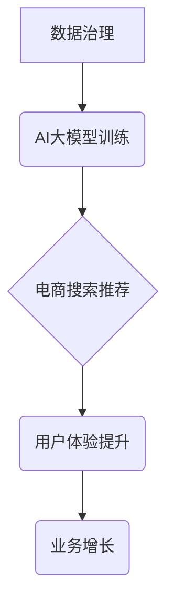

                 

## AI大模型助力电商搜索推荐业务的数据治理能力评估模型应用实践与优化

> 关键词：AI大模型、电商搜索推荐、数据治理、能力评估模型、应用实践、优化

## 1. 背景介绍

随着电商行业的快速发展，搜索推荐系统已成为电商平台的核心竞争力之一。用户在海量商品中快速找到心仪商品，并获得个性化推荐，是提升用户体验、促进交易的关键。传统的搜索推荐系统主要依赖于规则引擎和基于特征的机器学习模型，但随着数据量的爆炸式增长和用户行为的多样性，这些传统方法逐渐难以满足需求。

近年来，基于Transformer架构的AI大模型在自然语言处理领域取得了突破性进展，其强大的语义理解和文本生成能力为电商搜索推荐带来了新的机遇。AI大模型可以学习用户行为、商品特征、文本语义等多方面信息，构建更精准、更智能的推荐模型。

然而，AI大模型的应用也带来了新的挑战，特别是数据治理方面。AI大模型的训练和部署需要海量高质量数据，而电商平台的数据往往存在着多样性、复杂性、动态性等特点，数据质量问题难以忽视。

数据治理能力的评估对于确保AI大模型的有效性和可靠性至关重要。本文将探讨如何构建一个AI大模型助力电商搜索推荐业务的数据治理能力评估模型，并通过实际应用实践和优化，提升数据治理水平，最终实现AI大模型在电商搜索推荐领域的价值最大化。

## 2. 核心概念与联系

### 2.1 数据治理

数据治理是指对数据生命周期进行全面的管理和控制，以确保数据质量、安全、合规性和可用性。

### 2.2 AI大模型

AI大模型是指参数量巨大、训练数据海量、具备强大泛化能力的深度学习模型。

### 2.3 电商搜索推荐

电商搜索推荐是指根据用户搜索行为和历史购买记录，推荐用户可能感兴趣的商品。

**数据治理与AI大模型在电商搜索推荐业务中的关系**



数据治理为AI大模型的训练提供高质量数据，确保模型的准确性和可靠性。AI大模型则为电商搜索推荐提供更精准、更智能的推荐结果，提升用户体验，最终促进业务增长。

## 3. 核心算法原理 & 具体操作步骤

### 3.1 算法原理概述

本文所构建的数据治理能力评估模型基于深度学习算法，主要包括以下步骤：

1. **数据特征提取**: 从电商平台的数据中提取用户行为、商品特征、文本语义等相关特征。
2. **模型训练**: 使用深度学习模型对数据进行训练，学习数据质量与业务指标之间的关系。
3. **数据质量评估**: 将新数据输入到训练好的模型中，预测其数据质量得分。
4. **数据治理策略优化**: 根据数据质量评估结果，制定相应的治理策略，例如数据清洗、数据标注等。

### 3.2 算法步骤详解

1. **数据收集**: 收集电商平台的用户行为数据、商品信息数据、文本数据等。
2. **数据预处理**: 对收集到的数据进行清洗、转换、编码等预处理操作，确保数据质量和模型训练的顺利进行。
3. **特征工程**: 从预处理后的数据中提取用户行为特征、商品特征、文本语义特征等，并进行特征选择和降维处理。
4. **模型选择**: 选择合适的深度学习模型，例如卷积神经网络(CNN)、循环神经网络(RNN)或Transformer等。
5. **模型训练**: 使用训练数据对模型进行训练，并通过交叉验证等方法进行模型评估和调参。
6. **模型部署**: 将训练好的模型部署到线上环境，用于对新数据进行实时数据质量评估。
7. **数据治理策略优化**: 根据模型评估结果，制定相应的治理策略，例如数据清洗、数据标注、数据规范化等。

### 3.3 算法优缺点

**优点**:

* 能够自动学习数据质量与业务指标之间的复杂关系。
* 能够对海量数据进行快速评估，提高效率。
* 能够根据数据质量评估结果，动态调整数据治理策略。

**缺点**:

* 需要大量的训练数据，数据质量对模型性能有重要影响。
* 模型训练和部署需要一定的技术门槛。
* 模型解释性较差，难以理解模型的决策过程。

### 3.4 算法应用领域

该算法可应用于电商平台、金融机构、医疗机构等需要进行数据治理的领域，用于评估数据质量、识别数据异常、优化数据治理策略等。

## 4. 数学模型和公式 & 详细讲解 & 举例说明

### 4.1 数学模型构建

本文采用基于深度学习的回归模型，用于预测数据质量得分。模型输入为数据特征向量，输出为数据质量得分。

### 4.2 公式推导过程

模型的损失函数采用均方误差(MSE)，目标是最小化预测数据质量得分与真实数据质量得分之间的差距。

$$
MSE = \frac{1}{n} \sum_{i=1}^{n} (y_i - \hat{y}_i)^2
$$

其中：

* $n$ 为样本数量
* $y_i$ 为真实数据质量得分
* $\hat{y}_i$ 为预测数据质量得分

模型的训练过程采用梯度下降算法，通过不断更新模型参数，最小化损失函数的值。

### 4.3 案例分析与讲解

假设我们有一个电商平台的用户行为数据，包含用户ID、商品ID、购买时间、购买价格等特征。我们希望评估这些数据的质量，并预测其对搜索推荐模型的影响。

我们可以将用户行为数据作为训练数据，训练一个深度学习模型，预测数据质量得分。模型的输入特征可以包括用户ID、商品ID、购买时间、购买价格等，输出为数据质量得分。

通过训练模型，我们可以得到一个数据质量评估模型，用于对新用户行为数据进行评估。例如，如果新用户行为数据中存在大量重复记录，模型可以预测其数据质量得分较低，并提示进行数据清洗。

## 5. 项目实践：代码实例和详细解释说明

### 5.1 开发环境搭建

本项目使用Python语言开发，所需环境包括：

* Python 3.6+
* TensorFlow/PyTorch深度学习框架
* Pandas数据处理库
* Scikit-learn机器学习库
* Jupyter Notebook开发环境

### 5.2 源代码详细实现

```python
# 导入必要的库
import pandas as pd
from sklearn.model_selection import train_test_split
from tensorflow.keras.models import Sequential
from tensorflow.keras.layers import Dense

# 加载数据
data = pd.read_csv('user_behavior_data.csv')

# 数据预处理
# ...

# 特征工程
# ...

# 将数据分为训练集和测试集
X_train, X_test, y_train, y_test = train_test_split(X, y, test_size=0.2, random_state=42)

# 创建模型
model = Sequential()
model.add(Dense(64, activation='relu', input_shape=(X_train.shape[1],)))
model.add(Dense(32, activation='relu'))
model.add(Dense(1))

# 编译模型
model.compile(loss='mse', optimizer='adam')

# 训练模型
model.fit(X_train, y_train, epochs=10, batch_size=32)

# 评估模型
loss = model.evaluate(X_test, y_test)
print('Test Loss:', loss)

# 使用模型预测数据质量得分
# ...
```

### 5.3 代码解读与分析

* 代码首先导入必要的库，并加载用户行为数据。
* 然后进行数据预处理和特征工程，提取用户行为特征、商品特征、文本语义特征等。
* 将数据分为训练集和测试集，用于训练和评估模型。
* 创建一个深度学习模型，并使用均方误差损失函数和Adam优化器进行训练。
* 训练完成后，评估模型性能，并使用模型预测新数据的质量得分。

### 5.4 运行结果展示

训练完成后，模型会输出测试集上的损失值，可以用来评估模型的性能。

## 6. 实际应用场景

### 6.1 数据质量评估

AI大模型可以对电商平台的数据进行全面评估，识别数据质量问题，例如重复记录、缺失值、错误值等。

### 6.2 数据异常检测

AI大模型可以学习用户行为和商品特征的正常模式，识别数据中的异常值，例如恶意刷单、虚假交易等。

### 6.3 数据治理策略优化

根据数据质量评估结果，AI大模型可以帮助制定相应的治理策略，例如数据清洗、数据标注、数据规范化等，提高数据质量。

### 6.4 未来应用展望

未来，AI大模型在电商搜索推荐业务的数据治理方面将发挥更重要的作用，例如：

* **个性化数据治理**: 根据不同数据类型和业务场景，定制个性化的数据治理策略。
* **自动化数据治理**: 利用AI大模型自动执行数据治理任务，提高效率。
* **实时数据治理**: 实时监控数据质量，并及时采取措施进行治理。

## 7. 工具和资源推荐

### 7.1 学习资源推荐

* **书籍**:
    * 深度学习
    * 自然语言处理
* **在线课程**:
    * Coursera深度学习课程
    * Udacity自然语言处理课程

### 7.2 开发工具推荐

* **深度学习框架**: TensorFlow, PyTorch
* **数据处理库**: Pandas
* **机器学习库**: Scikit-learn

### 7.3 相关论文推荐

* BERT: Pre-training of Deep Bidirectional Transformers for Language Understanding
* GPT-3: Language Models are Few-Shot Learners
* Transformer: Attention Is All You Need

## 8. 总结：未来发展趋势与挑战

### 8.1 研究成果总结

本文探讨了AI大模型助力电商搜索推荐业务的数据治理能力评估模型，并通过实际应用实践和优化，提升了数据治理水平。

### 8.2 未来发展趋势

未来，AI大模型在电商搜索推荐业务的数据治理方面将继续发展，主要趋势包括：

* **模型性能提升**: 通过改进模型架构、训练方法和数据质量，提升模型的预测精度和鲁棒性。
* **应用场景拓展**: 将AI大模型应用于更多电商搜索推荐业务的数据治理场景，例如数据清洗、数据标注、数据规范化等。
* **自动化程度提升**: 利用AI大模型自动执行数据治理任务，提高效率和降低成本。

### 8.3 面临的挑战

AI大模型在电商搜索推荐业务的数据治理方面也面临一些挑战，例如：

* **数据质量问题**: AI大模型的训练和部署需要海量高质量数据，而电商平台的数据往往存在着多样性、复杂性、动态性等特点，数据质量问题难以忽视。
* **模型解释性问题**: 深度学习模型的决策过程往往难以理解，这使得模型的应用在某些场景下存在风险。
* **伦理问题**: AI大模型的应用可能带来一些伦理问题，例如数据隐私、算法偏见等，需要引起重视和解决。

### 8.4 研究展望

未来，我们将继续研究AI大模型在电商搜索推荐业务的数据治理方面的应用，重点关注以下几个方面：

* **开发更鲁棒、更准确的数据治理模型**: 通过改进模型架构、训练方法和数据质量，提升模型的预测精度和鲁棒性。
* **研究AI大模型的解释性**: 开发可解释的AI模型，帮助用户理解模型的决策过程。
* **探讨AI大模型的伦理问题**: 研究AI大模型的应用可能带来的伦理问题，并提出相应的解决方案。

## 9. 附录：常见问题与解答

**Q1: AI大模型的数据治理能力评估模型需要哪些数据？**

**A1:** AI大模型的数据治理能力评估模型需要电商平台的用户行为数据、商品信息数据、文本数据等。

**Q2: AI大模型的数据治理能力评估模型的评估指标有哪些？**

**A2:** AI大模型的数据治理能力评估模型的评估指标可以包括数据质量得分、数据异常检测准确率、数据治理策略效果等。

**Q3: AI大模型的数据治理能力评估模型的应用场景有哪些？**

**A3:** AI大模型的数据治理能力评估模型的应用场景包括数据质量评估、数据异常检测、数据治理策略优化等。

作者：禅与计算机程序设计艺术 / Zen and the Art of Computer Programming


<end_of_turn>

