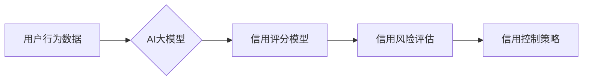

                 

## AI大模型在电商平台用户信用评估中的作用

> 关键词：AI大模型、用户信用评估、电商平台、机器学习、深度学习、自然语言处理、推荐系统、风险控制

## 1. 背景介绍

随着电商平台的蓬勃发展，用户信用评估已成为保障平台安全、促进交易健康发展的重要环节。传统的信用评估方法主要依赖于用户提供的静态信息，如身份信息、地址信息、交易记录等，难以全面反映用户的信用状况。而AI大模型凭借其强大的学习能力和数据处理能力，为用户信用评估提供了新的思路和方法。

AI大模型在电商平台用户信用评估中的应用，主要体现在以下几个方面：

* **更精准的信用评分：** AI大模型可以综合分析用户的多维度数据，包括交易行为、评论内容、社交网络信息等，构建更精准的用户信用评分模型。
* **更全面的信用评估：** AI大模型可以识别用户行为背后的隐含信息，例如用户对商品的评价倾向、购买习惯等，从而更全面地评估用户的信用状况。
* **更动态的信用评估：** AI大模型可以实时监控用户的行为变化，动态更新用户的信用评分，从而更及时地反映用户的信用状况。

## 2. 核心概念与联系

### 2.1 用户信用评估

用户信用评估是指对用户在电商平台上的行为进行分析，并根据其行为特征和历史记录，预测其未来交易行为的可靠性，从而为平台提供信用风险控制依据。

### 2.2 AI大模型

AI大模型是指训练数据量巨大、模型参数规模庞大的深度学习模型。它能够学习复杂的数据模式，并进行精准的预测和分类。

### 2.3 关联关系

AI大模型可以将用户在电商平台上的各种行为数据作为输入，通过学习和分析这些数据，构建用户信用评估模型。该模型可以根据用户的历史交易记录、评论内容、浏览行为、社交网络信息等多维度数据，预测用户的信用风险，并为平台提供相应的信用控制策略。

**Mermaid 流程图**



## 3. 核心算法原理 & 具体操作步骤

### 3.1 算法原理概述

AI大模型在用户信用评估中的核心算法主要包括：

* **机器学习算法：**例如逻辑回归、支持向量机、决策树等，可以根据历史数据学习用户信用特征，并构建信用评分模型。
* **深度学习算法：**例如卷积神经网络、循环神经网络等，可以更深入地学习用户行为数据中的复杂模式，构建更精准的信用评估模型。
* **自然语言处理算法：**例如文本分类、情感分析等，可以分析用户评论内容，提取用户对商品和平台的评价信息，用于信用评估。

### 3.2 算法步骤详解

1. **数据收集与预处理：**收集用户在电商平台上的各种行为数据，包括交易记录、评论内容、浏览行为、社交网络信息等，并进行清洗、转换、编码等预处理操作。
2. **特征工程：**根据算法需求，提取用户行为数据中的关键特征，例如交易金额、交易频率、评论评分、评论内容主题等。
3. **模型训练：**选择合适的机器学习或深度学习算法，利用训练数据训练信用评分模型。
4. **模型评估：**使用测试数据评估模型的性能，例如准确率、召回率、F1-score等。
5. **模型部署：**将训练好的模型部署到线上环境，用于实时评估用户的信用风险。

### 3.3 算法优缺点

**优点：**

* **精准度高：**AI大模型可以学习用户行为数据中的复杂模式，构建更精准的信用评分模型。
* **自动化程度高：**AI大模型可以自动化完成信用评估过程，提高效率。
* **可扩展性强：**AI大模型可以根据需要扩展数据维度和模型复杂度，适应不同的业务需求。

**缺点：**

* **数据依赖性强：**AI大模型的性能取决于训练数据的质量和数量。
* **解释性差：**深度学习模型的决策过程较为复杂，难以解释其评分结果。
* **伦理风险：**AI大模型可能存在偏见和歧视，需要进行充分的伦理评估和风险控制。

### 3.4 算法应用领域

AI大模型在用户信用评估领域的应用不仅限于电商平台，还可应用于以下领域：

* **金融领域：**信用评分、贷款风险评估、欺诈检测等。
* **保险领域：**风险评估、保费定价、理赔审核等。
* **社交网络领域：**用户身份验证、内容审核、社区管理等。

## 4. 数学模型和公式 & 详细讲解 & 举例说明

### 4.1 数学模型构建

用户信用评估模型通常采用评分模型的形式，将用户的信用风险映射到一个数值分数上。常用的评分模型包括逻辑回归、支持向量机、决策树等。

**逻辑回归模型**

逻辑回归模型将用户特征作为输入，通过sigmoid函数将输入映射到0到1之间的概率值，表示用户信用风险的概率。

$$
P(Y=1|X) = \frac{1}{1 + e^{-(w^T X + b)}}
$$

其中：

* $P(Y=1|X)$：用户信用风险为1的概率
* $X$：用户特征向量
* $w$：模型参数向量
* $b$：模型偏置项

### 4.2 公式推导过程

逻辑回归模型的训练过程是通过最大化似然函数来获得模型参数。似然函数表示模型参数下观测数据的概率。

$$
L(w,b) = \prod_{i=1}^{n} P(y_i|x_i)
$$

其中：

* $n$：样本数量
* $y_i$：第i个样本的真实标签（0或1）
* $x_i$：第i个样本的特征向量

通过对数似然函数，可以将乘积转化为求和，并使用梯度下降算法优化模型参数。

### 4.3 案例分析与讲解

假设我们有一个电商平台，需要评估用户的信用风险。我们可以收集用户的交易记录、评论内容、浏览行为等数据，并将其转化为特征向量。然后，我们可以使用逻辑回归模型训练一个信用评分模型。

例如，我们可以将用户的交易金额、交易频率、评论评分等特征作为输入，模型输出用户的信用风险概率。如果用户的信用风险概率高于某个阈值，则平台会对其进行信用限制，例如限制其购买金额或需要提供担保。

## 5. 项目实践：代码实例和详细解释说明

### 5.1 开发环境搭建

* **操作系统：** Linux/macOS/Windows
* **编程语言：** Python
* **深度学习框架：** TensorFlow/PyTorch
* **数据处理库：** Pandas/NumPy
* **机器学习库：** Scikit-learn

### 5.2 源代码详细实现

```python
import pandas as pd
from sklearn.model_selection import train_test_split
from sklearn.linear_model import LogisticRegression
from sklearn.metrics import accuracy_score

# 加载用户数据
data = pd.read_csv('user_data.csv')

# 选择特征和目标变量
features = ['交易金额', '交易频率', '评论评分']
target = '信用风险'

# 将数据分割为训练集和测试集
X_train, X_test, y_train, y_test = train_test_split(data[features], data[target], test_size=0.2, random_state=42)

# 创建逻辑回归模型
model = LogisticRegression()

# 训练模型
model.fit(X_train, y_train)

# 预测测试集结果
y_pred = model.predict(X_test)

# 计算模型准确率
accuracy = accuracy_score(y_test, y_pred)
print(f'模型准确率: {accuracy}')
```

### 5.3 代码解读与分析

* **数据加载和预处理：**首先，我们使用Pandas库加载用户数据，并选择需要使用的特征和目标变量。
* **数据分割：**我们将数据分割为训练集和测试集，用于训练和评估模型。
* **模型创建和训练：**我们使用Scikit-learn库中的LogisticRegression模型，并使用训练集数据训练模型。
* **模型评估：**我们使用测试集数据预测结果，并计算模型的准确率。

### 5.4 运行结果展示

运行上述代码后，会输出模型的准确率。

## 6. 实际应用场景

### 6.1 信用风险控制

电商平台可以利用AI大模型构建信用风险评估模型，对用户进行信用评分，并根据评分结果采取相应的风险控制措施，例如限制用户购买金额、要求用户提供担保等。

### 6.2 贷款风险评估

金融机构可以利用AI大模型评估用户的贷款风险，为用户提供个性化的贷款产品和利率。

### 6.3 欺诈检测

电商平台和金融机构可以利用AI大模型检测用户行为中的异常和欺诈行为，例如虚假交易、刷单等。

### 6.4 未来应用展望

随着AI技术的不断发展，AI大模型在用户信用评估领域的应用将更加广泛和深入。例如：

* **更精准的信用评估：**利用更先进的深度学习算法和更丰富的用户数据，构建更精准的信用评估模型。
* **更动态的信用评估：**实时监控用户的行为变化，动态更新用户的信用评分，更加及时地反映用户的信用状况。
* **更个性化的信用服务：**根据用户的信用状况和需求，提供个性化的信用服务，例如信用额度调整、信用保险等。

## 7. 工具和资源推荐

### 7.1 学习资源推荐

* **书籍：**
    * 《深度学习》
    * 《机器学习实战》
    * 《自然语言处理入门》
* **在线课程：**
    * Coursera
    * edX
    * Udacity

### 7.2 开发工具推荐

* **深度学习框架：** TensorFlow, PyTorch
* **数据处理库：** Pandas, NumPy
* **机器学习库：** Scikit-learn

### 7.3 相关论文推荐

* **《BERT: Pre-training of Deep Bidirectional Transformers for Language Understanding》**
* **《Attention Is All You Need》**
* **《Deep Learning for Credit Risk Assessment》**

## 8. 总结：未来发展趋势与挑战

### 8.1 研究成果总结

AI大模型在用户信用评估领域取得了显著的成果，能够构建更精准、更动态的信用评估模型，为电商平台和金融机构提供更有效的风险控制和信用服务。

### 8.2 未来发展趋势

* **模型精度提升：**利用更先进的深度学习算法和更丰富的用户数据，构建更精准的信用评估模型。
* **解释性增强：**研究更可解释的AI模型，提高模型决策的透明度和可信度。
* **个性化服务：**根据用户的信用状况和需求，提供个性化的信用服务，例如信用额度调整、信用保险等。

### 8.3 面临的挑战

* **数据质量和隐私保护：**AI大模型的性能依赖于训练数据的质量，同时需要保障用户数据的隐私安全。
* **模型公平性：**AI模型可能存在偏见和歧视，需要进行充分的公平性评估和风险控制。
* **监管和伦理问题：**AI大模型在信用评估领域的应用涉及到监管和伦理问题，需要制定相应的法律法规和伦理规范。

### 8.4 研究展望

未来，AI大模型在用户信用评估领域的应用将更加广泛和深入，需要继续加强模型的精度、解释性和公平性，并解决数据质量、隐私保护、监管和伦理等挑战。


## 9. 附录：常见问题与解答

**Q1：AI大模型在用户信用评估中有哪些优势？**

**A1：** AI大模型可以学习用户行为数据中的复杂模式，构建更精准的信用评分模型，自动化完成信用评估过程，提高效率。

**Q2：AI大模型在用户信用评估中有哪些风险？**

**A2：** AI大模型可能存在偏见和歧视，需要进行充分的伦理评估和风险控制。

**Q3：如何保障用户数据的隐私安全？**

**A3：** 在使用AI大模型进行用户信用评估时，需要采取相应的技术措施和管理制度，保障用户数据的隐私安全。例如，可以使用数据加密、匿名化等技术，并制定严格的数据使用和存储政策。


作者：禅与计算机程序设计艺术 / Zen and the Art of Computer Programming 
<end_of_turn>

