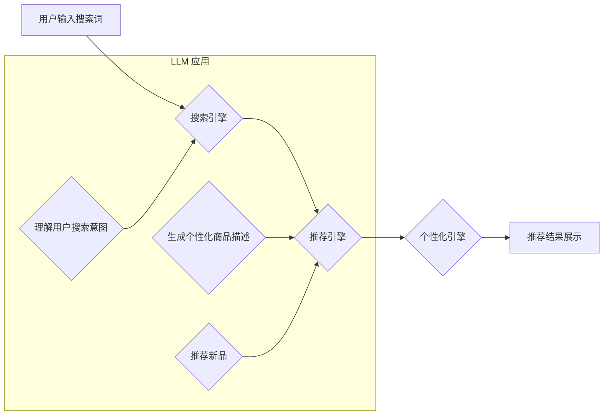

                 

## AI大模型赋能电商搜索推荐的新品发现能力提升

> 关键词：AI大模型、电商搜索、推荐系统、新品发现、用户行为分析、自然语言处理、深度学习

## 1. 背景介绍

在当今数据爆炸的时代，电商平台面临着巨大的挑战，如何精准地推荐用户感兴趣的商品，特别是新品，成为了提升用户体验和促进销售的关键。传统的搜索推荐系统主要依赖于商品的关键词匹配和用户历史行为，难以捕捉用户潜在需求和对新品的探索意愿。

近年来，大规模语言模型（LLM）的快速发展为电商搜索推荐带来了新的机遇。LLM 拥有强大的文本理解和生成能力，能够从海量商品信息和用户行为数据中挖掘更深层的语义关联，从而提升新品发现的准确性和效率。

## 2. 核心概念与联系

### 2.1  电商搜索推荐系统

电商搜索推荐系统旨在帮助用户快速找到所需商品，并根据用户的兴趣和偏好推荐相关商品。它通常由以下几个模块组成：

* **搜索引擎:** 处理用户搜索词，并返回相关商品列表。
* **推荐引擎:** 基于用户历史行为、商品属性和用户画像等信息，推荐用户可能感兴趣的商品。
* **个性化引擎:** 根据用户的个性化偏好，对搜索结果和推荐结果进行个性化排序和展示。

### 2.2  大规模语言模型（LLM）

LLM 是指训练规模庞大、参数数量众多的深度学习模型，能够理解和生成人类语言。常见的 LLM 包括 GPT-3、BERT、LaMDA 等。

LLM 拥有以下优势：

* **强大的文本理解能力:** 能够理解复杂的句子结构和语义关系。
* **优秀的文本生成能力:** 能够生成流畅、自然的文本内容。
* **泛化能力强:** 可以应用于多种自然语言处理任务，例如文本分类、问答系统、机器翻译等。

### 2.3  LLM 在电商搜索推荐中的应用

LLM 可以通过以下方式赋能电商搜索推荐系统：

* **理解用户搜索意图:** LLM 可以分析用户搜索词的语义，更准确地理解用户的搜索意图，从而返回更相关的商品结果。
* **生成个性化商品描述:** LLM 可以根据用户的兴趣和偏好，生成个性化的商品描述，提高商品的吸引力。
* **推荐新品:** LLM 可以分析海量商品信息和用户行为数据，识别潜在的新品趋势，并推荐符合用户需求的新产品。

**Mermaid 流程图**



## 3. 核心算法原理 & 具体操作步骤

### 3.1  算法原理概述

LLM 在电商搜索推荐中的应用主要基于以下核心算法：

* **Transformer 模型:** Transformer 模型是一种基于注意力机制的深度学习模型，能够有效地捕捉文本序列中的长距离依赖关系，在自然语言处理任务中取得了优异的性能。
* **BERT 模型:** BERT 是一个基于 Transformer 模型的预训练语言模型，通过在大量的文本数据上进行预训练，能够理解复杂的语义关系，在搜索意图理解和商品描述生成等任务中表现出色。
* **推荐算法:** 传统的推荐算法，例如协同过滤、基于内容的推荐等，可以结合 LLM 的文本理解能力，提升推荐的准确性和个性化程度。

### 3.2  算法步骤详解

1. **数据预处理:** 收集电商平台的商品信息、用户行为数据和文本评论等数据，进行清洗、格式化和向量化处理。
2. **LLM 预训练:** 使用预训练的 LLM 模型，例如 BERT，对商品信息和用户行为数据进行训练，学习商品的语义特征和用户兴趣偏好。
3. **模型微调:** 将预训练的 LLM 模型微调到电商搜索推荐的特定任务上，例如搜索意图理解、商品描述生成、新品推荐等。
4. **线上部署:** 将微调后的模型部署到电商平台的搜索推荐系统中，实时处理用户请求并提供个性化的推荐结果。

### 3.3  算法优缺点

**优点:**

* 能够理解用户的复杂搜索意图，提高搜索结果的准确性。
* 可以生成个性化的商品描述，提升商品的吸引力。
* 能够识别潜在的新品趋势，推荐符合用户需求的新产品。

**缺点:**

* 训练 LLM 模型需要大量的计算资源和时间。
* LLM 模型的解释性较差，难以理解模型的决策过程。
* LLM 模型容易受到数据偏差的影响，可能产生不公平或歧视性的推荐结果。

### 3.4  算法应用领域

LLM 在电商搜索推荐领域的应用不仅限于新品发现，还可以应用于以下领域：

* **搜索结果排序:** 根据用户搜索意图和商品语义特征，对搜索结果进行排序，提高用户体验。
* **商品分类:** 利用 LLM 的文本理解能力，自动对商品进行分类，提高商品管理效率。
* **用户画像构建:** 分析用户的搜索历史、浏览记录和评论内容，构建更精准的用户画像，为个性化推荐提供支持。

## 4. 数学模型和公式 & 详细讲解 & 举例说明

### 4.1  数学模型构建

LLM 的核心是 Transformer 模型，其主要结构包括编码器和解码器。编码器负责将输入的文本序列编码成语义向量，解码器则根据编码后的语义向量生成输出文本序列。

Transformer 模型中使用的注意力机制可以捕捉文本序列中的长距离依赖关系，其数学公式如下：

$$
Attention(Q, K, V) = \frac{exp(Q \cdot K^T / \sqrt{d_k})}{exp(Q \cdot K^T / \sqrt{d_k})} \cdot V
$$

其中：

* $Q$：查询矩阵
* $K$：键矩阵
* $V$：值矩阵
* $d_k$：键向量的维度

### 4.2  公式推导过程

注意力机制的核心思想是计算每个词与其他词之间的相关性，并根据相关性权重来加权求和，从而得到每个词的上下文表示。

公式推导过程如下：

1. 计算查询矩阵 $Q$ 与键矩阵 $K$ 的点积，并进行归一化处理，得到注意力权重矩阵。
2. 将注意力权重矩阵与值矩阵 $V$ 进行加权求和，得到每个词的上下文表示。

### 4.3  案例分析与讲解

例如，在理解用户搜索词 "新款手机" 时，注意力机制会计算 "新款" 和 "手机" 之间的相关性，并根据相关性权重来加权求和，从而得到 "新款手机" 的上下文表示。

通过分析 "新款手机" 的上下文表示，LLM 可以理解用户的搜索意图，并推荐符合用户需求的新款手机。

## 5. 项目实践：代码实例和详细解释说明

### 5.1  开发环境搭建

* Python 3.7+
* TensorFlow 或 PyTorch 深度学习框架
* CUDA 和 cuDNN (可选，用于 GPU 加速)

### 5.2  源代码详细实现

```python
# 使用 BERT 模型进行搜索意图理解
from transformers import AutoTokenizer, AutoModel

# 加载预训练的 BERT 模型和分词器
tokenizer = AutoTokenizer.from_pretrained("bert-base-uncased")
model = AutoModel.from_pretrained("bert-base-uncased")

# 用户搜索词
query = "新款手机"

# 将搜索词转换为 BERT 模型输入格式
input_ids = tokenizer.encode(query, add_special_tokens=True)

# 将输入序列送入 BERT 模型进行编码
outputs = model(input_ids)

# 获取 BERT 模型输出的语义向量
last_hidden_state = outputs.last_hidden_state

# 使用语义向量进行后续的搜索意图理解和推荐任务
```

### 5.3  代码解读与分析

* 代码首先加载预训练的 BERT 模型和分词器。
* 然后将用户搜索词转换为 BERT 模型输入格式，并将其送入模型进行编码。
* BERT 模型输出的语义向量可以用于后续的搜索意图理解和推荐任务。

### 5.4  运行结果展示

运行上述代码后，将得到 BERT 模型输出的语义向量，可以将其作为特征输入到其他推荐算法中，例如协同过滤或基于内容的推荐算法，从而实现更精准的新品推荐。

## 6. 实际应用场景

### 6.1  新品推荐

LLM 可以分析海量商品信息和用户行为数据，识别潜在的新品趋势，并推荐符合用户需求的新产品。例如，如果用户经常搜索 "智能手表"，LLM 可以识别出用户对智能穿戴设备的兴趣，并推荐最新的智能手表新品。

### 6.2  个性化商品描述

LLM 可以根据用户的兴趣和偏好，生成个性化的商品描述，提高商品的吸引力。例如，如果用户对 "运动鞋" 比较感兴趣，LLM 可以生成描述 "舒适透气，适合跑步和健身" 的商品描述，吸引用户的点击。

### 6.3  搜索结果排序

LLM 可以根据用户搜索意图和商品语义特征，对搜索结果进行排序，提高用户体验。例如，如果用户搜索 "新款手机"，LLM 可以优先推荐最新的手机型号，并根据用户的历史购买记录和浏览记录进行个性化排序。

### 6.4  未来应用展望

随着 LLM 技术的不断发展，其在电商搜索推荐领域的应用将更加广泛和深入。例如，LLM 可以用于：

* **多模态搜索:** 将文本、图像、视频等多种模态信息融合在一起，实现更精准的商品搜索。
* **对话式推荐:** 通过与用户进行对话，更深入地了解用户的需求，并提供个性化的商品推荐。
* **虚拟试衣间:** 利用 LLM 和计算机视觉技术，实现虚拟试衣间功能，帮助用户在线试穿商品。

## 7. 工具和资源推荐

### 7.1  学习资源推荐

* **Hugging Face:** https://huggingface.co/
* **OpenAI:** https://openai.com/
* **Stanford NLP Group:** https://nlp.stanford.edu/

### 7.2  开发工具推荐

* **TensorFlow:** https://www.tensorflow.org/
* **PyTorch:** https://pytorch.org/
* **Transformers:** https://huggingface.co/docs/transformers/index

### 7.3  相关论文推荐

* **BERT: Pre-training of Deep Bidirectional Transformers for Language Understanding**
* **Attention Is All You Need**
* **XLNet: Generalized Autoregressive Pretraining for Language Understanding**

## 8. 总结：未来发展趋势与挑战

### 8.1  研究成果总结

LLM 在电商搜索推荐领域取得了显著的成果，能够提升新品发现的准确性和效率，并为用户提供更个性化的商品推荐。

### 8.2  未来发展趋势

未来，LLM 在电商搜索推荐领域的应用将更加深入和广泛，例如：

* **多模态搜索:** 将文本、图像、视频等多种模态信息融合在一起，实现更精准的商品搜索。
* **对话式推荐:** 通过与用户进行对话，更深入地了解用户的需求，并提供个性化的商品推荐。
* **虚拟试衣间:** 利用 LLM 和计算机视觉技术，实现虚拟试衣间功能，帮助用户在线试穿商品。

### 8.3  面临的挑战

LLM 在电商搜索推荐领域也面临一些挑战，例如：

* **数据安全和隐私:** LLM 的训练需要大量用户数据，如何保护用户数据安全和隐私是一个重要问题。
* **模型解释性:** LLM 的决策过程难以解释，如何提高模型的透明度和可解释性是一个需要解决的问题。
* **模型偏见:** LLM 容易受到数据偏差的影响，可能产生不公平或歧视性的推荐结果，需要采取措施 mitigate 模型偏见。

### 8.4  研究展望

未来，需要进一步研究如何解决 LLM 在电商搜索推荐领域的挑战，例如：

* 开发更安全、更隐私的 LLM 训练方法。
* 研究更有效的模型解释技术。
* 探索如何 mitigate 模型偏见，确保推荐结果公平公正。


## 9. 附录：常见问题与解答

**Q1: LLM 在电商搜索推荐中有哪些优势？**

**A1:** LLM 能够理解用户的复杂搜索意图，生成个性化的商品描述，识别潜在的新品趋势，从而提升新品发现的准确性和效率，为用户提供更个性化的商品推荐。

**Q2: 如何评估 LLM 在电商搜索推荐中的性能？**

**A2:** 可以使用以下指标来评估 LLM 在电商搜索推荐中的性能：

* 点击率 (CTR)
* 转换率 (CVR)
* 用户满意度

**Q3: 如何解决 LLM 模型的解释性问题？**

**A3:** 可以使用以下方法来提高 LLM 模型的解释性：

* 使用可解释的机器学习模型，例如 LIME 或 SHAP。
* 对 LLM 模型的输出进行可视化，例如使用注意力机制的可视化工具。
* 开发更有效的模型解释技术。


作者：禅与计算机程序设计艺术 / Zen and the Art of Computer Programming 
<end_of_turn>

