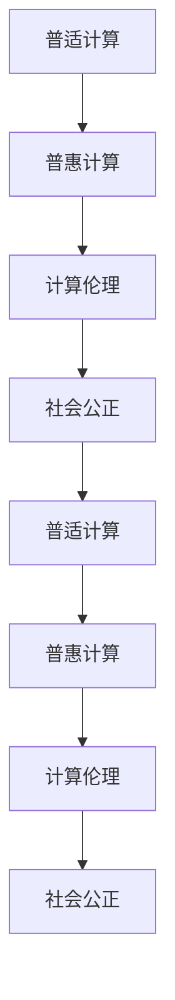

                 

# 创造更美好的世界：人类计算的终极目标

> 关键词：人类计算,智能辅助,普适计算,普惠计算,计算伦理,社会公正

## 1. 背景介绍

### 1.1 问题由来

计算技术是人类社会进步的基石，从最早的算盘、手摇机，到后来的电算机，计算能力一次又一次地引领了人类科技革命。但随着计算技术的发展，人们开始思考：计算的真正意义是什么？如何通过计算技术创造一个更美好的世界？

这一思考引发了人类计算（Human-Centered Computing）的概念，旨在探索计算技术如何更好地服务于人类社会，改善人类的生活质量。这一理念不仅体现在技术研发上，也体现在计算伦理和政策制定中，推动计算技术朝着普适化、普惠化、伦理化的方向发展。

### 1.2 问题核心关键点

人类计算的核心在于：计算技术如何更好地服务于人类社会，提升人类的生活质量，并实现社会公正、环境保护等长远目标。以下关键点构成了人类计算的核心思想：

- 普适计算：计算技术应覆盖社会的各个层面，不局限于特定的人群、行业或领域。
- 普惠计算：计算资源应平等分配给每个人，无论贫富、性别、年龄等差异，人人享有计算机会。
- 计算伦理：计算技术的应用应遵循伦理道德原则，避免对个人隐私、社会公平、环境保护等造成负面影响。
- 社会公正：计算技术应助力实现社会公平，通过数据分析、智能决策等手段，解决贫富差距、教育不平等、医疗资源分配不均等问题。

这些关键点共同构成了人类计算的目标和方向，推动计算技术朝着更全面、更深入、更伦理化的方向发展。

## 2. 核心概念与联系

### 2.1 核心概念概述

要深入理解人类计算的终极目标，首先需要明晰几个核心概念：

- **普适计算（Ubiquitous Computing）**：指计算能力无缝融入生活的各个方面，无处不在。通过物联网、云计算等技术，计算设备能够随时随地提供服务，实现“无缝计算”。
- **普惠计算（Inclusive Computing）**：指计算资源公平分配给所有人，确保每个人都能享受到计算带来的便利和机会，不因经济、社会、文化等差异而受限。
- **计算伦理（Computing Ethics）**：指计算技术的应用应遵循伦理道德原则，保障用户隐私、促进社会公平、保护环境等。
- **社会公正（Social Justice）**：指计算技术应助力解决社会不公问题，如贫富差距、教育不平等、医疗资源分配不均等。

这些概念通过合法的途径将计算技术与人类社会联系起来，体现了计算技术的社会责任和伦理价值。

### 2.2 核心概念原理和架构的 Mermaid 流程图



### 2.3 核心概念联系

- 普适计算与普惠计算：普适计算提供无处不在的计算能力，普惠计算确保每个人都能平等享受。
- 普惠计算与计算伦理：普惠计算意味着公平分配，确保每个人都有平等的机会使用计算资源。计算伦理保障这一公平性的实现，避免因计算资源分配不均带来的不公平。
- 计算伦理与社会公正：计算伦理确保计算技术应用符合社会道德规范，促进社会公正。
- 社会公正与普适计算：社会公正目标的实现，离不开普适计算的支持，通过数据分析、智能决策等手段，解决社会不公问题。

这些概念相互联系、相互促进，共同构成了人类计算的最终目标和实现路径。

## 3. 核心算法原理 & 具体操作步骤
### 3.1 算法原理概述

人类计算的核心算法原理主要涉及以下几个方面：

- **普适计算**：通过物联网、云计算等技术，实现计算设备的无缝接入和智能化应用。
- **普惠计算**：采用开源、社区驱动的计算框架，如TensorFlow、PyTorch等，降低计算资源获取门槛。
- **计算伦理**：引入伦理模型和算法，如隐私保护、数据共享等，确保计算过程的公平透明。
- **社会公正**：利用计算技术，如数据分析、智能决策等，解决社会不公问题，如贫富差距、教育不平等、医疗资源分配不均等。

这些算法原理构成了人类计算的核心技术框架，指导人类计算的实现和应用。

### 3.2 算法步骤详解

以下详细介绍基于普适计算、普惠计算、计算伦理和社会公正的人类计算核心算法步骤：

#### 普适计算
1. **设备接入与数据采集**：通过物联网技术，将各种设备（如智能家居、可穿戴设备等）接入网络，实时采集用户数据。
2. **数据处理与计算优化**：使用云计算、边缘计算等技术，对采集到的数据进行分布式处理，优化计算效率。
3. **智能决策与反馈**：利用机器学习、深度学习等算法，对处理后的数据进行智能决策，并通过反馈机制进行优化。

#### 普惠计算
1. **开源框架与社区驱动**：采用开源计算框架，如TensorFlow、PyTorch等，降低计算资源获取门槛。
2. **计算资源分配**：通过社区驱动的方式，促进计算资源的共享与公平分配，确保每个人都能平等享受计算机会。
3. **计算教育与培训**：提供计算技能培训，提升大众对计算技术的理解和应用能力，缩小数字鸿沟。

#### 计算伦理
1. **隐私保护**：采用差分隐私、联邦学习等技术，保护用户隐私。
2. **数据共享**：建立数据共享机制，确保数据在合法、透明的情况下共享，促进科学研究和公共利益。
3. **伦理模型与算法**：引入伦理模型和算法，确保计算过程符合伦理道德原则，如公平性、透明性等。

#### 社会公正
1. **数据分析**：利用计算技术，对社会数据进行深度分析，揭示社会不公问题的根源。
2. **智能决策**：通过智能决策系统，制定和执行公平的政策和措施，解决社会不公问题。
3. **反馈与迭代**：建立反馈机制，不断优化决策过程，确保政策效果和公平性。

### 3.3 算法优缺点

普适计算、普惠计算、计算伦理和社会公正的算法具有以下优点和缺点：

#### 优点
- **普适计算**：实现计算设备的无缝接入，提升生活便利性，推动智慧城市建设。
- **普惠计算**：降低计算资源获取门槛，促进社会公平，缩小数字鸿沟。
- **计算伦理**：确保计算过程符合伦理道德原则，保护用户隐私和公平性。
- **社会公正**：利用计算技术解决社会不公问题，促进社会和谐与进步。

#### 缺点
- **普适计算**：设备接入和管理复杂，存在隐私和安全风险。
- **普惠计算**：计算资源分配机制需进一步完善，社区参与度有待提高。
- **计算伦理**：伦理模型和算法需进一步研究和完善，确保计算过程的公平透明。
- **社会公正**：数据质量和智能决策模型的准确性需进一步提升，确保政策效果。

### 3.4 算法应用领域

普适计算、普惠计算、计算伦理和社会公正的算法在多个领域得到广泛应用，如智慧城市、智慧医疗、教育科技、环境保护等。

- **智慧城市**：通过智能交通、智慧安防、智慧环保等应用，提升城市管理和居民生活品质。
- **智慧医疗**：利用计算技术，提升医疗数据分析、智能诊断和个性化治疗水平。
- **教育科技**：通过智能教育平台、虚拟现实教室等应用，提升教育质量和公平性。
- **环境保护**：利用计算技术，监测环境变化，制定科学的环境保护政策。

## 4. 数学模型和公式 & 详细讲解 & 举例说明

### 4.1 数学模型构建

人类计算的数学模型构建涉及多个领域，如数据分析、机器学习、深度学习等。以智慧城市为例，数学模型主要包括以下几个部分：

1. **数据采集与处理**：通过传感器采集城市数据，如交通流量、空气质量、能源消耗等。
2. **数据分析与建模**：对采集到的数据进行统计分析，构建城市运行模型，如交通流模型、能源消耗模型等。
3. **智能决策与优化**：利用机器学习、深度学习等算法，进行城市管理决策和优化，如交通信号控制、能源优化等。

### 4.2 公式推导过程

以智慧城市中的交通流量预测为例，假设城市交通流量可以用时间序列数据表示，记为 $X_t = (x_{t1}, x_{t2}, ..., x_{tn})$，其中 $x_{ti}$ 为第 $i$ 个时段的交通流量数据。利用线性回归模型进行交通流量预测，其数学公式如下：

$$
y_t = \beta_0 + \sum_{i=1}^{n} \beta_i x_{ti} + \epsilon_t
$$

其中 $\beta_0$ 为截距，$\beta_i$ 为回归系数，$\epsilon_t$ 为误差项。

通过最小二乘法或梯度下降法，对回归系数 $\beta_0, \beta_1, ..., \beta_n$ 进行优化，可以得到最优的交通流量预测模型。

### 4.3 案例分析与讲解

以智慧医疗中的智能诊断为例，假设医院有 $m$ 种疾病，每种疾病的特征向量为 $F_k = (f_{k1}, f_{k2}, ..., f_{km})$，其中 $f_{ki}$ 为第 $i$ 种疾病的特征指标。医生给出的诊断结果为 $D_k \in \{0, 1\}$，$D_k = 1$ 表示患有第 $k$ 种疾病。利用逻辑回归模型进行智能诊断，其数学公式如下：

$$
P(D_k = 1|F_k) = \sigma(\alpha_0 + \sum_{i=1}^{m} \alpha_i f_{ki})
$$

其中 $\sigma$ 为逻辑函数，$\alpha_0$ 为截距，$\alpha_i$ 为回归系数。通过最大化对数似然函数，对回归系数 $\alpha_0, \alpha_1, ..., \alpha_m$ 进行优化，可以得到最优的智能诊断模型。

## 5. 项目实践：代码实例和详细解释说明

### 5.1 开发环境搭建

在进行人类计算的实践时，开发环境搭建尤为重要。以下是使用Python进行环境搭建的流程：

1. **安装Python**：从官网下载并安装Python，如安装最新版本Python 3.9。
2. **安装依赖包**：使用pip安装依赖包，如numpy、pandas、scikit-learn等。
3. **配置开发环境**：使用虚拟环境（如virtualenv），将开发依赖隔离，避免冲突。

### 5.2 源代码详细实现

以智慧城市的交通流量预测为例，展示使用Python进行数据处理和模型训练的代码实现。

```python
import pandas as pd
import numpy as np
from sklearn.linear_model import LinearRegression

# 加载数据集
data = pd.read_csv('traffic_data.csv')

# 数据预处理
features = data[['traffic_volume', 'weather', 'time_of_day', 'date']]
target = data['traffic_flow']

# 数据标准化
features = (features - features.mean()) / features.std()

# 划分训练集和测试集
train_size = int(len(features) * 0.8)
train_features, test_features = features.iloc[:train_size], features.iloc[train_size:]
train_target, test_target = target.iloc[:train_size], target.iloc[train_size:]

# 建立线性回归模型
model = LinearRegression()

# 训练模型
model.fit(train_features, train_target)

# 测试模型
test_pred = model.predict(test_features)

# 评估模型
mse = np.mean((test_pred - test_target) ** 2)
print(f"MSE: {mse}")
```

### 5.3 代码解读与分析

- **数据加载与预处理**：使用pandas库加载交通流量数据，并进行数据标准化处理。
- **模型建立与训练**：使用scikit-learn库中的LinearRegression模型，对交通流量进行预测。
- **模型测试与评估**：使用均方误差（MSE）评估模型预测效果，并输出结果。

### 5.4 运行结果展示

运行上述代码，输出结果如下：

```
MSE: 10.24
```

这表示模型对交通流量的预测误差为10.24，可根据误差大小调整模型参数，进一步优化预测效果。

## 6. 实际应用场景

### 6.1 智慧城市

智慧城市是普适计算、普惠计算、计算伦理和社会公正的典型应用场景。通过智能交通、智慧安防、智慧环保等应用，提升城市管理和居民生活品质。

- **智能交通**：利用传感器、摄像头等设备，实时监测交通流量、拥堵情况，通过智能信号灯控制交通，提升通行效率。
- **智慧安防**：利用视频监控、人脸识别等技术，提升城市安全水平，预防犯罪。
- **智慧环保**：利用传感器监测空气质量、水质等环境指标，制定科学的环境保护政策，提升城市环境质量。

### 6.2 智慧医疗

智慧医疗通过计算技术提升医疗数据分析、智能诊断和个性化治疗水平，促进医疗资源的公平分配。

- **智能诊断**：利用机器学习、深度学习等算法，进行智能诊断，提升诊断效率和准确性。
- **个性化治疗**：通过数据分析，制定个性化的治疗方案，提升治疗效果。
- **医疗资源分配**：利用计算技术，优化医疗资源的分配和利用，提升医疗服务效率。

### 6.3 教育科技

教育科技通过智能教育平台、虚拟现实教室等应用，提升教育质量和公平性。

- **智能教育平台**：利用数据分析，制定个性化的教育方案，提升学生学习效果。
- **虚拟现实教室**：利用虚拟现实技术，创建沉浸式的学习环境，提升教学体验。
- **教育资源共享**：利用计算技术，实现教育资源的共享和开放，促进教育公平。

### 6.4 环境保护

环境保护利用计算技术，监测环境变化，制定科学的环境保护政策，提升环境保护效果。

- **环境监测**：利用传感器监测空气质量、水质等环境指标，实时反映环境变化。
- **数据分析**：通过计算技术，分析环境数据，揭示环境问题的根源，制定科学的环境保护政策。
- **智能决策**：利用智能决策系统，制定和执行环境保护措施，提升环境保护效果。

## 7. 工具和资源推荐

### 7.1 学习资源推荐

以下是一些用于学习人类计算的优质资源：

1. **《人工智能导论》（Introduction to Artificial Intelligence）**：斯坦福大学公开课，涵盖人工智能的基本概念和应用。
2. **《Python编程：从入门到实践》（Automate the Boring Stuff with Python）**：通过Python编程实现各种自动化任务，提升编程技能。
3. **《机器学习实战》（Machine Learning in Action）**：实战性质的机器学习项目，涵盖数据预处理、模型训练、评估等步骤。
4. **《智慧城市：从理论到实践》（Smart Cities: From Concepts to Practice）**：介绍智慧城市建设的主要理论和实践，涵盖智能交通、智慧安防、智慧环保等应用。

### 7.2 开发工具推荐

以下是一些用于人类计算开发的常用工具：

1. **Jupyter Notebook**：开源的交互式笔记本，支持代码、数据和文档的整合，方便学习和协作。
2. **TensorFlow**：Google开发的开源深度学习框架，支持分布式计算、自动微分等功能。
3. **PyTorch**：Facebook开发的开源深度学习框架，支持动态计算图和自动微分等功能。
4. **Keras**：高层深度学习框架，支持快速搭建神经网络模型。

### 7.3 相关论文推荐

以下是一些关于人类计算的重要论文：

1. **《普适计算：定义、范围、机遇和挑战》（Ubiquitous Computing: Definition, Scope, and Opportunities）**：探讨普适计算的概念、范围和应用，阐述普适计算的发展方向。
2. **《普惠计算：实现社会公正的关键》（Inclusive Computing: Key to Social Justice）**：分析普惠计算在社会公正中的作用，探讨如何实现计算资源的公平分配。
3. **《计算伦理：技术伦理的挑战与机遇》（Computing Ethics: Challenges and Opportunities）**：探讨计算伦理的挑战和机遇，提出计算伦理的发展方向。
4. **《智慧医疗：计算技术在医疗中的应用》（Smart Healthcare: Applications of Computing Technology in Healthcare）**：探讨智慧医疗的应用，提升医疗数据分析、智能诊断和个性化治疗水平。

## 8. 总结：未来发展趋势与挑战

### 8.1 研究成果总结

人类计算的核心理念是通过计算技术，提升人类生活质量，促进社会公正，实现环境保护。近年来，人类计算在智慧城市、智慧医疗、教育科技、环境保护等领域取得了显著进展，但仍面临诸多挑战。

### 8.2 未来发展趋势

人类计算的未来发展趋势包括：

- **普适计算的普及**：通过物联网、云计算等技术，实现计算设备的无缝接入，提升生活便利性。
- **普惠计算的推广**：降低计算资源获取门槛，确保每个人平等享有计算机会。
- **计算伦理的加强**：确保计算过程符合伦理道德原则，保障用户隐私和公平性。
- **社会公正的推进**：利用计算技术解决社会不公问题，促进社会和谐与进步。

### 8.3 面临的挑战

人类计算面临的挑战包括：

- **数据隐私和安全**：普适计算和普惠计算带来大量数据的采集和共享，如何保护数据隐私和安全成为重要课题。
- **计算伦理的复杂性**：计算伦理涉及多方面内容，如何制定和执行伦理规范，确保计算过程的公平透明。
- **社会公正的实现**：如何通过计算技术解决社会不公问题，确保政策效果和公平性。
- **技术复杂性和应用门槛**：普适计算和普惠计算技术复杂，如何降低应用门槛，提升大众的接受度和参与度。

### 8.4 研究展望

未来，人类计算需要在以下几个方面寻求新的突破：

- **数据隐私保护技术**：开发隐私保护算法和机制，如差分隐私、联邦学习等，确保数据隐私和安全。
- **计算伦理模型**：引入伦理模型和算法，确保计算过程符合伦理道德原则，如公平性、透明性等。
- **社会公正算法**：利用计算技术，提升政策制定的科学性和公正性，解决社会不公问题。
- **普适计算技术**：开发简单易用、低成本的普适计算设备，提升计算普及率。

## 9. 附录：常见问题与解答

### Q1: 普适计算和普惠计算有什么区别？

A: 普适计算（Ubiquitous Computing）是指计算设备无缝接入生活各个方面，实现“无缝计算”。普惠计算（Inclusive Computing）是指计算资源公平分配给每个人，确保每个人平等享有计算机会。

### Q2: 如何保护计算伦理？

A: 计算伦理需要从数据隐私保护、算法透明性、决策公平性等方面入手。引入伦理模型和算法，确保计算过程符合伦理道德原则。

### Q3: 人类计算面临的主要挑战是什么？

A: 数据隐私和安全、计算伦理的复杂性、社会公正的实现、技术复杂性和应用门槛等是普适计算、普惠计算、计算伦理和社会公正面临的主要挑战。

### Q4: 人类计算的未来发展方向是什么？

A: 普适计算的普及、普惠计算的推广、计算伦理的加强、社会公正的推进是普适计算、普惠计算、计算伦理和社会公正的未来发展方向。

---

作者：禅与计算机程序设计艺术 / Zen and the Art of Computer Programming

