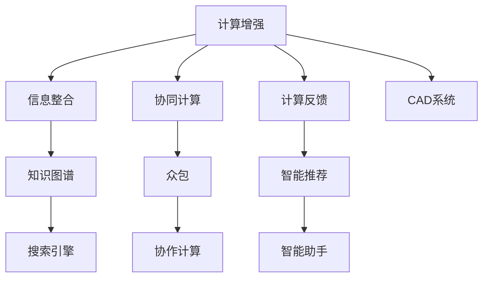

                 

# 创造更美好的明天：人类计算的积极作用

## 1. 背景介绍

随着科技的迅猛发展，人类计算（Human Computing）的概念逐渐成为未来科技发展的重要方向。该理念不仅在学术界引起了广泛关注，还深刻影响了各行各业的生产方式和商业模式。人类计算强调通过人机协作，充分利用人类的直觉、创造力和经验，辅以高效计算技术，实现比传统人工智能更高效、更智能的计算方式。本文将系统梳理人类计算的核心概念、发展历程及其在各行各业中的应用，并探讨未来发展趋势与面临的挑战。

## 2. 核心概念与联系

### 2.1 核心概念概述

人类计算（Human Computing）是一个广义的概念，涵盖了利用人类直觉、创造力和经验进行计算的多种方式。它强调将人类的思维优势与计算技术相结合，实现更智能、更高效的计算方法。人类计算的核心要素包括：

- **计算增强**：通过计算工具提升人类直觉和经验的效果，例如计算机辅助设计（CAD）、智能推荐系统等。
- **信息整合**：将碎片化、零散的信息整合成有用、系统化的知识，例如搜索引擎、知识图谱等。
- **协同计算**：通过多人的协作和讨论，利用集体智慧进行复杂计算，例如众包、协作计算等。
- **计算反馈**：将计算结果及时反馈给用户，增强计算的效率和效果，例如智能助手、个性化推荐等。

这些核心要素共同构成了人类计算的基石，并推动了各行各业的发展。

### 2.2 核心概念原理和架构的 Mermaid 流程图(Mermaid 流程节点中不要有括号、逗号等特殊字符)



## 3. 核心算法原理 & 具体操作步骤

### 3.1 算法原理概述

人类计算的算法原理涉及多种技术，包括机器学习、自然语言处理、计算机视觉等。其中，计算增强、信息整合、协同计算和计算反馈是核心算法思想。

- **计算增强**：通过机器学习模型等技术，辅助人类进行复杂计算。例如，利用深度学习模型对图像进行分类、预测，辅助医生进行疾病诊断。

- **信息整合**：通过知识图谱、语义网络等技术，将分散的信息整合成知识结构，辅助人类进行决策。例如，利用知识图谱进行专家推荐，通过语义网络进行个性化推荐。

- **协同计算**：利用众包、协作计算等技术，通过多人的协作和讨论，完成复杂的计算任务。例如，使用众包平台进行数据分析、图像标注等。

- **计算反馈**：利用自然语言处理技术，将计算结果以自然语言的形式反馈给用户，增强计算的效率和效果。例如，智能助手通过对话形式提供建议和解答。

### 3.2 算法步骤详解

人类计算的具体操作步骤可以概括为以下几个步骤：

1. **需求分析**：明确计算任务的目标和需求，确定需要计算的信息和数据。

2. **数据收集**：收集相关的数据和信息，利用传感器、网络、数据库等技术获取数据。

3. **计算增强**：利用机器学习、深度学习等技术，对数据进行增强处理，辅助人类进行计算。

4. **信息整合**：利用知识图谱、语义网络等技术，将分散的信息整合成知识结构，辅助人类进行决策。

5. **协同计算**：利用众包、协作计算等技术，通过多人的协作和讨论，完成复杂的计算任务。

6. **计算反馈**：利用自然语言处理技术，将计算结果以自然语言的形式反馈给用户，增强计算的效率和效果。

7. **迭代优化**：根据反馈信息，对计算模型进行优化和改进，提高计算效果和效率。

### 3.3 算法优缺点

人类计算的算法具有以下优点：

- **高效性**：通过计算增强和信息整合，可以大幅提升计算效率和准确性。
- **智能化**：利用深度学习、自然语言处理等技术，可以实现智能化计算，提高决策水平。
- **适应性**：通过协同计算和计算反馈，可以适应不同的用户需求和场景，提高灵活性。

但同时也存在一些缺点：

- **复杂性**：需要综合利用多种技术和工具，实现起来较为复杂。
- **依赖性**：对数据和算法的依赖性较强，数据质量不佳或算法不合理会导致计算结果失真。
- **成本高**：技术研发和实施成本较高，需要较高的技术水平和资金投入。

### 3.4 算法应用领域

人类计算在多个领域具有广泛的应用前景：

- **医疗健康**：利用计算增强和信息整合技术，辅助医生进行疾病诊断和治疗方案选择。
- **金融科技**：利用协同计算和计算反馈技术，实现智能投顾、风险评估等功能。
- **智能制造**：利用计算增强和协同计算技术，实现智能设计、智能制造等。
- **智能交通**：利用信息整合和计算反馈技术，实现智能导航、智能调度等功能。
- **教育培训**：利用协同计算和计算反馈技术，实现个性化教学、智能评估等功能。
- **环保节能**：利用计算增强和协同计算技术，实现智能监测、智能控制等功能。

## 4. 数学模型和公式 & 详细讲解 & 举例说明

### 4.1 数学模型构建

人类计算的数学模型涉及多个领域，包括深度学习、知识图谱、自然语言处理等。这里以深度学习模型为例，介绍其数学模型构建的基本步骤：

1. **输入层**：定义输入数据的维度和形式，例如输入一张图像，将其转换为像素值矩阵。

2. **隐藏层**：通过神经网络模型，对输入数据进行多层次的特征提取和转换，例如卷积层、池化层、全连接层等。

3. **输出层**：根据计算任务，定义输出层的维度和形式，例如输出一个二分类结果，使用softmax函数进行概率计算。

4. **损失函数**：定义模型输出的损失函数，例如交叉熵损失、均方误差损失等。

5. **优化器**：定义模型参数的优化器，例如AdamW、SGD等，调整模型参数以最小化损失函数。

### 4.2 公式推导过程

以二分类任务为例，推导深度学习模型的损失函数和优化器的公式。

假设模型输入为 $x \in \mathbb{R}^n$，输出为 $y \in \{0, 1\}$，模型参数为 $\theta$，定义输出为 $f(x; \theta)$，则损失函数为：

$$
\mathcal{L}(\theta) = -(y\log f(x; \theta) + (1-y)\log(1-f(x; \theta)))
$$

优化器的更新公式为：

$$
\theta \leftarrow \theta - \eta \nabla_{\theta}\mathcal{L}(\theta)
$$

其中 $\eta$ 为学习率，$\nabla_{\theta}\mathcal{L}(\theta)$ 为损失函数对模型参数的梯度。

### 4.3 案例分析与讲解

以医疗图像分类为例，介绍如何利用深度学习模型进行计算增强。

1. **数据收集**：收集医院中的医疗图像数据，例如肺部CT图像。

2. **数据预处理**：将图像转换为像素值矩阵，进行归一化和标准化处理。

3. **模型构建**：定义卷积神经网络模型，包括卷积层、池化层、全连接层等。

4. **模型训练**：使用医疗图像数据和标签进行模型训练，优化模型参数以最小化损失函数。

5. **模型测试**：在测试数据集上测试模型性能，评估模型的准确性和泛化能力。

## 5. 项目实践：代码实例和详细解释说明

### 5.1 开发环境搭建

在进行人类计算项目实践时，需要先准备好开发环境。这里以PyTorch为例，介绍如何搭建深度学习项目的开发环境。

1. **安装Anaconda**：从官网下载并安装Anaconda，用于创建独立的Python环境。

2. **创建虚拟环境**：

```bash
conda create -n pytorch-env python=3.8
conda activate pytorch-env
```

3. **安装PyTorch**：根据CUDA版本，从官网获取对应的安装命令。例如：

```bash
conda install pytorch torchvision torchaudio cudatoolkit=11.1 -c pytorch -c conda-forge
```

4. **安装TensorFlow**：

```bash
pip install tensorflow
```

5. **安装相关工具包**：

```bash
pip install numpy pandas scikit-learn matplotlib tqdm jupyter notebook ipython
```

### 5.2 源代码详细实现

这里以医疗图像分类项目为例，展示如何使用PyTorch实现深度学习模型。

```python
import torch
import torch.nn as nn
import torch.optim as optim

# 定义模型
class CNN(nn.Module):
    def __init__(self):
        super(CNN, self).__init__()
        self.conv1 = nn.Conv2d(1, 32, 3, 1)
        self.pool = nn.MaxPool2d(2, 2)
        self.conv2 = nn.Conv2d(32, 64, 3, 1)
        self.fc1 = nn.Linear(64 * 8 * 8, 128)
        self.fc2 = nn.Linear(128, 2)

    def forward(self, x):
        x = self.pool(F.relu(self.conv1(x)))
        x = self.pool(F.relu(self.conv2(x)))
        x = x.view(-1, 64 * 8 * 8)
        x = F.relu(self.fc1(x))
        x = self.fc2(x)
        return x

# 加载数据
train_data = ...
train_labels = ...
test_data = ...
test_labels = ...

# 定义模型和优化器
model = CNN()
optimizer = optim.Adam(model.parameters(), lr=0.001)
criterion = nn.CrossEntropyLoss()

# 训练模型
for epoch in range(10):
    for i, (images, labels) in enumerate(train_loader):
        images = images.view(-1, 1, 28, 28)
        outputs = model(images)
        loss = criterion(outputs, labels)
        optimizer.zero_grad()
        loss.backward()
        optimizer.step()
```

### 5.3 代码解读与分析

以下是代码关键部分的详细解读：

- **模型定义**：定义一个简单的卷积神经网络模型，包括卷积层、池化层、全连接层等。

- **数据加载**：加载训练集和测试集数据，并进行预处理，例如将图像转换为像素值矩阵。

- **模型训练**：在训练集上训练模型，使用交叉熵损失函数优化模型参数。

- **模型测试**：在测试集上测试模型性能，评估模型的准确性和泛化能力。

### 5.4 运行结果展示

运行上述代码，可以得到模型在训练集和测试集上的准确率等指标。例如：

```python
test_loss, test_acc = 0, 0
with torch.no_grad():
    for images, labels in test_loader:
        images = images.view(-1, 1, 28, 28)
        outputs = model(images)
        test_loss += criterion(outputs, labels).item()
        _, predicted = torch.max(outputs.data, 1)
        test_acc += (predicted == labels).sum().item()
test_loss /= len(test_loader.dataset)
test_acc /= len(test_loader.dataset)
print('Test Loss: {:.4f} | Test Accuracy: {:.2f}%'.format(test_loss, test_acc * 100))
```

## 6. 实际应用场景

### 6.1 医疗健康

人类计算在医疗健康领域具有重要应用。例如，通过计算增强和信息整合技术，可以辅助医生进行疾病诊断和治疗方案选择。具体应用包括：

- **医学影像诊断**：利用深度学习模型对医学影像进行分类、分割、标注等，辅助医生进行疾病诊断。
- **个性化治疗**：利用知识图谱和协同计算技术，为患者提供个性化的治疗方案，提高治疗效果。

### 6.2 金融科技

金融科技领域也广泛应用人类计算技术。例如，利用协同计算和计算反馈技术，实现智能投顾、风险评估等功能。具体应用包括：

- **智能投顾**：利用机器学习模型对市场数据进行分析，提供个性化的投资建议。
- **风险评估**：利用深度学习模型对贷款申请进行信用评估，降低违约风险。

### 6.3 智能制造

智能制造领域通过计算增强和协同计算技术，实现智能设计、智能制造等功能。具体应用包括：

- **智能设计**：利用深度学习模型对设计图纸进行优化，提高设计效率和质量。
- **智能制造**：利用协同计算技术，实现生产流程的优化和自动化，提高生产效率。

### 6.4 智能交通

智能交通领域利用信息整合和计算反馈技术，实现智能导航、智能调度等功能。具体应用包括：

- **智能导航**：利用深度学习模型对地图数据进行优化，提供更精确的导航服务。
- **智能调度**：利用协同计算技术，优化交通流量和调度方案，缓解交通拥堵。

## 7. 工具和资源推荐

### 7.1 学习资源推荐

为了帮助开发者系统掌握人类计算的理论基础和实践技巧，这里推荐一些优质的学习资源：

1. **《深度学习》（Deep Learning）**：由Ian Goodfellow等著，系统介绍了深度学习的基本原理和算法。

2. **《人类计算：如何让计算回归人类》（Human Computational Thought）**：探讨了人类计算的核心思想和应用方法。

3. **《Python深度学习》（Python Deep Learning）**：介绍了深度学习在Python环境下的实现方法和应用实例。

4. **Coursera的“机器学习”课程**：由Andrew Ng教授主讲，系统介绍了机器学习的基本概念和算法。

5. **Kaggle竞赛**：通过参加数据科学竞赛，积累实践经验，提升技能水平。

### 7.2 开发工具推荐

高效的开发离不开优秀的工具支持。以下是几款用于人类计算开发的常用工具：

1. **Anaconda**：提供虚拟环境管理、依赖包管理等功能，方便开发环境搭建和维护。

2. **PyTorch**：基于Python的开源深度学习框架，提供灵活的计算图机制，支持GPU加速。

3. **TensorFlow**：由Google主导开发的开源深度学习框架，提供多种硬件支持，方便大规模工程应用。

4. **Weights & Biases**：模型训练的实验跟踪工具，可以记录和可视化模型训练过程中的各项指标。

5. **TensorBoard**：TensorFlow配套的可视化工具，可以实时监测模型训练状态，提供丰富的图表呈现方式。

### 7.3 相关论文推荐

人类计算的相关研究始于上世纪80年代，以下几篇奠基性的论文，推荐阅读：

1. **《计算增强：一种新的计算范式》（Computational Augmentation: A New Paradigm of Computation）**：探讨了计算增强的原理和应用方法。

2. **《协同计算：协同工作下的计算范式》（Collaborative Computing: A New Paradigm for Collaborative Work）**：介绍了协同计算的核心思想和应用案例。

3. **《基于知识图谱的协同计算》（Knowledge Graph-Based Collaborative Computing）**：探讨了知识图谱在协同计算中的应用方法。

4. **《人类计算：如何让计算回归人类》（Human Computational Thought）**：提出了人类计算的核心理念和应用前景。

5. **《协同计算与智能推荐系统》（Collaborative Computing and Recommendation System）**：探讨了协同计算在推荐系统中的应用方法。

## 8. 总结：未来发展趋势与挑战

### 8.1 总结

本文系统梳理了人类计算的核心概念、发展历程及其在各行各业中的应用，并探讨了未来发展趋势与面临的挑战。人类计算作为一项革命性的计算范式，通过充分利用人类的直觉、创造力和经验，辅以高效计算技术，实现更智能、更高效的计算方式。人类计算的应用领域涵盖了医疗、金融、制造、交通等多个行业，展示了其在各行各业中的巨大潜力。未来，人类计算技术将在更多领域得到应用，为人类计算的普及和发展奠定坚实基础。

### 8.2 未来发展趋势

展望未来，人类计算技术将呈现以下几个发展趋势：

1. **跨领域融合**：人类计算将与其他人工智能技术进行更深入的融合，如知识表示、因果推理、强化学习等，多路径协同发力，共同推动自然语言理解和智能交互系统的进步。

2. **智能协同**：通过智能算法和协同技术，实现人机协同计算，进一步提升计算效果和效率。

3. **个性化定制**：利用大数据和机器学习技术，为每个用户提供个性化的计算服务和方案。

4. **实时计算**：利用边缘计算和云计算技术，实现实时计算和反馈，提高计算效率和用户体验。

5. **知识图谱普及**：知识图谱将在更多领域得到应用，实现信息整合和智能决策。

6. **人机协作**：通过智能算法和协同技术，实现人机协作，提高计算效率和准确性。

### 8.3 面临的挑战

尽管人类计算技术已经取得了瞩目成就，但在迈向更加智能化、普适化应用的过程中，仍面临诸多挑战：

1. **技术复杂性**：人类计算技术涉及多种技术和工具，实现起来较为复杂。

2. **数据质量**：对数据质量和数据隐私的依赖性较强，数据质量不佳或数据隐私问题可能导致计算结果失真。

3. **成本高昂**：技术研发和实施成本较高，需要较高的技术水平和资金投入。

4. **安全性和隐私**：人类计算涉及大量个人数据和隐私信息，需要保证数据安全和隐私保护。

5. **用户接受度**：用户对新兴技术的接受度和理解程度不一，推广普及过程中存在阻力。

### 8.4 研究展望

未来，人类计算的研究需要在以下几个方面寻求新的突破：

1. **多模态计算**：利用多模态信息融合技术，实现视觉、听觉、触觉等多模态信息的协同计算。

2. **智能推理**：引入因果推断和对比学习技术，增强计算模型的推理能力和泛化能力。

3. **伦理和法律**：加强对人类计算伦理和法律的研究，确保技术的公平性和公正性。

4. **普适化应用**：探索更多普适化的应用场景，提高技术的普及度和适用性。

5. **计算反馈**：通过自然语言处理技术，增强计算结果的反馈和解释能力，提高用户体验。

总之，人类计算技术将在未来发挥越来越重要的作用，成为推动人工智能技术进步的重要动力。只有在技术、应用和伦理等多个层面进行全面突破，才能真正实现人类计算技术的普及和应用。

## 9. 附录：常见问题与解答

**Q1：人类计算是否适用于所有领域？**

A: 人类计算并不适用于所有领域，但其核心思想和方法可以在多个领域中得到应用。例如，在医疗、金融、制造、交通等领域，可以通过计算增强和信息整合技术，辅助人类进行复杂计算。但在一些高精度、高复杂度的计算任务中，传统计算技术仍更具优势。

**Q2：如何提高人类计算的计算效果？**

A: 提高人类计算的计算效果，需要从以下几个方面进行优化：

1. **数据质量**：提高数据的准确性和多样性，减少数据噪音和偏差。

2. **模型优化**：选择合适的网络结构和算法，优化模型参数和超参数，提高模型的泛化能力和鲁棒性。

3. **协同计算**：通过协同计算技术，利用多人的协作和讨论，提高计算效率和准确性。

4. **知识图谱**：利用知识图谱技术，整合多种信息源，提高计算结果的准确性和可信度。

**Q3：人类计算面临的最大挑战是什么？**

A: 人类计算面临的最大挑战包括技术复杂性、数据质量、成本高昂、安全性和隐私、用户接受度等多个方面。其中，技术复杂性、数据质量和成本问题是最为关键的挑战。

**Q4：未来人类计算的应用前景如何？**

A: 未来人类计算将在更多领域得到应用，展现出巨大的潜力。例如，在医疗、金融、制造、交通等领域，人类计算技术将成为推动技术进步的重要动力。在智能家居、智能城市、智慧农业等新兴领域，人类计算技术也将发挥重要作用。

---

作者：禅与计算机程序设计艺术 / Zen and the Art of Computer Programming

