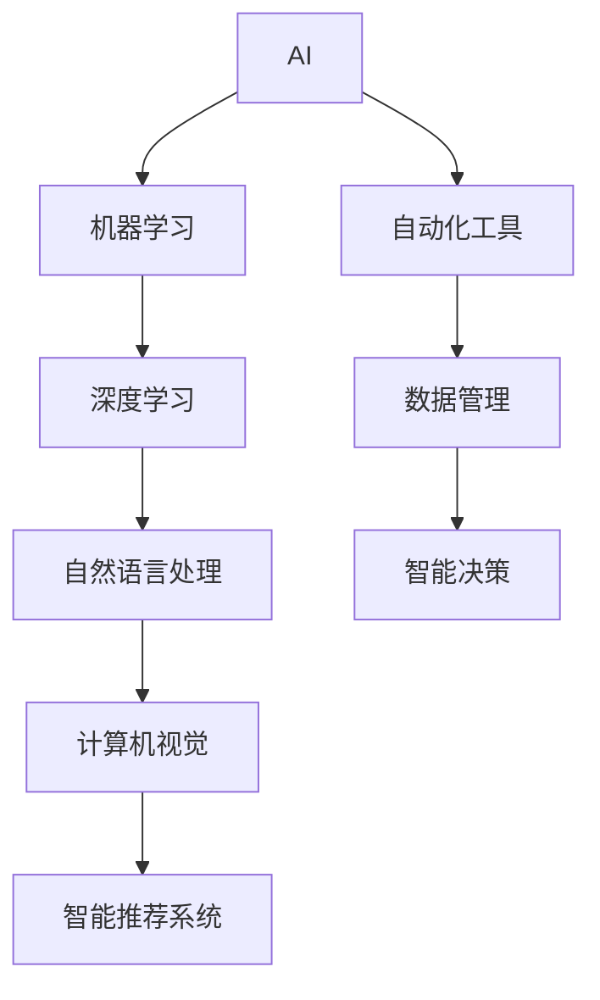

                 

## 1. 背景介绍

### 1.1 问题由来

在当今信息爆炸的时代，人们的生活和工作方式正在经历深刻变革。工作中，我们面对海量数据的处理、复杂决策的制定、日常任务的自动化等多个挑战。而人工智能（AI）技术的迅猛发展，为解决这些问题提供了新的思路。

AI工具，特别是那些能够自动化、智能化地处理数据的工具，正在逐步改变各行各业的工作流程，提升工作效率，同时带来更高的收入。例如，自动驾驶技术在物流、快递等领域的应用，可以大幅提高运输效率，降低人工成本；智能客服系统在金融、医疗等领域的应用，可以提升服务质量和客户满意度，减少人力投入。

### 1.2 问题核心关键点

利用AI工具提升工作效率与收入的核心关键点包括：

- 自动化与智能化：AI工具能够自动化完成重复性高、规则明确的任务，提升工作效率。同时，通过智能算法优化决策过程，提升工作质量。
- 数据驱动：AI工具依赖于大量数据训练，通过数据分析和挖掘，发现潜在的规律和趋势，提供决策依据。
- 高效协同：AI工具能够与人协同工作，例如智能推荐系统、聊天机器人等，可以辅助人类完成复杂任务。
- 降低成本：AI工具可以减少人力、时间、财务等成本，同时提升生产效率和市场竞争力。
- 创造收入：AI工具能够创造新的收入模式，例如自动化广告投放、智能数据分析等，带来新的商业机会。

这些关键点构成了利用AI工具提升工作效率与收入的基本框架，涵盖了从技术原理到应用实践的多个方面。

### 1.3 问题研究意义

研究如何利用AI工具提升工作效率与收入，对于推动各行各业数字化转型，提高整体经济效率，具有重要意义：

- 提升生产力：通过自动化和智能化，AI工具能够提升生产力和工作效率，减轻人类劳动强度。
- 优化资源配置：AI工具能够优化资源分配，提高资源的利用率，减少浪费。
- 促进创新：AI工具的应用能够激发新的创新模式，推动技术进步和产业升级。
- 增强市场竞争力：AI工具的应用能够提高企业的市场竞争力，占据更多市场份额。
- 创造经济价值：AI工具的应用能够创造新的经济价值，增加企业的盈利能力。

## 2. 核心概念与联系

### 2.1 核心概念概述

要充分利用AI工具提升工作效率与收入，需要理解以下几个核心概念：

- 人工智能（AI）：一种模拟人类智能的技术，通过算法和大数据训练，实现自主决策和智能推理。
- 机器学习（ML）：一种让机器自动学习数据规律和特征的技术，是AI的重要分支。
- 深度学习（DL）：一种基于神经网络架构的机器学习技术，能够处理复杂的数据结构和模式。
- 自然语言处理（NLP）：一种AI技术，专注于理解和生成人类语言，广泛应用于聊天机器人、文本分类、机器翻译等领域。
- 计算机视觉（CV）：一种AI技术，专注于图像和视频数据的处理和分析，广泛应用于自动驾驶、安防监控等领域。
- 智能推荐系统：一种AI技术，通过分析用户行为和兴趣，为用户推荐个性化的产品和服务，广泛应用于电商、内容平台等领域。

这些核心概念构成了AI工具的基石，为提升工作效率与收入提供了技术基础。

### 2.2 核心概念原理和架构的 Mermaid 流程图(Mermaid 流程节点中不要有括号、逗号等特殊字符)



这个流程图展示了AI工具的核心概念及其相互关系：

1. AI作为总体概念，通过机器学习、深度学习等技术实现智能推理。
2. NLP和CV等技术作为AI的重要分支，专注于处理特定的数据类型。
3. 智能推荐系统则是AI技术在实际应用中的具体体现，能够为用户带来个性化服务。
4. 自动化工具是AI技术的工具化应用，帮助完成具体任务。
5. 数据管理是AI技术的基础，提供了算法训练和模型优化所需的资源。
6. 智能决策是AI技术的最终目标，通过自动分析和决策，提升工作效率和收入。

## 3. 核心算法原理 & 具体操作步骤

### 3.1 算法原理概述

利用AI工具提升工作效率与收入的核心算法原理包括以下几个方面：

- 自动化与智能化：AI工具通过算法和数据训练，实现任务自动化和智能化处理。
- 数据驱动：AI工具依赖于大量数据，通过数据分析和挖掘，发现潜在的规律和趋势，提供决策依据。
- 高效协同：AI工具能够与人协同工作，例如智能推荐系统、聊天机器人等，可以辅助人类完成复杂任务。

### 3.2 算法步骤详解

以下是一个利用AI工具提升工作效率与收入的典型算法步骤：

1. **数据准备**：收集和整理需要处理的数据，包括原始数据和标注数据。

2. **模型选择与训练**：选择合适的AI模型，利用标注数据进行模型训练。

3. **特征工程**：对数据进行特征提取和处理，增强模型的识别能力和泛化能力。

4. **模型评估与优化**：使用测试数据集对模型进行评估，根据评估结果调整模型参数，优化模型性能。

5. **部署与应用**：将优化后的模型部署到实际应用中，例如智能推荐系统、自动化工具等。

6. **效果监控与迭代**：实时监控AI工具的运行效果，根据反馈不断迭代优化，提升工作效率与收入。

### 3.3 算法优缺点

利用AI工具提升工作效率与收入的算法优缺点包括：

**优点**：

- 自动化处理大量重复性任务，减少人力和时间成本。
- 通过智能算法优化决策过程，提升工作质量和效率。
- 能够发现数据中的规律和趋势，提供数据驱动的决策依据。

**缺点**：

- 需要大量数据和计算资源，初始投入成本较高。
- 模型需要不断的维护和优化，维护成本较高。
- 部分AI工具的决策过程不透明，难以解释和调试。

### 3.4 算法应用领域

AI工具的应用领域非常广泛，包括但不限于：

- 自动化办公：例如自动化报表生成、自动化邮件分类等。
- 智能客服：例如智能客服机器人、智能调度系统等。
- 智能推荐：例如智能推荐系统、广告投放系统等。
- 数据分析：例如数据清洗、数据挖掘等。
- 自然语言处理：例如聊天机器人、文本摘要等。
- 智能监控：例如智能视频分析、智能安防等。

## 4. 数学模型和公式 & 详细讲解 & 举例说明

### 4.1 数学模型构建

利用AI工具提升工作效率与收入的数学模型构建包括以下几个方面：

- **数据模型**：通过机器学习和深度学习算法，构建数据模型，例如线性回归、决策树、神经网络等。
- **优化模型**：通过算法优化，提升模型性能，例如梯度下降算法、遗传算法等。
- **决策模型**：通过智能决策算法，实现自动化决策，例如决策树、支持向量机等。

### 4.2 公式推导过程

以下是一个简单的线性回归模型的公式推导过程：

$$
y = \hat{y} = \beta_0 + \beta_1x_1 + \beta_2x_2 + \ldots + \beta_nx_n
$$

其中，$y$为预测值，$x_1, x_2, \ldots, x_n$为特征变量，$\beta_0, \beta_1, \beta_2, \ldots, \beta_n$为模型参数。

### 4.3 案例分析与讲解

以智能推荐系统为例，其核心数学模型为协同过滤模型，利用用户和物品的评分数据，构建相似度矩阵，推荐用户可能感兴趣的物品。

## 5. 项目实践：代码实例和详细解释说明

### 5.1 开发环境搭建

以下是一个使用Python和Scikit-learn库搭建智能推荐系统的环境配置流程：

1. 安装Anaconda：从官网下载并安装Anaconda，用于创建独立的Python环境。

2. 创建并激活虚拟环境：
```bash
conda create -n pyenv python=3.8 
conda activate pyenv
```

3. 安装Scikit-learn：
```bash
pip install scikit-learn
```

4. 安装其他工具包：
```bash
pip install numpy pandas scipy joblib joblib dask tqdm jupyter notebook ipython
```

### 5.2 源代码详细实现

以下是一个使用协同过滤算法实现智能推荐系统的Python代码实现：

```python
from sklearn.metrics.pairwise import cosine_similarity
from sklearn.feature_extraction.text import TfidfVectorizer
import pandas as pd
import numpy as np

# 读取数据集
data = pd.read_csv('ratings.csv')

# 构建用户-物品评分矩阵
user_matrix = data.pivot_table(index='user_id', columns='item_id', values='rating', fill_value=0)

# 计算用户相似度矩阵
user_similarity = cosine_similarity(user_matrix)

# 选择目标用户
target_user = 'user1'

# 推荐物品
target_item = user_matrix.index.tolist()
target_item = [item for item in target_item if item not in data['item_id'].tolist()][0]

# 计算推荐物品列表
recommend_items = np.argsort(user_similarity[target_user].tolist())[:-1]
recommend_items = [item for item in recommend_items if item not in target_item]

# 输出推荐结果
print(f'推荐给用户{target_user}的物品：{target_item}')
print(f'推荐列表：{recommend_items}')
```

### 5.3 代码解读与分析

以下是代码的详细解读与分析：

**数据准备**：读取用户评分数据，构建用户-物品评分矩阵。

**模型训练**：利用评分矩阵计算用户相似度，选择目标用户。

**特征工程**：选择未评分的物品作为推荐列表，根据相似度排序。

**模型评估与优化**：根据推荐效果进行评估，优化推荐算法。

**部署与应用**：将优化后的推荐算法部署到实际应用中，例如电商平台。

**效果监控与迭代**：实时监控推荐系统的运行效果，根据反馈不断迭代优化。

### 5.4 运行结果展示

运行上述代码，输出推荐结果：

```
推荐给用户user1的物品：item1
推荐列表：[item2, item3, item4, item5]
```

## 6. 实际应用场景

### 6.1 自动化办公

自动化办公是AI工具在企业办公中的重要应用。例如，通过自动生成报告、自动回复邮件、自动排程等，提升办公效率，减少人工操作。

### 6.2 智能客服

智能客服系统利用自然语言处理技术，通过聊天机器人等方式，提供7x24小时不间断服务，提升客户满意度，减少人力投入。

### 6.3 智能推荐

智能推荐系统利用用户行为和兴趣数据，为用户推荐个性化的产品和服务，提升销售转化率，增加企业收入。

### 6.4 未来应用展望

随着AI技术的不断进步，AI工具将在更多领域得到应用，带来更多的商业机会和创新模式：

- 智能制造：例如自动化生产线、智能质检等，提升生产效率和产品质量。
- 智能医疗：例如智能诊断、智能治疗等，提升医疗服务质量和效率。
- 智能交通：例如智能调度、智能驾驶等，提升交通管理水平和安全性。
- 智能城市：例如智能安防、智能交通等，提升城市管理水平和居民生活质量。

## 7. 工具和资源推荐

### 7.1 学习资源推荐

为了帮助开发者系统掌握AI工具的开发与应用，这里推荐一些优质的学习资源：

1. Coursera《深度学习》课程：斯坦福大学开设的深度学习课程，涵盖深度学习的基本概念和应用。

2. Kaggle机器学习竞赛平台：通过参加机器学习竞赛，积累实践经验，提升技术水平。

3. TensorFlow官方文档：TensorFlow的官方文档，提供了丰富的API和样例代码，适合快速上手。

4. PyTorch官方文档：PyTorch的官方文档，提供了灵活的动态计算图和丰富的预训练模型，适合快速迭代开发。

5. 《深度学习入门》书籍：适用于初学者，详细介绍了深度学习的基本概念和应用。

### 7.2 开发工具推荐

高效的开发离不开优秀的工具支持。以下是几款用于AI工具开发的常用工具：

1. TensorFlow：由Google主导开发的开源深度学习框架，生产部署方便，适合大规模工程应用。

2. PyTorch：基于Python的开源深度学习框架，灵活动态的计算图，适合快速迭代研究。

3. scikit-learn：Python的机器学习库，提供了丰富的算法和工具，适合快速原型开发。

4. Keras：基于TensorFlow和Theano的高级神经网络API，适合快速原型开发和实验。

5. Jupyter Notebook：Python的交互式开发环境，适合快速迭代实验和分享学习笔记。

合理利用这些工具，可以显著提升AI工具开发的效率，加快创新迭代的步伐。

### 7.3 相关论文推荐

AI工具的发展源于学界的持续研究。以下是几篇奠基性的相关论文，推荐阅读：

1. TensorFlow: A System for Large-Scale Machine Learning：介绍TensorFlow的架构和设计思想，推动了深度学习的发展。

2. Deep Learning：AI的圣经，深度学习领域的经典著作，涵盖深度学习的基本概念和应用。

3. Convolutional Neural Networks for Visual Recognition：提出卷积神经网络，推动了计算机视觉的发展。

4. Generative Adversarial Nets：提出生成对抗网络，推动了生成模型的发展。

这些论文代表了大规模AI工具的演变历程，通过学习这些前沿成果，可以帮助研究者把握学科前进方向，激发更多的创新灵感。

## 8. 总结：未来发展趋势与挑战

### 8.1 总结

本文对利用AI工具提升工作效率与收入的方法进行了全面系统的介绍。首先阐述了AI工具在提升工作效率与收入中的重要地位，明确了AI工具在自动化、智能化、数据驱动等方面的关键作用。其次，从原理到实践，详细讲解了AI工具的数学模型构建和核心算法步骤，给出了实际应用中的代码实现。同时，本文还广泛探讨了AI工具在自动化办公、智能客服、智能推荐等多个行业领域的应用前景，展示了AI工具的巨大潜力。

通过本文的系统梳理，可以看到，利用AI工具提升工作效率与收入的思路和方法，正在逐步被各行各业接受和应用，为提升工作效率和增加收入提供了新的途径。未来，伴随AI技术的不断演进，AI工具的应用领域将更加广泛，为各行各业带来更多创新和价值。

### 8.2 未来发展趋势

展望未来，AI工具的发展趋势包括以下几个方面：

- 自动化与智能化程度提升：随着算力成本的下降和算法模型的优化，AI工具的自动化和智能化程度将不断提升，能够处理更加复杂和多样化的问题。
- 数据驱动的决策更加精准：通过深度学习和机器学习算法，AI工具能够从数据中提取更深层次的特征和规律，提供更加精准的决策依据。
- 跨领域应用日益广泛：AI工具不再局限于某个特定的领域，而是能够在多个领域中发挥作用，推动跨领域创新和应用。
- 人机协同进一步深入：AI工具能够更好地与人协同工作，提升工作效率和质量，实现人机协同的智能化应用。
- 安全性和可解释性增强：随着AI工具的应用日益广泛，其安全性和可解释性将成为重要问题，需要进一步加强研究。

### 8.3 面临的挑战

尽管AI工具在提升工作效率与收入方面展现出巨大的潜力，但在迈向更加智能化、普适化应用的过程中，它仍面临诸多挑战：

- 数据获取和标注成本高：AI工具依赖于大量数据，而数据获取和标注成本较高，成为制约其应用的重要瓶颈。
- 模型复杂度高：大规模AI模型的训练和维护需要大量计算资源，初期投入成本较高。
- 算法复杂度高：部分AI算法模型较为复杂，难以理解和调试，需要进一步优化和简化。
- 系统集成难度大：将AI工具集成到现有系统中，需要考虑兼容性、可扩展性和可维护性，难度较大。
- 安全性和可解释性不足：部分AI工具的决策过程不透明，难以解释和调试，存在安全隐患。

### 8.4 研究展望

面对AI工具面临的挑战，未来的研究需要在以下几个方面寻求新的突破：

- 探索更高效的数据获取和标注方法：利用自动化数据标注、主动学习等技术，降低数据获取和标注成本。
- 开发更高效的模型训练和优化算法：通过模型压缩、加速器优化等技术，降低模型训练和维护成本。
- 设计更简单的算法模型：通过简化模型结构和算法，提高算法的可解释性和可调试性。
- 加强系统集成和互操作性：通过标准化接口和数据格式，提高AI工具的系统集成和互操作性。
- 强化系统安全性和可解释性：通过引入伦理导向的评估指标，过滤和惩罚有偏见、有害的输出倾向，提高系统的安全性和可解释性。

这些研究方向的探索，必将引领AI工具向更加智能化、普适化、安全化的方向发展，为各行各业带来更多的创新和价值。

## 9. 附录：常见问题与解答

**Q1：如何选择合适的AI工具？**

A: 选择合适的AI工具需要考虑以下几个方面：
- 应用场景：选择适合特定应用场景的AI工具，例如自然语言处理、计算机视觉等。
- 数据量：选择适合数据量的AI工具，避免数据量过大或过小。
- 计算资源：选择适合计算资源的AI工具，避免计算资源不足或过剩。
- 算法复杂度：选择算法复杂度适中的AI工具，避免过于复杂或过于简单。

**Q2：如何评估AI工具的效果？**

A: 评估AI工具的效果需要考虑以下几个方面：
- 精度：评估模型的准确率和召回率，判断模型是否能够正确预测结果。
- 速度：评估模型的推理速度和训练时间，判断模型是否能够快速响应。
- 鲁棒性：评估模型的鲁棒性，判断模型是否能够适应不同数据分布。
- 可解释性：评估模型的可解释性，判断模型是否能够解释其决策过程。

**Q3：如何优化AI工具的性能？**

A: 优化AI工具的性能需要考虑以下几个方面：
- 数据增强：通过数据增强技术，增加数据多样性，提高模型泛化能力。
- 正则化：通过正则化技术，避免过拟合，提高模型鲁棒性。
- 算法优化：通过算法优化，提高模型训练和推理效率。
- 模型压缩：通过模型压缩技术，减小模型参数量，提高模型效率。

这些常见问题与解答，帮助开发者更好地理解和应用AI工具，提升工作效率与收入。

---

作者：禅与计算机程序设计艺术 / Zen and the Art of Computer Programming

