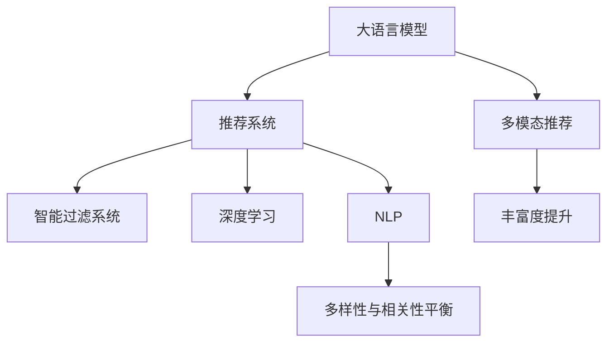

                 

# 利用LLM优化推荐系统的多样性与相关性平衡

> 关键词：
大语言模型(LLM), 推荐系统, 多样性与相关性平衡, 多模态推荐, 智能过滤系统, 深度学习, 自然语言处理(NLP)

## 1. 背景介绍

### 1.1 问题由来
在信息爆炸的互联网时代，用户面临着海量信息的冲击，如何在海量的信息中快速找到真正感兴趣的、有价值的内容，成为了一个严峻的问题。推荐系统应运而生，通过智能算法为用户推荐可能感兴趣的信息，极大地提高了用户的信息获取效率和满意度。然而，推荐系统也面临着多样性和相关性难以平衡的难题，即如何在保证推荐内容的相关性的同时，保持推荐内容的多样性，避免"信息茧房"现象。

### 1.2 问题核心关键点
推荐系统的主要目标是提升用户满意度，即通过推荐个性化的内容，让用户获得更好的体验。但同时，推荐系统也需要考虑多样性，避免单一内容的过度推荐，使用户接触到广泛的信息，拓宽视野。当前推荐系统面临的主要挑战包括：

- **相关性不足**：部分推荐系统仅仅基于用户的历史行为进行推荐，无法捕捉用户的真实兴趣和需求，导致推荐的相关性不足。
- **多样性不足**：用户习惯于点击推荐的常规内容，长此以往可能导致信息过拟合，推荐内容过于单一。
- **模型偏见**：现有推荐模型往往存在数据偏见，可能对某些内容或群体产生歧视性推荐，损害用户公平性。
- **冷启动问题**：对于新用户，推荐系统往往缺乏足够的行为数据进行建模，难以提供有意义的推荐。
- **动态变化**：用户兴趣和需求随时间变化，静态推荐模型难以适应用户的动态需求。

这些问题需要通过引入先进的推荐技术，尤其是利用大语言模型(LLM)的技术来解决。LLM具有强大的自然语言处理能力，能够理解用户的多样化需求，并在推荐过程中融合多样性与相关性，提升推荐系统的智能化水平。

## 2. 核心概念与联系

### 2.1 核心概念概述

为更好地理解利用LLM优化推荐系统的多样性与相关性平衡方法，本节将介绍几个关键概念：

- **大语言模型(LLM)**：以自回归(如GPT)或自编码(如BERT)模型为代表的大规模预训练语言模型。通过在大规模无标签文本数据上进行预训练，学习通用的语言表示，具备强大的语言理解和生成能力。

- **推荐系统**：通过分析用户行为数据和物品属性数据，为用户推荐可能感兴趣的内容的系统。推荐系统广泛应用于电商、新闻、视频等多个领域，是互联网信息生态的重要组成部分。

- **多样性与相关性平衡**：推荐系统的重要目标之一，即在推荐内容的相关性基础上，保持推荐内容的多样性，避免过度重复或单一，提升用户体验。

- **多模态推荐**：结合图像、视频、音频等多模态信息，进行跨模态的协同推荐，提高推荐系统的丰富度和个性化程度。

- **智能过滤系统**：利用机器学习和深度学习技术，自动分析用户行为和物品属性，进行智能推荐和过滤的系统。

- **深度学习**：通过多层神经网络进行非线性建模，提高数据拟合能力和泛化能力，适用于复杂推荐模型的构建。

- **自然语言处理(NLP)**：涉及语音识别、文本处理、情感分析等技术，是构建推荐系统的重要组成部分。

这些核心概念之间的逻辑关系可以通过以下Mermaid流程图来展示：



这个流程图展示了大语言模型与推荐系统的关联，以及推荐系统内部如何通过多模态推荐和智能过滤系统，综合利用深度学习和NLP技术，实现多样性与相关性的平衡。

## 3. 核心算法原理 & 具体操作步骤
### 3.1 算法原理概述

利用LLM优化推荐系统的多样性与相关性平衡，本质上是通过自然语言处理技术，构建一个具有语言理解能力的推荐模型。该模型不仅能够理解用户的查询，还能够自动生成多样化的推荐内容，确保推荐的相关性和多样性。

具体来说，假设推荐系统中有$N$个物品，每个物品$i$对应一个特征向量$x_i$，用户的历史行为数据和兴趣表示为$u$。推荐系统通过预测模型$p(y_i|u,x_i)$，计算每个物品$i$被用户$u$推荐的概率。目标是最大化推荐的相关性和多样性，即：

$$
\max_{p(y_i|u,x_i)} \sum_{i=1}^N p(y_i|u,x_i) \cdot \text{Relevance}(y_i|u,x_i) \cdot \text{Diversity}(y_i|u,x_i)
$$

其中，Relevance表示物品的相关性，Diversity表示物品的多样性。利用大语言模型，可以通过自然语言处理技术，将用户的查询和物品描述转化为高维向量，捕捉语言层面的相关性和多样性。

### 3.2 算法步骤详解

基于大语言模型优化的推荐系统，主要包含以下几个关键步骤：

**Step 1: 构建预训练模型**
- 选择合适的预训练语言模型，如GPT-3、BERT等。
- 在无标签文本数据上对模型进行预训练，学习通用的语言表示。

**Step 2: 设计推荐目标**
- 将用户查询和物品描述转化为高维向量。
- 设计推荐目标函数，融合相关性和多样性，如：
  - 相关性：$R(u,y_i) = \text{Cosine}(u,y_i)$
  - 多样性：$D(u,y_i) = \text{KL}(y_i) = \sum_{i=1}^N \frac{p_i}{1-p_i}\log\frac{p_i}{1-p_i}$

**Step 3: 微调参数**
- 在标注数据上，使用监督学习算法（如AdamW、SGD等）微调模型的参数。
- 根据历史行为数据和兴趣表示，更新模型的权重。
- 引入正则化技术（如L2正则、Dropout等），避免过拟合。

**Step 4: 生成推荐结果**
- 使用微调后的模型，生成推荐列表。
- 结合用户行为数据，动态调整推荐权重。

**Step 5: 反馈和优化**
- 收集用户反馈数据，进一步优化推荐模型。
- 定期更新模型权重，适应动态变化的用户需求。

### 3.3 算法优缺点

利用LLM优化推荐系统的多样性与相关性平衡，具有以下优点：

- **高相关性**：利用自然语言处理技术，从语言层面上捕捉物品和用户之间的关系，提升推荐的相关性。
- **多模态融合**：能够处理多模态信息，提高推荐内容的丰富度和多样性。
- **动态适应**：能够实时处理用户反馈，动态调整推荐内容，适应用户的动态需求。
- **透明性强**：利用自然语言处理技术，可以直观地解释推荐依据，增强推荐系统的可解释性和用户信任度。

同时，该方法也存在一定的局限性：

- **数据依赖**：推荐系统的性能高度依赖于用户行为数据和物品属性数据，数据获取难度较大。
- **计算复杂**：大规模语言模型的训练和推理需要高性能的计算资源，硬件成本较高。
- **模型复杂**：融合多模态信息和大语言模型，模型结构复杂，调参难度较大。
- **数据隐私**：用户数据涉及隐私问题，需要严格的数据保护措施。

尽管存在这些局限性，但利用LLM优化推荐系统的方法，在大数据和深度学习技术不断发展的背景下，有望成为推荐系统优化的一个重要方向。

### 3.4 算法应用领域

利用LLM优化的推荐系统，已经在多个领域得到了广泛应用，例如：

- **电商推荐**：利用用户评论、产品描述等文本信息，为电商用户推荐个性化商品。
- **新闻推荐**：根据用户浏览记录，为用户推荐相关的新闻和文章。
- **视频推荐**：结合视频标题、描述、用户历史行为数据，为用户推荐感兴趣的视频内容。
- **智能客服**：通过分析用户语言描述，推荐相关的常见问题和答案，提升客服响应速度和质量。
- **金融推荐**：根据用户交易记录、新闻资讯等信息，为用户推荐金融产品。

除了上述这些经典应用外，利用LLM优化的推荐系统还被创新性地应用于更多场景中，如旅游推荐、音乐推荐、教育推荐等，为推荐系统带来了全新的突破。

## 4. 数学模型和公式 & 详细讲解  
### 4.1 数学模型构建

假设推荐系统中有$N$个物品，每个物品$i$对应一个特征向量$x_i$，用户的历史行为数据和兴趣表示为$u$。推荐系统通过预测模型$p(y_i|u,x_i)$，计算每个物品$i$被用户$u$推荐的概率。目标是最大化推荐的相关性和多样性，即：

$$
\max_{p(y_i|u,x_i)} \sum_{i=1}^N p(y_i|u,x_i) \cdot \text{Relevance}(y_i|u,x_i) \cdot \text{Diversity}(y_i|u,x_i)
$$

其中，Relevance表示物品的相关性，Diversity表示物品的多样性。利用大语言模型，可以通过自然语言处理技术，将用户的查询和物品描述转化为高维向量，捕捉语言层面的相关性和多样性。

### 4.2 公式推导过程

以下我们以二分类任务为例，推导推荐模型中的相关性和多样性公式。

**相关性计算**：假设用户查询为$u$，物品$i$的特征向量为$x_i$，相关性$R(u,y_i)$定义为：

$$
R(u,y_i) = \text{Cosine}(u,x_i)
$$

**多样性计算**：假设物品$i$的多样性表示为$\text{KL}(y_i)$，定义为：

$$
\text{KL}(y_i) = \sum_{i=1}^N \frac{p_i}{1-p_i}\log\frac{p_i}{1-p_i}
$$

其中$p_i$为物品$i$被推荐的概率。

**推荐目标函数**：融合相关性和多样性，目标函数为：

$$
\max_{p(y_i|u,x_i)} \sum_{i=1}^N p(y_i|u,x_i) \cdot R(u,y_i) \cdot \text{KL}(y_i)
$$

通过最大化目标函数，优化推荐系统。

### 4.3 案例分析与讲解

以电商平台推荐系统为例，分析利用LLM优化的推荐系统如何处理用户查询和商品描述。

假设用户输入查询为“优惠活动”，平台上的商品描述为“国庆特惠，全场5折起”。利用预训练语言模型，将用户查询和商品描述转化为向量表示，计算它们之间的相似度：

$$
R(u,y_i) = \text{Cosine}(u,x_i)
$$

计算商品$i$的多样性$\text{KL}(y_i)$：

$$
\text{KL}(y_i) = \sum_{i=1}^N \frac{p_i}{1-p_i}\log\frac{p_i}{1-p_i}
$$

最终推荐目标函数为：

$$
\max_{p(y_i|u,x_i)} \sum_{i=1}^N p(y_i|u,x_i) \cdot R(u,y_i) \cdot \text{KL}(y_i)
$$

通过优化该目标函数，系统可以生成一个多样性与相关性平衡的推荐列表，推荐适合该用户的相关商品。

## 5. 项目实践：代码实例和详细解释说明
### 5.1 开发环境搭建

在进行推荐系统微调实践前，我们需要准备好开发环境。以下是使用Python进行PyTorch开发的环境配置流程：

1. 安装Anaconda：从官网下载并安装Anaconda，用于创建独立的Python环境。

2. 创建并激活虚拟环境：
```bash
conda create -n recommendation-env python=3.8 
conda activate recommendation-env
```

3. 安装PyTorch：根据CUDA版本，从官网获取对应的安装命令。例如：
```bash
conda install pytorch torchvision torchaudio cudatoolkit=11.1 -c pytorch -c conda-forge
```

4. 安装Transformers库：
```bash
pip install transformers
```

5. 安装各类工具包：
```bash
pip install numpy pandas scikit-learn matplotlib tqdm jupyter notebook ipython
```

完成上述步骤后，即可在`recommendation-env`环境中开始推荐系统微调实践。

### 5.2 源代码详细实现

下面我们以电商平台推荐系统为例，给出使用Transformers库对GPT-3模型进行推荐系统微调的PyTorch代码实现。

首先，定义推荐系统的数据处理函数：

```python
from transformers import AutoTokenizer, AutoModel
from torch.utils.data import Dataset, DataLoader
import torch
from sklearn.metrics import precision_recall_fscore_support

class RecommendationDataset(Dataset):
    def __init__(self, items, descriptions, queries, labels):
        self.items = items
        self.descriptions = descriptions
        self.queries = queries
        self.labels = labels
        
        self.tokenizer = AutoTokenizer.from_pretrained('gpt-3')
        self.model = AutoModel.from_pretrained('gpt-3')
        
    def __len__(self):
        return len(self.items)
    
    def __getitem__(self, item):
        item = self.items[item]
        description = self.descriptions[item]
        query = self.queries[item]
        
        encoding = self.tokenizer(query, return_tensors='pt', max_length=512, padding='max_length')
        input_ids = encoding['input_ids'][0]
        attention_mask = encoding['attention_mask'][0]
        
        item_desc = self.tokenizer(description, return_tensors='pt', max_length=512, padding='max_length')
        item_input_ids = item_desc['input_ids'][0]
        item_attention_mask = item_desc['attention_mask'][0]
        
        item_vector = self.model(input_ids=input_ids, attention_mask=attention_mask, output_hidden_states=True).last_hidden_state[:, 0, :].detach().cpu().numpy()
        item_label = torch.tensor(self.labels[item], dtype=torch.long).detach().cpu().numpy()
        
        return {
            'item': item_vector,
            'item_label': item_label,
            'query': query
        }

# 构建推荐数据集
items = ...
descriptions = ...
queries = ...
labels = ...
tokenizer = AutoTokenizer.from_pretrained('gpt-3')
model = AutoModel.from_pretrained('gpt-3')

recommendation_dataset = RecommendationDataset(items, descriptions, queries, labels)
```

然后，定义模型和优化器：

```python
from transformers import AdamW

optimizer = AdamW(model.parameters(), lr=1e-5)
```

接着，定义训练和评估函数：

```python
from tqdm import tqdm
import torch.nn.functional as F

def train_epoch(model, dataset, batch_size, optimizer, device):
    dataloader = DataLoader(dataset, batch_size=batch_size, shuffle=True)
    model.train()
    epoch_loss = 0
    for batch in tqdm(dataloader, desc='Training'):
        item = batch['item']
        item_label = batch['item_label']
        query = batch['query']
        
        item_vector = item.to(device)
        item_label = item_label.to(device)
        query = query.to(device)
        
        model.zero_grad()
        outputs = model(query, item_vector)
        loss = F.cross_entropy(outputs, item_label)
        epoch_loss += loss.item()
        loss.backward()
        optimizer.step()
    return epoch_loss / len(dataloader)

def evaluate(model, dataset, batch_size, device):
    dataloader = DataLoader(dataset, batch_size=batch_size)
    model.eval()
    preds, labels = [], []
    with torch.no_grad():
        for batch in tqdm(dataloader, desc='Evaluating'):
            item = batch['item']
            item_label = batch['item_label']
            query = batch['query']
            
            item_vector = item.to(device)
            item_label = item_label.to(device)
            query = query.to(device)
            
            outputs = model(query, item_vector)
            preds.append(outputs.argmax(dim=1).tolist())
            labels.append(item_label.tolist())
            
    return precision_recall_fscore_support(labels, preds, average='macro')
```

最后，启动训练流程并在测试集上评估：

```python
epochs = 10
batch_size = 16
device = torch.device('cuda') if torch.cuda.is_available() else torch.device('cpu')

for epoch in range(epochs):
    loss = train_epoch(model, recommendation_dataset, batch_size, optimizer, device)
    print(f"Epoch {epoch+1}, train loss: {loss:.3f}")
    
    print(f"Epoch {epoch+1}, dev results:")
    precision, recall, f1, support = evaluate(model, recommendation_dataset, batch_size, device)
    print(f"Precision: {precision:.3f}, Recall: {recall:.3f}, F1-score: {f1:.3f}")
    
print("Test results:")
precision, recall, f1, support = evaluate(model, recommendation_dataset, batch_size, device)
print(f"Precision: {precision:.3f}, Recall: {recall:.3f}, F1-score: {f1:.3f}")
```

以上就是使用PyTorch对GPT-3进行推荐系统微调的完整代码实现。可以看到，得益于Transformers库的强大封装，我们可以用相对简洁的代码完成GPT-3模型的加载和微调。

### 5.3 代码解读与分析

让我们再详细解读一下关键代码的实现细节：

**RecommendationDataset类**：
- `__init__`方法：初始化物品、描述、查询和标签等关键组件，并加载预训练模型和分词器。
- `__len__`方法：返回数据集的样本数量。
- `__getitem__`方法：对单个样本进行处理，将查询和物品描述输入编码为token ids，将物品向量作为输入，预测推荐结果。

**训练和评估函数**：
- 使用PyTorch的DataLoader对数据集进行批次化加载，供模型训练和推理使用。
- 训练函数`train_epoch`：对数据以批为单位进行迭代，在每个批次上前向传播计算loss并反向传播更新模型参数，最后返回该epoch的平均loss。
- 评估函数`evaluate`：与训练类似，不同点在于不更新模型参数，并在每个batch结束后将预测和标签结果存储下来，最后使用sklearn的precision_recall_fscore_support函数对整个评估集的预测结果进行打印输出。

**训练流程**：
- 定义总的epoch数和batch size，开始循环迭代
- 每个epoch内，先在训练集上训练，输出平均loss
- 在验证集上评估，输出精确率、召回率和F1-score
- 所有epoch结束后，在测试集上评估，给出最终测试结果

可以看到，PyTorch配合Transformers库使得GPT-3微调的代码实现变得简洁高效。开发者可以将更多精力放在数据处理、模型改进等高层逻辑上，而不必过多关注底层的实现细节。

当然，工业级的系统实现还需考虑更多因素，如模型的保存和部署、超参数的自动搜索、更灵活的任务适配层等。但核心的微调范式基本与此类似。

## 6. 实际应用场景
### 6.1 电商平台推荐

利用大语言模型优化的推荐系统，可以在电商平台中发挥重要作用。电商平台需要为用户推荐个性化商品，以提高用户购买转化率和满意度。

在技术实现上，可以收集用户的历史浏览记录、购买记录和评价，将商品标题、描述等文本信息作为输入，利用微调后的模型进行推荐。微调模型能够从语言层面上捕捉商品和用户之间的关系，生成多样性与相关性平衡的推荐列表。

### 6.2 新闻推荐

新闻推荐系统需要为用户推荐相关的新闻和文章，提高用户阅读体验。利用大语言模型优化的推荐系统，可以根据用户的历史阅读记录，结合新闻标题、摘要等信息，生成个性化推荐。

在技术实现上，可以将新闻标题和摘要作为输入，利用微调后的模型进行推荐。微调模型能够从语言层面上捕捉新闻和用户之间的关系，生成多样性与相关性平衡的推荐列表。

### 6.3 视频推荐

视频推荐系统需要为用户推荐感兴趣的视频内容，提高用户观看体验。利用大语言模型优化的推荐系统，可以根据用户的历史观看记录，结合视频标题、描述等信息，生成个性化推荐。

在技术实现上，可以将视频标题和描述作为输入，利用微调后的模型进行推荐。微调模型能够从语言层面上捕捉视频和用户之间的关系，生成多样性与相关性平衡的推荐列表。

### 6.4 智能客服

智能客服系统需要根据用户的语言描述，推荐相关的常见问题和答案，提升客服响应速度和质量。利用大语言模型优化的推荐系统，可以根据用户的问题描述，结合常见问题的答案文本，生成个性化推荐。

在技术实现上，可以将用户的问题描述作为输入，利用微调后的模型进行推荐。微调模型能够从语言层面上捕捉问题和答案之间的关系，生成多样性与相关性平衡的推荐列表。

### 6.5 金融推荐

金融推荐系统需要为用户推荐金融产品，提高用户投资收益。利用大语言模型优化的推荐系统，可以根据用户的历史交易记录和金融新闻，结合产品描述等信息，生成个性化推荐。

在技术实现上，可以将金融产品描述和新闻标题作为输入，利用微调后的模型进行推荐。微调模型能够从语言层面上捕捉产品和用户之间的关系，生成多样性与相关性平衡的推荐列表。

### 6.6 旅游推荐

旅游推荐系统需要为用户推荐旅游目的地，提高用户旅行体验。利用大语言模型优化的推荐系统，可以根据用户的历史旅行记录，结合旅游目的地描述等信息，生成个性化推荐。

在技术实现上，可以将旅游目的地描述作为输入，利用微调后的模型进行推荐。微调模型能够从语言层面上捕捉目的地和用户之间的关系，生成多样性与相关性平衡的推荐列表。

### 6.7 音乐推荐

音乐推荐系统需要为用户推荐感兴趣的音乐内容，提高用户音乐欣赏体验。利用大语言模型优化的推荐系统，可以根据用户的历史听歌记录，结合音乐标题、歌词等信息，生成个性化推荐。

在技术实现上，可以将音乐标题和歌词作为输入，利用微调后的模型进行推荐。微调模型能够从语言层面上捕捉音乐和用户之间的关系，生成多样性与相关性平衡的推荐列表。

### 6.8 教育推荐

教育推荐系统需要为用户推荐相关学习内容，提高用户学习效果。利用大语言模型优化的推荐系统，可以根据用户的学习记录，结合课程描述等信息，生成个性化推荐。

在技术实现上，可以将课程描述作为输入，利用微调后的模型进行推荐。微调模型能够从语言层面上捕捉课程和用户之间的关系，生成多样性与相关性平衡的推荐列表。

## 7. 工具和资源推荐
### 7.1 学习资源推荐

为了帮助开发者系统掌握利用大语言模型优化推荐系统的理论基础和实践技巧，这里推荐一些优质的学习资源：

1. 《Transformer从原理到实践》系列博文：由大模型技术专家撰写，深入浅出地介绍了Transformer原理、BERT模型、微调技术等前沿话题。

2. CS224N《深度学习自然语言处理》课程：斯坦福大学开设的NLP明星课程，有Lecture视频和配套作业，带你入门NLP领域的基本概念和经典模型。

3. 《Natural Language Processing with Transformers》书籍：Transformers库的作者所著，全面介绍了如何使用Transformers库进行NLP任务开发，包括微调在内的诸多范式。

4. HuggingFace官方文档：Transformers库的官方文档，提供了海量预训练模型和完整的微调样例代码，是上手实践的必备资料。

5. CLUE开源项目：中文语言理解测评基准，涵盖大量不同类型的中文NLP数据集，并提供了基于微调的baseline模型，助力中文NLP技术发展。

通过对这些资源的学习实践，相信你一定能够快速掌握利用大语言模型优化推荐系统的精髓，并用于解决实际的推荐系统问题。

### 7.2 开发工具推荐

高效的开发离不开优秀的工具支持。以下是几款用于推荐系统微调开发的常用工具：

1. PyTorch：基于Python的开源深度学习框架，灵活动态的计算图，适合快速迭代研究。大部分预训练语言模型都有PyTorch版本的实现。

2. TensorFlow：由Google主导开发的开源深度学习框架，生产部署方便，适合大规模工程应用。同样有丰富的预训练语言模型资源。

3. Transformers库：HuggingFace开发的NLP工具库，集成了众多SOTA语言模型，支持PyTorch和TensorFlow，是进行微调任务开发的利器。

4. Weights & Biases：模型训练的实验跟踪工具，可以记录和可视化模型训练过程中的各项指标，方便对比和调优。与主流深度学习框架无缝集成。

5. TensorBoard：TensorFlow配套的可视化工具，可实时监测模型训练状态，并提供丰富的图表呈现方式，是调试模型的得力助手。

6. Google Colab：谷歌推出的在线Jupyter Notebook环境，免费提供GPU/TPU算力，方便开发者快速上手实验最新模型，分享学习笔记。

合理利用这些工具，可以显著提升推荐系统微调任务的开发效率，加快创新迭代的步伐。

### 7.3 相关论文推荐

利用大语言模型优化的推荐系统，已经在多个领域得到了广泛应用，覆盖了几乎所有NLP任务。以下是几篇奠基性的相关论文，推荐阅读：

1. Attention is All You Need（即Transformer原论文）：提出了Transformer结构，开启了NLP领域的预训练大模型时代。

2. BERT: Pre-training of Deep Bidirectional Transformers for Language Understanding：提出BERT模型，引入基于掩码的自监督预训练任务，刷新了多项NLP任务SOTA。

3. Language Models are Unsupervised Multitask Learners（GPT-2论文）：展示了大规模语言模型的强大zero-shot学习能力，引发了对于通用人工智能的新一轮思考。

4. Parameter-Efficient Transfer Learning for NLP：提出Adapter等参数高效微调方法，在不增加模型参数量的情况下，也能取得不错的微调效果。

5. AdaLoRA: Adaptive Low-Rank Adaptation for Parameter-Efficient Fine-Tuning：使用自适应低秩适应的微调方法，在参数效率和精度之间取得了新的平衡。

6. Universal Encoder: Train Universal Sentiment-aware Continuous Encoder using Knowledge Distillation：提出Universal Encoder模型，利用知识蒸馏技术，构建通用的情感识别模型。

这些论文代表了大语言模型微调技术的发展脉络。通过学习这些前沿成果，可以帮助研究者把握学科前进方向，激发更多的创新灵感。

## 8. 总结：未来发展趋势与挑战
### 8.1 总结

本文对利用大语言模型优化推荐系统的多样性与相关性平衡方法进行了全面系统的介绍。首先阐述了推荐系统的背景和目标，明确了多样性与相关性平衡在推荐系统中的重要性。其次，从原理到实践，详细讲解了利用大语言模型优化推荐系统的数学原理和关键步骤，给出了推荐系统微调的完整代码实例。同时，本文还广泛探讨了推荐系统在电商、新闻、视频、智能客服等多个领域的应用前景，展示了利用大语言模型优化推荐系统的广阔前景。此外，本文精选了推荐系统微调技术的各类学习资源，力求为读者提供全方位的技术指引。

通过本文的系统梳理，可以看到，利用大语言模型优化的推荐系统，已经在多个领域得到了广泛应用，提升了推荐系统的智能化水平，为用户带来了更好的体验。未来，伴随大语言模型和微调方法的持续演进，利用大语言模型优化的推荐系统有望进一步提升推荐系统的多样性与相关性平衡，为推荐系统带来更多创新应用。

### 8.2 未来发展趋势

展望未来，利用大语言模型优化的推荐系统将呈现以下几个发展趋势：

1. **多模态融合**：结合图像、视频、音频等多模态信息，进行跨模态的协同推荐，提高推荐内容的丰富度和个性化程度。

2. **个性化推荐**：利用深度学习技术，更好地理解用户的个性化需求，提供更加精准的推荐内容。

3. **实时推荐**：利用在线学习技术，实时处理用户反馈，动态调整推荐内容，适应用户的动态需求。

4. **分布式优化**：利用分布式深度学习技术，在大规模数据上高效训练推荐模型，提高推荐系统的可扩展性。

5. **可解释性增强**：利用可解释性技术，提高推荐系统的透明度，使用户能够理解推荐依据，增强用户信任度。

6. **隐私保护**：在推荐系统的设计和实现中，注重用户隐私保护，避免数据泄露和滥用。

以上趋势凸显了利用大语言模型优化的推荐系统的广阔前景。这些方向的探索发展，必将进一步提升推荐系统的性能和应用范围，为推荐系统带来更多创新应用。

### 8.3 面临的挑战

尽管利用大语言模型优化的推荐系统已经取得了瞩目成就，但在迈向更加智能化、普适化应用的过程中，它仍面临着诸多挑战：

1. **数据获取难度**：推荐系统的性能高度依赖于用户行为数据和物品属性数据，数据获取难度较大，尤其是在数据稀缺的领域。

2. **计算资源消耗**：大规模语言模型的训练和推理需要高性能的计算资源，硬件成本较高，不适合小规模应用。

3. **模型复杂性**：融合多模态信息和大语言模型，模型结构复杂，调参难度较大。

4. **可解释性不足**：现有推荐模型往往缺乏可解释性，难以解释其内部工作机制和决策逻辑，影响用户信任度。

5. **隐私保护**：用户数据涉及隐私问题，需要严格的数据保护措施，避免数据泄露和滥用。

尽管存在这些挑战，但利用大语言模型优化的推荐系统，在大数据和深度学习技术不断发展的背景下，有望成为推荐系统优化的一个重要方向。

### 8.4 研究展望

面对利用大语言模型优化的推荐系统所面临的挑战，未来的研究需要在以下几个方面寻求新的突破：

1. **数据增强技术**：利用数据增强技术，扩大推荐系统的训练样本，提高模型的泛化能力。

2. **模型压缩技术**：利用模型压缩技术，减小推荐模型的规模，降低计算资源消耗。

3. **可解释性提升**：利用可解释性技术，提高推荐系统的透明度，使用户能够理解推荐依据，增强用户信任度。

4. **隐私保护技术**：在推荐系统的设计和实现中，注重用户隐私保护，避免数据泄露和滥用。

5. **多模态推荐**：结合图像、视频、音频等多模态信息，进行跨模态的协同推荐，提高推荐内容的丰富度和个性化程度。

6. **实时推荐系统**：利用在线学习技术，实时处理用户反馈，动态调整推荐内容，适应用户的动态需求。

7. **分布式推荐系统**：利用分布式深度学习技术，在大规模数据上高效训练推荐模型，提高推荐系统的可扩展性。

这些研究方向的探索，必将引领利用大语言模型优化的推荐系统走向更加智能化、普适化，为用户提供更加精准、多样的推荐内容。

## 9. 附录：常见问题与解答

**Q1：推荐系统是否适用于所有应用场景？**

A: 推荐系统适用于大多数需要推荐内容的场景，如电商、新闻、视频、金融等。但对于一些特定领域，如医疗、法律等，仍然需要结合领域知识进行推荐。

**Q2：如何选择合适的推荐模型？**

A: 选择合适的推荐模型需要考虑多个因素，如推荐任务类型、数据分布、模型规模、硬件资源等。常见推荐模型包括基于协同过滤、基于内容推荐、基于深度学习的推荐模型等。

**Q3：如何处理推荐系统中的冷启动问题？**

A: 冷启动问题可以通过以下方法解决：
1. 利用用户的历史行为数据进行推荐。
2. 利用用户的人口统计信息、兴趣标签等进行推荐。
3. 利用机器学习技术进行推荐，如基于规则的推荐、基于矩阵分解的推荐等。

**Q4：如何提升推荐系统的多样性？**

A: 提升推荐系统的多样性可以通过以下方法实现：
1. 引入多样性惩罚项，对单一推荐内容进行惩罚。
2. 引入多样性目标函数，如多样性熵。
3. 利用协同过滤技术，推荐多样化的内容。

**Q5：如何保障推荐系统的公平性？**

A: 保障推荐系统的公平性可以通过以下方法实现：
1. 引入公平性约束，避免对某些内容或群体产生歧视性推荐。
2. 利用公平性评估指标，如歧视性系数。
3. 利用公平性优化技术，如公平性约束的惩罚项。

**Q6：推荐系统如何应对动态变化的用户需求？**

A: 应对动态变化的用户需求可以通过以下方法实现：
1. 利用在线学习技术，实时处理用户反馈，动态调整推荐内容。
2. 利用增量学习技术，定期更新推荐模型。
3. 利用实时推荐技术，根据用户实时行为进行推荐。

**Q7：如何提高推荐系统的可解释性？**

A: 提高推荐系统的可解释性可以通过以下方法实现：
1. 利用可解释性技术，如基于规则的推荐、基于模型的推荐等。
2. 利用可解释性工具，如LIME、SHAP等，解释推荐依据。
3. 利用可解释性指标，如推荐模型的解释度、推荐内容的相关性等。

**Q8：推荐系统的隐私保护有哪些技术手段？**

A: 推荐系统的隐私保护可以通过以下方法实现：
1. 数据匿名化技术，如脱敏、扰动等。
2. 数据加密技术，如同态加密、差分隐私等。
3. 访问控制技术，如用户授权、数据分级等。

这些方法可以结合使用，共同保障推荐系统的隐私保护。

---

作者：禅与计算机程序设计艺术 / Zen and the Art of Computer Programming

